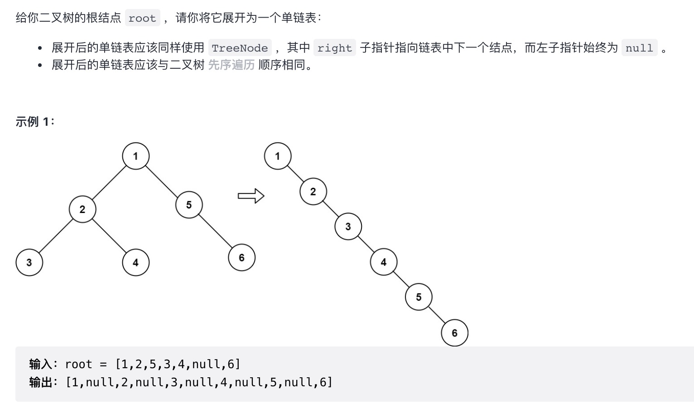

# leetCode刷题记录

| 文档创建人 | 创建日期   | 文档内容           | 更新时间   |
| ---------- | ---------- | ------------------ | ---------- |
| adsionli   | 2021-11-15 | leetCode刷题1-3 | 2021-11-15 |
| adsionli   | 2021-11-16 | leetCode刷题4-5 | 2021-11-16 |
| adsionli | 2021-12-04 | leetCode刷题-leetcodeHot题库+部分每日一题 | 2021-12-04 |

> 记录一下leetCode刷题，每天三道(如果有hard题，就一道hard，一道normal)，坚持到校招开始，每篇博文30题

## simple题目

### 1. 两数之和

> [原题链接](https://leetcode-cn.com/problems/two-sum/)

这题目不是很难弄，只需要用哈希表，就可以直接完成。

```js
/**
 * @param {number[]} nums
 * @param {number} target
 * @return {number[]}
 */
var twoSum = function (nums, target) {
    let numsMap = new Map();
    for (let i = 0; i < nums.length; ++i) {
        if (numsMap.has(target - nums[i])) {
            return [numsMap.get(target - nums[i]), i]
        }
        numsMap.set(nums[i], i);
    }
};
```

### 2. 543-二叉树的直径

> 原题描述:
>
> 

本道题目的具体解题思路就是进行深度遍历，然后返回最长的二叉树的直径，同时为了更好的区分开左右子树，在进行dfs的时候选择分别对右子树和左子树分别遍历的方式进行完成。

本题主要包含内容为：二叉树的遍历、递归遍历

```js
/**
 * Definition for a binary tree node.
 * function TreeNode(val, left, right) {
 *     this.val = (val===undefined ? 0 : val)
 *     this.left = (left===undefined ? null : left)
 *     this.right = (right===undefined ? null : right)
 * }
 */
/**
 * @param {TreeNode} root
 * @return {number}
 */
var diameterOfBinaryTree = function(root) {
    let depth = -Infinity;
    if (root == null) {
        return 0;
    }
    if (root.left == null && root.right == null) {
        return 0;
    }
    function dfs(root, level) {
        let left = 0;
        let right = 0;
        if (root.left == null && root.right == null) {
            return level;
        }
        if (root.left) {
            left = dfs(root.left, level + 1);
        }
        if (root.right) {
            right = dfs(root.right, level + 1)
        }
        depth = Math.max(depth, left + right - 2 * level);

        return Math.max(left, right)
    }
    let d1 = (root.left ? dfs(root.left, 1) : 0) + (root.right ? dfs(root.right, 1) : 0);
    let res = Math.max(depth, d1);

    return res;
};
```

### 3. 94-二叉树的中序遍历

> 原题描述：
>
> 

这题目没什么太多内容，就是二叉树的中序遍历的代码实现，先左在中最后右，按照这种顺序遍历下去即可

```js
// TAG: 二叉树中序遍历
/**
 * Definition for a binary tree node.
 * function TreeNode(val, left, right) {
 *     this.val = (val===undefined ? 0 : val)
 *     this.left = (left===undefined ? null : left)
 *     this.right = (right===undefined ? null : right)
 * }
 */
/**
 * @param {TreeNode} root
 * @return {number[]}
 */
var inorderTraversal = function(root) {
    if(!root){
        return [];
    }
    let res = [];
    let stack = [];
    while(root || stack.length){
        while(root){     
            stack.push(root);
            root = root.left;
        }
        root = stack.pop();
        res.push(root.val);
        root = root.right;
    }

    return res;
};
```

### 4. 700-二叉搜索树中的搜索

> 原题描述：
>
> 

首先需要明确什么是二叉搜索树，BST树就是他的根节点的左子树一定都比根节点要小，他的右子树一定要比根节点要大，首先需要明确这个，然后再来看这道题目就很简单了，只要判断每一层的根节点比我们要搜索的节点大小关系，来往左右子树进行移动就可以了

```js
/**
 * @param {TreeNode} root
 * @param {number} val
 * @return {TreeNode}
 */
var searchBST = function(root, val) {
    if(!root){
        return null;
    }
    while(root !== null){
        if(root.val == val){
            return root;
        }
        if(root.val > val){
            root = root.left
        }else{
            root = root.right;
        }
    }
    
    return null;
};
```

### 5. 501-二叉搜索树中的众数

> 原题描述：
>
> 

本题需要做的就是找到就是在这棵BST树中出现最多的元素，其实是这么说，但是实际上就是去遍历这颗树，但是每一次往下层的时候，都要去记录一下当前层的值，如果下一层的val和current相等，就把count++，如果不相等，就重置了current的值，并比较count与max之间的大小，取最大的赋给max，直到树遍历完成，最后在比较一下最后一个记录的count大小，在输出就可以了。

```js
/**
 * @param {TreeNode} root
 * @return {number[]}
 */
var findMode = function (root) {
    let current = null;
    let count = 0;
    let max = -Infinity;
    let res = [];
    function bst(node) {
        if (node == null) {
            return;
        }
        bst(node.left);
        if (current == null) {
            current = node.val;
            count++;
        } else if (current == node.val) {
            count++;
        } else {
            if (count > max) {
                res = [];
                res.push(current);
            } else if (count == max) {
                res.push(current)
            }
            current = node.val;
            max = Math.max(count, max);
            count = 1;
        }
        bst(node.right);
    }
    bst(root);
    if (res.indexOf(current) == -1) {
        if (count > max) {
            res = [];
            res.push(current);
        } else if (count == max) {
            res.push(current)
        }
    }
    return res;
};
```

### 6. 226-翻转二叉树

> 题目描述:
>
> 

这个题目没什么花头，直接将左右节点进行交换就可以了，和交换数字是一样的。然后一层层遍历下去交换就可以。

```js
/**
 * @param {TreeNode} root
 * @return {TreeNode}
 */
var invertTree = function (root) {
    function dfs(root) {
        if (root == null) {
            return;
        }
        let node = root.left;
        root.left = root.right;
        root.right = node;
        dfs(root.left);
        dfs(root.right);
    }

    dfs(root)

    return root;
};
```

### 7. 206-反转链表

> 原题描述：
>
> 

本题就是将链表翻转，最简单的方法就是迭代了，通过创建curr和prev来记录节点的位置，然后通过交换律一直走下去就可以了。

```js

```

### 8. 141-环形链表

> 原题描述:
>
> 

环形链表的判断是很简单的，只需要创建快慢指针，让慢指针一格一格走下去，快指针两个两个走下去，如果链表存在环，快慢指针一定会相遇，如果链表无环，快指针为null时就到头了，就是无环的。

```js

```

### 9. 150-相交链表

> 原题描述:
>
> 

本题可以直接通过创建Hash表的形式来进行解决，不过这里需要用Set，因为不能保证节点上的值是唯一的，相见一个链表内容放入到HashMap后，在对另外一个链表进行遍历，判断是否有存在与链表中的相同元素，当前节点在哈希集合中，则后面的节点都在哈希集合中，即从当前节点开始的所有节点都在两个链表的相交部分，因此在链表headB 中遍历到的第一个在哈希集合中的节点就是两个链表相交的节点，返回该节点。

```js

```

### 10. 234-回文链表

> 原题描述：
>
> 

本题的实现还十分常见的，我做的处理就是将链表复制一份出来，然后通过双指针的形式，来将链表前后进行比较，一旦出现不一样的，就返回false，否则及时回文链表

```js

```

### 11. 最小栈

> 原题描述:
>
> 

对于栈来说，如果一个元素 a 在入栈时，栈里有其它的元素 b, c, d，那么无论这个栈在之后经历了什么操作，只要 a 在栈中，b, c, d 就一定在栈中，因为在 a 被弹出之前，b, c, d 不会被弹出。

因此，在操作过程中的任意一个时刻，只要栈顶的元素是 a，那么我们就可以确定栈里面现在的元素一定是 a, b, c, d。

那么，我们可以在每个元素 a 入栈时把当前栈的最小值 m 存储起来。在这之后无论何时，如果栈顶元素是 a，我们就可以直接返回存储的最小值 m。

算法

按照上面的思路，我们只需要设计一个数据结构，使得每个元素 a 与其相应的最小值 m 时刻保持一一对应。因此我们可以使用一个辅助栈，与元素栈同步插入与删除，用于存储与每个元素对应的最小值。

1. 当一个元素要入栈时，我们取当前辅助栈的栈顶存储的最小值，与当前元素比较得出最小值，将这个最小值插入辅助栈中；

2. 当一个元素要出栈时，我们把辅助栈的栈顶元素也一并弹出；

3. 在任意一个时刻，栈内元素的最小值就存储在辅助栈的栈顶元素中。

```js

```

### 12. 506-相对名次

> 原题描述：
>
> 

这题难度不大，主要就是需要排序一下，然后按照顺序给他们赋予名次，然后在修改原数组内容就可以了。

```js

```

## normal题目

### 1. 两数之和

> [原题链接](https://leetcode-cn.com/problems/add-two-numbers/)

这道题虽然是一道中等题，但是实际也是一个水题，只需要一位一位读过去就可以了，最后再判断一下最后有没有进位就可以了。

```js
//这里我把整个调试代码也放出来，可以复制到vsCode上使用Run Code插件直接运行
function ListNode(val, next) {
    this.val = (val === undefined ? 0 : val)
    this.next = (next === undefined ? null : next)
}
/**
 * @param {ListNode} l1
 * @param {ListNode} l2
 * @return {ListNode}
 */
var addTwoNumbers = function (l1, l2) {
    let l1Node = l1;
    let l2Node = l2;
    let a = 0;
    let b = 0;
    let addSum = 0;
    let resNode = new ListNode();
    let node = resNode;
    while (l1Node || l2Node) {
        a = l1Node ? l1Node.val : 0;
        b = l2Node ? l2Node.val : 0;
        let sum = a + b + addSum;
        addSum = sum >= 10 ? parseInt(sum / 10) : 0;
        node.val = sum % 10;
        l1Node = l1Node ? l1Node.next : null;
        l2Node = l2Node ? l2Node.next : null;
        if (!l1Node && !l2Node) {
            if (addSum != 0) {
                node.next = new ListNode;
                node = node.next;
                node.val = addSum;
                node.next = null;
            } else {
                node.next = null;
            }

        } else {
            node.next = new ListNode;
            node = node.next;
        }
    }


    return resNode;

};

const l1 = () => {
    let l1 = [9, 9, 9, 9, 9, 9, 9];
    let headNode = new ListNode();
    let node = headNode;
    for (let i = 0; i < l1.length; i++) {
        node.val = l1[i];
        if (i == l1.length - 1) {
            node.next = null;
        } else {
            node.next = new ListNode;
            node = node.next;
        }
    }

    return headNode;
}

const l2 = () => {
    let l2 = [9, 9, 9, 9];
    let headNode = new ListNode();
    let node = headNode;
    for (let i = 0; i < l2.length; i++) {
        node.val = l2[i];
        if (i == l2.length - 1) {
            node.next = null;
        } else {
            node.next = new ListNode;
            node = node.next;
        }
    }

    return headNode;
}

let list1 = l1();
let list2 = l2();

let list = addTwoNumbers(list1, list2);
while (list) {
    console.log(list.val);
    list = list.next;
}
```

这道题目实际可以继续优化，因为写的有点啰嗦了，各位可以自行进行优化即可。

### 2. 无重复字符的最长子串

> [原题链接](https://leetcode-cn.com/problems/longest-substring-without-repeating-characters/)

这道题目其实很像滑动窗口，记得在很早之前就有做过这种题目，主要需要注意一下记录字符的位置变化，不是说遇到重复的之前全部删除掉，而是从删除掉的后一位继续接上去才可以。

```js
/**
 * @param {string} s
 * @return {number}
 */
var lengthOfLongestSubstring = function(s) {
    let compareStr = '';
    let max = 0;
    for(let i = 0; i < s.length; i++){
        let indexOf = compareStr.indexOf(s[i]);
        if(indexOf == -1){
            compareStr += s[i];
        }else {
            if(compareStr.length > max){
                max = compareStr.length;
            }
            if(compareStr.length == indexOf){
                compareStr = s[i];
            }else{
                compareStr = compareStr.substr(indexOf + 1) + s[i];
            }
        }
    }
    if(compareStr.length > max){
        max = compareStr.length
    }

    return max;
};
```

### 3. 5-最长回文子串

> 原题描述：
>
> 

这道题目就是求一个字符串，倒过来和正过来是一样的，这就是回文子串，这道题目可以直接进行暴力破解或者使用中心拓展法，因为在之前做过这道题目，所以直接用了中心拓展，来ac掉题目，没有测试暴力是否可以ac

```js
//这里其实很简单，就是看从当前这个位置的左右两端是否完全一致。不过这里需要注意的就是可能存在奇数个和偶数个的情况，所以采样点需要去两个，确保不会少。
var aroundCenter = function (s, start, end) {
    let l = start, r = end;
    while (l >= 0 && r < s.length && s[r] == s[l]) {
        l--;
        r++;
    }
    return r - l - 1;
}
/**
 * @param {string} s
 * @return {string}
 */
var longestPalindrome = function (s) {
    let sl = s.length;
    if (sl == 0 || sl == 1) {
        return s;
    }
    let start = 0, end = 0, mLen = 0;
    for (let i = 0; i < s.length; i++) {
        let len1 = aroundCenter(s, i, i);
        let len2 = aroundCenter(s, i, i + 1);
        mLen = Math.max(Math.max(len1, len2), mLen);
        if (mLen > end - start + 1) {
            start = i - parseInt((mLen - 1) / 2);
            end = i + parseInt(mLen / 2);
        }
    }
    return s.substr(start, mLen);
};
```

### 4. 105-从前序与中序遍历序列构造二叉树

> 题目描述:
>
> 

前序遍历和中序遍历可以确定一颗唯一的二叉树，这个是数据结构书上教过的，具体的代码实现实际上也不是很难，就是通过先将中序遍历的内容放到hashmap中去，然后通过使用先序遍历来处理这颗树就可以了。

> 只要我们在中序遍历中定位到根节点，那么我们就可以分别知道左子树和右子树中的节点数目。由于同一颗子树的前序遍历和中序遍历的长度显然是相同的，因此我们就可以对应到前序遍历的结果中，对上述形式中的所有左右括号进行定位。
>
> 这样以来，我们就知道了左子树的前序遍历和中序遍历结果，以及右子树的前序遍历和中序遍历结果，我们就可以递归地对构造出左子树和右子树，再将这两颗子树接到根节点的左右位置。
>
> **细节**
>
> 在中序遍历中对根节点进行定位时，一种简单的方法是直接扫描整个中序遍历的结果并找出根节点，但这样做的时间复杂度较高。我们可以考虑使用哈希表来帮助我们快速地定位根节点。对于哈希映射中的每个键值对，键表示一个元素（节点的值），值表示其在中序遍历中的出现位置。在构造二叉树的过程之前，我们可以对中序遍历的列表进行一遍扫描，就可以构造出这个哈希映射。在此后构造二叉树的过程中，我们就只需要 O(1)的时间对根节点进行定位了。
>

```js

```

```js
/**
 * @param {number[]} preorder
 * @param {number[]} inorder
 * @return {TreeNode}
 */
var buildTree = function (preorder, inorder) {
    let len = preorder.length;
    if (len == 1) {
        return new TreeNode(preorder[0])
    }
    let map = new Map();
    for (let i = 0; i < len; i++) {
        map.set(inorder[i], i);
    }
    function handle(pS, pE, iS, iE) {
        if (pS === pE) {
            return null;
        }
        const rootVal = preorder[pS];
        const root = new TreeNode(rootVal);

        const irI = map.get(rootVal);
        const lS = irI - iS;

        root.left = handle(pS + 1, pS + lS + 1, iS, irI);
        root.right = handle(pS + 1 + lS, pE, irI + 1, iE);
    }


    return handle(0, len, 0, len);
};
```


### 5. 102-二叉树的层序遍历

> 原题描述：
>
> 

这个就是bfs的一种书写方式，就是按照二叉树的层级去进行遍历，那么是怎么去遍历的呢，其实也不是很难，就是当我们遍历了一个层级之后，把每一个层放入到一个数组中去，然后再在数组中去一个一个读取每一个节点的左右子树，然后再将这些左右子树记录在另外一个数组中，当读取完成后，就放入最终的输出的数组里面，然后在进行迭代就可以了。

```js

```

```js
/**
 * @param {TreeNode} root
 * @return {number[][]}
 */
var levelOrder = function (root) {
    if(!root){
        return []
    }
    let res = [];
    let f = [];
    f.push(root);
    let node;
    while (f.length) {
        let level = [];
        let nodeL = [];
        for (let i = 0; i < f.length; i++) {
            node = f[i];
            level.push(node.val)
            if (node.left) {
                nodeL.push(node.left)
            }
            if (node.right) {
                nodeL.push(node.right)
            }
            
        }
        f = nodeL;
        res.push(level)
    }

    return res;
};
```

### 6. 142-环形链表二

> 原题描述：
>
> 

这道环形链表和上面一到有点略微的不同，这里的环形链表要求返回的是链表入口的那个节点，而不是简单地判断是否是环形链表。

```js

```

### 7. 二叉树展开为链表

> 原题描述：
>
> 

这题目其实说难不难，说简单也不是那么好实现，实际再具体实现的时候，思路一定要明确，就是左子树是比右子树优先插入的，可以通过遍历来解决这道题目，思路不难。可以看一下官方的题解过程：[题解过程](https://leetcode-cn.com/problems/flatten-binary-tree-to-linked-list/solution/er-cha-shu-zhan-kai-wei-lian-biao-by-leetcode-solu/)

代码实现如下:

```js

```

```js
/**
 * Definition for a binary tree node.
 * function TreeNode(val, left, right) {
 *     this.val = (val===undefined ? 0 : val)
 *     this.left = (left===undefined ? null : left)
 *     this.right = (right===undefined ? null : right)
 * }
 */
/**
 * @param {TreeNode} root
 * @return {void} Do not return anything, modify root in-place instead.
 */
var flatten = function (root) {
    while (root != null) {
        if (root.left == null) {
            root = root.right;
        } else {
            let pre = root.left;
            while (pre.right !== null) {
                pre = pre.right;
            }
            pre.right = root.right;
            root.right = root.left;
            root.left = null;
            root = root.right
        }
    }
};
```

## hard题目

### 1. 寻找两个正序数组的中位数

> 原题描述:
>
> 

这道题目一开始想的太简单了，主要看到这玩意，一下就想到了归并，直接暴力了。但是这样处理不好，因为要把所有数据复制一遍，实在太耗时了，然后修改了代码，只需要找到中位数就可以。结果自己写的代码和题解里的第二种方法一样，但是时间复杂度其实没变，只是代码没那么啰嗦了。所以看了一下解析里面的分析，发现二分的思想处理这道题目非常的好，虽然还有一个切割处理的，但是个人感觉这样的处理方式不适用大部分场景，所以还是选择使用二分的方法ac了这道题目。这里就不解析这道题目了，直接看题解会比较好。

```js
var getKth = function(nums1, s1, e1, nums2, s2, e2, k){
    var n = e1 - s1 + 1;
    var m = e2 - s2 + 1;
    if(n > m){
        return getKth(nums2, s2, e2, nums1, s1, e1, k)
    }
    if(n == 0){
        return nums2[s2 + k - 1];
    }

    if(k == 1){
        return Math.min(nums1[s1], nums2[s2])
    }
    //这里就是取出nums1与nums2中k折半之后的数据下标，同时判断当前k / 2的大小是否大于了数组的长度，如果大于数组长度，直接去数组的最后一位进行比较
    let i = s1 + Math.min(n, Math.floor(k / 2)) - 1;
    let j = s2 + Math.min(m, Math.floor(k / 2)) - 1;
    if(nums1[i] > nums2[j]){
        return getKth(nums1, s1, e1, nums2, j + 1, e2, Math.floor(k  - (j - s2 + 1)));
    }else{
        return getKth(nums1, i + 1, e1, nums2, s2, e2, Math.floor(k - (i - s1 + 1)));
    }
}

var findMedianSortedArrays = function (nums1, nums2) {
    let n = nums1.length;
    let m = nums2.length;
    let len = n + m;
    let left = (len + 1) / 2;
    let right = (len + 2) / 2;
    return (getKth(nums1, 0, n - 1, nums2, 0, m - 1, Math.floor(left)) + getKth(nums1, 0, n - 1, nums2, 0, m - 1, Math.floor(right))) * 0.5;
};
```

