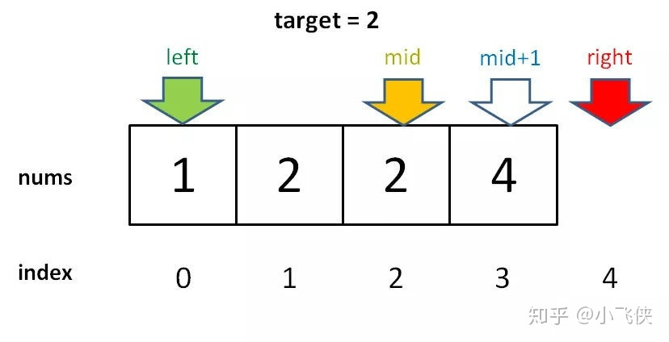

# 二分查找算法总结

| 文档创建人 | 创建日期   | 文档内容         | 更新时间   |
| ---------- | ---------- | ---------------- | ---------- |
| adsionli   | 2021-12-28 | 二分查找算法总结 | 2021-12-28 |

在刷题过程中真的是遇到了各种各样的二分查找的不同应用，所以在这里记录一下关于二分查找算法的一些知识总结以及在不同应用场景中的变形。

## 二分查找

​		折半查找法也称为二分查找法，它充分利用了元素间的次序关系，采用分治策略，可在最坏的情况下用**O(logn)**完成搜索任务。它的基本思想是：（这里假设数组元素呈升序排列）将n个元素分成个数大致相同的两半，取a[n/2]与欲查找的x作比较，如果x=a[n/2]则找到x，算法终止。如果x<a[n/2]，则我们只要在数组a的左半部继续搜索x；如果x>a[n/2]，则我们只要在数组a的右半部继续搜索x。

> 上段摘自百度百科。

​		**也就是说二分查找实际上就是将一段有序的数组，按照分治策略，不断地分割进行查找的一个过程。**

## 基本二分查找的实现流程

最基本的二分查找就是在一段有序的数组中去查找某一个数，通过不断的查找，直到找到这个树，然后返回相应的下标。

1. 关于选取中间点的写法，看了很多大佬写的，最终得出结论，推荐使用：`left - (left + right) >> 1`。

   > 为什么会使用这种方式来进行中间点的书写呢，主要就是害怕数字越界的问题
   >
   > 如果说left和right都是非常非常大的数，那么当left+right的时候就会发生越界行为，就会导致代码报错，那么就可以通过上面的写法来避免越界的发生。

2. 关于`left`和`right`的移动问题，有一些移动是把`left = mid`，有一些则是`left = mid + 1`，这个左边界的选择要根据在实际应用中来进行选取的，有的是需要选择`mid`，但是有的需要选取`mid + 1`，这和题目中提出的问题有很大的关系，要根据题目来选择正确的边界转移值。

3. 下面是基本二分查找的实现代码：

   ```js
   var binary_search = function(data, target){
       let left = 0, right = len - 1;
       //这里是>=的原因是因为我们选取的right是len-1,也就是需要包括了数组的全部元素=>[left, right]
       while(right >= left){
             let mid = left + (right - left) >> 1;
           if(data[mid] == target){
               return mid;
           }else if (data[mid] < target){
               //因为mid已经被查询过了，所以我们可以将这里left变到mid+1处   
               left = mid + 1eft;       	
           }else if (data[mid] > target){
               right = mid - 1eft;     	
           }
       }
   	if(data[left] != target){
   		return -1;
       }
       return left;
   }
   ```

> 上述代码就是一个最基本的二分查找的实现，没什么好多说的，代码实现很简单。

## 寻找左侧边界的二分搜索

直接看代码，其中的标记是需要注意的细节：

```js
function left_bound(nums, target) {
    if (nums.length == 0) return -1;
    let left = 0;
    let right = nums.length; // 注意

    while (left < right) { // 注意
        let mid = (left + right) / 2;
        if (nums[mid] == target) {
            right = mid;
        } else if (nums[mid] < target) {
            left = mid + 1;
        } else if (nums[mid] > target) {
            right = mid; // 注意
        }
    }
    return left;
}
```

*1.*为什么 `while(left < right)` 而不是 <= ?

答：用相同的方法分析，因为初始化 `right = nums.length` 而不是 `nums.length - 1` 。因此**每次循环的「搜索区间」是 [left, right) 左闭右开**。

`while(left < right)` 终止的条件是 `left == right`，**此时搜索区间 [left, left) 恰巧为空，所以可以正确终止**。

*2.* 为什么没有返回 -1 的操作？如果 nums 中不存在 target 这个值，怎么办？

答：因为要一步一步来，先理解一下这个「左侧边界」有什么特殊含义：



对于这个数组，算法会返回 1。这个 1 的含义可以这样解读：nums 中小于 2 的元素有 1 个。

比如对于有序数组 nums = [2,3,5,7], target = 1，算法会返回 0，含义是：`nums` 中小于 1 的元素有 0 个。如果 target = 8，算法会返回 4，含义是：nums 中小于 8 的元素有 4 个。

综上可以看出，函数的返回值（即 left 变量的值）取值区间是闭区间 [0, nums.length]，所以我们简单添加两行代码就能在正确的时候 return -1：

```js
while (left < right) {
    //...
}
// target 比所有数都大
if (left == nums.length) return -1;
// 类似之前算法的处理方式
return nums[left] == target ? left : -1;
```

*3.* 为什么 `left = mid + 1`，`right = mid` ？和之前的算法不一样？

答：这个很好解释，因为我们的「搜索区间」是 `[left, right)` 左闭右开，所以当 `nums[mid]` 被检测之后，下一步的搜索区间应该去掉 `mid` 分割成两个区间，即 `[left, mid)` 或 `[mid + 1, right)`。

*4.* 为什么该算法能够搜索左侧边界？

答：关键在于对于 `nums[mid] == target` 这种情况的处理：

```js
if (nums[mid] == target)
        right = mid;
```

可见，找到 `target` 时不要立即返回，而是缩小「搜索区间」的上界 right，在区间 [left, mid) 中继续搜索，即不断向左收缩，达到锁定左侧边界的目的。

*5.* 为什么返回 `left` 而不是 `right`？

答：返回`left`和`right`都是一样的，因为 `while` 终止的条件是 `left == right`。

## 寻找右侧边界的二分查找

寻找右侧边界和寻找左侧边界的代码差不多，只有两处不同，已标注：

```js
function right_bound(nums, target) {
    if (nums.length == 0) return -1;
    let left = 0, right = nums.length;

    while (left < right) {
        let mid = (left + right) / 2;
        if (nums[mid] == target) {
            left = mid + 1; // 注意
        } else if (nums[mid] < target) {
            left = mid + 1;
        } else if (nums[mid] > target) {
            right = mid;
        }
    }
    return left - 1; // 注意
```

*1.* 为什么这个算法能够找到右侧边界？

答：类似地，关键点还是这里：

```js
if (nums[mid] == target) {
        left = mid + 1;
```

当 `nums[mid] == target` 时，不要立即返回，而是增大「搜索区间」的下界 `left`，使得区间不断向右收缩，达到锁定右侧边界的目的。

*2.* 为什么最后返回 `left - 1` 而不像左侧边界的函数，返回 `left`？而且我觉得这里既然是搜索右侧边界，应该返回 `right` 才对。

答：首先，`while` 循环的终止条件是 `left == right`，所以 `left` 和 `right` 是一样的，你非要体现右侧的特点，返回 `right - 1` 好了。

至于为什么要减一，这是搜索右侧边界的一个特殊点，关键在这个条件判断：

```js
if (nums[mid] == target) {
        left = mid + 1;
        // 这样想: mid = left - 1
```


因为我们对 `left` 的更新必须是 `left = mid + 1`，就是说 `while` 循环结束时，`nums[left]` **一定不等于** `target` 了，而 `nums[left - 1]`**可能是**`target`。

至于为什么 `left` 的更新必须是 `left = mid + 1`，同左侧边界搜索，就不再赘述。

*3.* 为什么没有返回 -1 的操作？如果 `nums` 中不存在 `target` 这个值，怎么办？

答：类似之前的左侧边界搜索，因为 `while` 的终止条件是 `left == right`，就是说 left 的取值范围是 `[0, nums.length]`，所以可以添加两行代码，正确地返回 -1：

```js
while (left < right) {
    // ...
}
if (left == 0) return -1;
return nums[left-1] == target ? (left-1) : -1;
```

## 总结

1. 第一个，最基本的二分查找算法：

```js
因为我们初始化 right = nums.length - 1
所以决定了我们的「搜索区间」是 [left, right]
所以决定了 while (left <= right)
同时也决定了 left = mid+1 和 right = mid-1

因为我们只需找到一个 target 的索引即可
所以当 nums[mid] == target 时可以立即返回
```

2. 第二个，寻找左侧边界的二分查找：

```js
因为我们初始化 right = nums.length
所以决定了我们的「搜索区间」是 [left, right)
所以决定了 while (left < right)
同时也决定了 left = mid+1 和 right = mid

因为我们需找到 target 的最左侧索引
所以当 nums[mid] == target 时不要立即返回
而要收紧右侧边界以锁定左侧边界
```

3. 第三个，寻找右侧边界的二分查找：

```js
因为我们初始化 right = nums.length
所以决定了我们的「搜索区间」是 [left, right)
所以决定了 while (left < right)
同时也决定了 left = mid+1 和 right = mid

因为我们需找到 target 的最右侧索引
所以当 nums[mid] == target 时不要立即返回
而要收紧左侧边界以锁定右侧边界

又因为收紧左侧边界时必须 left = mid + 1
所以最后无论返回 left 还是 right，必须减一
```

## 旋转有序数组中的二分查找

假设存在一个数组，它在旋转之前是有序的数组，但是他从某一个下标处进行了旋转，那么这个数组还可以用二分来进行查找吗，答案是可以的，它依然可以使用二分查找，但是在使用二分查找的时候要进行一些判断，来判断当前区间是否是单调的区间。通过不断地二分，我们可以找到这一个单调的区间，从而找到我们所需要的值。

### 搜索旋转排序数组中的最小值

这里就拿leetcode中的[154-寻找旋转排序数组中的最小值II](https://leetcode-cn.com/problems/find-minimum-in-rotated-sorted-array-ii/)这道题目来说一下。

这道题目就是一道旋转有序数组中的二分查找的使用，但是它不是去查找某一个固定的数，而是去查找这个数组旋转后的最小的那个数。那么思考一下，我们是不是可以通过找到一段不是递增或递减的子序列，这个子序列中一定就会有最小的值。这道题的解题主要分为三个方面：

1. 旋转后的数组中，**最后一位元素x**：在最小值右侧的所有元素都比**x**要大，在最小值左侧的所有元素都**<= x**

2. 在二分查找的每一步中，最小值一定在左右边界中，所以我们需要将中点元素与右边界元素进行比较(这里就是要根据1中的最后一位元素的特殊性来确定)。这里又会存在一下三种情况：

   (1) `data[mid] < data[high]`

   当中点元素小于右边界大小的时候，我们可以很容易的确定中点元素是在最小值右边的，因为这个时候的中点到右边界依然是递增的，根据旋转之后的特性，在最小值元素的左右两端都是递增的原则来判断出来的。所以我们就可以不去管中点元素右边的元素了，改变右边界。

   `right = mid;`

   (2)`data[mid] == data[right]`

   当中点元素等于右边界元素的时候，我们可以知道，在这个数组中存在重复元素。这时候因为重复元素的存在我们就无法准确地判断中点元素究竟在最小值的左侧还是右侧，那么就不能直接忽略掉中点元素右边界的内容了，那么我们就需要一点点的推进来改变右边界大小。由于它们的值相同，所以无论 `data[right]`是不是最小值，都有一个它的「替代品」`data[mid]`，因此我们可以忽略二分查找区间的右端点。

   (3)`data[mid] > data[right]`

   当中点元素大于右边界大小的时候，那么就可以判断出中点元素的左侧一定是在最小值的左侧的，那么我们就可以忽略掉左半部分了。

   `left = mid + 1`

3. 有了上面的推导，我们可以很容易的得到旋转有序数组最小值的获取代码啦，具体代码如下：

   ```js
   var binary_search_find_reverse_min = function (data){
       let l = 0, r = data.length - 1;
       while(r >= l){
           let mid = l + (r - l) >> 1;
   		if(data[mid] > data[r]){
               l = mid + 1;
           }else if(data[mid] < data[r]){
   			r = mid;
           }else {
   			r--;
           }
       }
       
       return data[l];
   }
   ```

好啦，这就完成啦，所以这里一定要分析出二分之后边界变化的条件，这样才能在做这道题目的思路变得很清晰，同时可以通过画图来帮助分析。

### 搜索旋转排序数组中的某个值

这里就拿leetcode中的[33-搜索旋转排序数组](https://leetcode-cn.com/problems/search-in-rotated-sorted-array/)这道题目来说一下。

这个题目就是最典型的旋转排序数组搜索问题了，不同于上一道题目是找旋转排序数组中自己本身的最小值，这个就是和基础的二分一样，去查找数组中是否存在一个指定的值，但是这个数组是一个旋转排序数组，那么就来好好的分析一下这道题目究竟该怎么写。

> 实际上本道题目就是通过不断压缩中点元素来获取到一个递增或递减的子序列然后来查找到搜索数值

我们需要判断当前的子序列的左边界与中点元素的关系：

(1)`data[0] <= data[mid]`

如果中点元素大于旋转数组的头元素的时候，那么我们就可以直接判断出旋转后的最小值在右侧区间中，而这时候左侧区间就是一个有序序列。然后就是判断待查找的值是否落在有序单调区间中了

1)`target >= data[0] && target < data[mid]`

​	首先就是待查询数值在左侧区间中，此时待查询数值实际是在一个有序区间内了，那么我们就可以确定到右侧空间就是无用的了，可以直接舍弃，然后对右边界进行调整=>`right = mid - 1;`

2)如果说target不在左侧区间中的话，那么我们就判断出左侧区间就无用了，这时候直接调整左边界=> `left = mid + 1`

(2) `data[0] > data[mid]`

如果左边界是大于中点元素的，那么我们可以知道左边界与中点元素之间一定是存在着一个旋转之后的最小值的。那么可以进一步来判断等待查找到值是否会落在当前的左边界与中点元素之间的区间中

1)`data[mid] < target && target <= data[len - 1]`

第一种情况就是target在中点元素与右边界的区间中，这个时候我们可以很容易的知道，右侧区间是一个有序序列，那么只需要在右侧这个有序序列中去查找target就可以了，直接调整左边界为=>`l = mid + 1`

2)如果说target不在右侧的有序序列中的时候，就和第一类情况中的第二种一样，我们直接调整右边界为=>`right = mid - 1`，在这个不连续的序列中继续查找target的位置，持续的去修改mid位置，迟早会让其在一段有序序列中的。

> 为什么会在1，2两种情况中去选择判断`target >= data[0] && target < data[mid]`,`data[mid] < target && target <= data[len - 1]`
>
> 因为这个时候target都是落在有序序列中，会方便我们来使其最终落在有序序列中来查找。

根据上面的推导，我们来写出最后的代码:

```js
var binary_search_reverse_target = function (data){
    let l = 0, r = data.length - 1;
    while(r >= l){
        let mid = l + (r - l) >> 1;
        if(target == data[mid]){
            return mid;
        }
        if(data[mid] >= data[0]){
            if(target >= data[0] && target < data[mid]){
				r = mid - 1;
            }else {
                l = mid + 1;
            }
        }else {
            if(target > data[mid] && target <= data[data.length - 1]){
                l = mid + 1;
            }else {
                r= mid - 1;
            }
        }
    }
    if(nums[l] != target){
        return -1;
    }
    return l;
}
```

好啦，这就完成了这道题目啦，和上面一题其实很像，但是处理思路存在着一些不同，也是对二分的一种变形。


# 结束语

二分真的是一个很灵活的算法，可以针对很多不同场景做出很多不同调整，这个还需要使用者自己选择好需要调整的内容，我相信通过上述的讲解，大家都会被二分有一个很好地认知，再结合一些题目，一定可以轻松拿下，加油呀ヾ(◍°∇°◍)ﾉﾞ。

