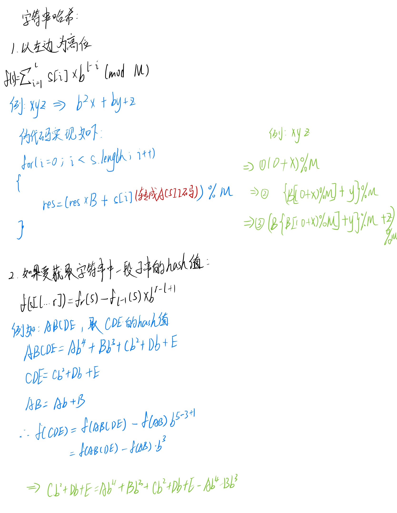

# Leetcode-1044最长重复子串题解记录

> 这道题目混合了字符串哈希以及二分查找，实在有点难，一开始看题解无法理解，然后在洗澡的时候就突然明白过了。
>
> 真的不会字符串hash，太笨了，呜呜呜，然后去B站搜了一个讲解字符串算法的，总算是明白了。
>
> [字符串算法](https://www.bilibili.com/video/BV14y4y117Gh?from=search&seid=1997164316317441736&spm_id_from=333.337.0.0)

| 文档创建人 | 创建日期   | 文档内容                 | 更新时间   |
| ---------- | ---------- | ------------------------ | ---------- |
| adsionli   | 2021-12-23 | 1044最长重复子串题解记录 | 2021-12-23 |

## 字符串Hash算法

首先声明，这里不会很完整的来讲什么是字符串Hash算法，这里我只列举在这道题目中需要用到的知识以及相关的公式，以图片的方式。

1. 字符串Hash算法其实就是采用了前缀和的思想，然后使用数字来代替字符串，加快搜索速度，使搜索的时间复杂度降为了O(1)
2. 那么在这道题目中，需要用到相关的字符串Hash算法的核心思想就如下图：




## 解题思路

1. 首先通过读题，我们可以知道，这道题目是求一段字符串中的最长重复字串，那么重复字串是什么意思，**就是从字串中存在一段子字符串在这段字串中重复了多次，这就是重复字串，这和回文子串是不相同的，千万不要混淆了。**其次要求的是最长的重复字串，那么就需要在最后返回的时候返回重复次数最多的。

2. 通过之前的铺垫，我们可以知道使用字符串hash算法的话，可以加快我们比较的速度，所以我们就需要在这里构建一个字符串hash算法，来加快我们字符串的匹配速度。

   ```js
   //这里借用三叶姐姐取的B值，来构建字符串hash，然后这里就不使用M了
   var longestDupSubstring = function(s){
       let b = 1313131;
       let len = s.length;
       //这里的这个p的作用是用来记录一下之后我们寻找子串的时候b^(r - l + 1)的速度，这样就可以很快取到了
   	let p = new Array(len).fill(0);
       let f = new Array(len).fill(0);
       p[0] = 1;
       for(let i = 0; i < len; i++){
           p[i + 1] = p[i] * b;
           f[i + 1] = f[i] * b + s[i].charCodeAt();
       }
   }
   ```

   > 上述代码就可以创建完成字符串的Hash值了，这里与之前所不同的是没有去mod一个M的值。

3. 在完成字符串hash之后，我们就可以通过二分查找来确定比较字符串的位置，这里为什么可以使用二分查找来确定字符串比较位置的原因如下：

   (1) 首先题目中要求的是重复字符，这就为我们提供了二分的思路了，因为一个字符串中要有重复字串的话，就可以知道在一个字符串中要是有重复的字串，那么最多只会有一半长度，超过一半长度就不会存在重复字串了

   (2)通过(1)中的描述，我们就可以选择使用二分查找的方式来选择check点，同时还需要设置一个Set来保存已经查找过的重复字串，这样可以保证不会出现重复字串的重复。

   (3)通过二分查找出来的数据，我们就可以通过字符串hash的公式来获取到对应字串的hash值，来进行比较，这时候的比较时间就是O(1)，而不是O(l-r)了，速度加快。

   (4)其实这里二分的长度就是实现了类似滑动窗口取值的作用，所以这道题也可以直接暴力来进行滑动窗口就完事了。

   具体实现如下：

   ```js
    while (left < right) {
        // 要 +1
   	const mid = left + ((right - left + 1) >> 1);
       const checkedAns = check(mid);
       if (checkedAns.length > 0) {
           left = mid;
           ans = checkedAns;
       } else {
           right = mid - 1;
       }
   }
   ```

4. 最后将二分与字符串hash进行合并，提交，完成啦。

```js
/**
 * @param {string} s
 * @return {string}
 */
var longestDupSubstring = function (s) {
    const MOD = 1000000007; // 大质数(降低错误率)
    const B1 = 26; // constant
    const B2 = 31; // constant
    let ans = '';

    let left = 0, right = s.length - 1;
    while (left < right) {
        // 要 +1
        const mid = left + ((right - left + 1) >> 1);
        const checkedAns = check(mid);
        if (checkedAns.length > 0) {
            left = mid;
            ans = checkedAns;
        } else {
            right = mid - 1;
        }
    }
    return ans;

    function check(len) {
        let hashCode1 = 0;
        let hashCode2 = 0;
        let set1 = new Set();
        let set2 = new Set();
        let maxTerm1 = 1;
        let maxTerm2 = 1;
        for (let i = 0; i < s.length; i++) {
            if (i < len) {
                maxTerm1 = maxTerm1 * B1 % MOD;
                maxTerm2 = maxTerm2 * B2 % MOD;
                hashCode1 = (hashCode1 * B1 + s[i].charCodeAt(0)) % MOD;
                hashCode2 = (hashCode2 * B2 + s[i].charCodeAt(0)) % MOD;
            } else {
                hashCode1 = (hashCode1 * B1 + s[i].charCodeAt(0) - s[i - len].charCodeAt(0) * maxTerm1) % MOD;
                // 减法之后有可能h1或者h2小于0，所以要+MOD
                if (hashCode1 < 0) hashCode1 += MOD;
                hashCode2 = (hashCode2 * B2 + s[i].charCodeAt(0) - s[i - len].charCodeAt(0) * maxTerm2) % MOD;
                if (hashCode2 < 0) hashCode2 += MOD;
            }
            if (set1.has(hashCode1) && set2.has(hashCode2)) return s.slice(i - len + 1, i + 1);
            if (i >= len - 1) {
                set1.add(hashCode1);
                set2.add(hashCode2);
            }
        }
        return '';
    }
};
```

## 总结

这题目真的很难啊，所以特地拉出来一篇来写，涉及到字符串Hash还有二分(滑动窗口)，当时没啥思路，直接暴力，TL，GG，还是看了题解之后才知道要这样来做，真的是一道很好的题目，希望自己可以好好掌握，加油加油ヾ(◍°∇°◍)ﾉﾞ。

