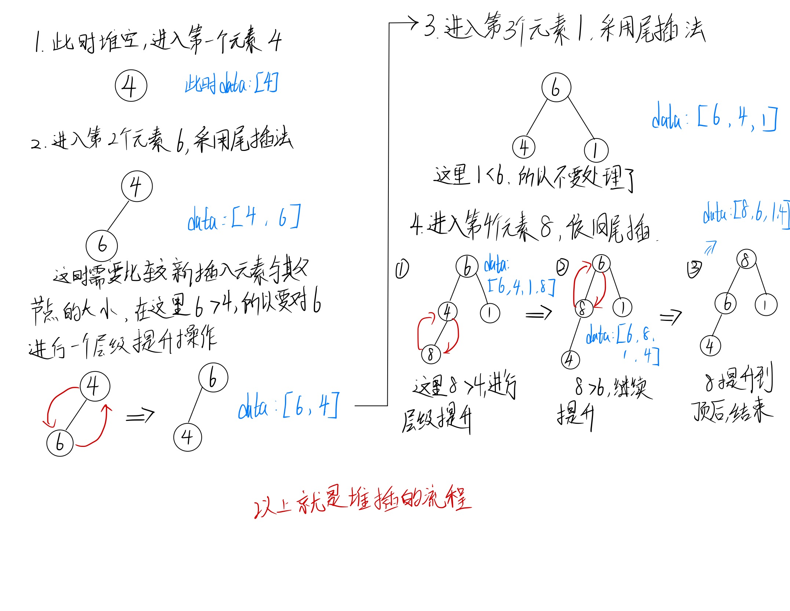
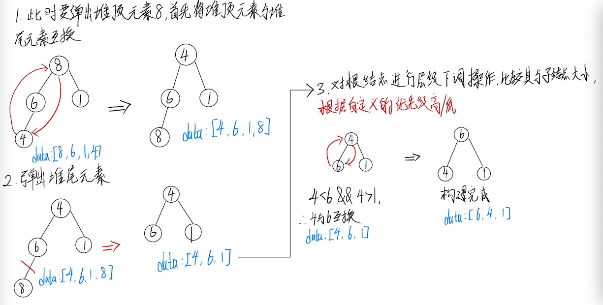

# 优先队列

| 文档创建人 | 创建日期   | 文档内容 | 更新时间   |
| ---------- | ---------- | -------- | ---------- |
| adsionli   | 2021-12-14 | 优先队列 | 2021-12-14 |

## 什么是优先队列

队列我想大家都应该知道，它是一种FIFO(先进先出)的基本数据结构，而优先队列则是在基本的队列基础上的一个拓展。

优先队列会为队列中的每一个元素设置一个优先级，且优先级高(或者低)的将会先出队，优先级相同的则按照其在队列中的顺序依次出队。

## 优先队列的特性

优先队列具有队列的所有特性，包括基本操作，只是在这基础上添加了内部的一个排序，**它本质是一个堆实现的**

和队列基本操作相同:

1. `top` 访问队头元素
2. `empty` 队列是否为空
3. `size` 返回队列内元素个数
4. `push` 插入元素到队尾 (并排序)
5. `emplace` 原地构造一个元素并插入队列
6. `pop` 弹出队头元素
7. `swap` 交换内容

## 优先队列的实现(基于二叉堆)

> 这里的实现全部都是使用**js**实现的，因为本人走的是前端方向，还望谅解......

1. 首先明确，将要建立的优先队列是以优先级高还是优先级低来决定出队顺序，这将决定我们是使用最大堆还是最小堆。假设我们这里选择使用优先级高先出队。那么我们来定义一下优先队列的构造函数。

   > 这里还需要注意，==这里的二叉堆的是一棵完全二叉树！==

   ```js
   class PriorityQueue {
       constructor(
       	compare = (a, b) => a > b
       ){
           this.compare = compare;
           this.data = [];
           this.size = 0;
       }
   }
   ```

   > 1. 这里的compare就是用来决定究竟构建的是最小堆还是最大堆，如上述代码中，构建的就是一个最大堆。
   >
   > 2. 这里是用数组来模拟堆，同时使用一个size变量来记录堆的大小。

2. 当我们在往优先队列中插入新的元素时，我们都需要对堆进行维护，来确保其一直能够保持其最大/小堆的特性，具体如下图所示：

   > 这里使用的例子:[4, 6, 1, 8]

   

   ​		实现代码：

   ```js
   class PriorityQueue {
       constructor(
       	compare = (a, b) => a > b
       ){
           this.compare = compare;
           this.data = [];
           this.size = 0;
       }
       
       /**
        * @method _parent 返回根节点
        * @param {*} index 
        */
       _parent(index) {
           return index - 1 >> 1
       }
       
       /**
       * @method set 添加入优先队列中，同时对齐进行提升操作
       * @param {number} val 
       */
       set(val) {
           this.data.push(val)
           this._shifUp(this.size++)
       }
       
       /**
        * @method _shifUp 层级上调
        * @param {*} index 
        */
       _shifUp(index) {
           while (this._parent(index) >= 0
               && this.compare(this.data[index], this.data[this._parent(index)])) {
               this._swap(index, this._parent(index))
               index = this._parent(index)
           }
       }
   
       _swap(a, b) {
           [this.data[a], this.data[b]] = [this.data[b], this.data[a]]
       }
   }
   ```

   3. 当我们弹出堆顶元素的时候，我们也是需要调整堆的结构的，来确保堆顶元素总是优先级高的元素，具体如下图所示：

      > 例子还是上述的:[4,6,1,8]，这时候弹出堆顶元素8

      

   实现代码如下:

   ```js
   /**
   * @method pop 弹出堆顶元素，并且进行层级变换，维护优先队列堆顶
   */
   pop() {
       if (this.size === 0) { return null }
       this._swap(0, --this.size)
       this._shifDown(0)
       return this.data.pop()
   }
   
   /**
   * @method _parent 返回根节点
   * @param {*} index 
   */
   _parent(index) {
       return index - 1 >> 1
   }
   
   /**
        * @method _child 返回子节点
        * @param {*} index 
        */
   _child(index) {
       return (index << 1) + 1
   }
   
   /**
   * @method _shifDown 层级下调
   * @param {*} index 
   */
   _shifDown(index) {
       while (this._child(index) < this.size) {
           let child = this._child(index)
           if (child + 1 < this.size
               && this.compare(this.data[child + 1], this.data[child])) {
               child = child + 1
           }
           if (this.compare(this.data[index], this.data[child])) {
               break
           }
           this._swap(index, child)
           index = child
       }
   }
   
   _swap(a, b) {
       [this.data[a], this.data[b]] = [this.data[b], this.data[a]]
   }
   ```

经过上述过程后，我们就可以获得优先队列的完整代码啦:

```js
class PriorityQueue {
    constructor(
        compare = (a, b) => a > b
    ) {
        this.data = [];
        this.size = 0;
        this.compare = compare;
    }

    /**
     * @method top 返回堆顶最大元素 
     */
    top() {
        return this.size === 0 ? null : this.data[0]
    }

    /**
     * @method set 添加入优先队列中，同时对齐进行提升操作
     * @param {number} val 
     */
    set(val) {
        this.data.push(val)
        this._shifUp(this.size++)
    }

    /**
     * @method pop 弹出堆顶元素，并且进行层级变换，维护优先队列堆顶
     */
    pop() {
        if (this.size === 0) { return null }
        this._swap(0, --this.size)
        this._shifDown(0)
        return this.data.pop()
    }

    /**
     * @method _parent 返回根节点
     * @param {*} index 
     */
    _parent(index) {
        return index - 1 >> 1
    }

    /**
     * @method _child 返回子节点
     * @param {*} index 
     */
    _child(index) {
        return (index << 1) + 1
    }

    /**
     * @method _shifDown 层级下调
     * @param {*} index 
     */
    _shifDown(index) {
        while (this._child(index) < this.size) {
            let child = this._child(index)
            if (child + 1 < this.size
                && this.compare(this.data[child + 1], this.data[child])) {
                child = child + 1
            }
            if (this.compare(this.data[index], this.data[child])) {
                break
            }
            this._swap(index, child)
            index = child
        }
    }

    /**
     * @method _shifUp 层级上调
     * @param {*} index 
     */
    _shifUp(index) {
        while (this._parent(index) >= 0
            && this.compare(this.data[index], this.data[this._parent(index)])) {
            this._swap(index, this._parent(index))
            index = this._parent(index)
        }
    }

    _swap(a, b) {
        [this.data[a], this.data[b]] = [this.data[b], this.data[a]]
    }
}

export default PriorityQueue;
```

## 优先队列的相关练习题

1. leetcode-630 课程表III：[题目链接](https://leetcode-cn.com/problems/course-schedule-iii/)
2. leetcode-621 任务调度器：[题目链接](https://leetcode-cn.com/problems/task-scheduler/)

  ......


到这，优先队列的内容就差不多说完啦，如果想要牢牢地掌握好这个数据结构类型的话，就需要多敲几遍代码，然后理解好堆的维护，然后再做几道相关的题目，就没有问题啦，加油ヾ(◍°∇°◍)ﾉﾞ。