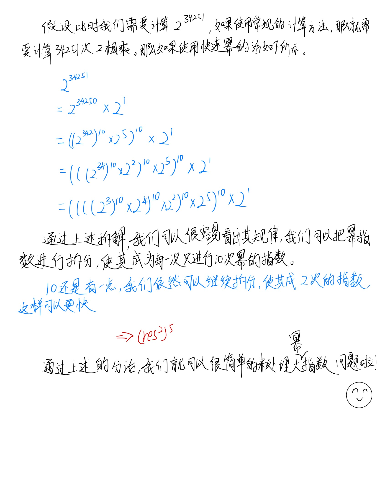

# 快速幂

| 文档创建人 | 创建日期   | 文档内容 | 更新时间   |
| ---------- | ---------- | -------- | ---------- |
| adsionli   | 2021-12-14 | 快速幂   | 2021-12-14 |

## 什么是快速幂？

快速幂就是快速算底数的n次幂。其时间复杂度为 O(log₂N)， 与朴素的O(N)相比效率有了极大的提高。

快速幂算法的核心思想就是每一步都把指数分成两半（分治），而相应的底数做平方运算。这样不仅能把非常大的指数给不断变小，所需要执行的循环次数也变小，而最后表示的结果却一直不会变。

> 以上摘自百度百科

## 快速幂的规律



上图可以很清晰的说明快速幂的构成原理，其实就是分治方法的使用，然后通过对幂指数进行拆分来减少幂指数计算，然后再拆分开位数再一次减少幂指数计算，达到加速的效果！同时上述的快速幂是正向幂拆分，还有逆向拆分，我没有研究...

## 快速幂的代码实现

> js的代码实现

快速幂的实现其实就是通过递归来搞定的

```js
var pow = function (x, n) {
    let ns = n.toString();
    qPow = function (n, p) {
        let res = 1;
        for (let i = p; i != 0; i >>= 1) {
            //当幂指数为奇数时，只要乘以一个就可以了，如果是偶数乘以2个
            if (i & 1 != 0) {
                res = res * n;
            }
            n = n * n;
        }
        return res;
    }
    let res = qPow(x, Number(ns[0]));
    //正向快速幂，从首位开始
    for (let i = 1; i < ns.length; i++) {
        res = qPow(res, 10) * qPow(x, Number(ns[i]));
    }
    //如果幂指数小于0，那么就返回倒数就可以了
    if (n < 0) {
        return 1 / res;
    }

    return res;
};
```

## 快速幂相关练习

1. leetcode-372.超级次方: [超级次方](https://leetcode-cn.com/problems/super-pow/)
2. leetcode-50.Pow(x,n): [Pow(x, n)](https://leetcode-cn.com/problems/powx-n/)

......


快速幂在计算幂指数很大的时候给与了我们巨大的帮助，其本质的思想实际就是分治的策略，所以，分治在程序设计中是非常重要的组成部分，还望大家多多练习，能够熟练掌握分治的知识，加油ヾ(◍°∇°◍)ﾉﾞ。