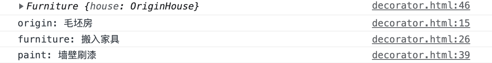
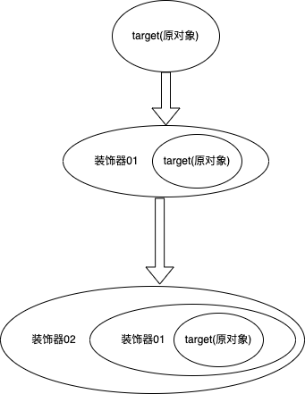

# 装饰器模式

| 文档创建人 | 创建日期   | 文档内容           | 更新时间   |
| ---------- | ---------- | ------------------ | ---------- |
| adsionli   | 2022-02-05 | 装饰器模式知识总结 | 2022-02-05 |

装饰器模式可以说是在平时代码编写中使用最多的一种模式了，一般情况下大家可能都没有注意到，但是实际上已经使用了装饰器模式了。

那么究竟什么是装饰器模式，装饰器模式在js中的实现是什么样子的呢，装饰器模式的使用技巧又有哪一些呢，让我们一同来探究一下。

## 1. 装饰器模式简介

经典的装饰器模式是一种结构型设计模式，它允许向一个现有的对象中添加新的功能，同时又保证不改变它的结构，是对现有类的一个包装修饰。

通常来说，在代码设计中，应该遵循 「多用组合，少用继承」的原则。通过装饰器模式可以动态地给一个对象添加额外的职责。就增加新的功能而言，装饰器模式比生成子类更加灵活，简单。

在生活中很多很多的东西其实都是装饰器模式的使用，比如说：

1. 房屋装修，房屋装修并不会影响到房屋本身用来居住的基本功能，而是只是为房屋增加跟多内容
2. 喝奶茶，除了奶茶之外，还可以添加珍珠、波霸、椰果、仙草、香芋等等辅料，辅料的添加对奶茶的饮用并无影响，奶茶喝起来还是奶茶的味道，只不过辅料的添加让这杯奶茶的口感变得更多样化。
3. 等等.......

所以装饰器模式不仅仅是使用在代码这一层明，在各种各样的用途中都会被用到。当然我们现在再说的还是代码层面，上面的🌰只是为了方便理解装饰器模式的作用。同时我们通过上面的🌰，又可以总结出一些内容：

1. 装饰不影响原有的功能，原有功能可以照常使用；

2. 装饰可以增加多个，共同给目标对象添加额外功能；

那么在js中如何实现装饰器模式呢？可以看一下下面的这段代码:

```js
class OriginHouse {
    getDesc() {
        console.log('毛坯房')
    }
}

/* 搬入家具 - 装饰者 */
class Furniture {
    constructor(house) {
        this.house = house
    }
    
    getDesc() {
        this.house.getDesc()
        console.log('搬入家具')
    }
}

/* 墙壁刷漆 - 装饰者 */
class Painting {
    constructor(house) {
        this.house = house
    }
    
    getDesc() {
        this.house.getDesc()
        console.log('墙壁刷漆')
    }
}

let house = new OriginHouse()
house = new Furniture(house)
house = new Painting(house)

house.getDesc()
```



这段代码就是一段比较典型的装饰器模式运用的例子，就是之前说的房屋装修的问题，我们可以看到最后的输出就是会把装载上的内容同时全部输出出来且没有依赖与继承。

当然针对上面这个例子，我们可以用以下的形式进行简写

```js
/* 毛坯房 - 目标对象 */
var originHouse = {
    getDesc() {
        console.log('毛坯房 ')
    }
}

/* 搬入家具 - 装饰者 */
function furniture() {
    console.log('搬入家具 ')
}

/* 墙壁刷漆 - 装饰者 */
function painting() {
    console.log('墙壁刷漆 ')
}

/* 添加装饰 - 搬入家具 */
originHouse.getDesc = function() {
    var getDesc = originHouse.getDesc
    return function() {
        getDesc()
        furniture()
    }
}()

/* 添加装饰 - 墙壁刷漆 */
originHouse.getDesc = function() {
    var getDesc = originHouse.getDesc
    return function() {
        getDesc()
        painting()
    }
}()

originHouse.getDesc()
// 输出： 毛坯房  搬入家具  墙壁刷漆
```

所以我们也就差不多可以画出装饰器模式的示例图了



可以从上图看出，在表现形式上属于包装模式。在装饰者模式中，一个对象被另一个对象包装起来，形成一条包装链，并增加了原先对象的功能。

## 2. es7中的装饰器

decorator （装饰器）是 ES7 中的一个提案。装饰器与函数组合（compose）以及高阶函数很相似，使用 @ 符号作为标识符，放置在被装饰的代码前面。

> 当然@符号作为装饰器标识符在java中已经被大量使用了，特别是在框架中，比如Springboot框架中就大量使用了@注解符来实现装饰器功能。

JavaScript 中的装饰器和 Java 中的装饰器类似，依赖于 `Object.defineProperty`，一般是用来装饰类、类属性、类方法。使用装饰器可以做到不直接修改代码，就实现某些功能，做到真正的面向切面编程。这在一定程度上和 `Proxy` 很相似，但使用起来比 `Proxy` 会更加简洁。

> 更多关于装饰器相关的内容可以看这里：[TC39](https://github.com/tc39/proposal-decorators)
>
> 现在主要使用装饰器符号的是在typescript中，其中就有三种形式：类、函数、属性装饰器这三种。

### 2.1 类装饰器

装饰类的时候，装饰器方法一般会接收一个目标类作为参数。同时装饰类的时候也可以在接受在声明装饰器时候的参数。下面就是一个类装饰器的例子，

> 类似Springboot框架中的Controller的定义一样

```typescript
//类装饰器
let controllerMap = new Map();
function Controller(params: string) {
    return function (target: any) {
        //注册在一个map中，方便请求进入的时候找到对应的类对象
        map.set(params, target)
        //同时通过设置相关内容，为传入的对象扩展功能
        target.prototype.request = <T>(data: T, status: string, code: number) => {
            return {
                data,
                status,
                code
            }
        }
        target.prototype.require = <T>(data: T) => {
            return data;
        }
    }
}
export { controllerMap, Controller};

import Controller from "../Controller.ts"
@Controller("/user")
class UserController {
    
}
```

如上段代码，这样就可以为对象设置相关的装饰器，实现了类似于Java框架中的功能，方便我们在使用TypeScript编写代码。

同时在类装饰器中主要的有两个参数需要注意一下，一个是在声明装饰器时，传入的参数，这里可传入多个参数，不限制一个`@Controller(...[attr])`，接收的时候自己按自己需要来写就行，还有一个就是`return function(target)`的这个`target`参数，就是原对象，也就是这里的`UserController`

> 这就为我想要写框架提供了很好的工具，哈哈哈，装饰器什么时候才能在js上完全支持就好了，现在就先通过ts来写也很好

### 2.2 函数装饰器

函数装饰器就和类装饰器相同，不过不是作用在class，而是作用在function上，同时这个function必须要在一个class中才可以使用函数装饰器，实际上也就是和类成员装饰器相同，不过这里抽出来说了。看一下下面的例子(这里仍然用框架中的知识来说明):

```typescript
import {controllerMap} from "../Controller.js"
let getMap = new Map();
function GET(path){
    return function(target, attr){
       	getMap.set(target.name, (getMap.get(target.name) | []).push(attr))
    }
}

export default GET;
import GET from "../Get.js"
@Controller('user')
class UserController {
    @GET("/info")
    getUserInfo(Request request){
		console.log(request.user_id);
    }
}
```

这里就是模拟了一个控制器中的一个请求的GET请求的操作，他会在框架加载之初，构建出一个GET请求的表，来响应GET请求的进入，然后就可以直接找到这个请求，并进行调用。这样是不是就会很方便呢，当然这里也只是一个简单的实用，并不完善。

下面再给一个修改了方法过程的例子:

```typescript
//假设这里有一个filter的map保存了filter对象,名称为filterMap
function filter(param: string){
    return function(target: any, propName: any, descriptor: any){
        let oMethod = target[propName];
        descriptor.value = function(...args: any[]){
            let filterStatus = filterMap.get(param).filter(args);
            if(!filterSatatus.status){
                throw new Error(filterStatus.error_message)
            }
            oMethod.apply(this, args);
        }
    }
}
class UserController {
	@filter('user')
    getUserInfo(user: UserInfo){
        console.log(user);
    }
}
```

这里就实现了一个类似于过滤器的功能了。这里就是将原方法进行了改造，但是仍然保留了原方法的功能，只是添加了一个过滤器的功能，来效验参数是否合法。

### 2.3 属性装饰器

属性装饰器，顾名思义就是类中的属性的设置的装饰器，这个也直接通过代码来看一下:

```typescript
function readonly(isWirte: boolean, value: string) {
    return function(target: any, name: any, descriptor: any){
        Reflect.deleteProperty(target, name);
        Reflect.defineProperty(target, name, {
            value: value,
            writable: isWirte
        })
    }
}
@Controller('user')
class UserController {
    @readonly(true, "adsionli")
    public userName: string | undefined;
    @GET("/info")
    getUserInfo(Request request){
		console.log(request.user_id);
    }
}
```

上述代码中的readonly的设置在userName属性上的时候，就是属性装饰器，我们通过使用readonly的设置，让userName这个属性不能够被更改的同时设置其默认值，这也是使用属性装饰器的一个用处，当然还有更多关于属性装饰器的使用，这就需要大家自己去摸索了。

属性装饰器一共接收三种参数，分别是:

1. `target`: 类对象
2. `name`: 属性名称
3. `descriptor`: 属性描述(就是一些属性相关的内容，比如`value`,`writable`,`configure`这些)

> 当然这些装饰器我都是使用在ts中的，如果大家要使用的话需要保证已经安装好了ts的环境才可以。

## 3. 装饰器模式的优缺点

**装饰者模式的优点：**

1. 我们经常使用继承的方式来实现功能的扩展，但这样会给系统中带来很多的子类和复杂的继承关系，装饰者模式允许用户在不引起子类数量暴增的前提下动态地修饰对象，添加功能，装饰者和被装饰者之间松耦合，可维护性好；

2. 被装饰者可以使用装饰者动态地增加和撤销功能，可以在运行时选择不同的装饰器，实现不同的功能，灵活性好；

3. 装饰者模式把一系列复杂的功能分散到每个装饰器当中，一般一个装饰器只实现一个功能，可以给一个对象增加多个同样的装饰器，也可以把一个装饰器用来装饰不同的对象，有利于装饰器功能的复用；

4. 可以通过选择不同的装饰者的组合，创造不同行为和功能的结合体，原有对象的代码无须改变，就可以使得原有对象的功能变得更强大和更多样化，符合开闭原则；

**装饰者模式的缺点：**

1. 使用装饰者模式时会产生很多细粒度的装饰者对象，这些装饰者对象由于接口和功能的多样化导致系统复杂度增加，功能越复杂，需要的细粒度对象越多；

2. 由于更大的灵活性，也就更容易出错，特别是对于多级装饰的场景，错误定位会更加繁琐；

## 4. 装饰器模式与其他几种模式的区别

### 4.1 装饰器模式与适配器模式

> 装饰者模式和适配器模式都是属于包装模式，然而他们的意图有些不一样：

1. 装饰器模式： 扩展功能，原有功能还可以直接使用，一般可以给目标对象多次叠加使用多个装饰者；

2. 适配器模式： 功能不变，但是转换了原有接口的访问格式，一般只给目标对象使用一次；

### 4.2 装饰器模式与组合模式

这两个模式有相似之处，都涉及到对象的递归调用，从某个角度来说，可以把装饰者模式看做是只有一个组件的组合模式。

1. 装饰器模式： 动态地给对象增加功能；

2. 组合模式： 管理组合对象和叶子对象，为它们提供一致的操作接口给客户端，方便客户端的使用；

### 4.3 装饰器模式与策略模式

装饰者模式和策略模式都包含有许多细粒度的功能模块，但是他们的使用思路不同：

1. 装饰器模式： 可以递归调用，使用多个功能模式，功能之间可以叠加组合使用；

2. 策略模式： 只有一层选择，选择某一个功能；****

**这里大家如果不懂这三种模式的话，可以看一下我关于其他模式的总结来进行一下学习**

## 总结

装饰器模式真的是非常好用的一种模式，对于我们实现功能拓展提供了非常便利的手段，虽然也存在一些问题但仍然不能挡住他的好用。

同时因为es7中关于@装饰符的使用，我就可以来自己写关于一些框架的内容啦，哈哈。

**装饰者模式的适用场景**

1. 如果不希望系统中增加很多子类，那么可以考虑使用装饰者模式；

2. 需要通过对现有的一组基本功能进行排列组合而产生非常多的功能时，采用继承关系很难实现，这时采用装饰者模式可以很好实现；

3. 当对象的功能要求可以动态地添加，也可以动态地撤销，可以考虑使用装饰者模式；

好好利用装饰器模式，来进一步优化代码结构，加油加油ヾ(◍°∇°◍)ﾉﾞ！
