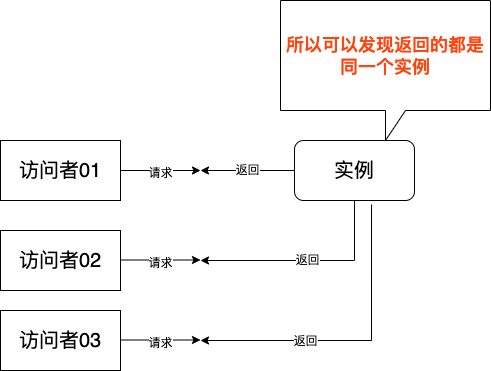
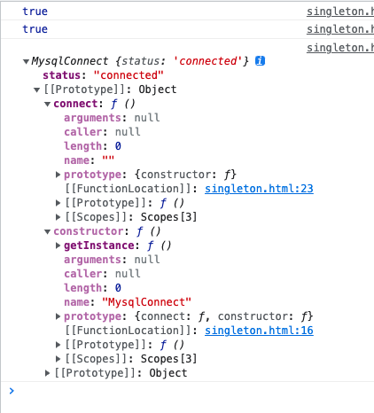
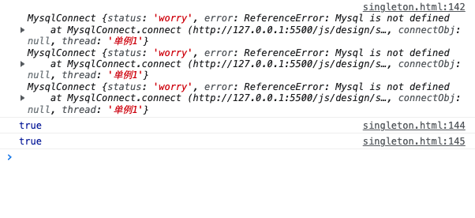

# 单例模式

| 文档创建人 | 创建日期   | 文档内容         | 更新时间   |
| ---------- | ---------- | ---------------- | ---------- |
| adsionli   | 2022-02-05 | 单例模式知识总结 | 2022-02-05 |

单例模式是设计模式中比较简单的一种模式，也是日常代码编程中最常使用的一种模式。一直没有很系统的整理过它，通过这一篇来进行一下整理。

单例模式 （Singleton Pattern）又称为单体模式，保证一个类只有一个实例，并提供一个访问它的全局访问点。也就是说，**第二次使用同一个类创建新对象的时候，应该得到与第一次创建的对象完全相同的对象**。

## 1. 实际开发中遇到需要单例模式的情况

1. 数据库连接、线程池、配置文件缓存、浏览器中的 window/document 等，如果创建多个实例，会带来资源耗费严重，或访问行为不一致等情况。
2. 一些文件的读取场景也类似，如果文件比较大，那么文件读取就是一个比较重的操作。比如这个文件是一个配置文件，那么完全可以将读取到的文件内容缓存一份，每次来读取的时候访问缓存即可，这样也可以达到节约开销的目的。
3. 一些频繁需要被访问到的实例，且这些实例需要保存其每次修改的状态。

...

**那么根据上述的场景，我们很容易就发现一些相关性:**

1. 每次访问者来访问，返回的都是同一个实例；

2. 如果一开始实例没有创建，那么这个特定类需要自行创建这个实例；

知道了上面这些特性，我们就可以发现在前端开发中的很多地方都是用到了单例模式：

1. window和document就是两个典型的单例模式的使用，这两个对象无论在什么时候进行访问的时候都是一样的对象。

   > `window` 表示包含 `DOM` 文档的窗口，`document` 是窗口中载入的 `DOM` 文档

2. es6中提供的Module模块特性，通过import/export导出模块中的变量也是单例。也就是说，如果在某个地方改变了模块内部变量的值，别的地方再引用的这个值是改变之后的。

   > 看到这块的时候突然想到了vuex是不是也是单例的一种使用，查了一些资料之后发现了问题....vue本身就是单页面应用的，所以vuex实际上就是不属于单例模式的使用，而是单页应用的单页面中的单例的应用。是不是有点奇怪，也就是说vuex只作用在单页面上属于单例，但是作用在多页面上时，就不是单例了，而是开辟了一块新的内存来存放一个新的vuex状态数据。

3. 在 JavaScript 中使用字面量方式创建一个新对象时，实际上没有其他对象与其类似，因为新对象已经是单例了，就比如下面的这个例子:

   ```js
   { a: 1 } === { a: 1 }
   //这里的数据实际就是false了，肯定是不相同的，这就涉及到变量那块的知识了，可以去看看。
   ```

然后来看一个简单的单例模式使用的例子

```js
class MysqlConnect {
    static _schedule = null;
	
	static getInstance(){
        //判断是否已经创建过MysqlConnect，如果已经创建过了就直接返回
        if(MysqlConnect._schedule){
           	return MysqlConnect._schedule;
        }
        return MysqlConnect._schedule = new MysqlConnect();
    }

	constructor(){
        //判断是否已经创建过MysqlConnect，如果已经创建过了就直接返回
        if(MysqlConnect._schedule){
           	return MysqlConnect._schedule;
        }
        //如果是通过new来创建的实例对象，那就在构造函数中为静态变量进行赋值
        MysqlConnect._schedule = this;
    }
}
```

虽然上面这个对象可以实现单例，但是有一个很明显的缺点，就是维护的实例作为静态属性直接暴露，外部可以直接修改，这点肯定是不可被接受的。

## 2. js中实现单例模式的几种方式

**首先我们先来整理一下实现单例所需要的内容**

1. `Singleton`: 特定类，就是需要被访问者拿到的单例的实例
2. `instance`: 单例，用于保存特定类的实例，特定类一般会提供 getInstance 方法来获取该单例
3. `getInstance`: 获取单例的方法，或者直接由 new 操作符获取

除了上面需要具备的内容之外，还需要关注以下几个点：

1. 访问时返回的始终是同一个实例
2. 自行赋给instance, 可以是在一开始加载时创建或是在第一次被访问时创建
3. 一般来说都会用于一个getInstance方法用来获取instance存储的实例。

单例模式的具体工作方式如下图：



### 2.1 使用IIFE方式来创建单例模式

> IIFE的意思就是立即调用函数表达式的意思，这里实际就是利用了函数作用域来隐藏单例实例的instance
>
> 这是一个被称为 [自执行匿名函数](https://developer.mozilla.org/zh-CN/docs/Glossary/Self-Executing_Anonymous_Function) 的设计模式，主要包含两部分。第一部分是包围在 [`圆括号运算符`](https://developer.mozilla.org/zh-CN/docs/Web/JavaScript/Reference/Operators/Grouping) `()` 里的一个匿名函数，这个匿名函数拥有独立的词法作用域。这不仅避免了外界访问此 IIFE 中的变量，而且又不会污染全局作用域。
>
> ```js
> (function () {
>     statements
> })();
> ```
>
> 摘自MDN

根据IIFE的定义，我们来改写一下MysqlConnect类的写法

```js
const MysqlConnect = (function(){
    let _instance = null;
    //这里实际就是对构造函数的修改
    const MysqlConnect = function(){
        if(_instance) return _instance;
        _instance = this;
        this.connect();
        return _instance
    }
    
    MysqlConnect.prototype.connect = function(){
        this.status = 'connected';
    }
    
    MysqlConnect.getInstance = function() {
        if(_instance) return _instance;
        _instance = new MysqlConnect();
        return _instance;
    }
    
    return MysqlConnect;
})();
const m1 = new MysqlConnect();
const m2 = new MysqlConnect();
const m3 = MysqlConnect.getInstance();
console.log(m1 === m2);
console.log(m2 === m3);
console.log(m1);
```

先来查看一下输出：




通过使用IIFE再配合块作用域，就可以很好地将_instance对外部隐藏而不会被修改啦。

> 1. 代价和上例一样是闭包开销，并且因为 IIFE 操作带来了额外的复杂度，让可读性变差。
>
> 2. IIFE 内部返回的 Singleton 才是我们真正需要的单例的构造函数，外部的 Singleton 把它和一些单例模式的创建逻辑进行了一些封装。
>
> 3. IIFE 方式除了直接返回一个方法/类实例之外，还可以通过模块模式的方式来进行。
>
>    ```js
>    //其实就是多加一个export MysqlConnect就可以了
>    export default MysqlConnect;
>    ```

### 2.2 使用块级作用域创建单例应用

直接上代码

```js
 let MysqlConnect;
{
    //在{}中使用块级作用域，就可以避免被外部污染
    let _instance = null
    //const也是es6中提供的块级作用域，这样定义的MysqlConnect也只作用在内部，而不会被外部污染
    const MysqlConnect = function () {
        if (_instance) return _instance     // 判断是否已有单例
        _instance = this
        this.connect()                         // 初始化操作
        return _instance
    }

    MysqlConnect.prototype.connect = function () {
        this.status = 'connected'
    }
    //这里的MysqlConnect是一个自由变量，因为定义的作用域更大，所以可以在这里被使用
    MysqlConnect = function () {
        if (_instance) return _instance
        _instance = new Singleton()
        return _instance
    }
}
const m1 = MysqlConnect();
const m2 = MysqlConnect();
console.log(m1 === m2);
```

解释就不多加解释啦，我已经写在注释里面啦，可以发现块级作用域的出现，让我们可以脱离IIFE来进行单例的创建，真的是很好用。

### 2.3 单例模式的抽离

为啥叫单例模式的抽离呢，因为我们之前的例子中不难发现，单例模式的创建逻辑和原先这个类的一些功能逻辑（比如 `init` 等操作）混杂在一起，根据单一职责原则，这个例子我们还可以继续改进一下，将单例模式的创建逻辑和特定类的功能逻辑拆开，这样功能逻辑就可以和正常的类一样。

其实实现起来也不是很难，直接看代码就可以啦：

```js
class MysqlConnect {
    constructor(thread) {
        this.status = "disconnect";
        this.error = null;
        this.connectObj = null;
        this.thread = thread;
        this.connect();
    }

    connect() {
        try {
            this.connectObj = Mysql.connect();
            this.status = "connected";
        } catch (error) {
            this.status = "worry";
            this.error = error;
        }
    }
}

const Singleton = (function () {
    let _instance = null;
    const ProxySingleton = function (thread) {
        if (_instance) {
            return _instance;
        }
        _instance = new MysqlConnect(thread);
        return _instance;
    }
    ProxySingleton.getInstance = function (thread) {
        if (_instance) {
            return _instance;
        }
        _instance = new ProxySingleton(thread);
        return _instance;
    }

    return ProxySingleton;
})();
const v1 = new Singleton('单例1')
const v2 = new Singleton('单例2')
const v3 = Singleton.getInstance('单例3')
console.log(v1, v2, v3)

console.log(v1 === v2)	// true
console.log(v1 === v3)	// true
```

可以复制到代码中，在浏览器控制台中输出看一下:



哦吼，实现了和之前一样的效果，但是我们已将之前的模块进行了拆分，实现了单一职责原则啦。

这样的单例模式赋能类也可被称为代理类，将业务类和单例模式的逻辑解耦，把单例的创建逻辑抽象封装出来，有利于业务类的扩展和维护。代理的概念我们将在后面代理模式的章节中更加详细地探讨。

当然对于上段代码，我们还可以通过使用es6中Proxy和Reflect来进行优化:

```js
class MysqlConnect {
    constructor(thread) {
        this.status = "disconnect";
        this.error = null;
        this.connectObj = null;
        this.thread = thread;
        this.connect();
    }

    connect() {
        try {
            this.connectObj = Mysql.connect();
            this.status = "connected";
        } catch (error) {
            this.status = "worry";
            this.error = error;
        }
    }
}

const Singleton = (function () {
    let _instance
    return new Proxy(MysqlConnect, {
        construct(target, args) {
            return _instance || (_instance = Reflect.construct(MysqlConnect, args)) // 使用 new FuncClass(...args) 也可以
        }
    })
})();
const v1 = new Singleton('单例1')
const v2 = new Singleton('单例2')
const v3 = Singleton.getInstance('单例3')
console.log(v1, v2, v3)

console.log(v1 === v2)	// true
console.log(v1 === v3)	// true
```

## 3. 惰性单例、懒汉式-饿汉式

有时候一个实例化过程比较耗费性能的类，但是却一直用不到，如果一开始就对这个类进行实例化就显得有些浪费，那么这时我们就可以使用惰性创建，即延迟创建该类的单例。之前的例子都属于惰性单例，实例的创建都是 `new` 的时候才进行。

> 其实也是很好理解的，只是名词让人有点疑惑，实际就是用到了才创建，不用不创建

**惰性单例又被成为懒汉式，相对应的概念是饿汉式：**

1. 懒汉式单例是在使用时才实例化

2. 饿汉式是当程序启动时或单例模式类一加载的时候就被创建。

我们可以举一个简单的例子比较一下：

```js
class FuncClass {
    constructor() { this.bar = 'bar' }
}

// 饿汉式
const HungrySingleton = (function() {
    const _instance = new FuncClass()
    
    return function() {
        return _instance
    }
})()

// 懒汉式
const LazySingleton = (function() {
    let _instance = null
    
    return function() {
        return _instance || (_instance = new FuncClass())
    }
})()

const visitor1 = new HungrySingleton()
const visitor2 = new HungrySingleton()
const visitor3 = new LazySingleton()
const visitor4 = new LazySingleton()

console.log(visitor1 === visitor2)	// true
console.log(visitor3 === visitor4)	// true
```

惰性创建在实际开发中使用很普遍，了解一下对以后的开发工作很有帮助。

## 4. 单例模式的优缺点

单例模式主要解决的问题就是节约资源，保持访问一致性。

**简单分析一下它的优点：**

1. 单例模式在创建后在内存中只存在一个实例，节约了内存开支和实例化时的性能开支，特别是需要重复使用一个创建开销比较大的类时，比起实例不断地销毁和重新实例化，单例能节约更多资源，比如数据库连接；

2. 单例模式可以解决对资源的多重占用，比如写文件操作时，因为只有一个实例，可以避免对一个文件进行同时操作；

3. 只使用一个实例，也可以减小垃圾回收机制 GC（Garbage Collecation） 的压力，表现在浏览器中就是系统卡顿减少，操作更流畅，CPU 资源占用更少；

**单例模式也是有缺点的**

1. 单例模式对扩展不友好，一般不容易扩展，因为单例模式一般自行实例化，没有接口；

2. 与单一职责原则冲突，一个类应该只关心内部逻辑，而不关心外面怎么样来实例化；

**. 单例模式的使用场景**

那我们应该在什么场景下使用单例模式呢：

1. 当一个类的实例化过程消耗的资源过多，可以使用单例模式来避免性能浪费；

2. 当项目中需要一个公共的状态，那么需要使用单例模式来保证访问一致性；
