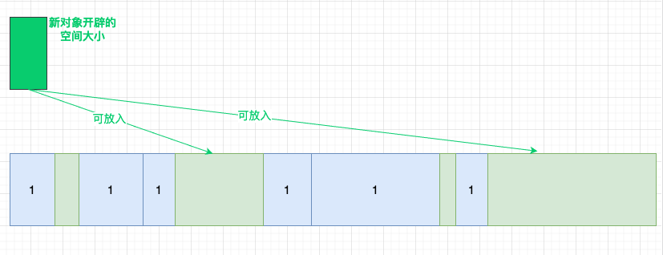

# 垃圾回收与内存泄漏

| 文档创建人 | 创建日期   | 文档内容                       | 更新时间   |
| ---------- | ---------- | ------------------------------ | ---------- |
| adsionli   | 2022-02-20 | 垃圾回收与内存泄漏知识学习笔记 | 2022-02-20 |

垃圾回收与内存管理是Js中很重要的一块部分，它贯穿了整个Js的各个方面，所以就来好好的学一下这两个方面的知识，了解其在Js中具体的执行方式、条件、管理。

## 垃圾回收(GC)

根据MDN上的垃圾回收的说明，我们可以知道：

垃圾回收是删除任何其他对象未使用的对象的过程。

在Js中，垃圾回收器并不是每时每刻都在进行工作的，而是定期的、周期性的进行工作，找出那些不再呗继续使用的对象，让后将存储它的内存空间进行释放。

> 周期性的原因是因为垃圾回收器的开销比较大而且在垃圾回收时会占用主线程。

不再使用的变量也就是生命周期结束的变量，当然只可能是局部变量，全局变量的生命周期直至浏览器卸载页面才会结束。局部变量只在函数的执行过程中存在，而在这个过程中会为局部变量在栈或堆上分配相应的空间，以存储它们的值，然后在函数中使用这些变量，直至函数结束。而闭包中由于内部函数的原因(内部函数会始终调用外部函数中的变量)，外部函数并不能算是结束。

可以看一下下面这个例子，来区分一下局部变量与全局变量

```js
function fn1(){
    const obj = {
        name: "adsionli",
        age: 26
    }
}
function fn2(){
    const obj = {
        name: "adsionli",
        age: 26
    }
    return obj;
}
let a = fn1();
let b = fn2();
```

现在可以分析一下上述的代码：

1. 首先在`fn1`函数中,`obj`属性在`fn1`被执行时存放在一块内存空间中，但是由于`fn1`函数执行完成之后，并没有外部变量继续使用`obj`属性，所以存放`obj`属性的内存空间会被垃圾回收器释放掉。
2. 接着来看一下`fn2`函数，同样的`fn2`函数中的`obj`属性也会被存放在一块内存空间中，当`fn2`函数执行完成之后，此时存放`obj`属性的内存空间不会被释放掉，这是因为它被返回给了`b`这个全局变量了，所以就是还是在使用之中，所以就不会被垃圾回收器回收掉，就不会被释放。

到了这里我们也就大概明白了垃圾回收器的工作，但是对于垃圾回收器来说，究竟该怎么区分哪些变量是需要的，哪些变量是不需要的，在Js中主要有两种方法来进行区分：**引用计数**和**标记清除**

### 1.1 标记清除法

标记清除法就和它的名字是一样的，每一个变量再被使用的时候，会被标记上相应的标识来避免垃圾回收器将其释放，当变量不再被使用的时候就会被标记为可被回收状态，然后由垃圾回收器将其释放。

> 标记清除（Mark-Sweep），目前在 `JavaScript引擎` 里这种算法是最常用的，到目前为止的大多数浏览器的 `JavaScript引擎` 都在采用标记清除算法，只是各大浏览器厂商还对此算法进行了优化加工，且不同浏览器的 `JavaScript引擎` 在运行垃圾回收的频率上有所差异

#### 1.1.1 执行流程

1. 垃圾收集器在运行时会给内存中的所有变量都加上一个标记，假设内存中所有对象都是垃圾，全标记为0。

2. 然后从各个根对象开始遍历，把不是垃圾的节点改成1。

3. 清理所有标记为0的垃圾，销毁并回收它们所占用的内存空间。

4. 最后，把所有内存中对象标记修改为0，等待下一轮垃圾回收。

#### 1.1.2 优点

标记清除法的优点非常明显，就是非常非常的简单，只需要为对象添加一个标记位，来区分是被使用还是闲置即可，非常的简单，实现起来也很方便。

#### 1.1.3 缺点

标记清除算法有一个很大的缺点，就是在清除之后，剩余的对象内存位置是不变的，也会导致空闲内存空间是不连续的，导致内存碎片化，并且由于剩余空闲内存不是一整块，它是由不同大小内存组成的内存列表，这就牵扯出了内存分配的问题。(下图中展示的就是标记清除法清除之后的情况)


如果这时候我们需要插入一块为新的对象分配的内存空间时，我们就需要先线性查找到>= size的块才能分配给他。就像下面这张图展示的一样:



对于如何找到合适的块的大小，可以有以下三种方法：

1. 找到**>=size**的块就立刻返回。
2. 遍历全部的内存空间，返回**>=siz**e的最下的内存块
3. 遍历全部的内存空间，找到最大的内存块，然后进行切割，**切割的依据就是准备放入的内存的size大小**，然后将这块内存地址返回。

上面三种方法中，最不靠谱的就是第三种，这玩意虽然能够返回最合适的大小的size的内存块，但是造成了更多的内存碎片。

对比一下第一种和第二种方法，我们可以发现第一种方法的效率明显要比第二种的效率要高不少，这是因为第一种方法的最差时间复杂度是O(n)，而第二种的平均时间复杂度是O(n)，所以针对以上的分析，会发现还是线性查找还是比较好的。

当然其实这其中还是有一些问题就是：会产生更多的小的内存碎片。当然这个缺点也就是标记清除法最明显的缺点了。

而且标记清除法还有一个缺点就是**分配速度慢**，因为即便是使用 `First-fit` 策略，其操作仍是一个 `O(n)` 的操作，最坏情况是每次都要遍历到最后，同时因为碎片化，大对象的分配效率会更慢。

> 有一种算法，可以解决标记清除法的缺点就是标记整理(Mark-Compact)算法，它在标记阶段和标记清除法是相同的，但是在清除阶段做了一些操作，就是将还在被使用的对象的内存进行了移动，然后清理了边界上的内存块。具体可以看一下下图:
>
> 

### 1.2 引用计数法

引用计数（Reference Counting），这其实是早先的一种垃圾回收算法，它把 **对象是否不再需要** 简化定义为 **对象有没有其他对象引用到它**，如果没有引用指向该对象（零引用），对象将被垃圾回收机制回收。

> 不过目前使用引用计数法已经很少很少了，因为其中有严重的缺陷，会导致内存的堆积。

引用计数法主要工作就是将每一个变量都赋予一个被使用次数的变量，然后通过这个变量来判断是否清除，那么可以触发变量变化的几个情况如下:

1. 当声明了一个变量并且将一个引用类型赋值给该变量的时候这个值的引用次数就为 1。
2. 如果同一个值又被赋给另一个变量，那么引用数加 1。
3. 如果该变量的值被其他的值覆盖了，则引用次数减 1。
4. 当这个值的引用次数变为 0 的时候，说明没有变量在使用，这个值没法被访问了，回收空间，垃圾回收器会在运行的时候清理掉引用次数为 0 的值占用的内存。

说实话，当我在看到这些情况的时候，我觉得这是一个很美好的方法，而且很简单，很容易实现，但是实际这里存在了一个十分巨大的缺陷，就是**循环引用问题**。就比如下面这个例子：

```js
function fn(){
    const A = new Object();
    const B = new Object();
    
    A.b = B;
    B.a = A;
}
```

如上所示，对象 A 和 B 通过各自的属性相互引用着，按照上文的引用计数策略，它们的引用数量都是 2，但是，在函数 `test` 执行完成之后，对象 A 和 B 是要被清理的，但使用引用计数则不会被清理，因为它们的引用数量不会变成 0，假如此函数在程序中被多次调用，那么就会造成大量的内存不会被释放。

> 这个问题在使用标记清除法的时候就不会出现，这是因为标记清除法会将fn函数在执行完成后，fn函数中的属性会被划入到非作用域内，然后就会被清除掉。

根据我看的几个博客中有提到在早期的IE8之前的版本中，DOM对象以及BOM对象时基于c++的COM对象的形式实现的，而COM对象的垃圾回收机制还是采用的是引用计数法，而没有使用Js引擎中的标记清除法来实现，这就导致了Js 访问的**COM对象依然是基于引用计数策略**的，这就会让IE中涉及到COM对象的使用时，就会存在循环应用的问题，导致内存的浪费。

```js
// COM对象
let ele = document.getElementById("xxx")
let obj = new Object()

// 造成循环引用
obj.ele = ele
ele.obj = obj
```

那么为了可以让这些不必要的内存浪费，最简单的方法来处理就是自己手动来释放

```js
ele = null;
```

但是在IE9及IE9+后的版本中，`BOM` 与 `DOM` 对象都改成了 `JavaScript` 对象，也就避免了上面的问题。也就是说使用了Js引擎的标记清除法了。

#### 1.2.1 优点

1. 对比标记清除来看就会清晰很多，首先引用计数在引用值为 0 时，也就是在变成垃圾的那一刻就会被回收，所以它可以立即回收垃圾。
2. 标记清除法是定时执行的而且在执行时会占用系统线程，而引用计数法只需要在引用时计数就可以了。

#### 1.2.2 缺点

1. 引用计数的缺点想必大家也都很明朗了，首先它需要一个计数器，而此计数器需要占很大的位置，因为我们也不知道被引用数量的上限
2. 无法解决循环引用无法回收的问题，这也是最严重的。


这里就先记录一下比较简单且常见的两种GC方法，之后还会有一篇专门深入的去学习GC优化的内容。

## 2. 内存泄漏问题

内存泄露是指当一块内存不再被应用程序使用的时候，由于某种原因，这块内存没有返还给操作系统或者内存池的现象。内存泄漏可能会导致应用程序卡顿或者崩溃。

比较常见的内存泄漏就比如下面这段代码所示：

```js
function assignHandler(){
    var element = document.getElementById('toolbar');
    element.onclick = function() {
        alert(element.id)
    }
}
```

以上代码创建了一个作为 element 元素事件处理程序的闭包，而这个闭包则又创建了一个循环引用，匿名函数中保存了一个对 element 对象的引用，因此无法减少 element 的引用数。只要匿名函数在，element 的引用数至少是 1，因此它所占用的内存就永远无法回收。

解决方法也很简单，就和之前说的引用计数法一样，主动释放掉就可以。

```js
function assignHandler(){
    var element = document.getElementById('toolbar');
    element.onclick = function() {
        alert(element.id)
    }
    element = null;
}
```

### 2.1 全局变量造成的内存泄漏

在非严格模式中，如果存在未定义变量的话，会自动进行变量提升，变为全局变量，绑定在全局对象上(window/global)，就比如下面这段代码中所示:

```js
function fn(){
    name = "adsionli"
}
fn();
console.log(name);
```


foo 执行的时候，由于内部变量没有定义，所以相当于 `window.name = 'adsionli'`，函数执行完毕，本应该被销毁的变量 `name` 却永久的保留在内存中了。

还有种情况就是this上下对象使用出现问题，可以看一下下段代码:

```js
function foo(){
	this.name = "adsionli";
}
//foo函数自己调用自身，而不是作为构造函数被实例化出来的时候，this指向的是全局对象window，这就导致name一直在内存中了
foo();
```

针对上面的出现的问题，使用严格模式`use strict`就可以解决，这就可以避免全局变量的不合理出现，避免内存泄漏。

```js
'use strict'
function foo(){
    this.name = "adsionli";
}
//foo函数自己调用自身，而不是作为构造函数被实例化出来的时候，this指向的是全局对象window，这就导致name一直在内存中了
foo();
```

再来看一下之前的例子在使用严格模式的时候的输出是什么。


这时候就会报错了，就可以避免this上下文指针出现的问题。

> 当然严格模式也不是万能的，比如说第一种情况就无法处理掉，因为name在fn函数执行时才会被提升，这时候他就变成合法的了，就无法被严格模式捕捉到。

所以必须要注意对全局变量的不需要被使用的时候进行手动释放，设置为 null，以回收内存。

**全局变量注意事项：**

当全局变量用于临时存储和处理大量信息时，需要多加小心。如果必须使用全局变量存储大量数据时，确保用完以后把它设置为 null 或者重新定义。与全局变量相关的增加内存消耗的一个主因是缓存。缓存数据是为了重用，缓存必须有一个大小上限才有用。高内存消耗导致缓存突破上限，因为缓存内容无法被回收。

### 2.2 计时器造成的内存泄漏

看一下下面这段代码：

```js
var someResource = getData();
setInterval(function(){
    var node = document.getElementById('Node');
    if(node){
        node.innerHTML = JSON.stringify(someResource);
    }
}, 1000);
```

与节点或数据关联的计时器不再需要，`node` 对象可以删除，整个回调函数也不需要了。可是，计时器回调函数仍然没被回收（计时器停止才会被回收）。同时，`someResource` 如果存储了大量的数据，也是无法被回收的。

### 2.3 闭包造成的内存泄漏

闭包是js中非常重要的知识，如果不了解闭包相关的知识的可以去看一下我写的闭包的博文。但是在闭包的不当使用会发生严重的内存泄漏。

```js
var theThing = null;
var replaceThing = function () {
    var originalThing = theThing;
    var unused = function () {
        if (originalThing)
            console.log("hi");
    };
    theThing = {
        longStr: new Array(1000000).join('*'),
        someMethod: function () {
            console.log(someMessage);
        }
    };
};
setInterval(replaceThing, 1000);
```

每次调用 `replaceThing` `，theThing` 得到一个包含一个大数组和一个新闭包（`someMethod`）的新对象。同时，变量 `unused` 是一个引用 `originalThing` 的闭包（先前的 `replaceThing` 又调用了 `theThing` ）。思绪混乱了吗？最重要的事情是，闭包的作用域一旦创建，它们有同样的父级作用域，作用域是共享的。`someMethod` 可以通过 `theThing` 使用，`someMethod` 与 `unused` 分享闭包作用域，尽管 `unused` 从未使用，它引用的 `originalThing` 迫使它保留在内存中（防止被回收）。当这段代码反复运行，就会看到内存占用不断上升，垃圾回收器（GC）并无法降低内存占用。本质上，闭包的链表已经创建，每一个闭包作用域携带一个指向大数组的间接的引用，造成严重的内存泄漏。


具体就如上图所示。


## 参考文章

1. [「硬核JS」你真的了解垃圾回收机制吗](https://juejin.cn/post/6981588276356317214)
2. [JS 从内存空间谈到垃圾回收机制](https://www.cnblogs.com/echolun/p/11503915.html)
3. [JS中的垃圾回收与内存泄漏](https://segmentfault.com/a/1190000012738358)
4. [MDN-内存管理](https://developer.mozilla.org/zh-CN/docs/Web/JavaScript/Memory_Management)
5. [JavaScript 垃圾回收机制](http://thsi.tech/2020/11/17/javascript/04-javascript-garbage-collection/)
6. [4类 JavaScript 内存泄漏及如何避免](https://jinlong.github.io/2016/05/01/4-Types-of-Memory-Leaks-in-JavaScript-and-How-to-Get-Rid-Of-Them/)

## 总结

Js的垃圾回收策略真的是很多种，当我们弄懂其中的大概的工作原理之后，我们就可以在编写代码时，知道程序会在什么时候释放掉无用的内存地址块，避免内存的浪费，提高程序的性能。这对于我们的开发过程还是十分重要的，所以希望大家可以重视这方面的知识内容，而不是只是浅显的为了面试而去死记硬背，而是要在实际代码开发中去思考这些内容，这样我们才可以有所进步，成为一个好的coder，加油呀ヾ(◍°∇°◍)ﾉﾞ！

