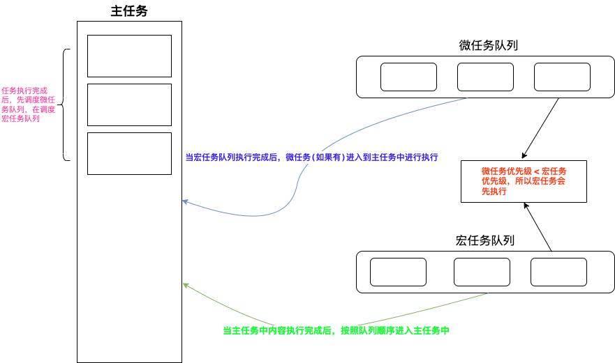
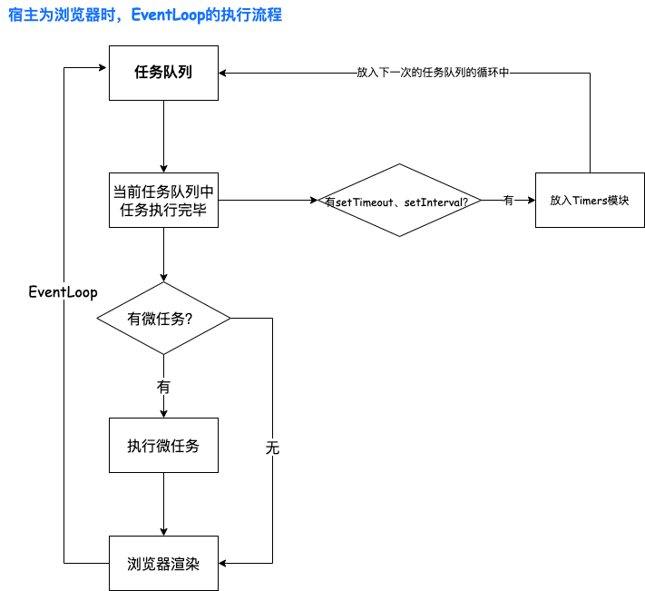
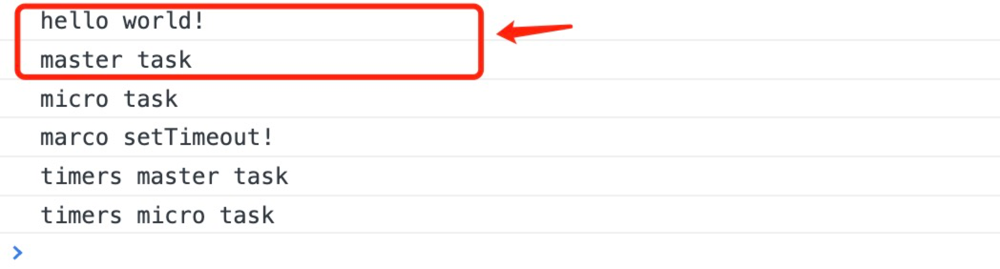
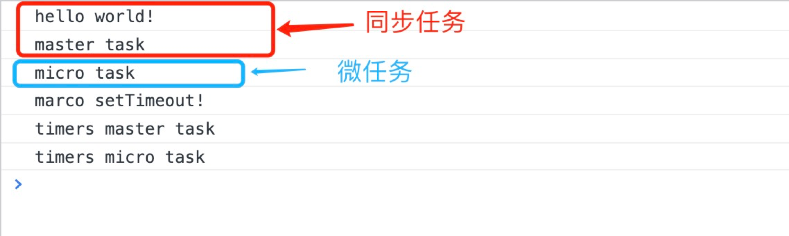
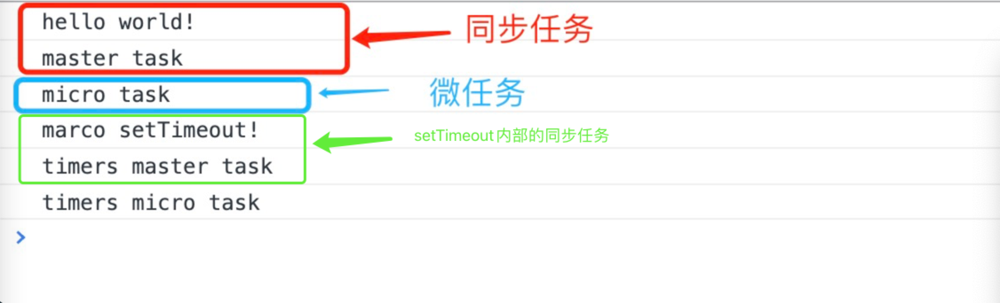
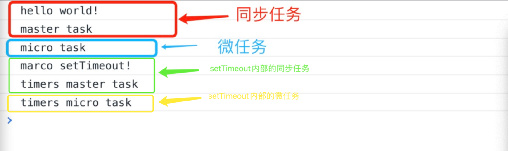

# 宏任务与微任务

| 文档创建人 | 创建日期   | 文档内容             | 更新时间   |
| ---------- | ---------- | -------------------- | ---------- |
| adsionli   | 2022-02-06 | 宏任务与微任务的学习 | 2022-02-06 |

最近在学习vue3的源码阅读时，在副作用执行调度器这里遇到了`Promise.resolve().then()`的微任务调度，所以就想着好好学习一下微任务与宏任务的相关知识，然后好好整理一下，增加自己的知识面，以便未来在写自己的框架或者项目时，可以从更多的执行流程的维度去考虑。

## Js执行流程
1. JS分为同步任务和异步任务
2. 同步任务都在主线程上执行，形成一个执行栈
3. 主线程之外，事件触发线程管理着一个任务队列，只要异步任务有了运行结果，就在任务队列之中放置一个事件。
4. 一旦执行栈中的所有同步任务执行完毕（此时JS引擎空闲），系统就会读取任务队列，将可运行的异步任务添加到可执行栈中，开始执行。

### 事件循环
事件循环是通过任务队列的机制来进行协调的。**一个 Event Loop 中，可以有一个或者多个任务队列(task queue)，一个任务队列便是一系列有序任务(task)的集合**；每个任务都有一个任务源(task source)，源自同一个任务源的 task 必须放到同一个任务队列，从不同源来的则被添加到不同队列。**`setTimeout/Promise`等API便是任务源**，而进入任务队列的是他们指定的具体执行任务。

在事件循环中，每进行一次循环操作称为`tick`，每一次`tick`的任务处理模型是比较复杂的，但关键步骤如下：
1. 在此次 tick 中选择最先进入队列的任务(oldest task)，如果有则执行(一次)
2. 检查是否存在 Microtasks，如果存在则不停地执行，直至清空 Microtasks Queue
3. 更新 render
4. 主线程重复执行上述步骤



如上图所示，一个简单的js任务执行结构，主要分为主线程、微任务队列与宏任务队列。

主线程、微任务队列、宏任务队列的优先级如下：
```
主线程 > 宏任务队列 > 微任务队列 
```

## 宏任务与微任务
接下来就来说说宏任务包含的内容以及微任务的内容，以及他们的混合使用时的执行流程.
> ES6 规范中，`microtask(微任务)`称为`jobs`,`macrotask`(宏任务也叫主任务)称为`task`。宏任务是由宿主发起的，而微任务由JavaScript自身发起。
### 宏任务
首先来看一下宏任务都包括哪一些内容：
1. `script`(主程序代码)
2. `setTimeOut`
3. `setInterVal`
4. I/O操作
5. UI渲染
6. `requestAnimationFrame`
宏任务是在宿主下工作的
> 宿主是什么？
> 宿主指的就是Js的运行环境，因为对于Js来说，是不能脱离执行环境运行的，它和C++等语言不同，不是对立存在的，而是需要运行在相关平台中的，一般来说，我们指的宿主主要是：**浏览器、Node**

在写这篇博客的时候，我参考了很多别人写的博客，很多人都在争论究竟是宏任务先执行还是微任务先执行，主要的矛盾就是在`setTimeout`与`Promise.resolve().then()`上面，后来我去研究了一下Mdn以及整个EventLoop的执行，以及一些大佬写的博客后，得出了结论：
1. 宏任务的执行是在微任务执行之前执行的，在一个EventLoop中，一定是现在宏任务队列中先顺序执行，然后在判断微任务队列中是否存在微任务，如果存在就顺序执行微任务队列中的任务，如果不存在就执行下一次EventLoop了。
2. 为什么`setTimeout`是`在Promise.then`之后才执行的呢？

答：因为`setTimeout`不会在当前次的任务队列中被执行，而是在下一次任务队列中才会被执行，所以他不会在当前次任务队列执行，这就导致他看起来像是在最后被输出的
### 微任务
微任务通常是指安排在当前执行的脚本之后应该立即发生的事情，例如对一批动作做出反应，或者在不承担全新任务的情况下进行异步操作。只要没有其他 JavaScript 在中间执行，微任务队列就会在回调之后处理，并且在每个任务结束时处理。在微任务期间排队的任何其他微任务都将添加到队列的末尾并进行处理。
微任务主要包括以下这些：
1. `Promise.then`
2. `Object.observe`
3. `MutationObserver`
4. `process.nextTick(Node.js 环境)`
> 这里必须要区分出的一点就是`Promise`并不是异步任务，而是一个同步任务，所以它不会分到微任务中去，而Promise.then是一个异步任务且是一个微任务，所以这里不要弄混淆了，不要简单地认为Promise就是一个微任务，==切记切记!==

微任务队列总是在宏任务执行完毕后才会继续执行，是在当前 task 执行结束后立即执行的任务。也就是说，在当前task任务后，下一个task之前，在渲染之前。
所以它的响应速度相比setTimeout（setTimeout是task）会更快，因为无需等渲染。也就是说，在某一个macrotask执行完后，就会将在它执行期间产生的所有microtask都执行完毕（在渲染前）。
下面这张图可以看出其渲染流程

### 宏任务与微任务的区别
一个任务就是指计划由标准机制来执行的任何 JavaScript，如程序的初始化、事件触发的回调等。 除了使用事件，你还可以使用 `setTimeout()` 或者 `setInterval()` 来添加任务。

**任务队列和微任务队列的区别很简单，但却很重要：**
1. 当执行来自任务队列中的任务时，在每一次新的事件循环开始迭代的时候运行时都会执行队列中的每个任务。在每次迭代开始之后加入到队列中的任务需要在下一次迭代开始之后才会被执行.
2. 每次当一个任务退出且执行上下文为空的时候，微任务队列中的每一个微任务会依次被执行。不同的是它会等到微任务队列为空才会停止执行——即使中途有微任务加入。换句话说，微任务可以添加新的微任务到队列中，并在下一个任务开始执行之前且当前事件循环结束之前执行完所有的微任务。

### 宏任务与微任务混合使用执行流程
有了上面的知识储备之后，我们就来实际分析一个宏任务与微任务混合使用的代码。
下面那是一段混合使用宏任务`setTimeout`与微任务`Promise.then`的实例代码，我们可以来分析一下
```js
console.log('hello world!');
setTimeout(() => {
	console.log('marco setTimeout!')
	new Promise((resolve) => {
		console.log("timers master task")
		resolve();
	}).then(() => {
		console.log("timers micro task")
	})
}, 0)
new Promise((resolve, reject) => {
	console.log("master task")
	resolve();
}).then(() => {
	console.log("micro task")
})
```
1. 首先一定是先读取同步任务的内容，那么一定会先输出**hello world!**，之后遇到了`setTimeout`则会被放入到任务队列中，然后Promise中，resolve回调中也是属于同步任务，所以也会输出**master task**，这样我们就明确了首先得输出

2. 当同步任务执行完成之后，就会去找任务队列中存在的任务，这时候任务队列中存在`setTimeout`，那么就会把它放入到timers中，等待其他任务处理完成后，再一次循环中处理。
3. 这时候，任务队列处理完成，来处理微任务队列，那么就会执行Promise.then回调方法了，这时候就会输出**micro task**。

4. 进入下一次EventLoop，这时候没有同步任务了，且任务队列只剩下了`setTimeout`，这时候就执行`setTimeout`。setTimeout内部函数方法也是遵循任务执行流程的。这时候就会先执行同步任务，输出**marco setTimeout!**，然后再输出Promise中的同步任务**timers master task**。

5. 最后在执行setTimeout内部的微任务，也就是Promise.then内的回调函数，输出**timers micro task**，执行流程结束


有没有发现，当你弄懂了之后，这些东西还是比较简单的，当然面试题目里面也会出现一些比较变态的内容，比如疯狂的Promise.then的嵌套，这时候就需要明确直到Promise.then也是返回的是一个Promise对象，其也是一个同步任务，然后再一步一步分析下去，这样就不会混乱了。同样需要记得上面提到的：

==**每次当一个任务退出且执行上下文为空的时候，微任务队列中的每一个微任务会依次被执行。不同的是它会等到微任务队列为空才会停止执行——即使中途有微任务加入。换句话说，微任务可以添加新的微任务到队列中，并在下一个任务开始执行之前且当前事件循环结束之前执行完所有的微任务。**==

## 拓展
### Promise，process.nextTick谁先执行？
`process.nextTick()` 是一个特殊的异步API，其不属于任何的EventLoop阶段。事实上Node在遇到这个API时，EventLoop根本就不会继续进行，会马上停下来执行`process.nextTick()`，这个执行完后才会继续EventLoop。

所以，`nextTick`和`Promise`同时出现时，肯定是`nextTick`先执行，原因是`nextTick`的队列比`Promise`队列优先级更高。

###  Vue中的vm.$nextTick
`vm.$nextTick`接受一个回调函数作为参数，用于将回调延迟到下次DOM更新周期之后执行。

这个API就是基于事件循环实现的。
“下次DOM更新周期”的意思就是下次微任务执行时更新DOM，而`vm.$nextTick`就是将回调函数添加到微任务中（在特殊情况下会降级为宏任务）。

因为微任务优先级太高，Vue 2.4版本之后，提供了强制使用宏任务的方法。

> `vm.$nextTick`优先使用Promise，创建微任务。
> 如果不支持Promise或者强制开启宏任务，那么，会按照如下顺序发起宏任务：
>
> 1. 优先检测是否支持原生 setImmediate（这是一个高版本 IE 和 Edge 才支持的特性）
> 2. 如果不支持，再去检测是否支持原生的MessageChannel
> 3. 如果也不支持的话就会降级为 setTimeout。


## 参考
1. [Tasks, microtasks, queues and schedules(主要参考文章，写的很好)](https://jakearchibald.com/2015/tasks-microtasks-queues-and-schedules/?utm_source=html5weekly)
2. [深入：微任务与Javascript运行时环境](https://developer.mozilla.org/zh-CN/docs/Web/API/HTML_DOM_API/Microtask_guide/In_depth)
3. [宏任务和微任务到底是什么？](https://www.jianshu.com/p/bfc3e319a96b)
4. [js中的宏任务与微任务](https://zhuanlan.zhihu.com/p/78113300)

## 总结
宏任务和微任务的概念是非常的主要的，特别是在一个EventLoop中，只有熟练掌握并运用这一块内容之后，我们可以更加得心应手的控制我们代码的执行流程，让我们的工作变得更加清晰明了。当然对于我们面试的时候做面试题也是非常重要的😂，加油加油💪🏻ヾ(◍°∇°◍)ﾉﾞ！
> 大家一定要自己找一些面试题去试试看，不然的话可能还是会掌握的不充分！

