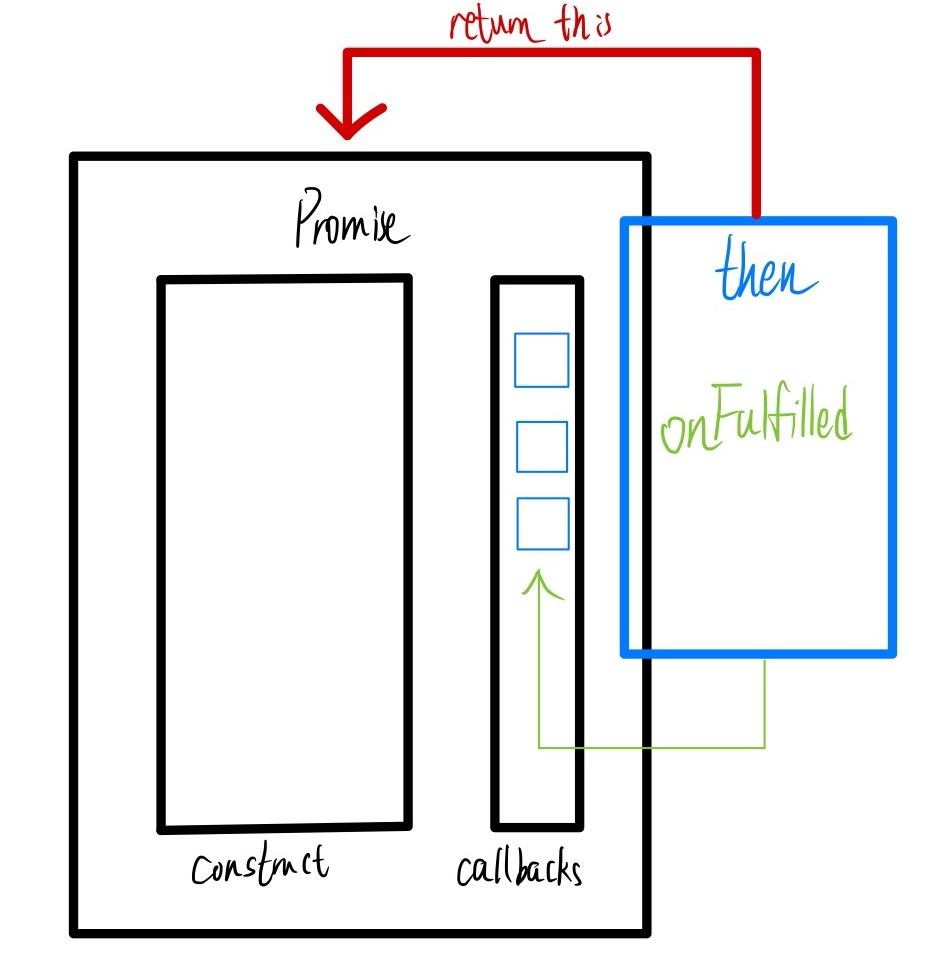

# Promise源码阅读

| 文档创建人 | 创建日期   | 文档内容        | 更新时间   |
| ---------- | ---------- | --------------- | ---------- |
| adsionli   | 2022-01-04 | Promise源码阅读 | 2022-01-04 |

> Promise的规范很多很多，但是ES6标准最终采用的就是Promise/A+规范，所以在这次源码阅读中所涉及的代码都是根据Promise/A+规范来的。

## Promise的基础实现

首先，promise肯定是一个类，我们就用class来声明。

1. 由于`new Promise((resolve, reject)=>{})`，所以传入一个参数（函数），Promise/A+规范里叫它executor，传入就执行。

2. executor里面有两个参数，一个叫resolve（成功），一个叫reject（失败）。

3. 由于resolve和reject可执行，所以都是函数。

```js
class Promise {
    //executor是一个回调函数，且包含两个参数为resolve与reject，这两个参数实际上也是两个函数，用来传递Resolved(已定型)状态的回传数据
    constructor(fn){
        //resolve与reject方法不是在创建的时候就触发的，是在主动执行的时候才触发，所以使用bind绑定一下this上下文
        //因为Promise的特性是创建的时候就执行，所以传入的回调函数直接执行。
        fn(this.resolve.bind(this), this.reject.bind(this))；
    }
    
    resolve(value){
        return value；
    }
    
    reject(value){
        return value；
    }
}
```

然后再来分析一下Promise中的链式调用，因为Promise是支持链式调用的，所以这就说明了then方法的返回一定是一个Promise对象，这样才可以支持链式调用，这在之前的Promise学习中提到过。

> 先不考虑返回错误的情况，then中先只接收一个参数，用于处理Fulfilled状态

```js
class Promise {
    constructor(fn){
        //使用callbacks数组来模拟链式调用时的队列,callbacks中存放的是then中回调函数参数
        this.callbacks = [];
        fn(this.resolve.bind(this), this.reject.bind(this))；
    }
    
    then(onFulfilled){
        //then的参数是回调函数，这里先只执行成功的回调
        this.callbacks.push(onFulfilled)
        //因为then方法可以链式调用，所以这里需要返回
        return this;
    }
    
    resolve(value){
       	this.callbacks.forEach(fn => fn(value))
    }
    
    reject(value){
        return value；
    }
}
```

> 关于上段代码的一个解释(一个最基础实现):
>
> 
>
> 通过这张图我们就可以理解上述代码了：
>
> 1. 我们会把每一次then中的回调函数加入到callbacks中，也就是注册回调函数，这样就可以进行链式调用，然后不断地先进先出。
>
> 2. 创建 Promise 实例时传入的函数会被赋予一个函数类型的参数，即 resolve，它接收一个参数 value，代表异步操作返回的结果，当异步操作执行成功后，会调用resolve方法，这时候其实真正执行的操作是将 callbacks 队列中的回调一一执行

但是上一个版本存在一些问题，就是我们会发现在resolve方法执行的时候，实际上callbacks中还没有任何的回调函数放入，因为resolve在then方法之前被执行了，所以这里就不太正确，还需要继续处理，于是有了下面这个版本：

```js
```


## 参考来源

1. 图解Promise实现原理：

   [基础实现](https://mp.weixin.qq.com/s?__biz=MzI4NjY4MTU5Nw==&mid=2247486661&idx=1&sn=8e4b3056aa9c110ca08047d0917290f4&chksm=ebd87c57dcaff54168d1a8f94b074fa814270b9753d8c1e7eebe3b4203254ecb0e6989ba1f19&scene=21#wechat_redirect)

   [Promise链式调用](https://mp.weixin.qq.com/s?__biz=MzI4NjY4MTU5Nw==&mid=2247486706&idx=2&sn=9434eb4f5ea43e46de70a6486afbffbf&chksm=ebd87c60dcaff57669d389cf114a993b15df789b1b14fe1f4c89e38d304d79489dc5394e9296&scene=21#wechat_redirect)

   [Promise原型方法实现](https://mp.weixin.qq.com/s?__biz=MzI4NjY4MTU5Nw==&mid=2247486850&idx=2&sn=647638dbb430da2c23a1320033fc806f&chksm=ebd87d10dcaff40681acb2ee93b5516ae190e1111938fc72da12178e3d7f9c9fe5ffa0569254&scene=21#wechat_redirect)

   [Promise静态方法实现](https://mp.weixin.qq.com/s?__biz=MzI4NjY4MTU5Nw==&mid=2247486966&idx=2&sn=5c90d287040a811ed06517518fee8e34&chksm=ebd87d64dcaff4726226d01cbb7b12aea5f16429a06b8f8cfbc23a35ecf955c899cd139283b7&cur_album_id=1500522652875194368&scene=189#wechat_redirect)

2. ES6中Promise规范: [Promise/A+](https://promisesaplus.com/)

3. [Promise不会？？看这里！！！史上最通俗易懂的Promise！！！](https://juejin.cn/post/6844903607968481287#heading-7)
4. [BAT前端经典面试问题：史上最最最详细的手写Promise教程](https://juejin.cn/post/6844903625769091079#heading-6)