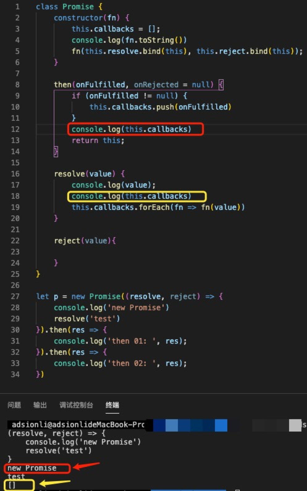
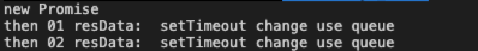
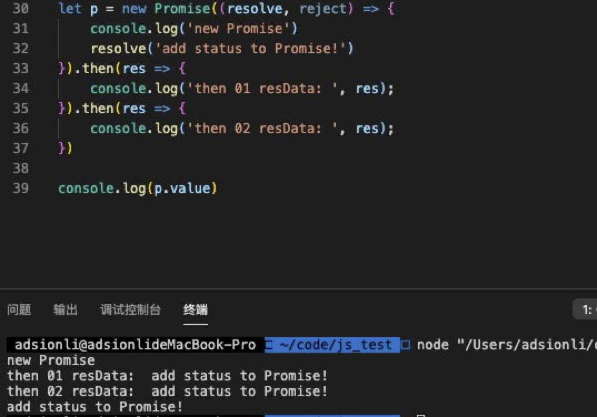
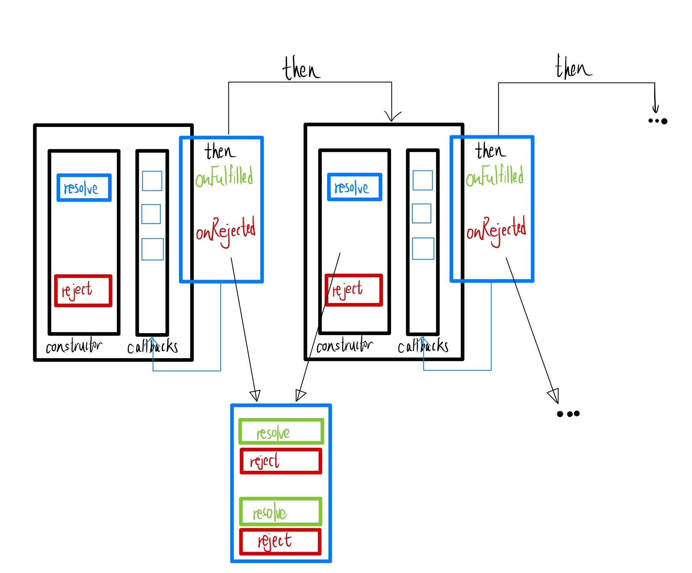
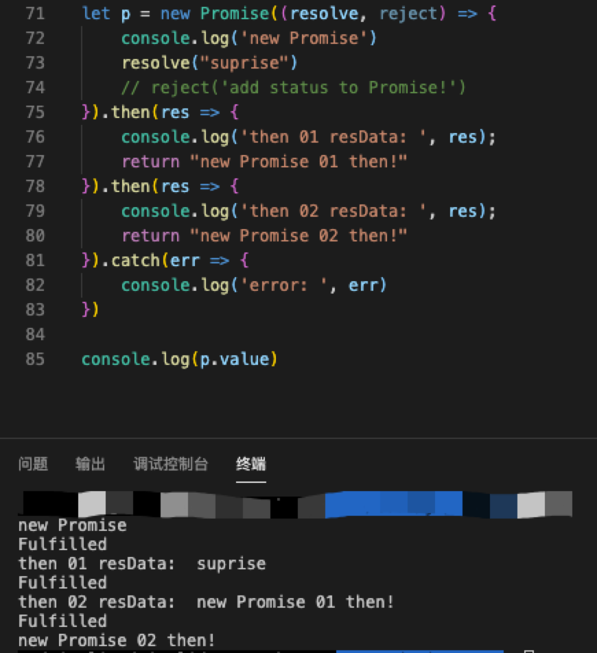

# Promise源码实现(一)

| 文档创建人 | 创建日期   | 文档内容            | 更新时间   |
| ---------- | ---------- | ------------------- | ---------- |
| adsionli   | 2022-01-04 | Promise源码实现(一) | 2022-01-04 |

> Promise的规范很多很多，但是ES6标准最终采用的就是Promise/A+规范，所以在这次源码阅读中所涉及的代码都是根据Promise/A+规范来的。

## Promise的基础实现

接下来让我们一步步来实现一个基本的Promise类！

### 最基本的Promise结构实现

首先，promise肯定是一个类，我们就用class来声明。

1. 由于`new Promise((resolve, reject)=>{})`，所以传入一个参数（函数），Promise/A+规范里叫它executor，传入就执行。

2. executor里面有两个参数，一个叫resolve（成功），一个叫reject（失败）。

3. 由于`resolve`和`reject`可执行，所以都是函数。

```js
class Promise {
    //executor是一个回调函数，且包含两个参数为resolve与reject，这两个参数实际上也是两个函数，用来传递Resolved(已定型)状态的回传数据
    constructor(fn){
        //resolve与reject方法不是在创建的时候就触发的，是在主动执行的时候才触发，所以使用bind绑定一下this上下文
        //因为Promise的特性是创建的时候就执行，所以传入的回调函数直接执行。
        fn(this.resolve.bind(this), this.reject.bind(this))；
    }
    
    resolve(value){
        return value；
    }
    
    reject(value){
        return value；
    }
}
```

然后再来分析一下Promise中的链式调用，因为Promise是支持链式调用的，所以这就说明了then方法的返回一定是一个Promise对象，这样才可以支持链式调用，这在之前的Promise学习中提到过。

> 先不考虑返回错误的情况，then中先只接收一个参数，用于处理Fulfilled状态

```js
class Promise {
    constructor(fn){
        //使用callbacks数组来模拟链式调用时的队列,callbacks中存放的是then中回调函数参数
        this.callbacks = [];
        //因为Promise的特性是创建的时候就执行，所以传入的回调函数直接执行
        fn(this.resolve.bind(this), this.reject.bind(this))；
    }
    
    then(onFulfilled, onRejected = null){
        //then的参数是回调函数，这里先只执行成功的回调
        if (onFulfilled != null) {
            this.callbacks.push(onFulfilled)
        }
        //因为then方法可以链式调用，所以这里需要返回
        return this;
    }
    
    resolve(value){
        //将返回的数据作为参数传递给callbacks中的回调方法中。
       	this.callbacks.forEach(fn => fn(value))
    }
    
    reject(value){
        
    }
}
```

> 关于上段代码的一个解释(一个最基础实现):
>
> 
>
> 通过这张图我们就可以理解上述代码了：
>
> 1. 我们会把每一次`then`中的回调函数加入到`callbacks`中，也就是注册回调函数，这样就可以进行链式调用，然后不断地先进先出。
>
> 2. 创建 Promise 实例时传入的函数会被赋予一个函数类型的参数，即 `resolve`，它接收一个参数 `value`，代表异步操作返回的结果，当异步操作执行成功后，会调用`resolve`方法，这时候其实真正执行的操作是将 `callbacks` 队列中的回调一一执行

但是上一个版本存在一些问题，就是我们会发现在`resolve`方法执行的时候，实际上`callbacks`中还没有任何的回调函数放入，因为`resolve`在then`方法`之前被执行了，所以这里就不太正确，还需要继续处理。如下图所示：



### 基于setTimeout的Promise实现

既然存在问题就进行修改，于是有了下面这个版本：

```js
class Promise {
    constructor(fn) {
        this.callbacks = [];
        fn(this.resolve.bind(this), this.reject.bind(this));
    }

    then(onFulfilled, onRejected = null) {
        if (onFulfilled != null) {
            this.callbacks.push(onFulfilled)
        }
        return this;
    }

    resolve(value) {
        setTimeout(() => {
            this.callbacks.forEach(fn => fn(value))
        })
    }

    reject(value) {

    }
}
```

这里我们加入了`setTimeout`方法，借助`setTimeout`的机制来将`resolve`的处理放在`then`之后，这样在进行`resolve`的时候，`callbacks`中内容就不为空了。

> 当我们不设置`setTimeout`的时间的时候或设置为0的时候，实际上我们是让`setTimeout`中的内容在大于0秒才执行，这样我们就可以利用其特性，改变任务的执行顺序，将`setTimeout`内的回调函数放在普通的任务队列执行后，再去执行`setTimeout`队列中的积累的任务。

这样之后的执行结果也就如下图所示：



但是这里仍然是存在问题的，如果这时候有一个`then`方法是分开的，也就是不是和之前`then`连在一起的话，那么`callbacks`中就无法放入这个回调函数，也就导致`resolve`中仍然无法执行到。

```js
let p = new Promise((resolve, reject) => {
    console.log('new Promise')
    resolve('setTimeout change use queue')
}).then(res => {
    console.log('then 01 resData: ', res);
}).then(res => {
    console.log('then 02 resData: ', res);
})
//这个setTimeout的内容在setTimeout队列中比resolve后面，也就是说会在resolve之后才执行，就没办法了
setTimeout(() => {
    p.then(res => {
        console.log('then 03 resData: ', res);
    })
})
```

### 基于状态的Promise实现

既然如此，该怎么办呢，这里就可以引入状态啦。通过Promise/A+规范中的描述，我们可以确定下来一共有三种状态：Pending，Fulfilled，Rejected。在引入状态之后呢，我们还需要对`resolve`中的返回数据进行记录，这样才可以传递给不是在链式调用中传入的回调函数进行使用。经过这样修改之后的代码如下:

> 这里关于状态就不多说啦，之前的Promise详解中都已经介绍过了，大家可以去翻翻。

```js
class Promise {
    constructor(fn) {
        this.callbacks = [];
        this.status = 'Pending';
        this.value = null;
        fn(this.resolve.bind(this), this.reject.bind(this));
    }

    then(onFulfilled, onRejected = null) {
        if(this.status === 'Pending'){
           	this.callbacks.push(onFulfilled)
        }else if(this.status === 'Fulfilled'){
            onFulfilled(this.value);
        }
        return this;
    }

    resolve(value) {
        //在resolve的时候进行状态修改，之前的文章中也有说过
        this.status = 'Fulfilled';
        this.value = value;
        this.callbacks.forEach(fn => fn(value))
    }

    reject(value) {

    }
}
```

上面的代码中，我们把`resolve`中的`setTimeout`函数移除掉了，因为我们现在可以通过状态来控制了，同时我们会将`resolve`方法传入的`value`参数进行记录，这样我们就可以在`then`中访问到`resolve`的`value`值，就不再需要`setTimeout`了，同时我们会在`resolve`中改变状态，变为`Fulfilled`状态。

这时候我们再来试一下调用，查看一下输出情况：



到这里一个最简单的Promise类就差不多完成了，然后我们再来完善一下对错误的捕获，其实和`resolve`的书写是不差多的，大差不差。

```js
class Promise {
    constructor(fn) {
        this.callbacks = [];
        this.status = 'Pending';
        this.value = null;
        this.reason = null;
        try{
            fn(this.resolve.bind(this), this.reject.bind(this));
        }catch(error) {
            //如果传入函数出现错误，直接调用reject，将状态直接转变为Rejected
            this.reject(error);
        }
    }

    then(onFulfilled, onRejected = null) {
        if(this.status === 'Pending'){
           	this.callbacks.push(onFulfilled)
        }else if(this.status === 'Fulfilled'){
            //这里需要判断一下是否传入了onFulfilled回调，在catch的时候是不传入的。
            onFulfilled != null && onFulfilled(this.value);
        }else if(this.status === 'Rejected'){
            //这里也需要判断，因为可能之前是正确的，不会传入onRejected
            onRejected != null && onRejected(this.reason);   
        }
        return this;
    }
	
    catch(onRejected){
        //在之前也有说，实际上catch就是then的别名，这里直接调用then,但是一个参数给null,第二个回调参数给错误处理的回调函数
        return this.then(null, onRejected);
    }
    
    resolve(value) {
        if(this.status === 'Pending'){
            //在resolve的时候进行状态修改，之前的文章中也有说过
            this.status = 'Fulfilled';
            this.value = value;
            this.callbacks.forEach(fn => fn(value))
        }
    }

    reject(value) {
        //必须是在status等于Pending的时候才可以改变状态，这是基于Promise的特性,只可以改变一次状态
        if(this.status === 'Pending'){
            //修改Promise的状态为Rejected，且这个时候Promise的状态已定型(Resolved)
            this.status = 'Rejected';
            this.reason = value;
            this.callbacks.forEach(fn => fn(value));
        }
    }
}
```

这样就是初步完成了Promise的基础实现，其实这个实现还存在很多问题不知道大家发现了没有，那我就稍微提一下啦：

1. `then`方法返回的是当前的Promise的本身而不是一个新的Promise对象。
2. `value`不会随着新的Promise链式调用而更新，始终使用的是第一个Promise的`value`
3. Promise内部执行错误的捕获也只能捕获第一个Promise的错误，其他的错误都无法捕获。而且如果第一个错误了，会直接无法使用之后`then`方法中内容，这样是不对的，实现的就是不是Promise的链式调用，而是变成实现了`Promise.all`方法了，这样也是不对的。

基于上述的三点引出我们的下一节啦，来解决上面没有解决的问题。

## 完整实现Promise的链式调用实现

经过上一节的历程，我们获得了一个基本的Promise实现，但是其中还存在不少问题，所以我们在这一节中一个一个来进行解决

> 1. 根据Promise/A+规范中的说法，为了达成链式，我们默认在第一个then里返回一个promise，就是在then里面返回一个新的promise,称为promise2：`promise2 = new Promise((resolve, reject)=>{})`。
>
> 2. 将这个promise2返回的值传递到下一个then中，如果返回一个普通的值，则将普通的值传递给下一个then中。
>
> 3. 当我们在第一个then中`return`了一个参数（参数未知，需判断）。这个return出来的新的promise就是onFulfilled()或onRejected()的值

### 链式调用的完善

首先我们先来画一下链式调用的过程：



根据上图中的描述，我们可以再次确定每个 `then` 注册的 `onFulfilled` 都返回了不同的结果，层层递进，很明显在 `then` 方法中 `return this` 不能达到这个效果。引入真正的链式调用，**`then` 返回的一定是一个新的Promise实例。**真正的链式 Promise 是指在当前 Promise 达到 fulfilled 状态后，即开始进行下一个 Promise（后邻 Promise）。

所以我们需要解决的就是如何衔接当前Promise及后邻的Promise的执行。

首先我们来改写一下`then`方法，因为我们已经直到返回的是一个新的Promise实例才可以

```js
then(onFulfilled, onRejected = null) {
    //因为这里返回的是一个新的Promise实例，所以在下一次链式操作的时候，就是基于本次返回的Promise实例的链式操作啦
    return new Promise((resolve, reject) => {
        //在这里新增加一个处理的方法，用来处理不同状态以及传入回调函数参数
        this.handle({
            onFulfilled: onFulfilled || null,
            onRejected: onRejected || null,
            resolve,
            reject
        })
    })
}
//这里就来写一下这个handle函数方法
handle(callback){
    //当当前的Promise状态为Pending状态时候，我们要将回调函数放入到callbacks中，等到Promise状态改变时，在做调用，确保Promise链式调用执行的顺序没有问题
    if(this.state === 'Pending'){
        this.callbacks.push(callback)
        return
    }
    let cb = this.state === 'Fulfilled' ? callback.onFulfilled : callback.onRejected;
    let rcb = this.state === 'Fulfilled' ? callback.resolve : callback.reject;
    let value = this.status === 'Fulfilled' ? this.value : this.reason;
    //当回调函数中没有传入onFulfilled或onRejected的回调的时候，直接返回参数就可以了，因为说明接下来没有需要执行的链式操作了。
    if(!cb){
        rcb(value)
        return
    }
    //如果回调函数中包含onFulfilled或onRejected的回调，那就进行执行，因为Promise创建的时候就执行了。同时将执行后的返回参数放入到resolve或者reject中进行抛出
    let data = cb(value);
    rcb(data);
}
//同时还需要对resolve与reject进行处理，因为此时的callbacks中的回调函数发生了改变
resolve(value) {
    if (this.status === 'Pending') {
        this.status = 'Fulfilled';
        this.value = value;
        //将本次Promise实例执行的返回值传递给下一次中进行使用
        this.callbacks.forEach(callback => this.handle(callback))
    }
}

reject(value) {
    if (this.status === 'Pending') {
        this.status = 'Rejected';
        this.reason = value;
        this.callbacks.forEach(callback => this.handle(callback));
    }
}
```

> 由上面的实现，我们可以看到：
>
> 1. **then 方法中，创建并返回了新的 Promise 实例，这是串行Promise的基础，是实现真正链式调用的根本。**
>
> 2. **then 方法传入的形参 onFulfilled 以及创建新 Promise 实例时传入的 resolve 放在一起，被push到当前 Promise 的 callbacks 队列中，这是衔接当前 Promise 和后邻 Promise 的关键所在。**
>
> 3. **根据规范，onFulfilled 是可以为空的，为空时不调用 onFulfilled。**

通过上面的改写，我们已经基本实现了在then之后执行并返回一个全新的Promise实例了，且不会再像之前那样全部使用的是第一次的Promise的返回值了，而是一个新的Promise的返回值了，具体运行如下：



通过上面的运行结果我们可以发现现在的每一层`value`的传递就不是第一次的Promise示例返回数据了，而是每一个`then`之后的返回数据了。这就解决了我们之前的遗留的一大部分问题了。

但是上面的`resolve`都是返回的是一个`value`值，如果这时候返回的是一个Promise对象的话这时候就无法使用了，那么我们再来对代码做一些调整。

> 实际上这里的调整就不多了，只需要调整resolve函数就可以

```js
resolve(value){
    if(value && (typeof(value) === 'object' || typeof(value) === 'function') && (value instanceof Promise)){
        //因为这个时候传入的value是Promise对象，所以可以获取到then，基于传入的Promise的then
        let then = value.then;
        //这里传入的onFulfilled是最外层的那个Promise的resolve方法，也就是说内层的Promise在执行完成后，才会改变内层的Promise状态，也就是内层决定外层状态
        then.call(value, this.resolve.bind(this));
        return ;
    }
}
```

> 从代码上看，**它是对 resolve 中的值作了一个特殊的判断，判断 resolve 的值是否为 Promise实例，如果是 Promise 实例，那么就把当前 Promise 实例的状态改变接口重新注册到 resolve 的值对应的 Promise 的 onFulfilled 中，也就是说当前 Promise 实例的状态要依赖 resolve 的值的 Promise 实例的状态。**

到这里实际上我们的Promise链式调用就差不多快做完啦，我们先来把完整的代码放出来测试一下

```js
class Promise {
    constructor(fn){
        this.callbacks = [];
        this.status = 'Pending';
        this.value = null;
        this.reason = null;
        try {
            fn(this.resolve, this.reject);
        }catch(error){
            this.reject(error)
        }
    }
    
    then(onFulfilled, onRejected = null){
        return new Promise((resolve, reject) => {
            this.handle({
                onFulfilled: onFulfilled || null,
                onRejected: onRejected || null,
                resolve,
                reject
            })
        })
    }
    
    catch(err){
        this.then(null, err)
    }
    
    handle(callback){
        if(this.status === 'Pending'){
            this.callbacks.push(callback);
            return;
        }
        let cb = this.status === 'Fulfilled' ? callback.onFulfilled : callback.onRejected;
        let rcb = this.status === 'Fulfilled' ? callback.resolve : callback.reject;
        let value = this.status === 'Fulfilled' ? this.value : this.reason;
        if(!cb){
            rcb(value);
            return;
        }
        let data = cb(value);
        rcb(data);
    }
    
    resolve(value){
        if(this.status === 'Pending'){
            if(value && (typeof(value) === 'object' || typeof(value) === 'function') && (value instanceof Promise)){
                let then = value.then;
                then.call(value, this.resolve.bind(this), this.reject.bind(this));
                return ;
            }
            
            this.status = 'Fulfilled';
            this.value = value;
            this.callbacks.forEach(callback => this.handle(callback));
        }
    }
    
    reject(value){
        if(this.status === 'Pending'){
            this.status = 'Rejected';
            this.reason = reason;
            this.callbacks.forEach(callback => this.handle(callback));
        }
    }
}
```

然后我们创建一个模拟方法，来跑一遍我们自己 编写的Promise类，查看一下结果

```js
const mockAjax = (url, s, callback) => {
    setTimeout(() => {
        callback(url + '异步请求耗时' + s + '秒');
    }, 1000 * s)
}
let p = new Promise((resolve, reject) => {
    mockAjax('getUserId', 1, function(result) {
        resolve(result);
    })
}).then(res => {
    console.log(res);
    return new Promise((resolve, reject) => {
        mockAjax('getUserName', 2, function(result){
            resolve(result)
        })
    })
}).catch(error => {
    console.log(error);
})
```


> 稍微加一点执行流程的讲解
>
> 1. 首页是创建了一个Promise对象，然后在传入的函数中模拟一个接口请求，当请求成功后调起resolve方法。
> 2. 此时因为首先创建的Promise01中的内容还未执行完成，但是同步还在进行，此时走入到then中。
> 3. 因为Promise01的状态还是Pending状态，所以在then中返回的新的Promise实例中执行的handle方法会把Promise02的onFulfilled放入到Promise01的callbacks中，等待Promise01的执行完成后进行执行。
> 4. 同步进程继续往下走，因为没有错误可以捕获了，所以等待Promise01完成。
> 5. Promise01执行完成后，会调起resolve方法，此时就会开始执行callbacks中放入的Promise02的onFulfilled，同时传入Promise01的执行返回值。
> 6. Promise02的resolve返回也是一个Promise对象，所以当执行完onFulfilled之后，在resolve方法中，直接调起这个传入的Promise03。
> 7. 当Promise03执行完毕之后，Promise03的resolve是一个普通的value了，Promise03的then返回的新的Promise04的状态变为了Fulfilled，那么就可以改变Promise02的状态为Fulfilled。
> 8. Promise02的状态改变带动了Promise03的状态改变为了Fulfilled，到了这里就执行完成了。
>
> 实在是有点复杂...

根据最后的输出结果，我们终于是成功的复原出了Promise的resolve情况下的代码编写，接下来让我们对Promise的异常捕获来进行代码上的修改吧。

### Promise异常捕获处理

> 其实在上面，我们已经进行了一些异常的捕获和处理了，现在就是来继续完善

首先修改一下handle方法，因为在handle方法会运行onFulfilled或onRejected方法，可能会存在错误，所以需要使用try...catch包裹

```js
handle(callback){
    if (this.status === 'Pending') {
        this.callbacks.push(callback);
        return;
    }
    let cb = this.status === 'Fulfilled' ? callback.onFulfilled : callback.onRejected;
    let rcb = this.status === 'Fulfilled' ? callback.resolve : callback.reject;
    let value = this.status === 'Fulfilled' ? this.value : this.reason;
    //这里rcb是Promise自己定义的resolve或是reject方法，可以不用捕获异常，因为不会出问题
    if (!cb) {
        rcb(value);
        return;
    }
    try {
        let data = cb(value);
        rcb(data);
    }catch(error){
        //一旦捕获到错误直接调用callback中的reject方法，抛出错误
        callback.reject(error);
    }
}
```

到这里其实就差不多啦，这一节内容太多了，还有一部分关于Promise的内容就拆开，放到下一节去实现。

## 参考来源

1. 图解Promise实现原理：

   [基础实现](https://mp.weixin.qq.com/s?__biz=MzI4NjY4MTU5Nw==&mid=2247486661&idx=1&sn=8e4b3056aa9c110ca08047d0917290f4&chksm=ebd87c57dcaff54168d1a8f94b074fa814270b9753d8c1e7eebe3b4203254ecb0e6989ba1f19&scene=21#wechat_redirect)

   [Promise链式调用](https://mp.weixin.qq.com/s?__biz=MzI4NjY4MTU5Nw==&mid=2247486706&idx=2&sn=9434eb4f5ea43e46de70a6486afbffbf&chksm=ebd87c60dcaff57669d389cf114a993b15df789b1b14fe1f4c89e38d304d79489dc5394e9296&scene=21#wechat_redirect)

   [Promise原型方法实现](https://mp.weixin.qq.com/s?__biz=MzI4NjY4MTU5Nw==&mid=2247486850&idx=2&sn=647638dbb430da2c23a1320033fc806f&chksm=ebd87d10dcaff40681acb2ee93b5516ae190e1111938fc72da12178e3d7f9c9fe5ffa0569254&scene=21#wechat_redirect)

   [Promise静态方法实现](https://mp.weixin.qq.com/s?__biz=MzI4NjY4MTU5Nw==&mid=2247486966&idx=2&sn=5c90d287040a811ed06517518fee8e34&chksm=ebd87d64dcaff4726226d01cbb7b12aea5f16429a06b8f8cfbc23a35ecf955c899cd139283b7&cur_album_id=1500522652875194368&scene=189#wechat_redirect)

2. ES6中Promise规范: [Promise/A+](https://promisesaplus.com/)

3. [Promise不会？？看这里！！！史上最通俗易懂的Promise！！！](https://juejin.cn/post/6844903607968481287#heading-7)
4. [BAT前端经典面试问题：史上最最最详细的手写Promise教程](https://juejin.cn/post/6844903625769091079#heading-6)