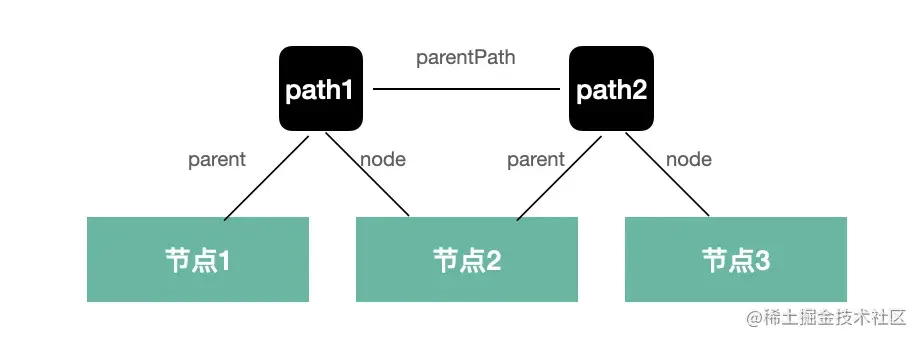

# babel学习-相关Api

| 文档创建人 | 创建日期   | 文档内容          | 更新时间   |
| ---------- | ---------- | ----------------- | ---------- |
| adsionli   | 2022-07-21 | babel学习-相关Api | 2022-07-21 |


parser：解析成AST抽象语法树


traverse: 维护整个树的状态，并负责替换、删除和添加节点。


generate：将AST抽象语法树转换成代码


types: 包含构建、验证和转换 AST 节点的方法


template：占位符，主要用于生成指定AST类型数据


通过对acorn的方法复写，实现对acorn的parser阶段（词法分析-分词，语法分析-组装AST）生成的AST语法树进行扩展


`traverse`实际是**通过观察模式**，来观察`babel`处理到的不同的`AST`阶段，然后在不同阶段调用不同的`vistor`函数来进行`transform`。


path 是记录遍历路径的 api，它记录了父子节点的引用，还有很多增删改查 AST 的 api：



[path的api](https://github.com/jamiebuilds/babel-handbook/blob/master/translations/en/plugin-handbook.md#babel-traverse)

```js
//常用的Api
path {
    // 属性：
    node 
    parent
    parentPath
    scope
    hub
    container
    key
    listKey
    
    // 方法
    get(key) 
    set(key, node)
    inList()
    getSibling(key) 
    getNextSibling()
    getPrevSibling()
    getAllPrevSiblings()
    getAllNextSiblings()
    isXxx(opts)
    assertXxx(opts)
    find(callback)
    findParent(callback)
    
    insertBefore(nodes)
    insertAfter(nodes)
    replaceWith(replacement)
    replaceWithMultiple(nodes)
    replaceWithSourceString(replacement)
    remove()
    
    traverse(visitor, state)
    skip()
    stop()
}
```

- `path.node` 当前 AST 节点
- `path.parent` 父 AST 节点
- `path.parentPath` 父 AST 节点的 path
- `path.scope` 作用域
- `path.hub` 可以通过 `path.hub.file` 拿到最外层 File 对象， `path.hub.getScope` 拿到最外层作用域，`path.hub.getCode` 拿到源码字符串
- `path.container` 当前 AST 节点所在的父节点属性的属性值
- `path.key` 当前 AST 节点所在父节点属性的属性名或所在数组的下标
- `path.listkey` 当前 AST 节点所在父节点属性的属性值为数组时 `listkey` 为该属性名，否则为 `undefined`


### container、listkey、key

这几个属性不太常用，简单介绍一下。

因为 AST 节点要挂在父 AST 节点的某个属性上，那个属性的属性值就是这个 AST 节点的 container。

比如 CallExpression 有 callee 和 arguments 属性，那么对于 callee 的 AST 节点来说，callee 的属性值就是它的 container，而 callee 就是它的 key。

因为不是一个列表，所以 listkey 是 undefined。


而 BlockStatement 有 body 属性，是一个数组，对于数组中的每一个 AST 来说，这个数组就是它们的 container，而 listKey 是 body，key 则是下标。


上面这些也比较好理解，container就是子节点的容器，listkey就是container下的集合，如果不是集合那么key就相当于是container下的挂载内容

### path 的方法

path 有如下方法，同样也不需要记：

- get(key) 获取某个属性的 path
- set(key, node) 设置某个属性的值
- getSibling(key) 获取某个下标的兄弟节点
- getNextSibling() 获取下一个兄弟节点
- getPrevSibling() 获取上一个兄弟节点
- getAllPrevSiblings() 获取之前的所有兄弟节点
- getAllNextSiblings() 获取之后的所有兄弟节点
- find(callback) 从当前节点到根节点来查找节点（包括当前节点），调用 callback（传入 path）来决定是否终止查找
- findParent(callback) 从当前节点到根节点来查找节点（不包括当前节点），调用 callback（传入 path）来决定是否终止查找
- inList() 判断节点是否在数组中，如果 container 为数组，也就是有 listkey 的时候，返回 true
- isXxx(opts) 判断当前节点是否是某个类型，可以传入属性和属性值进一步判断，比如path.isIdentifier({name: 'a'})
- assertXxx(opts) 同 isXxx，但是不返回布尔值，而是抛出异常
- insertBefore(nodes) 在之前插入节点，可以是单个节点或者节点数组
- insertAfter(nodes) 在之后插入节点，可以是单个节点或者节点数组
- replaceWith(replacement) 用某个节点替换当前节点
- replaceWithMultiple(nodes) 用多个节点替换当前节点
- replaceWithSourceString(replacement) 解析源码成 AST，然后替换当前节点
- remove() 删除当前节点
- traverse(visitor, state) 遍历当前节点的子节点，传入 visitor 和 state（state 是不同节点间传递数据的方式）
- skip() 跳过当前节点的子节点的遍历
- stop() 结束所有遍历

### 作用域 path.scope

scope 是作用域信息，javascript 中能生成作用域的就是模块、函数、块等，而且作用域之间会形成嵌套关系，也就是作用域链。babel 在遍历的过程中会生成作用域链保存在 path.scope 中。

属性和方法大概有这些

```js
path.scope {
    bindings
    block
    parent
    parentBlock
    path
    references
 
    dump()
    parentBlock()
    getAllBindings()
    getBinding(name)
    hasBinding(name)
    getOwnBinding(name)
    parentHasBinding(name)
    removeBinding(name)
    moveBindingTo(name, scope)
    generateUid(name)
}
```

各自的含义：

- scope.bindings 当前作用域内声明的所有变量
- scope.block 生成作用域的 block，详见下文
- scope.path 生成作用域的节点对应的 path
- scope.references 所有 binding 的引用对应的 path，详见下文
- scope.dump() 打印作用域链的所有 binding 到控制台
- scope.parentBlock() 父级作用域的 block
- getAllBindings() 从当前作用域到根作用域的所有 binding 的合并
- getBinding(name) 查找某个 binding，从当前作用域一直查找到根作用域
- getOwnBinding(name) 从当前作用域查找 binding
- parentHasBinding(name, noGlobals) 查找某个 binding，从父作用域查到根作用域，不包括当前作用域。可以通过 noGlobals 参数指定是否算上全局变量（比如console，不需要声明就可用），默认是 false
- removeBinding(name) 删除某个 binding
- hasBinding(name, noGlobals) 从当前作用域查找 binding，可以指定是否算上全局变量，默认是 false
- moveBindingTo(name, scope) 把当前作用域中的某个 binding 移动到其他作用域
- generateUid(name) 生成作用域内唯一的名字，根据 name 添加下划线，比如 name 为 a，会尝试生成 _a，如果被占用就会生成 __a，直到生成没有被使用的名字。

#### scope.block

> 就是获取到作用域的块级元素

能形成 scope 的有这些节点，这些节点也叫 block 节点。

```javascript
export type Scopable =
  | BlockStatement
  | CatchClause
  | DoWhileStatement
  | ForInStatement
  | ForStatement
  | FunctionDeclaration
  | FunctionExpression
  | Program
  | ObjectMethod
  | SwitchStatement
  | WhileStatement
  | ArrowFunctionExpression
  | ClassExpression
  | ClassDeclaration
  | ForOfStatement
  | ClassMethod
  | ClassPrivateMethod
  | StaticBlock
  | TSModuleBlock;
```

我们可以通过 `path.scope.block` 来拿到**所在的块对应的节点**，通过 `path.scope.parentBlock` 拿到**父作用域对应的块节点**。

一般情况下我们不需要拿到生成作用域的块节点，**只需要通过 path.scope 拿到作用域的信息，通过 path.scope.parent 拿到父作用域的信息**。

#### scope.bindings、scope.references（重点）

作用域中保存的是声明的变量和对应的值，**每一个声明叫做一个binding**。

比如这样一段代码

```javascript
const a = 1;
```

它的 path.scope.bindings 是这样的

```javascript
bindings: {
    a: {
        constant: true,
        constantViolations: [],
        identifier: {type: 'Identifier', ...}
        kind:'const',
        path: {node,...}
        referenced: false
        referencePaths: [],
        references: 0,
        scope: ...
    }
}
```

因为我们在当前 scope 中声明了 a 这个变量，所以 bindings 中有 a 的 binding，每一个 binding 都有 kind，这代表绑定的类型：

- `var、let、const` 分别代表 `var、let、const` 形式声明的变量
- `param` 代表参数的声明
- `module` 代表 `import` 的变量的声明

`binding` 有多种 `kind`，代表变量是用不同的方式声明的。

`binding.identifier` 标识符和 `binding.path`整个声明语句。


声明之后的变量会被引用和修改。

1. binding.referenced 代表声明的变量是否被引用

   如果被引用了，就可以通过 binding.referencePaths 拿到所有引用的语句的 path。

2. binding.constant 代表变量是否被修改过。

   如果被修改了，可以通过 binding.constViolations 拿到所有修改的语句的 path。


path 的 api 还是比较多的，这也是 babel 最强大的地方。主要是操作当前节点、当前节点的父节点、兄弟节点，作用域，以及增删改的方法。


node节点链，scope作用域链，bindings作用域中的变量

### AST 的别名

遍历的时候要指定 visitor 处理的 AST，有的时候需要对多个节点做同样的处理，babel 支持指定多个 AST 类型，也可以通过别名指定一系列类型。

```javascript
// 单个 AST 类型
FunctionDeclaration(path, state) {},
// 多个 AST 类型
'FunctionDeclaration|VariableDeclaration'(path, state) {}
// AST 类型别名
Declaration(){}
```

可以在[文档中](https://link.juejin.cn/?target=https%3A%2F%2Fbabeljs.io%2Fdocs%2Fen%2Fbabel-types)查到某个 AST 类型的别名是啥，某个别名都包含哪些 AST 类型可以在[babel-types的类型定义](https://link.juejin.cn/?target=https%3A%2F%2Fgithub.com%2Fbabel%2Fbabel%2Fblob%2Fmain%2Fpackages%2Fbabel-types%2Fsrc%2Fast-types%2Fgenerated%2Findex.ts%23L2489-L2535)处查。

所有的 AST 相关的信息都可以在[babel-types](https://link.juejin.cn/?target=https%3A%2F%2Fgithub.com%2Fbabel%2Fbabel%2Fblob%2Fmain%2Fpackages%2Fbabel-types%2Fsrc%2Fdefinitions%2Fcore.ts)里查看，每一个 AST 节点怎么创建、怎么校验、怎么遍历，其实都与 AST 的结构有关系，这些都在 babel-types 里面定义。

比如 if 就定义了有哪些属性可以遍历、别名是什么，每一个属性怎么校验，然后会根据这些规则生成xxx，isXxx，assertXxx等api用于创建、判断AST节点。