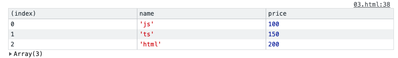

# 闭包

| 文档创建人 | 创建日期   | 文档内容           | 更新时间   |
| ---------- | ---------- | ------------------ | ---------- |
| adsionli   | 2022-02-01 | 闭包内容学习与整理 | 2022-02-02 |

闭包可以说js中必须要掌握的知识之一了。闭包虽然说是比较难以理解的，但是如果我们熟练地掌握了作用域相关的知识的之后，我们再来学习闭包就会比较轻松啦。

## 什么是闭包

一个函数和对其周围状态（**lexical environment，词法环境**）的引用捆绑在一起（或者说函数被引用包围），这样的组合就是**闭包**（**closure**）。也就是说，闭包让你可以在一个内层函数中访问到其外层函数的作用域。在 JavaScript 中，每当创建一个函数，闭包就会在函数创建的同时被创建出来。

> 引用自MDN中对闭包的解释

上面这个解释可能稍微有点难理解，所以就直接上代码：

```js
function fn1(){
	let data = 1;
	function add(){
		console.log(++data)
	}
	add()
}
fn1();
```

`fn1`函数创建了一个局部函数`add()`以及一个局部变量`data`，`add()`函数可以在`fn1`函数体内使用，`add()`函数内没有自定义的局部变量，但是他可以访问到fn1函数内的变量data。这其实就是闭包的使用了。

再来看一个例子:

```js
var a = 10;
function fn() {
    var b = 20;
    function bar() {
        console.log(a + b); //30
    }
    return bar;
}
var x = fn(),b = 200;
x(); //bar()
```

这个例子和上面不同的是bar函数没有在fn进行执行，而是返回了一个函数。

> 其实这个例子在作用域中已经说明过了，但是其实也就是闭包的一种使用了。所以这里不解释了

JavaScript中的函数会形成了闭包。 *闭包*是由函数以及声明该函数的**词法环境**组合而成的。该环境包含了这个闭包创建时作用域内的任何局部变量。

## 闭包的使用

有了上面的铺垫，现在我们再来看一些关于闭包的例子：

```js
let lesson = [
    {
        name: "js",
        price: 100
    },
    {
        name: "ts",
        price: 150
    },
    {
        name: "html",
        price: 200
    },
    {
        name: "css3",
        price: 400
    }
];
function between(a, b) {
    return v => v.price >= a && v.price <= b
}

let arr = lesson.filter(between(50, 200));
console.table(arr);
```

上述代码的例子就是一个课程的销售的一个价格区间的获取，我们使用`Array`对象的`filter`函数来进行过滤，同时使用闭包的原理来进行`filter`内部的回调方法传入。我们在`between`函数中，返回一个箭头函数，然后使用箭头函数来使用`between`函数的词法环境中的a,b变量，最后在接受filter回调中传入的value值，来进行过滤。这就是闭包函数的一种使用。

运行一下，看一下输出：



为了加强记忆，我们再来一个例子来加深一下记忆：

```js
function makeAdder(x) {
  return function(y) {
    return x + y;
  };
}

var add5 = makeAdder(5);
var add10 = makeAdder(10);

console.log(add5(2));  // 7
console.log(add10(2)); // 12
```

> 这个例子是mdn中给出的一个例子，非常得好

我们定义了 `makeAdder(x)` 函数，它接受一个参数 `x` ，并返回一个新的函数。返回的函数接受一个参数 `y`，并返回`x+y`的值。

从本质上讲，`makeAdder` 是一个函数工厂 — 他创建了将指定的值和它的参数相加求和的函数。在上面的示例中，我们使用函数工厂创建了两个新函数 — 一个将其参数和 5 求和，另一个和 10 求和。

**`add5` 和 `add10` 都是闭包。它们共享相同的函数定义，但是保存了不同的词法环境**。在 `add5` 的环境中，`x` 为 5。而在 `add10` 中，`x` 则为 10。

上面两个例子基本就可以将闭包差不多掌握了，所以希望大家能够好好地复盘一下闭包的执行过程，加深印象。

## 闭包的性能

如果不是某些特定任务需要使用闭包，在其它函数中创建函数是不明智的，因为闭包在处理速度和内存消耗方面对脚本性能具有负面影响。

例如，在创建新的对象或者类时，方法通常应该关联于对象的原型，而不是定义到对象的构造器中。原因是这将导致每次构造器被调用时，方法都会被重新赋值一次（也就是说，对于每个对象的创建，方法都会被重新赋值）。

同时对于闭包来说，还可能会造成内存的浪费，比如说下面这个例子

```js
//假设我们这里需要获取到所有div元素的，并对div元素添加点击事件
let divs = document.querySelectorAll('div')
divs.forEach(function(item){
    item.addEventListener("click", function(){
        console.log(item.getAttribute("desc"));
        console.log(item);
    })
})
```

这里我们虽然可以在闭包中取得div中的desc属性，但是每一次的调用都会将item存放在内存中导致内存的浪费，那么如何才能优化这段代码呢？看一下下面

```js
let divs = document.querySelectorAll('div')
divs.forEach(function(item){
    let desc = item.getAttribute("desc")
    item.addEventListener("click", function(){
        console.log(desc);
    })
    item = null;
})
```

我们可以将desc属性的读取放在外面，当我们使用好了item之后，我们就可以将item主动释放掉，而不是存在闭包函数中，这样就不会造成内存的浪费。


## 总结

其实闭包学起来不是很吃力，但是需要吃透作用域相关的知识，这样才能够很好地掌握好闭包的知识点，同时通过闭包我们还可以慢慢的引出this的使用，以及函数柯里化的相关知识，所以知识是连贯的，加油加油!

