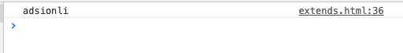
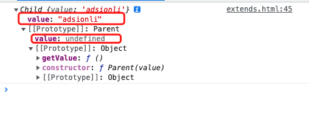
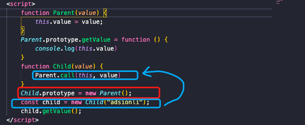
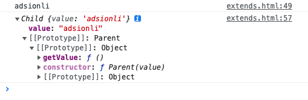
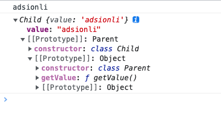

# 继承

| 文档创建人 | 创建日期   | 文档内容 | 更新时间   |
| ---------- | ---------- | -------- | ---------- |
| adsionli   | 2022-01-23 | 继承     | 2022-01-23 |

通过我们之前对原型与原型链的学习，如果说可以熟练掌握的话，再来学习继承，你会发现很简单就可以弄懂其中的原理。

## 1. 继承

js中的继承分为两个部分，对实例的继承和对原型的继承。可以用原型来继承公用的属性和方法，当原型上的属性和方法改变时，继承关系链上的所有对象都将受到影响；用实例来继承特有的属性和方法，当实例上的属性和方法发生改变时，继承关系链上的所有对象互不影响。

继承在ES6可以通过extends关键字完成继承，那么在ES6之前的话，一共有两种继承方式，分别是：

1. 组合继承
2. 寄生组合继承

在这两种方式中，寄生组合继承更加接近ES6中定义的extends关键字实现的继承方式。

## 2. 组合继承

构造函数继承与原型链继承的组合就是组合继承。组合继承方式是最常用的继承方式，具体实现可以看下面的代码

```js
function Parent(value) {
    this.value = value;
}
Parent.prototype.getValue = function(){
    console.log(this.value)
}
function Child(value){
    Parent.call(this, value)
}
Child.prototype = new Parent();
const child = new Child("adsionli");
child.getValue();
```



> 以上继承的方式核心是在子类的构造函数中通过 `Parent.call(this)` 继承父类的属性，然后改变子类的原型为 `new Parent()` 来继承父类的函数。

上面这段代码就是一个组合继承的实现，我们可以看到实例上确实已经有了继承自`Parent`的`value`属性和由`Parent`产生的`getValue()`函数的执行。但是如果我们打印一下`child`实例，你会发现一个问题。



我们会发现，在`Child`类中，会有一个多余的`value`属性，这个属性应该是在`Parent`中，但是却在`Child`也出现了，这就会造成一个问题，就是当js执行时，去寻找`value`属性时，会沿着原型链进行搜索，到搜索到Child的时候，就会停下，因为`Child`此时具有`value`属性，而不会前往上一级`Parent`去寻找，这就导致了子类存在了不需要存在的属性，存在内存上的浪费。

造成这个现象的原因是因为在完成对`Parent`的继承时，执行了两次`Parent`的构造函数，这就造成了属性的复制了，这两次执行过程分别在下图框起来的地方：



第一次发生在将`Parent`作为Child`的`原型时，还有一次则是发生在了实例化`Child`对象时，这时候会调用`Child`对象的构造函数，在这里会有一个`Parent.call`的执行，这时构造函数可以传参，并且不会与父类引用属性共享，可以复用父类的函数。但是同时会多执行一次`Parent`的构造函数，这就导致了属性的复制。

那么为了解决上面的这个问题，就出现了寄生组合继承

## 3. 寄生组合继承

组合继承是因为多调用了一次构造函数，导致属性的复制，那么在寄生组合继承中则优化了这一点，使用的方法也很简单，就是使用了`Object`中的`Object.create`这个静态方法。下面是一段寄生组合继承的实现

```js
function Parent(value) {
    this.value = value;
}
Parent.prototype.getValue = function () {
    console.log(this.value)
}
function Child(value) {
    Parent.call(this, value)
}
Child.prototype = Object.create(Parent.prototype);
let child = new Child("adsionli");
child.getValue();
console.log(child);
```



因为使用了Object.create方法，所以就不会在执行一次Parent的构造函数了，直接将`Parent.prototype`提供在了`Child.prototype.__proto__`上了，这样就可以避免开属性重复复制出现的现象。

> 关于Object.create方法不知道的同学，可以看一下MDN中的介绍:[Object.create](https://developer.mozilla.org/zh-CN/docs/Web/JavaScript/Reference/Global_Objects/Object/create)

## 4. ES6中的class的继承

在ES6中实现继承的方式会比ES5实现继承方便的多，我们可以使用class语法糖来创建类，然后通过extends关键字来轻松实现继承。

```js
class Parent {
    constructor(value){
        this.value = value;
    }
    getValue(){
        console.log(this.value);
    }
}
class Child extends Parent {
    constructor(value){
        super(value)
    }
}
let child = new Child("adsionli");
child.getValue();
console.log(child)
```



我们可以看到ES6中的继承就和ES5中的寄生组合继承的输出几乎是一样的，稍微有点不同的就是在Child中的构造函数中使用了`super`这个方法来给父类的元素进行赋值，这里其实就像`Parent.call(this, value)`的效果。

然后来看一下extends通过babel编译出来的代码是什么样子的

```js
function _possibleConstructorReturn(self, call) {
    // ...
    return call && (typeof call === 'object' || typeof call === 'function') ? call : self;
}

function _inherits(subClass, superClass) {
    // ...
    //这里也就是通过寄生组合继承的方式来完成继承的
    subClass.prototype = Object.create(superClass && superClass.prototype, {
        constructor: {
            value: subClass,
            enumerable: false,
            writable: true,
            configurable: true
        }
    });
    if (superClass) Object.setPrototypeOf ? Object.setPrototypeOf(subClass, superClass) : subClass.__proto__ = superClass;
}


var Parent = function Parent() {
    // 验证是否是 Parent 构造出来的 this
    _classCallCheck(this, Parent);
};

var Child = (function (_Parent) {
    _inherits(Child, _Parent);

    function Child() {
        _classCallCheck(this, Child);

        return _possibleConstructorReturn(this, (Child.__proto__ || Object.getPrototypeOf(Child)).apply(this, arguments));
    }

    return Child;
}(Parent));
```

核心是`_inherits`函数，可以看到它采用的是寄生组合继承方式，同时在完成寄生组合继承的基础上，又通过了Object.setPrototypeOf方法，来将父类的[[Prototype]]中的属性给到subClass对象上(主要是静态方法的继承)，这也是在寄生组合继承没有实现的一个功能。

## 总结

到这里继承相关的知识也就差不多结束了，在这一章中涉及到了很多其他的相关知识，比如说[原型链，构造函数](https://adsionli.xslease.com/page/js/basic/object_link)，Object中的一些静态方法的巧妙使用等，如果不熟悉的话可以去看一下我写的内容。当我们熟悉了相关内容再来看继承的知识的时候，你就会发现很简单了，加油加油ヾ(◍°∇°◍)ﾉﾞ！
