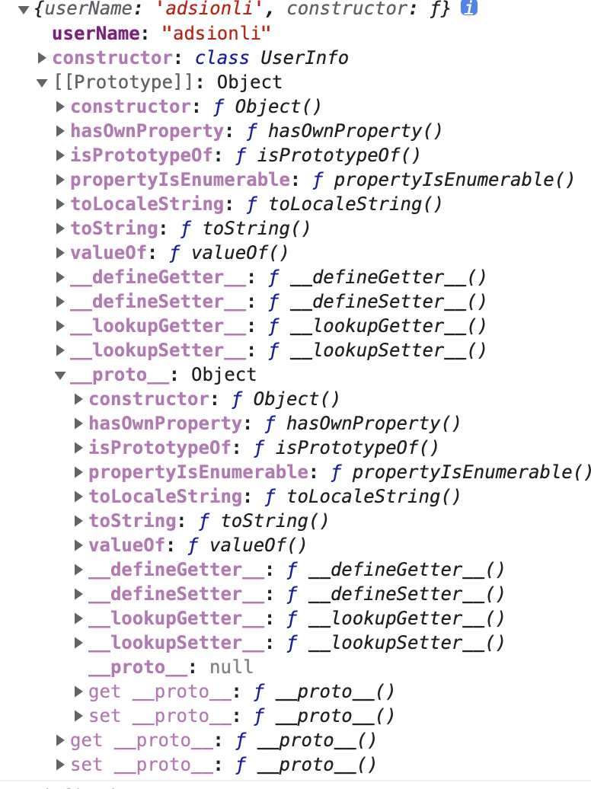

# 原型与原型链

| 文档创建人 | 创建日期   | 文档内容     | 更新时间   |
| ---------- | ---------- | ------------ | ---------- |
| adsionli   | 2021-12-27 | 原型与原型链 | 2021-12-27 |

原型和原型链是整个js的基础知识中非常重要的一环，只有掌握好原型以及原型链的知识，才能弄清楚每一个类的上下游关系，才能在编写代码时有一个很清楚的逻辑思维。

## 1. 原型对象

JavaScript 常被描述为一种**基于原型的语言 (prototype-based language)**——每个对象拥有一个**原型对象**，对象以其原型为模板、从原型继承方法和属性。原型对象也可能拥有原型，并从中继承方法和属性，一层一层、以此类推。这种关系常被称为**原型链 (prototype chain)**，它解释了为何一个对象会拥有定义在其他对象中的属性和方法。那么就开始一层层来学习原型对象

### 1.1 普通对象与函数对象

在Js中一共含有两种对象，分别是函数对象`Function`以及普通对象`Object`，这两者之间拥有着完全不一样的函数方法，但是其中又可以顺着原型链通过Function对象找到Object对象，这里面存在着的爱恨纠葛很是麻烦，所以一定要区分好两者。下面是一个例子

```js
//函数对象Function
function f1(){}; 
var f2 = function(){};
var f3 = new Function('str','console.log(str)');
//普通Object对象
var o1 = {}; 
var o2 =new Object();
var o3 = new f1();

console.log(typeof f1);
console.log(typeof f2);
console.log(typeof f3);  

console.log(typeof o1);
console.log(typeof o2);
console.log(typeof o3);
```


通过浏览器控制台可以看出`f1,f2,f3`都是函数对象，`o1,o2,o3`都是普通对象。

这两者区别就在于，一个是通过函数声明或是`new Function`来创建的，而普通对象就是通过`new Object`或者是通过创建一个空对象或是`new` 一个`Function`对象的时候，就会创建出`Object`对象，也就是普通对象。

### 1.2 构造函数

通过 new 函数名  来实例化对象的函数叫构造函数。任何的函数都可以作为构造函数存在。之所以有构造函数与普通函数之分，主要从功能上进行区别的，构造函数的主要 功能为 初始化对象，特点是和`new` 一起使用。`new`就是在创建对象，从无到有，构造函数就是在为初始化的对象添加属性和方法。**构造函数定义时首字母大写**（规范）。

比如下面这个例子

```js
function User(name, age) {
    this.userName = name;
    this.age = age;
    this.register = () => {
        console.log(register)
    }
}
let user01 = new User("adsionli", 26);
let user02 = new User("shirley", 26);
console.log(user01.constructor === User);
console.log(user02.constructor === User);
```

来看一下输出:


从输出可以看出来代码中的`User`就是构造函数，所以实例化了对象之后，变量调用`constructor`的时候指向的就是这个`User`构造函数啦。

### 1.3 原型对象

说完了普通对象，函数对象，构造函数之后，就可以来看一下什么是原型对象了。

原型对象，顾名思义，它就是一个普通对象。一个普通对象的所有的属性都是挂载在它的原型对象下的，这其中也包括它的constructor函数，同时这个constructor函数一定指向的就是这个普通对象(原型对象)。

> 在默认情况下，所有的**原型对象**都会**自动获得**一个 `constructor`（构造函数）属性，这个属性（是一个指针）指向 `prototype` 属性所在的函数（Person）

然后可以看一下下面这个例子，这个例子就是展示了一个原型对象的内容。

```js
class UserInfo { };
UserInfo.prototype.userName = "adsionli"
console.log(UserInfo.prototype);
```

上面这段代码对象的prototype的输出，我们可以来看一下输出结果:



通过上面的这段输出，我们一下就是可以发现以下的关系:

```js
UserInfo.prototype.constructor === UserInfo;
```

然后如果我们在实例化一下`UserInfo`这个普通对象

```js
let user = new UserInfo();
user.age = 26;
console.log(user);
```

再来看下输出:


这里我们又可以发现一个关系就是之前我们在构造函数那里写的:

```js
user.constructor === UserInfo;
```

啊，这样就有可以得出了一个关系(递推过来):

```js
user === UserInfo.prototype
```

所以，user这个实例对象就是UserInfo这个普通对象的原型对象啦，是不是有点绕，但是通过代码就可以很清楚的看到啦。

这样我们就可以得到一个结论：

**结论：原型对象（Person.prototype）是 构造函数（Person）的一个实例。**

但是对于函数对象来说，它的原型对象还是函数对象，而且它的原型对象的原型对象是`undefined`，这就是函数对象与普通对象的不一样的地方。

## __proto__与prototype

弄清楚了什么是原型对象之后，再来说说控制台中出现的`__proto__`与`prototype`之间的关系，为后面的原型链做准备。

`__proto__`和`prototype`关系：

1. `__proto__`和`constructor`是**对象**独有的。
2. `prototype`属性是**函数**独有的。

> 在 js 中我们是使用构造函数来新建一个对象的，每一个构造函数的内部都有一个 `prototype` 属性值，这个属性值是一个对象，这个对象包含了可以由该构造函数的所有实例共享的属性和方法。当我们使用构造函数新建一个对象后，在这个对象的内部将包含一个指针，这个指针指向构造函数的 `prototype` 属性对应的值，在 ES5 中这个指针被称为对象的原型。一般来说我们是不应该能够获取到这个值的，但是现在浏览器中都实现了 proto 属性来让我们访问这个属性，但是我们最好不要使用这个属性，因为它不是规范中规定的。ES5 中新增了一个 `Object.getPrototypeOf()` 方法，我们可以通过这个方法来获取对象的原型。

原型与实例与构造函数之间使用`__proto__`与`prototype`的表示:

```js
实例.__proto__ === 原型
原型.constructor === 构造函数
构造函数.prototype === 原型
```

我们再通过一个完整的流程来梳理一下其中的关系，然后再通过画图的方式来明确。

```js
class UserInfo { }
console.log(UserInfo.prototype);
console.log(UserInfo.prototype.constructor);
console.log(UserInfo.prototype.constructor.prototype);
console.log(UserInfo.prototype.__proto__);
console.log(UserInfo.prototype.__proto__.__proto__);  
console.log(UserInfo.prototype.constructor.__proto__);
console.log(UserInfo.prototype.constructor.__proto__.__proto__);
console.log(UserInfo.prototype.constructor.__proto__.__proto__.__proto__)
```


借助代码的输出，我们就可以大致的画出相关的原型图啦。


有了上面这张结构图，大家应该就对原型对象和原型链之间的关系有了初步的了解，然后让我们继续深入原型链吧。

> 注意，这里有一个东西没有说明好就是：
>
> ```js
> //因为UserInfo === UserInfo.prototype.constructor
> //所以可以得出:
> UserInfo.prototype.constructor === UserInfo;
> UserInfo.prototype.constructor.__proto__ === Function.prototype;
> UserInfo.__proto__ === Function.prototype;
> ```

## 2. 原型链

原型链是由原型对象组成，每个对象都有 `__proto__` 属性，指向了创建该对象的构造函数的原型，`__proto__` 将对象连接起来组成了原型链。是一个用来实现继承和共享属性的有限的对象链。

### 2.1 原型链的两种机制

1. **属性查找机制:** 当查找对象的属性时，如果实例对象自身不存在该属性，则沿着原型链往上一级查找，找到时则输出，不存在时，则继续沿着原型链往上一级查找，直至最顶级的原型对象`Object.prototype`，如还是没找到，则输出`undefined`；
2. **属性修改机制:** 只会修改实例对象本身的属性，如果不存在，则进行添加该属性，如果需要修改原型的属性时，则可以用: `b.prototype.x = 2`；但是这样会造成所有继承于该对象的实例的属性发生改变。

### 2.2 原型链Uml

通过上面及第一部分的学习之后，我们现在来分析并绘制一个完整的原型链不会太难，假设我们现在有以下这段代码。

```js
class foo{};
let fn = new foo();
let obj = new Object();
```


好吧，稍微有点复杂，但是如果理清楚的话，你会发现其实不是很难的啦。当然这里有一个特殊的一点就是`Function.prototype.constructor.prototype === Function.prototype.constructor.__proto__`这个是有一些特殊的，但是其实你理一下就会发现确实是这样，每一个构造方法的上一级一定是`Function.prototype`，而函数对象的构造方法是他本身也是符合设计的规矩的，所以是没错的。

### 2.3 原型链的总结

好了，有了上面那个Uml图后，我们可以总结出一些内容

1. 每个函数都有 `prototype` 属性，除了 `Function.prototype.bind()`，该属性指向原型。

2. 每个对象都有 `__proto__` 属性，指向了创建该对象的构造函数的原型。其实这个属性指向了 `[[prototype]]`，但是 `[[prototype]]`是内部属性，我们并不能访问到，所以使用 `_proto_`来访问。

3. 对象可以通过 `__proto__` 来寻找不属于该对象的属性，`__proto__` 将对象连接起来组成了原型链。

==注：在新版的Js中已经抛弃了__proto__，但是是可以使用的，所以这里还是用__proto__来代替`Object.getPrototypeOf`来书写，方便一些==

## 总结

到这里原型/原型链的内容也就差不多结束了，绕来绕去的属实有点头疼，但是理清楚之后就会发现语言设计者在这里设计的巧妙之处，为了各位能够加强对这里的记忆，最好的方法就是自己动手去分析一段代码，然后自己绘制一下原型链的Uml，这样就可以很好地掌握这个知识点啦。加油加油ヾ(◍°∇°◍)ﾉﾞ！

