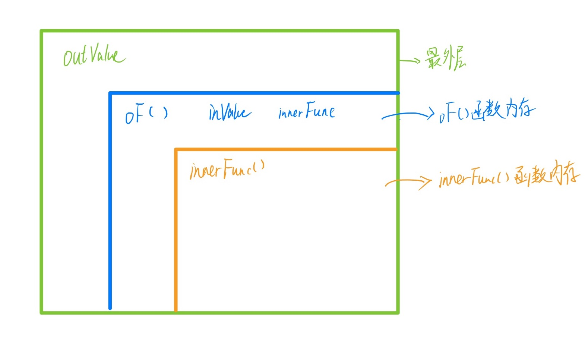
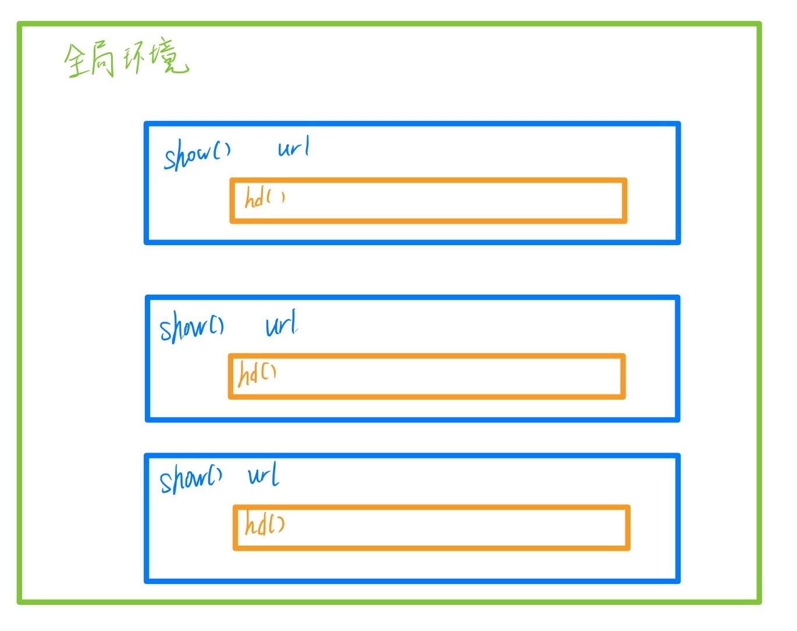
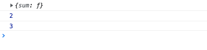
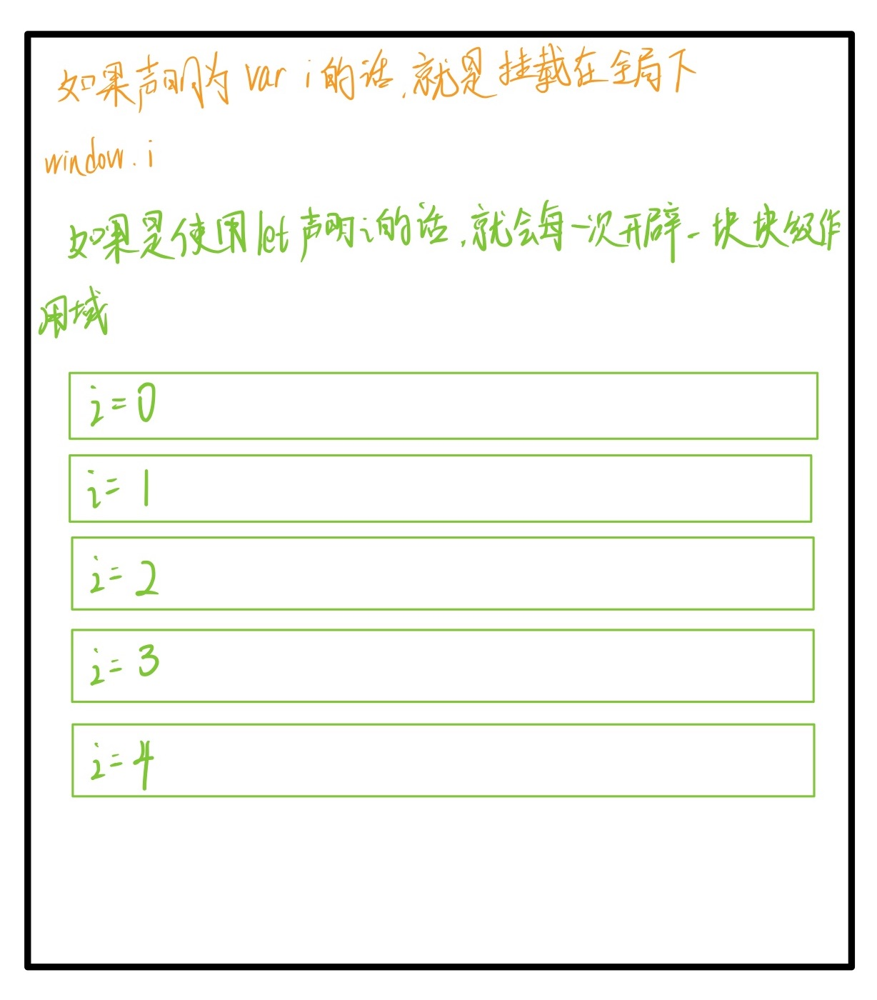

# 作用域

| 文档创建人 | 创建日期   | 文档内容 | 更新时间   |
| ---------- | ---------- | -------- | ---------- |
| adsionli   | 2022-02-02 | 作用域   | 2022-02-02 |

JavaScript语言中，关于作用域真的是一个非常重要的一块内容。如果不熟悉作用域的使用及作用范围的话，很容易在代码编写中出现很多的错误。所以今天就来整理并深入学习一下作用域。

## 1. 作用域的基础

### 1.1 什么是作用域

作用域是在运行时代码中的某些特定部分中变量，函数和对象的可访问性。

就拿下面这个例子来进行说明一下

```js
function out(){
    var inValue = "adsionli"
}
out();
//这里就会报错了，因为inValue作用的范围只在函数作用域中，而在外层的作用域中是没有inValue的值的。
console.log(inValue)
```

从上面的例子可以体会到作用域的概念，变量 inVariable 在全局作用域没有声明，所以在全局作用域下取值会报错。我们可以这样理解：**作用域就是一个独立的地盘，让变量不会外泄、暴露出去**。也就是说**作用域最大的用处就是隔离变量，不同作用域下同名变量不会有冲突。**

**ES6 之前 JavaScript 没有块级作用域,只有全局作用域和函数作用域**。ES6 的到来，为我们提供了‘块级作用域’,可通过新增命令 let 和 const 来体现。

### 1.2 作用域的分类

作用域主要分为如下几类：

1. window/global Scope: 全局作用域
2. function Scope: 函数作用域
3. block Scope: 块级作用域（ES6新增let与const之后才有的）

## 2. 作用域

### 2.1 全局作用域

在代码中任何地方都能访问到的对象拥有全局作用域，一般来说以下几种情形拥有全局作用域：

1. 最外层函数以及在最外层函数外面定义的变量拥有全局作用域。

   > 这种就是外部变量可以在函数中被使用到。
   >
   > 

   ```js
   var outValue = "out Value";
   function oF(){
       var inValue = "函数内变量";
       //这里其实就相当于最外层函数定义的变量，相对于内部函数的作用域
       let innerFunc = () => {
           console.log(inValue);
       }
       //在最外层函数外定义了变量，所以这个变量属于全局作用域，所以这里可以被访问到
       console.log(outValue)
       innerFunc();
   }
   oF();
   console.log(outValue);
   //在最外层函数的外部没有定义，所以会报错
   console.log(inValue);
   ```

2. 所有末定义直接赋值的变量自动声明为拥有全局作用域

   > 当然这个涉及到了变量提升的概念。

   ```js
   function outFun2() {
       //这里没有定义variable的值，所以会进行变量提升，提升到最外层进行var的定义，所以就化为了全局作用域了
       variable = "未定义直接赋值的变量";
       var inVariable2 = "内层变量2";
   }
   outFun2(); //要先执行这个函数，否则根本不知道里面是啥
   console.log(variable); //未定义直接赋值的变量
   console.log(inVariable2); //inVariable2 is not defined
   ```

3. 所有 `window` 对象的属性拥有全局作用域

   > `window` 对象的内置属性都拥有全局作用域，例如 `window.name`、`window.location`、`window.top`等等

全局作用域使用起来很方便，但是全局作用域会存在一些弊端:

如果写了很多行 JS 代码，变量定义都没有用函数包括，那么它们就全部都在全局作用域中。这样就会 污染全局命名空间, 容易引起命名冲突。

### 2.2 函数作用域

声明在函数内部的变量，和全局作用域相反，局部作用域一般只在固定的代码片段内可访问到，最常见的例如函数内部。

```js
function doSomething() {
    var blogName = "浪里行舟";
    function innerSay() {
        alert(blogName);
    }
    innerSay();
}
alert(blogName); //脚本错误
innerSay(); //脚本错误
```

**作用域是分层的，内层作用域可以访问外层作用域的变量，反之则不行。**

同时在没有块级作用域之前，**块语句（大括号“｛｝”中间的语句），如 if 和 switch 条件语句或 for 和 while 循环语句，不像函数，它们不会创建一个新的作用域**。在块语句中定义的变量将保留在它们已经存在的作用域中。

```js
if (true) {
    // 'if' 条件语句块不会创建一个新的作用域
    var name = "Hammad"; // name 依然在全局作用域中
}
console.log(name); // logs 'Hammad'
```

#### 2.2.1 函数环境生命周期

在js中，一个被使用的变量是不会被回收的，那么在一段代码中一个函数被执行之后，如果没有返回，或者返回的是一个基本类型时，其再被执行后就会被回收掉。如果返回的是一个函数方法的话，就会将函数进行保留而不会不被清除，就如下面的几个实例:

1. 首先是一个简单的例子：

   ```js
   function show(){
       let n = 1;
       console.log(++n)
   }
   //这里执行多次show函数。
   show();
   show();
   show();
   show();
   show();
   ```

   可以看一下浏览器控制台的输出。

   

   我们可以不难发现，这里的输出一直都是2。原因就是函数被执行完之后，就会被回收，所以当执行一个新的函数的时候，就是重新开辟了一个内存空间，是全新的内容，所以输出就一直是2了。那么如何让n发生改变呢，看如下代码:

   ```js
   function show(){
       let n = 1;
       return function sum(){
           console.log(++n);
       }
   }
   var a = show();
   a();
   a();
   a();
   ```

   这时候再来看一下浏览器中的输出。

   

   n发生了改变，这是为什么呢？因为在show函数中返回的是一个sum函数，然后在全局中被使用了(赋值给了a)，所以show函数就会存在在内存中而不会被回收，那么这个n就会随着a的执行而不断的累加上去。原理图如下图所示:

   

2. 接下来是一个基于上面例子的进阶版:

   ```js
   function show(){
       let n = 1;
       return function sum(){
           let m = 1;
           function add(){
               console.log(++m)
           }
           add();
       }
   }
   var a = show();
   a();
   a();
   a();
   ```

   看一下浏览器中的输出。

   

   咦，这里的m永远输出的都是2了，这是为啥？其实原因很简单，因为我们这里其实只是保留了show函数中的内容，而对sum函数中的内容并没有被保留，其在每一次被调用结束的时候，都会回收掉add的内存空间，所以就导致了m的值的输出始终都是2了，就如下图所示。

   

   那么我们就可以进行一下修改:

   ```js
   function show(){
       let n = 1;
       return function sum(){
           let m = 1;
           return function add(){
               console.log(++m)
           }
       }
   }
   
   let a = show()();
   a();
   a();
   ```

   这个时候再来看一下输出就是对的啦!

   

   如果我们这时候在对上面的代码进行一些修改:

   ```js
   function show(){
       let n = 1;
       return function sum(){
           let m = 1;
           return function add(){
               console.log("m:", ++m);
               console.log("n:", ++n);
           }
       }
   }
   
   let a = show()();
   a();
   a();
   let b = show()();
   b();
   b();
   ```

   那么这个时候的输出会是什么呢？如下图:

   

   那么看到这个输出，我想大家大概也明白是怎么回事了吧，当b在创建一个时候，他就会创建一个内存空间去存放一个全新的show，而不是接着a的来创建的，所以就会出现上面的情况啦。

有了上面的两个例子，我们基本就能很好的认识函数环境的生命周期究竟是怎么回事了，这里可能有点绕，所以希望大家可以多练习练习加强记忆。

#### 2.2.2 构造函数中的作用域使用形态

直接上例子：

```js
function Hd(){
    let n = 1;
    this.sum = function(){
        console.log(++n)
    }
}
let a = new Hd();
a.sum();
a.sum();
```

看一下浏览器控制台的输出：


为什么输出的n的值会是3呢，那么对于构造函数来说，我们可以理解成这样:

```js
function Hd(){
    let n = 1;
    function sum(){
        console.log(++n)
    }
    
    return {
        sum
    }
}
let a = new Hd();
console.log(a)
a.sum();
a.sum();
```

看一下浏览器控制台的输出:



可以发现与上面的输出是完全相同的，这样就很方便理解了，这时候返回的是一个对象，那么Hd就不会被内存回收，因为还处于被使用的状态，所以就会累加n啦！

同样，在进行一点修改:

```js
function Hd(){
    let n = 1;
    function sum(){
        console.log(++n)
    }
    
    return {
        sum
    }
}
let a = new Hd();
a.sum();
a.sum();
let b= new Hd();
b.sum();
b.sum();
```

这里是不是就用在展示浏览器输出就应该知道是怎么回事了吧，就和2.2.1中的例子是一样的，新开辟的内存空间肯定是一块全新的而不是继承了a的啦。

### 2.3 块级作用域

块级作用域可通过新增命令 let 和 const 声明，所声明的变量在指定块的作用域外无法被访问。块级作用域在如下情况被创建：

1. 在一个函数内部
2. 在一个代码块（由一对花括号包裹）内部

let 声明的语法与 var 的语法一致。你基本上可以用 let 来代替 var 进行变量声明，但会将变量的作用域限制在当前代码块中。块级作用域有以下几个特点：

1. 声明变量不会提升到代码块的顶部

   ```js
   function getValue(condition) {
       if (condition) {
           let value = "blue";
           return value;
       } else {
           // value 在此处不可用
           return null;
       }
       // value 在此处不可用
   }
   ```

   > let/const 声明并不会被提升到当前代码块的顶部，因此你需要手动将 let/const 声明放置到顶部，以便让变量在整个代码块内部可用。

2. 禁止重复声明

   如果一个标识符已经在代码块内部被定义，那么在此代码块内使用同一个标识符进行 let 声明就会导致抛出错误。

   ```js
   var count = 30;
   let count = 40; // Uncaught SyntaxError: Identifier 'count' has already been declared
   ```

   如果在嵌套的作用域内使用 let 声明一个同名的新变量，则不会抛出错误。

   ```js
   var count = 30;
   // 不会抛出错误
   if (condition) {
       let count = 40;
       // 其他代码
   }
   ```

3. let-const-var在for循环中的执行

   如果在没有块级作用域的时候，我们通过var来声明for循环中的循环参数的时候，就会出现一个问题，如下例：

   ```js
   for(var i = 0; i < 5; i++){
       setTimeout(() => {
           console.log(i);
       }, 1000);
   }
   ```

   看一下浏览器控制台输出:

   

   那么我们这时候在使用let来修改一下代码:

   ```js
   for(let i = 0; i < 5; i++){
       setTimeout(() => {
           console.log(i);
       }, 1000);
   }
   ```

   再来看一下浏览器控制台输出:

   

   那么这里的原理是什么，可以看一下下图：

   

   通过上面这张图，我们可以很清晰的看出来，使用`let`声明的`i`只会作用在当前次循环的作用域中。这就`var`声明的`i`不同了，他就不会变成一个全局的`i`，从而使得`setTimeout`中输出的全是5了。当然这里还涉及到线程的执行顺序的问题，因为`setTimeout`的执行会有点特殊，这里的一些知识点我就会放在`setTimeout`与`setInterval`中来说明。

#### 2.3.1 模拟出var的伪块作用域

那么如果我们需要使用var的同时，模拟出伪块作用域的功能的话，需要怎么办呢，我们可以使用闭包的形式来进行处理

```js
for (var i = 0; i < 5; i++) {
    (function (a) {
        setTimeout(() => {
            console.log(a);
        }, 1000);
    })(i)
}
```

可以再来看一下浏览器控制台的输出


这时候我们可以发现，每一次输出都是正确的了，这是因为我们使用闭包来控制，然后每一次函数都会开辟块新的内存地址来存，然后再将i传入，作为形参，这样就可以达到块作用域的效果，当然这样就有点麻烦了，还是let、const方便很多。

## 3. 作用域链

### 3.1 自由变量

在了解作用域链之前，先学习一下什么叫做自由变量。

```js
var a = 100;
function fn(){
    var b = 200;
    console.log(a);
    console.log(b);
}
fn();
```

在上述代码块中，`console.log(a)`要得到 a 变量，但是在当前的作用域中没有定义 a（可对比一下 b）。当前作用域没有定义的变量，这称为 **自由变量** 。关于自由变量的值的获取，在下面再展开。

### 3.2 什么是作用域链

```js
var a = 100;
function F1() {
    var b = 200;
    function F2() {
        var c = 300;
        console.log(a); // 自由变量，顺作用域链向父作用域找
        console.log(b); // 自由变量，顺作用域链向父作用域找
        console.log(c); // 本作用域的变量
    }
    F2();
}
F1();
```

在上述代码中，如果我们要在F2函数中获取到a,b的值，那么我们就需要顺着F2函数所在的作用域继续向外层寻找，直到我们找到了变量所在的作用域，如果找到全局作用域还没有找到，就放弃寻找。这种一层层的关系就叫做作用域链。

### 3.3 自由变量的取值

还是用一段代码来举例

```js
var a = 10;
function fn() {
    var b = 20;
    function bar() {
        console.log(a + b); //30
    }
    return bar;
}
var x = fn(),b = 200;
x(); //bar()
```

在 bar 函数中，取自由变量 a,b 的值时，要到哪个作用域中取？——要到创建 bar 函数的那个作用域中取，**无论 bar 函数将在哪里调用**。

所以==**要到创建这个函数的那个域。作用域中取值,这里强调的是“创建”，而不是“调用”**==，切记切记——其实这就是所谓的”静态作用域”

> 这里实际上就和上面涉及到的一些作用域的问题是相通的了，这时候fn是在内存中的，保存的是fn函数以及其内部的内容。

## 4. 作用域与执行上下文

许多开发人员经常混淆作用域和执行上下文的概念，误认为它们是相同的概念，但事实并非如此。

我们知道 JavaScript 属于解释型语言，JavaScript 的执行分为：解释和执行两个阶段,这两个阶段所做的事并不一样：

**解释阶段**：

1. 词法分析

2. 语法分析

3. 作用域规则确定

**执行阶段**：

1. 创建执行上下文

2. 执行函数代码

3. 垃圾回收

JavaScript 解释阶段便会确定作用域规则，因此作用域在函数定义时就已经确定了，而不是在函数调用时确定，但是执行上下文是函数执行之前创建的。执行上下文最明显的就是 this 的指向是执行时确定的。而作用域访问的变量是编写代码的结构确定的。

作用域和执行上下文之间最大的区别是：
**执行上下文在运行时确定，随时可能改变；作用域在定义时就确定，并且不会改变**。

一个作用域下可能包含若干个上下文环境。有可能从来没有过上下文环境（函数从来就没有被调用过）；有可能有过，现在函数被调用完毕后，上下文环境被销毁了；有可能同时存在一个或多个（闭包）。**同一个作用域下，不同的调用会产生不同的执行上下文环境，继而产生不同的变量的值**。


## 总结

在没有整理作用域的知识的时候，其实还不知道作用域还有这么多门门道道，以为自己已经很熟悉了，结果在整理的过程中才发现，原来作用域还有这么多东西，而且其中还涉及到很多很多知识的串联。比如说和setTimeout、垃圾回收、内存等等的联动知识。其实这样真的很好，我们就可以将js语言串联起来，学习到连贯的知识和内容，可以了解到每一块知识点不是独立存在的而是有关联的，这才是这门语言被设计的初衷。加油加油！

