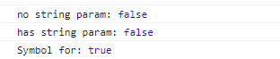
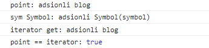
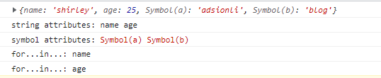
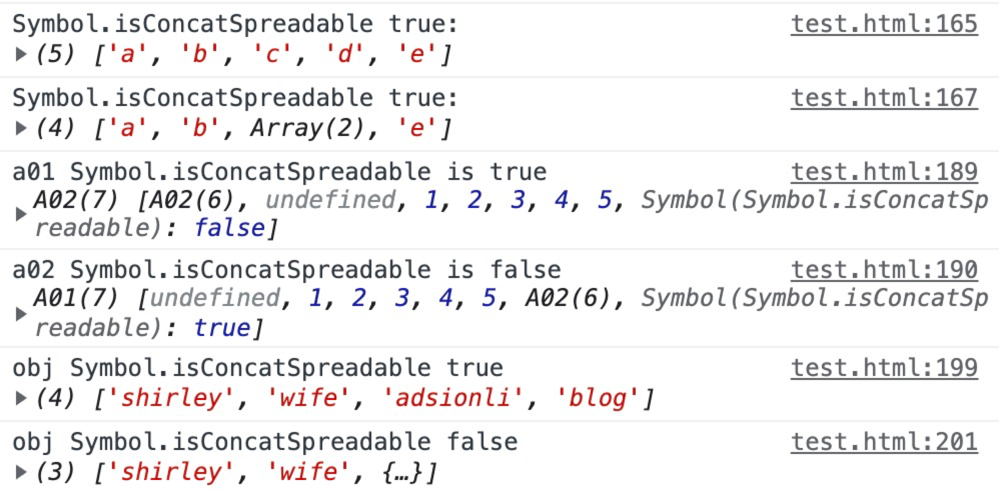
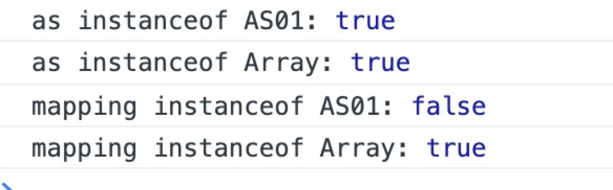
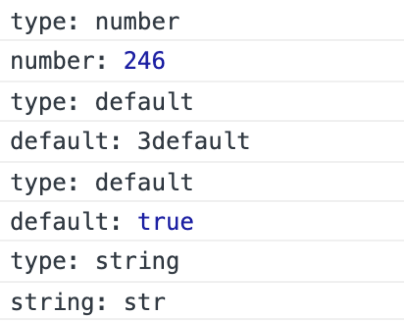

# Symbol类型

| 文档创建人 | 创建日期   | 文档内容                   | 更新时间   |
| ---------- | ---------- | -------------------------- | ---------- |
| adsionli   | 2021-12-17 | Js中的Symbol类型的知识总结 | 2021-12-17 |

> 本篇文章主要学习的书籍是阮一峰老师的ES6标准入门一书。

# Symbol

`Symbol`类型是在ES6标准中推出的一种原始数据类型，但是在平时开发中使用的次数不是很多，所以不是很会使用`Symbol`类型的数据，现在出一篇博文来记录一下这个不同寻常的`Symbol`类型。

## Symbol的定义与概述

1. `Symbol`是一种原始数据类型，其表示的含义就是独一无二的值。

2. `Symbol`值通过`Symbol`函数生成，也就是说，对象的属性名现在可以用两种类型：一种是原来就有的字符串，另一种就是新增的`Symbol`类型。只要属性名属于`Symbol`类型，就是独一无二的，可以保证不会与其他属性名发生冲突。

==使用Symbol函数时，是不可以使用new的，因为Symbol是一种原始数据类型，而不是一个对象，所以是不可以添加属性的。==

3. `Symbol`函数可以接受一个字符串作为参数，表示对Symbol示例的描述，主要是为了在控制台显示的时候，可以显示出字符串参数`Symbol`，加以区分。

```js
let s1 = Symbol('s1');
let s2 = Symbol('s2');

console.log(s1.toString());
console.log(s2.toString());
```

如上述的代码中我们对变量`s1`与`s2`在声明为`Symbol`类型的时候加了字符串作为参数然后在`console.log`的时候，我们可以在浏览器控制台或者终端指执行的时候，区分出不同`Symbol`类型的表标识。

如果说`Symbol`的参数是一个对象的话，那么这个对象一定要带有`toString`方法，因为`Symbol`会自动去调用函数的`toString`方法来作为字符串参数标识。

```js
let obj = {
    toString(){
        return "obj"
    }
}

let s1 = Symbol(obj);
console.log(s1);
```


4. 对于Symbol类型来说，如果说在声明的时候，使用了相同的字符串作为表示，当我们去进行比较的时候我们可以发现，返回的一定是false。因为Symbol类型一定是独一无二的，无论字符串表示是否相同，都是不存在一样的

   > 当然对于使用`Symbol.for`来声明的就不一定了，当然这里是使用的Symbol来作为类型声明的。

```js
let s1 = Symbol();
let s2 = Symbol();
console.log(s1 == s2);
let s3 = Symbol('str');
let s4 = Symbol('str');
console.log(s3 == s4);
let s5 = Symbol.for('for');
let s6 = Symbol.for('for');
console.log(s5 == s6);
```



5. `Symbol`可以转换成两种类型分别是：`Boolean`、`String`。但是`Symbol`不可以转换成`Number`类型。

> 不过当`Symbol`转换成`Boolean`类型的时候，永远都表示为`true`

```js
let sym = Symbol('symbol');
//这里可以看出Symbol可以显示转换成String类型
console.log(`u Symbol is ${sym}`);
//也可以被动转换
let str = String(sym);
console.log(str);

let sym01 = Symbol('boolean');
let bool = Boolean(sym01);
console.log(bool);
```

## Symbol作为类中的属性名的使用

因为每一个`Symbol`值都是独一无二的，所以在对象中使用的话可以保证不会出现相同的作用名属性，这对于一个对象由多个模块构成的情况来说十分的有用，可以防止相同属性名的复写

> 其实也就和其他语言中的`protected`的作用非常相似。

这里举一段代码示例:

```js
var sym = Symbol();
var a = {
    [sym]: 'welcome to adisonli blog!'
}
//这里的输出就是'welcome to adisonli blog!'
console.log(a[sym]);
```

==`Symbol`类型的值作为对象的属性名的时候是不可以通过点运算符来进行调用的！==

> 其实原因也很好理解，因为点运算符之后跟的是字符串，但是Symbol类型也是一种基本类型且无法通过设置的字符串标记来取到，如此就可以知道肯定是无法通过点运算法来获取的。
>
> 下面这段代码就可以很清晰的显示
>
> ```js
> let sym = Symbol('symbol');
> let a = {
>     sym: 'adsionli blog'
> }
> a[sym] = 'adsionli'
> console.log('point:',a.sym);
> console.log('sym Symbol:',a[sym].toString(), sym.toString());
> console.log('iterator get:',a['sym']);
> console.log('point == iterator:',a.sym == a['sym']);
> ```
>
> 
>
> 所以通过上面这个例子我们可以很容易的看到，Symbol在对象中的读取形式和普通的字符串属性是不相同的，无法通过点运算符来读到，只可以通过对象的迭代器属性来读取。

### Symbol作为属性名的遍历方式

根据上面的内容我们可以知道`Symbol`在对象中的获取方便与普通的字符串的属性获取是不同的，那么在`Object`类型中的`getOwnPropertyName`的方法是否能够获取到呢，答案自然是不行的，因为Symbol类型不是字符串类型，所以无法进行获取。当然`Object`类型中有一个方法还是可以获取到的就是`getOwnPropertySymbols`方法。

> 当然啦，这里如果是`hasOwnProperty`也就无法判断是否存在`Symbol`类型的属性啦！

同时，针对对象类型的迭代器遍历方式，比如`for...in...`或者是`for...of...`也是无法获取到`Symbol`类型的属性的，只可以获取普通的字符串类型的属性。

示例代码及运行示例图如下：

```js
let obj = {};
let a = Symbol('a');
let b = Symbol('b');

obj.name = "shirley";
obj.age = 25;
obj[a] = 'adsionli';
obj[b] = 'blog';
console.log(obj)
let s = Object.getOwnPropertyNames(obj);
console.log('string attributes:', ...s);
let ssym = Object.getOwnPropertySymbols(obj);
console.log('symbol attributes:', ...ssym);
for(let key in obj){
    console.log("for...in...:", key);
}
```



在ES6中存在一个新的特殊类`Reflect`，其中的`ownKeys`方法可以获取到包括`Symbol`类型属性在内的全部的`key`，这里就让各位自己去测试一下啦。

基于上面的特性，通常就会将Symbol作为对象中定义一些非私有但又希望只用于内部的方法：

```js
var size = Symbol('size');
class Collection {
    constructor(){
        this[size] = 0;
    }
    
    add(item) {
        //这里可以通过获取this[size]的大小作为键名
        this[this[size]] = item;
        this[size]++;
    }
    
    static sizeOf(obj){
        return obj[size];
    }
}

let x = new Collection();
console.log('x size:', Collection.sizeOf(x));
x.add('adisonli');
x.add('blog');
console.log('x size:', Collection.sizeOf(x));
console.log('x attributes:', Object.getOwnPropertyNames(x));
console.log('x all attributes:', Reflect.ownKeys(x));
```


### Symbol在常量中的使用

`Symbol`类型还可以用来定义一组常量，可以保证常量中的每一个值都一定不相同。

```js
log.levels = {
    DEBUG: Symbol('debug');
    INFO: Symbol('info');
	WARN: Symbol('warn');
}

console.log(log.levels.DEBUG, "debug message");
console.log(log.levels.INFO, "info message");
```

常量使用`Symbol`最大的好处就是其他任何值都不可能是相同的值，这样就保证了`switch`的工作模式一定是可以被使用的。

## Symbol.for与Symbol的区别

当我们需要使用相同的`Symbol`值的时候，普通的`Symbol`是无法做到这一点的，只能够通过使用另外一种形式来声明的时候才可以，就是`Symbol.for`来声明。

`Symbol.for`可以接受一个字符串作为参数，然后回去搜索是否已经存在相同字符串的`Symbol`值，如果有就返回这个`Symbol`值，如果没有的话就新建一个并返回`Symbol`值。

```js
let sym01 = Symbol.for('adsionli');
let sym02 = Symbol.for('adsionli');

console.log(sym01 == sym02);
```

`Symbol.for`与`Symbol`都可以生成新的`Symbol`。他们的最主要的区别就是`Symbol.for`会被登记在全局变量中而`Symbol`则不会。`Symbol.for`的声明最大的不同就是在每次声明的时候会先去查询当前字符串的key是否存在，如果不存在的话就会创建一个`Symbol`并返回，然后再放入搜索表中，如果已经存在就直接返回而不会创建了。

`Symbol.keyFor`方法能够将一个通过`Symbol.for`声明的`Symbol`的值，返回其的key值。

> `Symbol.for`为`Symbol`值登记的名字是全局环境的，可以在不同的`iframe`或`service worker`中取到同一个值。

## 内置Symbol值

在ES6中一共提供了11中内置的Symbol值，用于指向不同类型的内部使用方法

> 这里说一些可能会经常使用到的，不常使用的就放在后面的汇总表格中。

### 1. Symbol.hasInstance 

本属性指向对象类型中的一个内部方法，当对象使用instanceof运算符时会调用本属性指向的方法，判断该对象是否是某个构造函数的实例。

下面给出一段代码与运行结果图展示具体的使用方式：

```js
class JudgeEven {
    //这里就将对象的instanceof改成了传入对象是否是偶数
    static [Symbol.hasIntance](obj) {
        return Number(obj) % 2 === 0;
    }
}
//使用上面的判断
console.log("judge even:", 1 instanceof JudgeEven);
console.log("judge even:", 2 instanceof JudgeEven);
console.log("judge even:", 2468 instanceof JudgeEven);
```


通过上面演示，我们可以知道Symbol这个内置值的作用就是可以改变对象默认的instanceof运算符调用的方法，当然如果我们自己不做定义的时候，也会有一个默认的方法被执行的。

### 2. Symbol.isConcatSpreadable

本属性是一个Boolean类型的值，表示该对象在使用Array.prototype.concat()时是否可以展开，如果是true|undefined的话就是展开，如果是false的话就是不展开合并。

下面给出一段代码与运行结果图展示具体的使用方式：

```js
//第一种是普通的数组对象的设置这个默认内置属性
let arr = ['c', 'd'];
console.log('Symbol.isConcatSpreadable true:',['a', 'b'].concat(arr, 'e'));
arr[Symbol.isConcatSpreadable] = false;
console.log('Symbol.isConcatSpreadable true:', ['a', 'b'].concat(arr, 'e'));
//第二种是在对象中使用本属性，这个就需要写成是实例中的一个属性
class A01 extends Array {
    constructor(args){
        super(args);
        this[Symbol.isConcatSpreadable] = true;
    }
}
class A02 extends Array {
    constructor(args){
        super(args);
        this[Symbol.isConcatSpreadable] = false;
    }
}
let a1 = new A01();
for(let i = 1; i <= 5; i++){
    a1[i] = i;
}
let a2 = new A02();
for(let i = 1; i <= 5; i++){
    a2[i] = i * 2;
}
console.log('a01 Symbol.isConcatSpreadable is true', a2.concat(a1));
console.log('a02 Symbol.isConcatSpreadable is false', a1.concat(a2));
//第三种是类数组对象的使用，也是可以赊着Symbol.isConcatSpreadable属性的
let obj = {
    length: 2,
    0: 'adsionli',
    1: 'blog'
}
obj[Symbol.isConcatSpreadable] = true;
let arr001 = ['shirley', 'wife'];
console.log('obj Symbol.isConcatSpreadable true', arr001.concat(obj));
obj[Symbol.isConcatSpreadable] = false;
console.log('obj Symbol.isConcatSpreadable false', arr001.concat(obj));
```



上面的示例我们可以看出Symbol.isConcatSpreadable的功能就是控制Array或者类Array对象在concat操作的时候是否展开，如果设置为true就会将其展开，做一个结构操作，如果是false就不会展开，直接放入数组中。这个还挺有用的，有的时候我们想要将数组合并，但是又不想展开的时候我们就可以设置这个属性来控制其是否展开。

### 3. Symbol.species

对象的Symbol.species属性指向当前对象的构造函数。创建实例是默认会调用这个方法，就是使用这个属性返回的函数当作构造函数来创造新的实例对象，它会改变原型链的指向。

下面给出一段代码与运行结果图展示具体的使用方式：

```js
class AS01 extends Array {
    constructor(args){
        super(args);
        this[Symbol.isConcatSpreadable] = false;
    }
    
    static get [Symbol.species](){
        return Array;
    }
}
let as = new AS01(1,2,3,4,5,6,7,8,9);
let mapping = as.map(x => x * x);
console.log('as instanceof AS01:', as instanceof AS01);
console.log('as instanceof Array:', as instanceof Array);
console.log('mapping instanceof AS01:', mapping instanceof AS01);
console.log('mapping instanceof Array:', mapping instanceof Array);
```



根据运行结果图我们可以发现，在声明`as`的时候，因为走的是`new AS01`，所以这个时候其构造方法走的依然是`AS01`本身的构造方法，但是当调用了`map`方法返回的值，如果说我们将代码中的`get [Symbol.species]`的返回值设置为`return this`的话，那么`mapping`也是`instanceof AS01` 是`true`的，但是现在就是`false`了，因为我们设置了他的构造函数返回是`Array`，所以在实例化的时候就改变其构造函数的指向了。

> 当然这里需要弄清楚的就是如果是new的话，其构造函数执行的依然是new的这个对象的构造函数，而如果是对对象进行处理时，返回的对象值就变成了get中设置的了，一定要注意其中的区别。

### 4. Symbol.toPrimitive

本属性指向的是一个对象的方法，对象被转为原始类型的值的时候会调用这个方法，返回该对象对应的原始类型值。

一共可以被分为三种类型：Number，String，Default

下面给出一段代码与运行结果图展示具体的使用方式：

```js
let obj = {
    [Symbol.toPrimitive](hint) {
        console.log('type:', hint)
        switch(hint){
            case 'number':
                return 123;
            case 'string':
                return "str";
            case 'default':
                return 'default';
            default:
                throw new Error('no this type:' + hint);
        }
    }
}
console.log("number:",2 * obj);
console.log("default:",3 + obj);
console.log("default:",obj == 'default');
console.log("string:",String(obj));
```



> 这个内置属性可以让我们自己控制当前对象转变成不同原始类型的返回值，针对不同的场景。还算有点作用😂

### 5.剩余内置值汇总

| 内置值               | 作用                                                         | 作用类型     |
| -------------------- | ------------------------------------------------------------ | ------------ |
| `Symbol.match`       | 指向一个函数，实际就是正则匹配函数，可以通过改变`Symbol.match`方法来自定义匹配对象 | `regexp`正则 |
| `Symbol.replace`     | 指向一个方法，当对象被`String.prototype.replace`方法调用的时候会返回该方法的返回值 | `String`类型 |
| `Symbol.search`      | 指向一个方法，当对象被`String.prototype.search`方法调用的时候会返回该方法的返回值 | `String`类型 |
| `Symbol.split`       | 指向 一个正则表达式的索引处分割字符串的方法。 这个方法通过 `String.prototype.split()` 调用。 | `String`类型 |
| `Symbol.toStringTag` | `Symbol.toStringTag` 是一个内置 `symbol`，它通常作为对象的属性键使用，对应的属性值应该为字符串类型，这个字符串用来表示该对象的自定义类型标签，通常只有内置的 `Object.prototype.toString()` 方法会去读取这个标签并把它包含在自己的返回值里。也是写在对象的默认`get`中的。 | `Object`类型 |
| `Symbol.iterator`    | `Symbol.iterator` 为每一个对象定义了默认的迭代器。该迭代器可以被 `for...of` 循环使用。 | `Object`类型 |
| `Symbol.unscopables` | `Symbol.unscopables`指用于指定对象值，其对象自身和继承的从关联对象的 with 环境绑定中排除的属性名称。 | `Object`类型 |


# 总结

看着只是一个新增的类型Symbol，但是通过学习我发现这个类型可以作为很多原来js中所没有的特性来进行代替，真的可以使用在非常多的场景，之后在自己开发的时候，就可以将这原始类型用于合适的开发位置，来更好的构建代码。加油加油，努力学习，ヾ(◍°∇°◍)ﾉﾞ！
