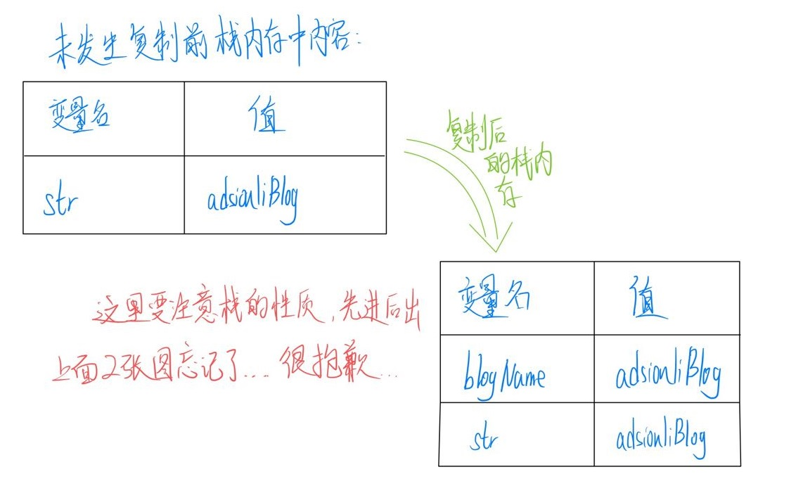
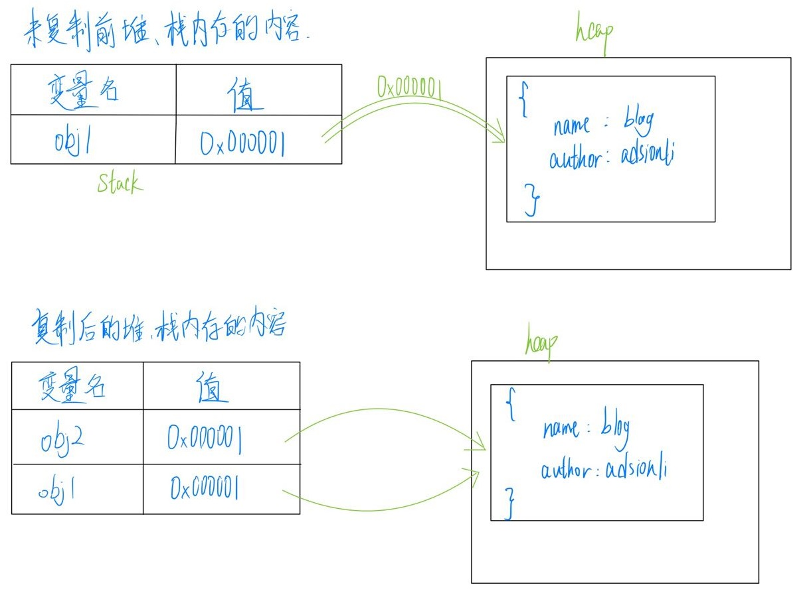
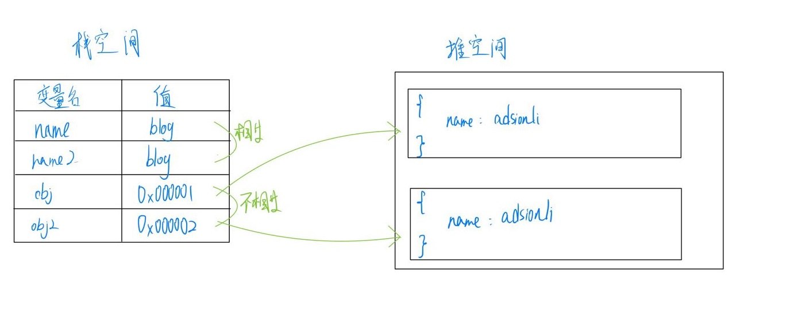

# 变量与类型

| 文档创建人 | 创建日期   | 文档内容                   | 更新时间   |
| ---------- | ---------- | -------------------------- | ---------- |
| adsionli   | 2021-12-16 | Js中的变量与类型的知识总结 | 2021-12-16 |

## 数据类型的种类

根据ECAMScript标准的规定，一共有7种数据类型，然后这7种数据类型又被分为2类，分别是：原始类型和对象类型

### 原始类型

1. `Null`: 只包含了一个值：**Null**
2. `Undefined`: 和上面的老哥一样，也是只有一个值：**Undefined**

3. `Boolean`: 这个老朋友了，布尔类型，两个值：**true**和**false**
4. `Symbol`: 这个数据类型是在ES6中正式提出的，它主要是指一个实例且是唯一、不可改变的，具体的使用方法，将会在另外一篇文章中写出
5. `Number`: 整数、浮点数，以及在JS中特有的一些特殊值：`-Infinity(无穷小)`,`Infinity(无穷大)`,`NaN(无定义Number)`。
6. `String`: 字符串，与其他语言中一样的。

> 在ES10中新增了一种数据类型为`BigInt`，如果有学习C++或者Java的同学应该比较熟悉，极大值类型，类似于C++中的`long long`。

### 对象类型

1. `Object`

   说到`Object`类型，为什么它可以自己作为一大类，因为他下面的东西实在是太多了，随便举几个：`Promise`、`Array`、`Function`，就这几个都是我们最常用的都是在`Object`类型下的特殊对象，所以单独归为一类完全是没所谓的。

## 数据类型区分的意义

### 不可变性

对于原始数据类型来说，在ECMAScript标准中，被定义为具有不可变性的性质，也就是原始数据类型本身是不可被外界所改变的。

比如这里比较典型的String类型的变量：

```js
let str = "adsionli";
str.subString(0, 2);
str.substr(0, 2);
str.toLowerCase(1);
str.trim(1);
str[0] = 1;
console.log(str);
```

通过上述各种的**String**类型下自带的静态方法，你会发现最后的`console`出来的`str`依然还是`adsionli`，他并没有改变原有的`str`变量的值，而是在调用方法的时候返回了一个新的**String**类型的值。

当然这里也会存在一些有趣的问题，比如说下面这段代码：

```js
let str = "adsionli";
str += " love shirley";
console.log(str)
```

这时候`console`打印出来的数据时`"adsionli love shirley"`，这里是不是有点奇怪，为什么`String`类型的变量发生了改变，这不是不符合不可变性的要求了吗？实际这里原本String在内存空间中的确没有改变，而是在执行**+**的时候重新开辟了一块地址空间进行存储，并将`str`变量指针指到了新的地址空间上了，这就到时`str`打印的时候开起来发生了改变，实际上这个`String`值在原来的地址空间中是没有改变的。

具体流程如下图所示：


### 引用类型(对象类型)

引用类型在内存中的存储方式是采用的堆内存的结构，因为堆内存结构具有一下几个特点，让引用类型在使用中更加的灵活：

1. 存储的值空间大小不定，可以动态增删
2. 通过代码进行空间分配
3. 空间大
4. 使用引用地址进行读取，无法直接操作内部存储。

当然选用堆内存也有一个比较大的缺点就是**运行效率低**，但是对比它的优点来说，这点真的不太妨碍使用堆内存来存储引用类型。

具体的使用如下图及代码示例所示：

```js
const people01 = {
    name: "adsionli",
    age: "25",
    profession: "Postgraduate"
}
const people02 = {
    name: "shirley",
    age: "25",
    profession: "adsionli wife"
}
const getName = function(people){
    return people.hasOwnProperty('name') ? people.name : 'this people do not have name';
}
```


当然，引用类型就不再具有`不可变性`了，我们可以轻易的改变它们

```js
people02.age = 16;
people01.age = 18;
console.log(people01);
console.log(people02);
```

比如说在数组中，数组类中有许多静态方法可以改变数组的结构

1. `pop()`: 弹出数组的最后一个元素，改变原数组，返回弹出元素
2. `shift()`: 把数组的第一个元素删除，若空数组，不进行任何操作，返回undefined,改变原数组，返回第一个元素的值
3. `unshift()`: 在数组头部添加一个或多个元素，改变原数组，返回新数组的长度
4. `reverse()`: 翻转数组，改变原数组，返回翻转后的数组
5. `sort()`: 对数组元素进行自定义回调的排序，改变原数组，返回排序后的数组
6. `splice()`: 从数组中添加/删除项目，改变原数组，返回被删除的元素

### 复制

1. 对于原始类型的数据进行复制的操作可以见代码和下图所示：

```js
let str = "adsionliBlog";
let blogName = str;
console.log(blogName)
```



通过上图我们可以很清楚的看到，当我们复制一个原始类型的数据时候，它就会创建一个新的内存空间并压入到栈内存中。所以这个内容是一个很简单的过程，不是很复杂，比较容易理解的。

2. 对于引用类型的数据进行复制的操作可以见代码和下图所示：

```js
let obj1 = {
    name: "blog",
    author: "adsionli"
}
let obj2 = obj1;
console.log(obj2);
```



通过上面的代码和图片，我们可以发现复制引用类型和复制原始类型的过程是不一样的，原始数据类型是复制原来的数据并开辟一个新的空间进行压入栈空间。而引用类型是复制一个相同的地址压入到栈内存中，然后复制的变量也是通过地址来在堆内存中找到对应的数据，这就完成了引用类型的复制。

通过对复制的解析，我们发现无论是原始类型还是引用类型都是对栈内存进行操作，**但是引用类型不同就是通过复制地址来指向同一个堆地址，而不是在复制一个堆数据来进行复制，这样就大大的节省了堆内存的开销。**但是这也造成了如下的问题

==当我们修改引用类型的变量内容的时候，另外的其他指向相同堆地址的内容也会发生改变，造成影响。==

> 这就引出了之后的深拷贝与浅拷贝问题啦，这里先预留一个空的链接，之后来补上[深拷贝与浅拷贝]()

### 比较

对于原始类型的之间比较和引用类型的比较也是存在一些不同的。

可以参考下面的代码与图片：

```js
var obj2 = {
    name:'adsionli'
};
var obj = {
    name:'adsionli'
};
console.log(obj === obj2); // false
var name2 = 'blog';
var name = 'blog';
console.log(name === name2); // true
```



对于原始类型，比较时会直接比较它们的值，如果值相等，即返回`true`。

对于引用类型，比较时会比较它们的引用地址，虽然两个变量在堆中存储的对象具有的属性值都是相等的，但是它们被存储在了不同的存储空间，因此比较值为`false`。

### 值传递与引用传递

借助下面的例子，我们先来看一看什么是值传递，什么是引用传递：

```js
let name = 'adsionli';
function changeValue(name){
    name = 'adsionliBlog';
}
changeValue(name);
console.log(name);
```

执行上面的代码，如果最终打印出来的`name`是`'adsionli'`，没有改变，说明函数参数传递的是变量的值，即值传递。如果最终打印的是`'adsionliBlog'`，函数内部的操作可以改变传入的变量，那么说明函数参数传递的是引用，即引用传递。

很明显，上面的执行结果是`'adsionli'`，即**函数参数仅仅是被传入变量复制给了的一个局部变量，改变这个局部变量不会对外部变量产生影响。**

```js
let obj = {
    name:'adsionli'
};
function changeValue(obj){
    obj.name = 'adsionliBlog';
}
changeValue(obj);
console.log(obj.name); // adsionliBlog
```

上面的代码可能让你产生疑惑，是不是参数是引用类型就是引用传递呢？

首先明确一点，`ECMAScript`中所有的函数的参数都是按值传递的。

同样的，当函数参数是引用类型时，我们同样将参数复制了一个副本到局部变量，只不过复制的这个副本是指向堆内存中的地址而已，我们在函数内部对对象的属性进行操作，实际上和外部变量指向堆内存中的值相同，但是这并不代表着引用传递，下面我们再按一个例子：

```js
let obj = {};
function changeValue(obj){
    obj.name = 'adsionli';
    obj = {
        name:'adsionliBlog'
    };
}
changeValue(obj);
console.log(obj.name); // adsionli
```

可见，函数参数传递的并不是变量的`引用`，而是变量拷贝的副本，当变量是原始类型时，这个副本就是值本身，当变量是引用类型时，这个副本是指向堆内存的地址。所以，再次记住：

> `ECMAScript`中所有的函数的参数都是按值传递的。


# 总结

看着简单的类型和变量，在实际理解其原理的时候才会发现在前辈们在开发JS语法的时候所做出的细节上的处理，所以对一个问题最好需要深究，这样在自己写代码的时候脑子就会很清楚地知道他的运行状态是什么，加油加油ヾ(◍°∇°◍)ﾉﾞ

