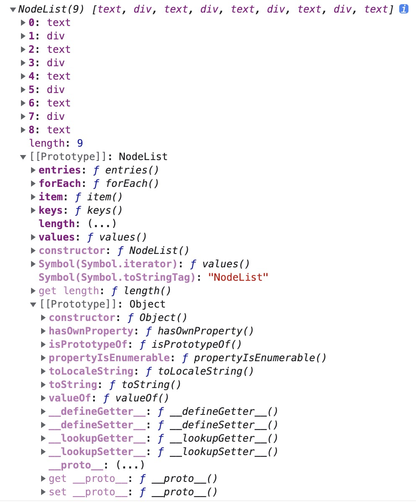
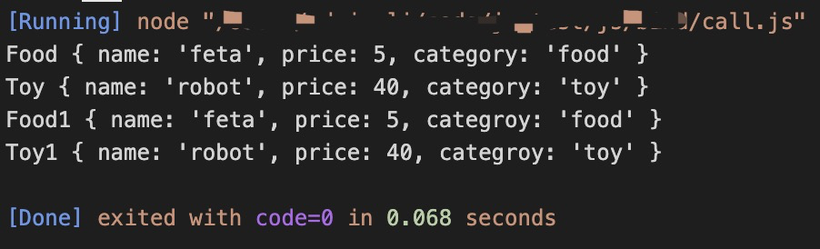
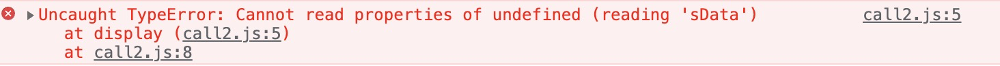

# apply,bind,call用法与区别

| 文档创建人 | 创建日期   | 文档内容                  | 更新时间   |
| ---------- | ---------- | ------------------------- | ---------- |
| adsionli   | 2021-11-15 | apply,bind,call用法与区别 | 2021-11-15 |

>  最近写代码经常会碰到使用`apply,bind,call`的场景，为了彻底可以区分开其三者的使用，写一篇博文记录一下。

`bind`与`apply`, `call`的区别在于，`bind`是返回对应函数，便于稍后调用，而`apply`与`call`是立即执行。

## apply

> **mdn**上关于`apply`的说明：[apply说明](https://developer.mozilla.org/zh-CN/docs/Web/JavaScript/Reference/Global_Objects/Function/apply)

### apply解释

**`apply()`**： 改变某个函数运行时的上下文（context）而存在的，换句话说，就是为了改变函数体内部 `this` 的指向

### apply参数

`apply`参数有两个，分别是：

1. 一个具有给定`this`值的函数

   >必选的。在 *`func`* 函数运行时使用的 `this` 值。请注意，`this`可能不是该方法看到的实际值：如果这个函数处于非严格模式下，则指定为 `null` 或 `undefined` 时会自动替换为指向全局对象，原始值会被包装。

2. 以一个数组（或[类数组对象](https://developer.mozilla.org/zh-CN/docs/Web/JavaScript/Guide/Indexed_collections#working_with_array-like_objects)）的形式提供的参数

   > 可选的。一个数组或者类数组对象，其中的数组元素将作为单独的参数传给 `func` 函数。如果该参数的值为 `null` 或 `undefined`，则表示不需要传入任何参数。
   >
   > ==注：从ECMAScript 5 开始可以使用类数组对象。==

### apply使用示例

1. 示例一：通过`apply`使用Math方法中的`max`和`min`方法

```js
const numbers = [5, 6, 2, 3, 7];
//通过apply绑定参数，首项包含this值的函数设为Null
const max = Math.max.apply(null, numbers);
//输出为7
console.log(max);
//通过apply绑定参数，首项包含this值的函数设为Null
const min = Math.min.apply(null, numbers);
//输出为2
console.log(min);
```

2. 示例二：最简单的柯里化通用示例的实现，也是通过apply绑定参数，这里传入的`this`设为null

```js
function curry(fn, ...args1){
    let args = args1;
    return function(...args2){
        args = args.concat(args2);
        return fn.apply(null, args);
    }
}
```

3. 示例三：将类数组对象转换成数组对象

```js
//是否是数组对象的验证
function isArray(obj){ 
    return Object.prototype.toString.call(obj) === '[object Array]' ;
}

var parent = document.getElementById('parent');
var child_nodes = parent.childNodes;

var domNodes = Array.prototype.slice.apply(child_nodes)
//输出为true
console.log(isArray(domNodes));
```

> 类数组对象的解释：
>
> `Javascript`中存在一种名为伪数组的对象结构。比较特别的是 `arguments` 对象，还有像调用 `getElementsByTagName` , `document.childNodes` 之类的，它们返回`NodeList`对象都属于伪数组。不能应用 Array下的 `push` , `pop` 等方法。
>
> ==类数组对象不是数组对象，它不包括数组对象原型链上的任何方法==
>
> ```js
> //输出false
> console.log(NodeList instanceof Array)
> ```
>
> 
>
> NodeList的格式输出及其原型链。可以发现他的上一层就是object，而不是array。
> 

### apply源码实现分析

```js
Function.prototype.apply = function (obj, arr) {
    // 当apply的第一个参数是null的时候，this的默认指向是window
    var obj = obj || window;
    // 把该函数挂载到对象上
    obj.fn = this;
    //判断有没有传值
    if (!arr) {
        result = obj.fn();
    } else {
        //判断传入的是不是数组，不是的话抛出异常
        if (!Array.isArray(arr) && (arr instanceof NodeList)) {
            throw new Error('上传的必须是数组或类数组对象');
        };
        var args = [];
        // 用于存储apply后面的参数
        for (var i = 0; i < arr.length; i++) {
            args.push('arr[' + i + ']');
        };
        // 这里的args默认是会调用Array.toString()方法的
        var result = eval('obj.fn(' + args + ')');
    }
    // 删除函数
    delete obj.fn;
    // 因为函数可能有放回值，所以把结果也返回出去给他们
    return result;
}

```

通过源码我们可以看到，这个带有`this`的函数要么是传入的内容，要么当传入为`null`或`undefined`时，就会挂载在`window`这个顶层对象上。apply函数可接受的数组参数(也可以是类数组对象)。如果为空，直接返回挂载完成的内容。如果不为空，就需要将数组或类数组对象中的参数取出，然后传入绑定this函数之后的函数对象中，作为参数传入。

> 最后补充一道面试题在这里:
>
> 定义一个 `log` 方法，让它可以代理 `console.log` 方法。
>
> ```js
> //实现如下
> function log(...res){
>     //这里的obj传入也可以是null, 因为原本就是挂载console下的this的。
>     console.log.apply(console, res);
> }
> ```

## call

> mdn上关于`call`的说明：[call说明](https://developer.mozilla.org/zh-CN/docs/Web/JavaScript/Reference/Global_Objects/Function/call)

### call解释

`call`的作用和`apply`的是一模一样的，都是改变函数的上下文this的指向的。

### call参数

`call`参数有两个，分别是：

1. 一个具有给定`this`值的函数

   >可选的。在 *`function`* 函数运行时使用的 `this` 值。请注意，`this`可能不是该方法看到的实际值：如果这个函数处于[非严格模式](https://developer.mozilla.org/zh-CN/docs/Web/JavaScript/Reference/Strict_mode)下，则指定为 `null` 或 `undefined` 时会自动替换为指向全局对象，原始值会被包装。

2. arg1, arg2, ....

   >指定的参数列表。

### call使用示例

> 示例直接引用mdn上的，mdn上给出的十分的好

1. 示例一：使用`call`实现函数继承

   ```js
   function Product(name, price) {
       this.name = name;
       this.price = price;
   }
   
   function Food(name, price) {
       Product.call(this, name, price);
       this.category = 'food';
   }
   
   function Toy(name, price) {
       Product.call(this, name, price);
       this.category = 'toy';
   }
   
   var cheese = new Food('feta', 5);
   var fun = new Toy('robot', 40);
   ```

   > 代码分析：
   >
   > 我们看到在`Food`与`Toy`这两个`Function`中，都回去使用`Product`去绑定一下当前`Function`的`this`作用域，同时将`name`与`price`传递给`Product`。这将相当于如下代码:
   >
   > ```js
   > class Production {
   >     constructor(name, price){
   >         this.name = name;
   >         this.price = price;
   >     }
   > }
   > class Food extends Production{
   >     constructor(name, price){
   >         super(name, price);
   >         this.categroy = "food"
   >     }
   > }
   > class Toy extends Production {
   >     constructor(name, price){
   >         super(name, price);
   >         this.categroy = "toy";
   >     }
   > }
   > ```
   >
   > 这个效果是一样的，实际`Food`与`Toy`两个`Function`对象拥有了`Production`的`name`与`price`。下面是输出：
   >
   > 

2. 示例二：使用`call`方法调用函数并指定上下文的`this`

   ```js
   function greet() {
       var reply = [this.animal, 'typically sleep between', this.sleepDuration].join(' ');
       console.log(reply);
   }
   
   var obj = {
       animal: 'cats', sleepDuration: '12 and 16 hours'
   };
   
   greet.call(obj);
   ```

   > 代码分析：
   >
   >  我们可以发现greet这个Function对象中是没有animal与sleepDuration这两个参数的。但是通过call方法来改变其上下文，这样可以很好地对代码进行解耦。

3. 示例三：在使用严格模式下于非严格模式下的区别

   ```js
   //启用严格模式
   'use strict'
   var sData = 'Wisen';
   
   function display() {
       console.log('sData value is %s ', this.sData);
   }
   
   display.call();
   //非严格模式
   var sData = 'Wisen';
   
   function display() {
       console.log('sData value is %s ', this.sData);
   }
   
   display.call();
   ```

   >代码分析：
   >
   >首先来看一下运行结果图
   >
   >严格模式下:
   >
   >
   >
   >非严格模式下：
   >
   >
   >
   >我们可以很明显的区分出来，严格模式下，如果call中不传入包含this的函数的话，会默认使用undefined来进行替代，但是在非严格模式下，会将当前运行的作用域中的this传入，这样就可以找到sData的数据了。

### call源码实现分析

```js
Function.prototype.call = function (obj) {
    // 当call的第一个参数没有或者是null的时候，this的指向是window
    var obj= obj || window;
    // 把a方法放进里面
    obj.fn = this;
    // 用于存储call后面的参数
    var args = [];
    var len = arguments.length;
    // 这里是为了将一个函数的参数传入到另外一个函数执行
    for (var i = 1; i < len; i++) {
        args.push('arguments[' + i + ']');
    };
    // 在eval的环境下 args数组会变成一个一个参数字符串（默认是会调用Array.toString()）
    var result = eval('obj.fn(' + args + ')');
    // 删除b里面的a方法
    delete obj.fn;
    // 因为函数可能有返回值，所以把结果也返回出去给他们
    return result;
};
```

不难发现，其实call与apply实现的区别仅仅是在传入参数的类型方面有所不同，其他的处理方式都是一样的。

## bind

> mdn上关于`bind`的说明：[bind说明](https://developer.mozilla.org/zh-CN/docs/Web/JavaScript/Reference/Global_Objects/Function/bind)

### bind解释

`bind()` 方法**创建一个新的函数**，在 `bind()` 被调用时，这个新函数的 `this` 被指定为 `bind()` 的第一个参数，而其余参数将作为新函数的参数，供调用时使用。

> 注意：这里其实已经说明了`bind`与`apply,call`的不同了，`bind`是返回一个新的函数而不是立即执行。

### bind参数

`bind`方法参数有两个，分别是：

1. 一个具有给定`this`值的函数

   > 调用绑定函数时作为 `this` 参数传递给目标函数的值。 如果使用[new](https://developer.mozilla.org/zh-CN/docs/Web/JavaScript/Reference/Operators/new)运算符构造绑定函数，则忽略该值。当使用 `bind` 在 `setTimeout` 中创建一个函数（作为回调提供）时，作为 `thisArg` 传递的任何原始值都将转换为 `object`。
   >
   > ==如果 `bind` 函数的参数列表为空，或者`thisArg`是`null`或`undefined`，执行作用域的 `this` 将被视为新函数的 `thisArg`。==

2. arg1, arg2, ....

### bind使用示例

1. 示例一：将方法从对象中拿出来，然后调用，并且希望`this`指向原来的对象

   ```js
   this.num = 9; 
   var mymodule = {
       num: 81,
       getNum: function() { 
           console.log(this.num);
       }
   };
   
   mymodule.getNum(); // 81
   
   var getNum = mymodule.getNum;
   getNum(); // 9, 因为在这个例子中，"this"指向全局对象
   
   var boundGetNum = getNum.bind(mymodule);
   boundGetNum(); // 81
   ```

   > 代码分析：
   >
   > 在第一次将方法从`mymodule`中抽出后，赋予`getNum`之后进行执行，我们发现**输出的是9**，因为这个时候`getNum`的指向不在是`mymodule`对象的作用域了，而是当前所在作用域的上下文中了，所以输出**就是9而不是81**，当然还好这里定义了`num`，否则这里就要报错了。那么如果还是需要使用`mymodule`作用域中的`num`，那么就需要将抽出的`getNum`重新绑定到`mymodule`上才可以。

2. 示例二：单体模式中，使用`bind`方法来代替`_this,that,self`等保存`this`。

   ```js
   //原代码
   var foo = {
       bar : 1,
       eventBind: function(){
           var _this = this;
           $('.someClass').on('click',function(event) {
               console.log(_this.bar);
           });
       }
   }
   //使用bind进行代替
   var foo = {
       bar : 1,
       eventBind: function(){
           $('.someClass').on('click',function(event) {
               console.log(this.bar);
           }.bind(this));
       }
   }
   ```

   > 代码分析：
   >
   > 我们可以看到，在两种不同的表达中，确保`this`指向的做法不相同，上一种中，是将`this`指向赋予给一个函数内部作用域的一个变量，这样就可以在内部的回调函数中使用。而第二种是通过`bind`方法来将`this`进行绑定。这时候`bind`就创建一个新的回调函数，且这个函数是挂载在最外层`foo`对象下的，在传入到`click`事件中去被执行。这样的做法就是可以很好地控制不同的作用域下的`this`指向，不会混乱。

3. 示例三：偏函数

   ```js
   function list() {
     return Array.prototype.slice.call(arguments);
   }
   
   function addArguments(arg1, arg2) {
       return arg1 + arg2
   }
   
   var list1 = list(1, 2, 3); // [1, 2, 3]
   var result1 = addArguments(1, 2); // 3
   
   // 创建一个函数，它拥有预设参数列表。
   var leadingThirtysevenList = list.bind(null, 37);
   // 创建一个函数，它拥有预设的第一个参数，相当于默认增加了第一位arg1的值
   var addThirtySeven = addArguments.bind(null, 37);
   // [37]
   var list2 = leadingThirtysevenList();
   // [37, 1, 2, 3]
   var list3 = leadingThirtysevenList(1, 2, 3);
   // 37 + 5 = 42
   var result2 = addThirtySeven(5);
   //这个还是42，因为有效参数传入此时只包括了arg2,所以只会传入的值5生效。
   //实际相当于addArguments(arg){
   //  return 37 + arg
   //}
   var result3 = addThirtySeven(5, 10);
   ```

   > 偏函数的解释:
   >
   > 在计算机科学中，局部应用是指**固定一个函数的一些参数，然后产生另一个更小元的函数**。（什么是元？元是指函数参数的个数，比如一个带有两个参数的函数被称为二元函数。）
   >
   > 代码分析：
   >
   > 当绑定函数被调用时，这些参数会被插入到目标函数的参数列表的开始位置，传递给绑定函数的参数会跟在它们后面。

4. 示例四：作为构造函数中使用的绑定函数，实际就是为构造函数需要传入的参数值进行预设。

   ```js
   function Point(x, y) {
       this.x = x;
       this.y = y;
   }
   
   Point.prototype.toString = function() {
       return this.x + ',' + this.y;
   };
   var p = new Point(1, 2);
   // '1,2'，这里不对构造方法中的参数给定值，而是直接传入
   p.toString(); 
   //这里实际上就是对构造方法的第一项x直接给定了值
   var YAxisPoint = Point.bind(null, 0);
   //因为在上面使用了bind，所以构造函数的第一项x已经存在意义了，所以只需要传入y的值就可以了
   /**
   * new YAxisPoint(5) = new Point(0, 5)
   */
   var axisPoint = new YAxisPoint(5);
   // '0,5'
   axisPoint.toString(); 
   // true
   axisPoint instanceof Point; 
   // true
   axisPoint instanceof YAxisPoint; 
   // true
   new YAxisPoint(17, 42) instanceof Point;
   ```

   > 此处代码分析直接看示例中的注释即可。

### bind源码实现分析

```js
Function.prototype.bind = function(context){
    self = this;
    var args = Array.prototype.slice.call(arguments, 1);
    return function(){
        var innerArgs = Array.prototype.slice.call(arguments, 1);
        args = args.concat(innerArgs);
        return self.apply(context, args)
    }
}
```

`bind`的代码实现就是利用了[柯里化](./#/page/js/currying)的技术和`apply,call`方法的结合。因为bind与apply,call最大的不同就是他并不会立刻执行，且返回的一个新创建的函数。不过这里的代码还不是最终的代码，这里代码虽然已经可以绑定this以及传入参数，但是这里却不能作为函数的构造函数绑定的调用，所以还需要进行调整，这就有涉及到原型链的调用了。

```js
Function.prototype.bind = function (context) {
    var args = Array.prototype.slice.call(arguments, 1);
    var F = function () { };
    var self = this;
    var bound = function () {
        var innerArgs = Array.prototype.slice.call(arguments);
        args = args.concat(innerArgs);
        return self.apply((this instanceof F ? this : context), args);
    };
    F.prototype = self.prototype;
    bound.prototype = new F();
    return bound;
};
```

通过这段代码，我们会发现通过设置一个中转构造函数F，使绑定后的函数与调用`bind()`的函数处于同一原型链上，用new操作符调用绑定后的函数，返回的对象也能正常使用`instanceof`，因此这是最严谨的`bind()`实现。

## es7中新增双冒号绑定的使用

### 使用示例

1. 基本使用

   ```js
   foo::bar;
   //相当于
   bar.bind(foo);;
   
   foo::bar(...arguments);
   //相当于
   bar.bind(foo, ...arguments);
   bar.apply(foo, arguments);
   bar.call(foo, ...arguments);
   
   //如果双冒号左边为空，右边为一个对象的方法，则等于将该方法绑定在该对象上
   var method = obj::obj.foo;
   //相当于
   var method = ::obj.foo;
   //相当于
   var method = obj.foo.bind(obj);
   
   var log = ::console.log;
   //相当于
   var log = console.log.bind(console);
   ```

2. 链式使用法

   ```js
   import { map, takeWhile, forEach } from "iterlib";
   
   getPlayers()::map(x => x.character())::takeWhile(x => x.strength > 100)::forEach(x =>  console.log(x));
   //相当于
   map(x => x.character()).bind(getPlayers);
   takeWhile(x => x.strength > 100).bind(getPlayers);
   forEach(x => console.log(x)).bind(getPlayers);
   ```

# 总结

`apply` 、 `call` 、`bind` 三者都是用来改变函数的this对象的指向的；
`apply` 、 `call` 、`bind` 三者第一个参数都是this要指向的对象，也就是想指定的上下文；
`apply` 、 `call` 、`bind` 三者都可以利用后续参数传参；
`bind` 是返回对应函数，便于稍后调用；`apply` 、`call` 则是立即调用 。
