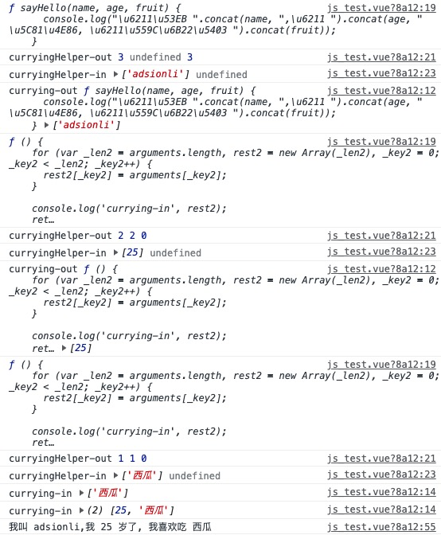
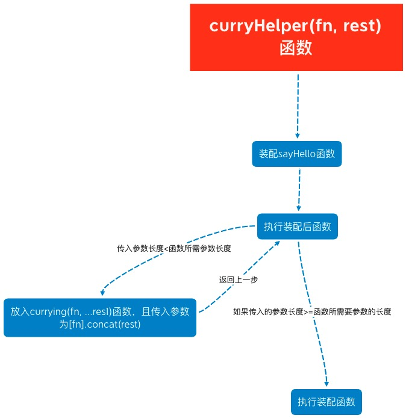

# Currying(柯里化)

| 文档创建人 | 创建日期   | 文档内容         | 更新时间   |
| ---------- | ---------- | ---------------- | ---------- |
| adsionli   | 2021-11-04 | 柯里化的知识学习 | 2021-11-04 |

> 本篇文章主要参考来源: 
>
> 1. [JS中的柯里化](https://www.zhangxinxu.com/wordpress/2013/02/js-currying/)
> 2. [js中的柯里化](https://segmentfault.com/a/1190000012769779) ==不是同一个== 
> 3. [详解JS函数柯里化](https://www.jianshu.com/p/2975c25e4d71)     ==这片最后那道题目原作者说的有问题==

## 什么是柯里化

柯里化（Currying），又称部分求值（Partial Evaluation），是把接受多个参数的函数变换成接受一个单一参数（最初函数的第一个参数）的函数，并且返回接受余下的参数而且返回结果的新函数的技术。

> 好吧，每一个字都认识，合在一起就变得奇怪了，那这里还是用自己的意思梳理一下：
>
> 一个函数，拥有很多个参数，这个时候使用一种方法，把这个函数给拆分掉，变成一个只接受单一参数的函数，而且这个处理之后的函数，会返回一个剩下所有参数且拥有返回结果的新函数。
>
> 这样理解好像会稍微简单一些，其实看代码是最直观的，这里给出一个简单的柯里化函数的对比就知道了。
>
> ```js
> //没有柯里化的函数
> function add (x, y){
>     return x + y
> }
> add(1, 2);
> ```
>
> ```js
> //柯里化后的函数表现
> function curryAdd(x){
>     return function(y){
>         return x + y;
>     }
> }
> let add = curryAdd(1);
> add(2);
> ```
>
> 你会发现，最后这两段代码的输出是一致的，但是他们的实现是完全不同，可能在这里你无法感受到柯里化带来的一捏捏变化，但是你在阅读了后面的文章后，再来看这两段代码的时候，你会发现，他们不同究竟是什么。柯里化究竟在这个过程中扮演了一个什么样的角色。

## 柯里化的作用

说了上面一堆话之后，那么柯里化之后的代码究竟有什么作用呢，它拥有3个比较常见的作用：

1. 参数复用
2. 提前返回
3. 延迟计算(虽然，但是......这个延迟计算的表达可能存在问题，个人感觉最多就是传递任意多的参数都先不会执行返回，直到最后一次空参传递过来的时候执行，最多也就算控制输出吧......)

## 柯里化的使用示例

### 柯里化的通用实现

```js
function curry(fn, ...res1){
    return function(...res2){
        return fn.apply(this, res1.concat(res2))
    }
}
```

### 柯里化的高阶使用

```js
function currying(fn, ...rest1) {
    return function (...rest2) {
        return fn.apply(null, rest1.concat(rest2))
    }
}
function curryingHelper(fn, len) {
    const length = len || fn.length // 第一遍运行length是函数fn一共需要的参数个数，以后是剩余所需要的参数个数
    return function (...rest) {
        return rest.length >= length // 检查是否传入了fn所需足够的参数
            ? fn.apply(this, rest)
        	: curryingHelper(currying.apply(this, [fn].concat(rest)), length - rest.length) // 在通用currying函数基础上
    }
}
function sayHello(name, age, fruit) {
    console.log(`我叫 ${name},我 ${age} 岁了, 我喜欢吃 ${fruit}`)
}

let msg = curryingHelper(sayHello);
msg('adsionli')(25)('西瓜');
```

> 根据输出流程，解释一下上段代码：
>
> 
>
> 这里会比通用的柯里化函数多了一个`curryHelper`函数，这个函数的主要作用就是进行递归，将传递进来的数据进行拼接，然后传给`curry`函数进行处理。
>
> 我们可以通过这个输出看出来整个工作流程是怎么回事的：
>
> 1. 首先先将我们需要装配的`sayHello`函数装配在`curryHelper`上，这里就不是放在`curry`了。那是因为这里我们这里使用了很多阶的`currying`的嵌套。
> 2. 在第一个函数参数传递之后，我们需要将传入的待处理函数与参数进行合并，然后`apply`到`currying`函数上。
> 3. 这个时候`currying`函数的第一层就变成了这样 `sayHello, 'adsionli'`了，那这时等待继续传入的参数还剩下2个。
> 4. 继续传入参数，然后判断当前参数数量与length比较，如果小于的话，继续将上一次的currying函数绑定上新的内容，这个内容就变成了 `currying, ['adsionli', 25]`。
> 5. 继续套娃，输入最后一个参数，此时rest.length == length，那么再把最后一个参数合并进去，然后开始执行嵌套着的currying函数，一层层的concat参数，最后执行到最外层的sayHello，在传入准备好的参数，结束整个流程。
> 6. 看起来上述分析好像有点复杂，实际上还是比较清晰的，只是简单的使用了一个递归的过程，那么接下来在给一张流程图，就很明确了。
>
> 

## 柯里化的使用场景

### 1. 参数复用

```js
// 函数封装后
function check(reg, txt) {
    return reg.test(txt)
}

check(/\d+/g, 'test')       //false
check(/[a-z]+/g, 'test')    //true

// Currying后
function curryingCheck(reg) {
    return function(txt) {
        return reg.test(txt)
    }
}

var hasNumber = curryingCheck(/\d+/g)
var hasLetter = curryingCheck(/[a-z]+/g)

hasNumber('test1')      // true
hasNumber('testtest')   // false
hasLetter('21212')      // false
```

上面这段的代码示例非常得好，可以很好地凸显出柯里化之后，代码复用的便利性，我们可以对正则验证前先添加一层柯里化，然后直接传入待验证数据皆可以很好地分开每一种正则判断的函数分类，对管理函数来说是非常便利的。

### 2. 提前 返回/确认

```js
var on = function(element, event, handler) {
    if (document.addEventListener) {
        if (element && event && handler) {
            element.addEventListener(event, handler, false);
        }
    } else {
        if (element && event && handler) {
            element.attachEvent('on' + event, handler);
        }
    }
}

var on = (function() {
    if (document.addEventListener) {
        return function(element, event, handler) {
            if (element && event && handler) {
                element.addEventListener(event, handler, false);
            }
        };
    } else {
        return function(element, event, handler) {
            if (element && event && handler) {
                element.attachEvent('on' + event, handler);
            }
        };
    }
})();//这里进行闭包，可以直接进行return不需要在代码中在使用on()(element, event, handler)这种写法，可以直接on(element, event, handler)就可以

//换一种写法可能比较好理解一点，上面就是把isSupport这个参数给先确定下来了
var on = function(isSupport, element, event, handler) {
    isSupport = isSupport || document.addEventListener;
    if (isSupport) {
        return element.addEventListener(event, handler, false);
    } else {
        return element.attachEvent('on' + event, handler);
    }
}
```

上面这段柯里化的写法实际也是在elementui组件库中也是这样应用的，这样就可以不用在每次自执行判断函数，直接就可以提前确定了会走哪一个方法，避免每次都进行判断。

### 3. 延迟执行

```js
const curry = function(fn) {
  const _args = []
  return function cb(...rest) {
    if (rest.length === 0) {
      return fn.apply(this, _args)
    }
    _args.push(...rest)
    return cb
  }
}

const curryAdd = curry((...T) => 
  T.reduce((sum, single) => sum += single)
)
curryAdd(1)
curryAdd(2)
curryAdd(3)
curryAdd(4)
curryAdd()   
```

这里的延迟调用就是不断的积累参数值，最后在执行，这个例子中就是一个累加的操作，其实我们再求平均值的时候也可以这样做，或者是在做异步统计的时候也可以进行这种操作，会非常的便利，不用每一次都去统计一个新的值，而是放到最后一起处理，确保准确性。

## 柯里化的内容补充

其实如果已经学习过js中的bind函数的实现，你会发现他其实也是用柯里化进行返回的。

```js
function bind(...res){
    let self = this;
    context = [].shift.call(res);
    args = [].slice.call(res);
    return function (...res1){
        self.apply(context, [].concat.call(args, [].slice.call(res1)))
    }
}
```

现在再来看这段代码，是不是妥妥的柯里化实现。

所以说柯里化在实际开发中的使用还是非常广泛的，是一个前端开发者必须要掌握的一项技能。

最后再补充一些知识：

1. 存取arguments对象通常要比存取命名参数要慢一点

2. 一些老版本的浏览器在arguments.length的实现上是相当慢的

3. 使用fn.apply( … ) 和 fn.call( … )通常比直接调用fn( … ) 稍微慢点

4. 创建大量嵌套作用域和闭包函数会带来花销，无论是在内存还是速度上

==但是！几乎可以会略不及.../doge==

