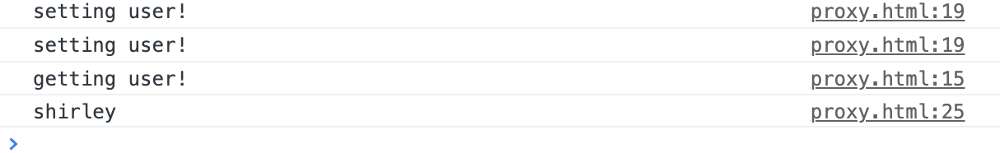
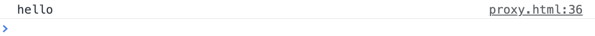
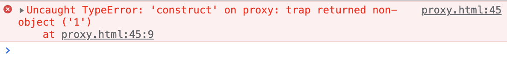
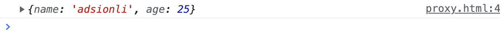
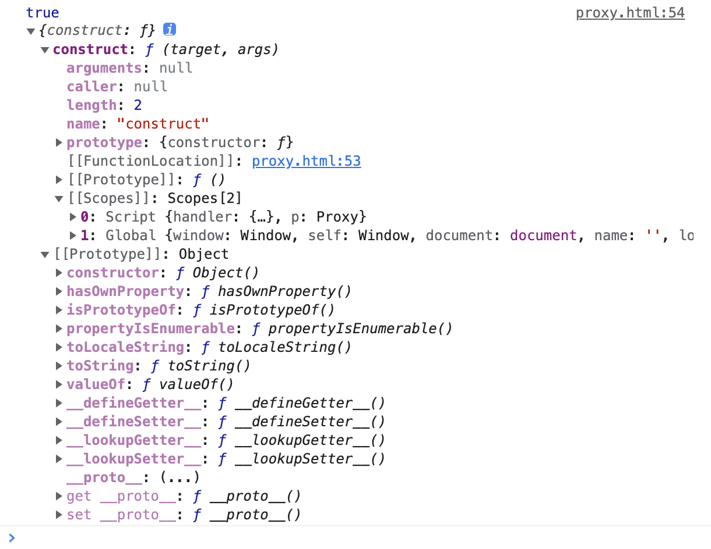

# Proxy

| 文档创建人 | 创建日期   | 文档内容             | 更新时间   |
| ---------- | ---------- | -------------------- | ---------- |
| adsionli   | 2022-01-20 | es6中的Proxy内容学习 | 2022-01-20 |

## 1. Proxy的基本概述

Proxy是在es6中才推出的一个新的对象。**Proxy** 对象用于创建一个对象的代理，从而实现基本操作的代理和自定义（如属性查找、赋值、枚举、函数调用等）。

> Proxy 用于修改某些操作的默认行为，等同于在语言层面做出修改，所以属于一种“元编程”（meta programming），即对编程语言进行编程。

```js
var obj = new Proxy({}, {
    get: function (target, propKey, receiver) {
        console.log(`getting ${propKey}!`);
        return Reflect.get(target, propKey, receiver);
    },
    set: function (target, propKey, value, receiver) {
        console.log(`setting ${propKey}!`);
        return Reflect.set(target, propKey, value, receiver);
    }
});
obj['user'] = 'adsionli';
obj['user'] = 'shirley';
console.log(obj.user);
```

上面这段代码就是一个简单的Proxy的使用。这里定义的Proxy对象，会将原对象的get方法与set方法进行代理，然后根据自定义内容来对get和set方法进行操作。

> get方法就是通过`obj.xxx`或`obj[xxx]`来进行获取
>
> set方法就是对obj对象内的变量进行设置的时候出发，类似于`obj.xxx = xxxx;`这种样子。

上段代码的运行结果：




**Proxy的两个参数分别是：**

1. **target:** 要使用 `Proxy` 包装的目标对象（可以是任何类型的对象，包括原生数组，函数，甚至另一个代理）。
2. **handler:**一个通常以函数作为属性的对象，各属性中的函数分别定义了在执行各种操作时代理 `p` 的行为。

> 其中handler函数中可以代理操作一共有13种。

如果Proxy的第一个handler参数不传入任何代理操作的话，没有任何代理效果，访问`proxy`就等同于访问`target`。

同时Proxy对象也可以作为其他对象的原型对象，比如下面这段代码:

```js
let proxy = new Proxy({}, {
    get(target, propKey){
        return "hello"
    }
})
let obj = Object.create(proxy);
console.log(obj.time);
```

看一下输出:



我们可以发现，当obj对象想要获取到time属性的时候，触发了Proxy的代理，因为obj没有time属性，所以会从原型链上向上寻找，找到了Proxy对象之后，就会触发Proxy的get代理了。

## 2. Proxy的代理操作

Proxy的handler参数中一共可以设置13种代理操作:

1. **get(target, propKey, receiver)**：代理对象属性的读取，比如`proxy.foo`和`proxy['foo']`。

2. **set(target, propKey, value, receiver)**：代理对象属性的设置，比如`proxy.foo = v`或`proxy['foo'] = v`，返回一个布尔值。

3. **has(target, propKey)**：代理`propKey in proxy`的操作，返回一个布尔值。

4. **deleteProperty(target, propKey)**：代理`delete proxy[propKey]`的操作，返回一个布尔值。

5. **ownKeys(target)**：代理`Object.getOwnPropertyNames(proxy)`、`Object.getOwnPropertySymbols(proxy)`、`Object.keys(proxy)`、`for...in`循环，返回一个数组。该方法返回目标对象所有自身的属性的属性名，而`Object.keys()`的返回结果仅包括目标对象自身的可遍历属性。

6. **getOwnPropertyDescriptor(target, propKey)**：代理`Object.getOwnPropertyDescriptor(proxy, propKey)`，返回属性的描述对象。

7. **defineProperty(target, propKey, propDesc)**：代理`Object.defineProperty(proxy, propKey, propDesc）`、`Object.defineProperties(proxy, propDescs)`，返回一个布尔值。

8. **preventExtensions(target)**：代理`Object.preventExtensions(proxy)`，返回一个布尔值。

9. **getPrototypeOf(target)**：代理`Object.getPrototypeOf(proxy)`，返回一个对象。

10. **isExtensible(target)**：代理`Object.isExtensible(proxy)`，返回一个布尔值。

11. **setPrototypeOf(target, proto)**：代理`Object.setPrototypeOf(proxy, proto)`，返回一个布尔值。如果目标对象是函数，那么还有两种额外操作可以代理。

12. **apply(target, object, args)**：代理 Proxy 实例作为函数调用的操作，比如`proxy(...args)`、`proxy.call(object, ...args)`、`proxy.apply(...)`。

13. **construct(target, args)**：代理 Proxy 实例作为构造函数调用的操作，比如`new proxy(...args)`。

## 3. Proxy代理的一些例子

这里的例子就不举太简单的了，举一些比较特殊的例子

### 3.1 get(target, propKey, receiver)

第一个例子，利用Proxy代理get来实现链式操作:

```js
var pipe = function (value) {
  var funcStack = [];
  var oproxy = new Proxy({} , {
    get : function (pipeObject, fnName) {
      if (fnName === 'get') {
        return funcStack.reduce(function (val, fn) {
          return fn(val);
        },value);
      }
      funcStack.push(window[fnName]);
      return oproxy;
    }
  });

  return oproxy;
}

var double = n => n * 2;
var pow    = n => n * n;
var reverseInt = n => n.toString().split("").reverse().join("") | 0;

pipe(3).double.pow.reverseInt.get; // 63
```

这一个例子就是利用Proxy代理了get方法，然后完成了一个函数方法的链式调用，我们可以传入几个箭头函数，然后处理好放入数组中，然后使用数组的reduce方法，进行累加，每一次都进行方法的处理就可以啦,直到执行到get方法时，进行处理返回就完事啦。

第二个例子：

```js
const dom = new Proxy({}, {
  get(target, property) {
    return function(attrs = {}, ...children) {
      const el = document.createElement(property);
      for (let prop of Object.keys(attrs)) {
        el.setAttribute(prop, attrs[prop]);
      }
      for (let child of children) {
        if (typeof child === 'string') {
          child = document.createTextNode(child);
        }
        el.appendChild(child);
      }
      return el;
    }
  }
});

const el = dom.div({},
  'Hello, my name is ',
  dom.a({href: '//example.com'}, 'Mark'),
  '. I like:',
  dom.ul({},
    dom.li({}, 'The web'),
    dom.li({}, 'Food'),
    dom.li({}, '…actually that\'s it')
  )
);

document.body.appendChild(el);
```

上面的例子则是利用`get`拦截，实现一个生成各种 DOM 节点的通用函数`dom`。

是不是发现如果Proxy的get用的比较好的话，就可以减少很多重复的工作量，完成很多特定的操作，实现不同类的单一职责原则啦。

**这里再说明一下`receiver`这个参数**

receiver在一般情况下返回的是这个Proxy对象的。

在Proxy对象中的get代理时，如果一个对象的某个属性设置了不可写且不可设置的属性的时候，再通过get代理时，就会发生错误，就比如下面这段代码:

```js
const target = Object.defineProperties({}, {
  foo: {
    value: 123,
    writable: false,
    configurable: false
  },
});

const handler = {
  get(target, propKey) {
    return 'abc';
  }
};

const proxy = new Proxy(target, handler);
//这里的foo属性就是设置了不可写且不可设置的属性，所以就无法进行代理了
proxy.foo
```

> 关于属性相关的设置，可以看这里:[object属性](https://developer.mozilla.org/zh-CN/docs/Web/JavaScript/Reference/Global_Objects/Object/defineProperty)

### 3.2 set(target, propKey, value, receiver)

关于set的例子：

```js
const handler = {
  get (target, key) {
    invariant(key, 'get');
    return target[key];
  },
  set (target, key, value) {
    invariant(key, 'set');
    target[key] = value;
    return true;
  }
};
function invariant (key, action) {
  if (key[0] === '_') {
    throw new Error(`Invalid attempt to ${action} private "${key}" property`);
  }
}
const target = {};
const proxy = new Proxy(target, handler);
proxy._prop
// Error: Invalid attempt to get private "_prop" property
proxy._prop = 'c'
// Error: Invalid attempt to set private "_prop" property
```

上面这个例子可以实现非常好的内容就是我们可以将开头是下划线的内容进行私有化，不可被外部访问与修改。结合`get`和`set`方法，就可以做到防止这些内部属性被外部读写。

划重点，这个例子可以用到实际开发中使用。

### 3.3 constructor(target, args, newTarget)

`construct()`方法用于代理`new`命令。

`construct()`方法可以接受三个参数。

1. `target`：目标对象。

2. `args`：构造函数的参数数组。

3. `newTarget`：创造实例对象时，`new`命令作用的构造函数（下面例子的`p`）。

==`construct()`方法返回的必须是一个对象，否则会报错。==(看一下下面的例子及输出)

```js
const p = new Proxy(function() {}, {
  construct: function(target, argumentsList) {
    return 1;
  }
});

new p()
```



那么返回的是一个对象时

```js
const p = new Proxy(function () { }, {
    construct: function (target, argumentsList) {
        return {
            name: "adsionli",
            age: 25
        };
    }
});

let a = new p()
console.log(a)
```



还有值得注意地方就是在Proxy中的construct代理中的this对象指的并不是传入的target而是Proxy本身

```js
const handler = {
  construct: function(target, args) {
    console.log(this === handler, this);
    return new target(...args);
  }
}

let p = new Proxy(function () {}, handler);
new p() // true
```




这里我就举这三个代理方法的内容，因为过于太多了，所以大家可以直接前往阮一峰老师的es6入门指南这本书里面去看，都非常的好，这里给一个在线的:[es6入门指南](https://es6.ruanyifeng.com/#docs/proxy)

当然啦，这里还需要大家数量掌握关于js中的Object对象中本身所具有的函数的内容，这样才能更加方便的来学习Proxy。

## Proxy中this问题

虽然 Proxy 可以代理针对目标对象的访问，但它不是目标对象的透明代理，即不做任何拦截的情况下，也无法保证与目标对象的行为一致。主要原因就是在 Proxy 代理的情况下，目标对象内部的`this`关键字会指向 Proxy 代理。

```javascript
const target = {
  m: function () {
    console.log(this === proxy);
  }
};
const handler = {};

const proxy = new Proxy(target, handler);

target.m() // false
proxy.m()  // true
```

上面代码中，一旦`proxy`代理`target`，`target.m()`内部的`this`就是指向`proxy`，而不是`target`。所以，虽然`proxy`没有做任何拦截，`target.m()`和`proxy.m()`返回不一样的结果。

下面是一个例子，由于`this`指向的变化，导致 Proxy 无法代理目标对象。

```javascript
const _name = new WeakMap();

class Person {
  constructor(name) {
    _name.set(this, name);
  }
  get name() {
    return _name.get(this);
  }
}

const jane = new Person('Jane');
jane.name // 'Jane'

const proxy = new Proxy(jane, {});
proxy.name // undefined
```

上面代码中，目标对象`jane`的`name`属性，实际保存在外部`WeakMap`对象`_name`上面，通过`this`键区分。由于通过`proxy.name`访问时，`this`指向`proxy`，导致无法取到值，所以返回`undefined`。

此外，有些原生对象的内部属性，只有通过正确的`this`才能拿到，所以 Proxy 也无法代理这些原生对象的属性。

```javascript
const target = new Date();
const handler = {};
const proxy = new Proxy(target, handler);

proxy.getDate();
// TypeError: this is not a Date object.
```

上面代码中，`getDate()`方法只能在`Date`对象实例上面拿到，如果`this`不是`Date`对象实例就会报错。这时，`this`绑定原始对象，就可以解决这个问题。

```javascript
const target = new Date('2015-01-01');
const handler = {
  get(target, prop) {
    if (prop === 'getDate') {
      return target.getDate.bind(target);
    }
    return Reflect.get(target, prop);
  }
};
const proxy = new Proxy(target, handler);

proxy.getDate() // 1
```

另外，Proxy 拦截函数内部的`this`，指向的是`handler`对象。

```javascript
const handler = {
  get: function (target, key, receiver) {
    console.log(this === handler);
    return 'Hello, ' + key;
  },
  set: function (target, key, value) {
    console.log(this === handler);
    target[key] = value;
    return true;
  }
};

const proxy = new Proxy({}, handler);

proxy.foo
// true
// Hello, foo

proxy.foo = 1
// true
```

上面例子中，`get()`和`set()`拦截函数内部的`this`，指向的都是`handler`对象。

## 总结

真的，阮老师写的那本es6入门指南里面的例子写得实在是太好了，完全可以结合到实际开发生产中去使用，太棒了！还有就是Proxy这个对象的出现，可以让我们对js的Object对象完成更多好玩的玩法，是真的很爽，大家一定一定要好好掌握Proxy，加油加油ヾ(◍°∇°◍)ﾉﾞ！

