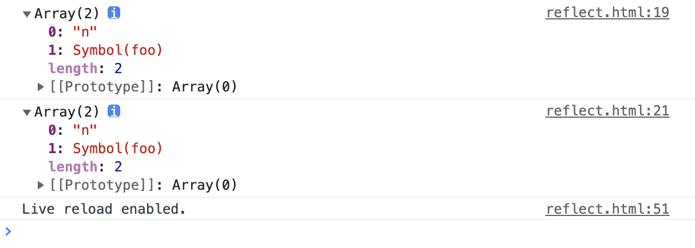

# Reflect

| 文档创建人 | 创建日期   | 文档内容               | 更新时间   |
| ---------- | ---------- | ---------------------- | ---------- |
| adsionli   | 2022-02-10 | es6中的Reflect内容学习 | 2022-02-10 |

Reflect在MDN中的描述：

**Reflect** 是一个内置的对象，它提供拦截 JavaScript 操作的方法。这些方法与[proxy handlers (en-US)](https://developer.mozilla.org/en-US/docs/Web/JavaScript/Reference/Global_Objects/Proxy/Proxy)的方法相同。`Reflect`不是一个函数对象，因此它是不可构造的。

> 本人对这里的拦截JavaScript操作这里稍微有点不理解，它应该不算是拦截才对。

## 1. Reflect的简单概述

Reflect对象是在es6中新增的一个对象，它主要作用使用来替代原来Object对象下的一些属于语言内部的方法，并且对Object中所不具有的方法进行补强。现阶段，某些方法同时在`Object`和`Reflect`对象上部署，未来的新方法将只部署在`Reflect`对象上。也就是说，从`Reflect`对象上可以拿到语言内部的方法。

> 其实也就是完成单一职责原则，让Object对象只完成对象相关的职责，将不属于对象中的语言内部的方法拆除出来给Reflect来完成。
>
> 一些个人看法：
>
> 1. 不知道为啥，Reflect被很多人说成是反射，但是就个人感觉而言，Reflect虽然被翻译成映射，但是在js中所完成的工作感觉也不太和映射相关联。

**Reflect对象相对于原先Object方法上的一些改进:**

1. `Reflect`修改某些`Object`方法的返回结果，让其变得更合理。比如，`Object.defineProperty(obj, name, desc)`在无法定义属性时，会抛出一个错误，而`Reflect.defineProperty(obj, name, desc)`则会返回`false`。

2.  让`Object`操作都变成函数行为。某些`Object`操作是命令式，比如`name in obj`和`delete obj[name]`，而`Reflect.has(obj, name)`和`Reflect.deleteProperty(obj, name)`让它们变成了函数行为。

   ```js
   'asign' in obj;
   
   Reflect.has('asign')
   ```

3. `Reflect`对象的方法与`Proxy`对象的方法一一对应，只要是`Proxy`对象的方法，就能在`Reflect`对象上找到对应的方法。这就让`Proxy`对象可以方便地调用对应的`Reflect`方法，完成默认行为，作为修改行为的基础。也就是说，不管`Proxy`怎么修改默认行为，你总可以在`Reflect`上获取默认行为。

   ```js
   Proxy(target, {
       set: function(target, name, value, receiver) {
           let success = Reflect.set(target, name, value, receiver);
           if (success) {
               console.log('property ' + name + ' on ' + target + ' set to ' + value);
           }
           return success;
       }
   });
   ```

4. Reflect能够减少原先使用Object时的代码量，让代码更加已读

   ```js
   // 老写法
   Function.prototype.apply.call(Math.floor, undefined, [1.75]) // 1
   
   // 新写法
   Reflect.apply(Math.floor, undefined, [1.75]) // 1
   ```

   还有比如原先需要获取Object对象中的Symbol属性时，就很麻烦，现在可以通过Reflect来简化获取

   ```js
   let s = Symbol('foo');
   let obj = {
       [s]: 123,
       n: 'adsionli'
   }
   //如果是要用Object.getOwnPropertyNames和Object.getOwnPropertySymbols结合获取全部属性的话
   console.log(Object.getOwnPropertyNames(obj).concat(Object.getOwnPropertySymbols(obj)));
   //如果是使用Reflect的话
   console.log(Reflect.ownKeys(obj));
   ```

   

## 2. Reflect的静态方法

`Reflect`对象一共有 13 个静态方法。

1. `Reflect.apply(target, thisArg, args)`

2. `Reflect.construct(target, args)`

3. `Reflect.get(target, name, receiver)`

4. `Reflect.set(target, name, value, receiver)`

5. `Reflect.defineProperty(target, name, desc)`

6. `Reflect.deleteProperty(target, name)`

7. `Reflect.has(target, name)`

8. `Reflect.ownKeys(target)`

9. `Reflect.isExtensible(target)`

10. `Reflect.preventExtensions(target)`

11. `Reflect.getOwnPropertyDescriptor(target, name)`

12. `Reflect.getPrototypeOf(target)`

13. `Reflect.setPrototypeOf(target, prototype)`

> 上面这些方法的作用，大部分与`Object`对象的同名方法的作用都是相同的，而且它与`Proxy`对象的方法是一一对应的。

与大多数全局对象不同`Reflect`并非一个构造函数，所以不能通过new运算符对其进行调用，或者将`Reflect`对象作为一个函数来调用。`Reflect`的所有属性和方法都是静态的。

### 3. Reflect静态方法使用示例

### 3.1 has(target, name)

`Reflect.has`方法对应`name in obj`里面的`in`运算符。

```javascript
var myObject = {
  foo: 1,
};

// 旧写法
'foo' in myObject // true

// 新写法
Reflect.has(myObject, 'foo') // true
```

如果`Reflect.has()`方法的第一个参数不是对象，会报错。

### 3.2 deleteProperty(target, name)

`Reflect.deleteProperty`方法等同于`delete obj[name]`，用于删除对象的属性。

```javascript
const myObj = { foo: 'bar' };

// 旧写法
delete myObj.foo;

// 新写法
Reflect.deleteProperty(myObj, 'foo');
```

该方法返回一个布尔值。如果删除成功，或者被删除的属性不存在，返回`true`；删除失败，被删除的属性依然存在，返回`false`。

如果`Reflect.deleteProperty()`方法的第一个参数不是对象，会报错。

### 3.3 apply(target, thisArg, args)

`Reflect.apply`方法等同于`Function.prototype.apply.call(func, thisArg, args)`，用于绑定`this`对象后执行给定函数。

一般来说，如果要绑定一个函数的`this`对象，可以这样写`fn.apply(obj, args)`，但是如果函数定义了自己的`apply`方法，就只能写成`Function.prototype.apply.call(fn, obj, args)`，采用`Reflect`对象可以简化这种操作。

> 关于`Function.prototype.apply.call`这种调用不太明白的同学，可以看一下这篇讲解，我感觉说的挺好的: [apply.call讲解](https://www.cnblogs.com/web-record/p/10477778.html)

```js
const ages = [11, 33, 12, 54, 18, 96];

// 旧写法
const youngest = Math.min.apply(Math, ages);
const oldest = Math.max.apply(Math, ages);
const type = Object.prototype.toString.call(youngest);

// 新写法
const youngest = Reflect.apply(Math.min, Math, ages);
const oldest = Reflect.apply(Math.max, Math, ages);
const type = Reflect.apply(Object.prototype.toString, youngest, []);
```

### 3.4 set(target, name, value, receiver)

`Reflect.set`方法设置`target`对象的`name`属性等于`value`。

这里选几个特殊的例子来说一下：

1. 如果`name`属性设置了赋值函数，则赋值函数的`this`绑定`receiver`。

   ```js
   var myObject = {
     foo: 4,
     set bar(value) {
       return this.foo = value;
     },
   };
   
   var myReceiverObject = {
     foo: 0,
   };
   //这里设置了receiver，所以this指向了myReceiverObject下的foo属性，所以myObject下的foo没有更改，更改的是myReceiverObject下的
   Reflect.set(myObject, 'bar', 1, myReceiverObject);
   myObject.foo // 4
   myReceiverObject.foo // 1
   ```

2. 通过Reflect与Proxy结合使用实现观察者模式

   ```js
   const queuedObservers = new Set();
   //观察者触发函数
   const observe = fn => queuedObservers.add(fn);
   //观察者拦截器，拦截函数的set操作
   const observable = obj => new Proxy(obj, {set});
   //具体拦截，通知到所有观察者
   function set(target, key, value, receiver) {
     const result = Reflect.set(target, key, value, receiver);
     queuedObservers.forEach(observer => observer());
     return result;
   }
   ```

   上面代码中，先定义了一个`Set`集合，所有观察者函数都放进这个集合。然后，`observable`函数返回原始对象的代理，拦截赋值操作。拦截函数`set`之中，会自动执行所有观察者。


更多关于Reflect使用相关的内容，大家可以进行百度，网上例子很多，这里就举几个特殊的。

## 总结

Reflect对象不是一个很难懂的东西，但是如果想要学会使用它的话，还需要大量的代码实践工作，所以还需加油，冲呀！

