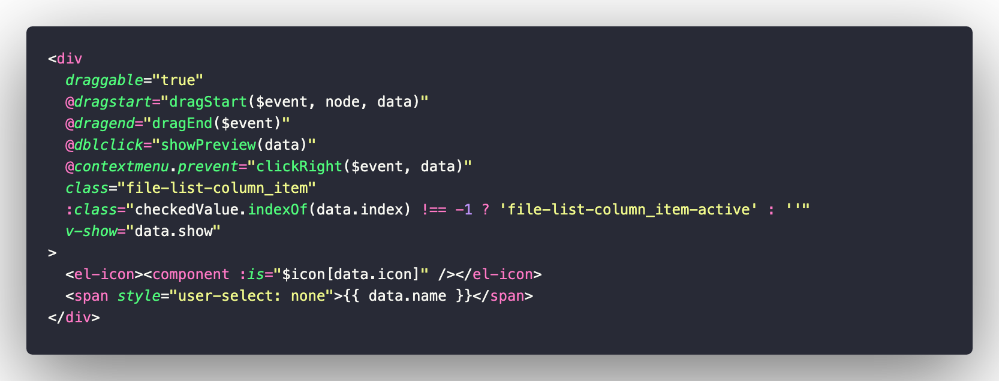

# Event之Drag拖放的学习与使用

| 文档创建人 | 创建日期   | 文档内容                    | 更新时间   |
| ---------- | ---------- | --------------------------- | ---------- |
| adsionli   | 2022-05-11 | Event之Drag拖放的学习与使用 | 2022-05-11 |

最近在继续完成文件可视化的过程中，没有很好地方法去处理文件移动，所以就想着要不就还是做成和MAC和WINDOWS系统中那种可拖动存放文件的操作，越想越不错，直接开干了，在写的过程，遇到了一些问题，就是关于drag的一些知识，因为以前没怎么特别学过，所以现在就特地来记录自己的学习过程以及使用的具体场景和实现。

## drag

`draggable`在**html5**才正式被提出来，如果想要使用`draggable`的话，就在需要使用的标签上添加`draggable=true`就可以了，这个时候就可以去拖拽这个标签了，但是这时候也只是支持了拖拽，我们还需要为标签添加相关的事件，来配合drag的实现，否则还是没啥用的。

拖拽这一动作主要分成两个对象：拖拽对象，放置对象。这两个对象会去实现不同的event方法，接下来会一一介绍。

### 拖拽对象

拖拽对象就是我们鼠标按下不放，然后拖到新的位置的那个DOM对象啦，对于拖拽对象来说，我们只需要设置三个属性就可以了：

1. `draggable`
2. `dragstart`
3. `dragend`

第一个`draggable`属性是html5新增的内容，如果我们为标签添加了之后，我们就可以拖动这个标签了，也就是说只有加了这个，我们才可以拖动。然后是`dragstart`和`dragend`两个event事件啦，我们在下面展开说说。

#### dragstart

`dragstart`也就是开始拖动时触发的`event`事件，也是我们必须要使用的一个事件，如果不使用`dragstart`的话，我们就没办法直到我们自己的event绑定到了哪一个可拖拽对象上，也没法通过`event`中的一个`DataTransformer`来传递数据给到放置对象上，也就是说，**这玩意真的很重要。**

> 对于dragstart事件的具体详情，可以去mdn上进行查看：[dragstart事件](https://developer.mozilla.org/zh-CN/docs/Web/API/Document/dragstart_event)

然后说说该怎么使用它，其实很简单，只要给设置了`draggable=true`的`dom`对象添加`eventListener`就可以啦，如下面这段代码

```js
//假设已经设置了draggable=true了
let dom = document.getElememtById('dragObj');
dom.draggable = true;
dom.addEventListener('dragstart', function(event){
    //这里我们就可以设置我们需要实现的逻辑，以及控制拖拽对象的css等内容
    ......
})
```

因为我们是为了在vue中使用的话，就可以使用vue提供给我们的直接可使用的别名`@dragstart`，当然我们也可以自定义拖拽事件，当然这些都是后话，具体实现如下图所示:



其中传入event参数，我们就可以直接使用vue中`$event`实例就可以了，我们还可以额外传入参数进去，因为vue相对灵活，可以使用响应式数据进行信息的记录，所以就不需要在使用`DataTransformer`对象来传递数据，不过还是可以用的，不过还是响应式数据方便捏，嘿嘿。偷懒了属于是。

#### dragend

dragend事件就是当我们把拖拽对象松开的时候会进行触发，也就是抬起鼠标左键的时候触发，这个时候如果我们不是要落位的话，而是用来移动一个可拖拽对象的话，就非常的有用了，因为我们可以通过event来获取到我们当前拖拽对象被释放时的位置，然后设置他的left,right,top,bottom等属性，让它可以移动到我们想要它放置的位置上去了。


### 放置对象


#### dragenter


#### dragover


#### dragleave


#### drop


## event


### preventDefault


### stopPropagation


### dataTranformer