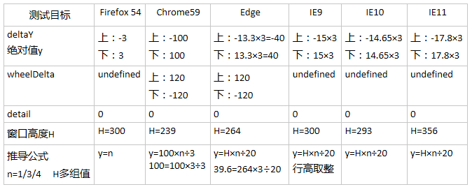

# 鼠标滚轮事件的学习与总结
| 文档创建人 | 创建日期   | 文档内容          | 更新时间 |
| ---------- | ---------- | ----------------- | -------- |
| adsionli   | 2021-11-03 | 滚轮事件的学习与总结 | 2021-11-03   |

> 想写这篇关于鼠标滚轮事件的起因是因为在看elementui-image源码的时候可以通过鼠标滚轮事件，来调整preview-image的图片放缩，所以就想好好学习和整理一下相关知识

## 滚轮事件介绍

什么是滚轮事件？

根据MDN上给出的解释就是：当滚动鼠标滚轮或操作其它类似输入设备时会触发**滚轮事件**。

也就是说滚轮事件不单单指鼠标滚轮，也包括其他可以出发滚轮事件的设备，比如说电脑触控板等都是可以触发滚轮事件的。所以这里的标题实际不是特别的正确，不应该只界定在鼠标触发的滚轮事件。

在MDN上同样还有对滚轮事件的注意事项:

1. 滚轮方向的改动不一定就完全是文档内容的滚动方向，因为标准并未定义滚轮事件会引发什么样的行为，滚轮事件引发的行为都是由浏览器平台来自己定义的。
2. 即便滚轮事件引发了文档内容的滚动行为，也不表示滚轮方向和文档内容的滚动方向一定相同。因而通过该滚轮事件获知文档内容滚动方向的方法并不可靠。
3. 如果想要获取可靠的文档内容的滚动方向，可以通过对文档内容的滚动事件添加监听，主要监听scrollLeft和scrollTop两个值的变化，来推断出滚动方向

> 从上述的注意事项中，我们可以很简单的归纳出几点
>
> 1. 滚轮方向 ≠ 文档滚动方向(严格意义上，实际很多都是相同的)
> 2. 滚轮引发文档内容滚动行为-> 滚动方向 ≠ 文档滚动方向(严格意义上)
> 3. 要获取正确的文档滚动方向，需要添加eventListener，获取scrollLeft和scrollTop两个参数来判断，由此可以看出，滚动方向取决于左、上的方向。

## 滚轮事件的可使用场景(个人见解)

1. 图片放大预览时的放缩操作
2. 内容懒加载时，监听滚动条的滚动位置
3. blog中，显示当前文章内容滑动到什么标题下
4. 商品侧边分类显示商品整体滑动位置（描述的有点怪，具体可参考美团外卖）
5. 歌词的滑动，监听滑动位置，显示对应歌词的加粗
6. 列表展示数据时，默认分页操作，可以根据滑动高度是否到底触发再次请求的操作，模拟分页。(聊天框的实现也是类似的，比如微信)
7. 暂时没想到了，以后再有的话继续补充......

## 不同浏览器平台的鼠标滚轮事件的差异

```js
const mouseWheel = () =>
  "onwheel" in document.createElement("div")
    ? "wheel" // 各个厂商的高版本浏览器都支持"wheel"
    : document.onmousewheel !== undefined
    ? "mousewheel" // Webkit 和 IE一定支持"mousewheel"
    : "DOMMouseScroll"; // 低版本firefox
```

从上述代码中，我们可以看出，滚轮事件主要有三种类型，分别是: `wheel`, `mousewheel`, `DOMMouseScroll`。分别对应的使用场景也在注释中有说明。

虽然在MDN中也有说`mousewheel`已经被弃用了，主要使用的是`wheel`，但是为了兼容低版本浏览器，还是需要添加上去。在低版本的firefox浏览器中，其也不支持`wheel`,所以还需要添加`DOMMouseScroll`已达到兼容的目的。

同时，各个不同的浏览器平台对于滚轮事件的上下移动的判定使用的参数是完全不同的，有的是使用wheelDelta，有的则是使用detail的，并通过他们的正负来判断其滚动的方向的，下面是我在网上找到的一张图，可以从这张图上看出当前使用比较多的浏览器上是通过什么判断的。



> 从上表可以看出，deltaY一个可以判断滚轮的方向是向上还是向下(正值向下滚动，负值向上滚动)。这里的==H==取得是`document.body.clientHeight || window.innerHeight`。==n==是滚动的行数。一般来说n默认的是3行。
>
> 通过分析可以得出以下结论:
>
> 1. **可靠属性**：deltaY，方向判断方法一致（正值向下滚动，负值向上滚动），与操作系统鼠标设置有关联，但需注意绝对值算法不统一。(比如在mac上使用的时候，如果选择的鼠标滚轮是自然属性，实际就是向上滚动是正值，向下滚动是负值)
>
> 2. **功能方面**：Firefox能直观反映滚动行数，但不能直观与浏览器默认滚动条保持同步；其他几组浏览器则恰好相反；
>
> 3. **个人建议**：个人认为wheelDelta的最初设计思想很好，电脑鼠标滚轮垂直行数默认值是3，wheelDelta默认值120，即单行行高40px，即使用户电脑做了个性化设置，像素值也不会出现循环小数，避免了Chrome的deltaY设计缺陷，有利于行业规范化，所以建议各浏览器厂商能完整支持wheelDelta这一属性。

## 鼠标滚轮事件的使用

```js
//获取鼠标滚轮事件
const mouseWheel = () =>
  "onwheel" in document.createElement("div")
    ? "wheel" // 各个厂商的高版本浏览器都支持"wheel"
    : document.onmousewheel !== undefined
    ? "mousewheel" // Webkit 和 IE一定支持"mousewheel"
    : "DOMMouseScroll"; // 低版本firefox
this.mouseWheelHandler = rafThrottle((e) => {
    /**
     * NOTE: wheelDelta和detail都是用来判断滚轮是上滑还是下滑，但是在不同浏览器的平台中的判断条件不同，所以需要两个都叫判断
     * NOTE: 当使用window.requestAnimationFrame的时候，是可以不使用transition的
     */
    const delta = e.wheelDelta ? e.wheelDelta : -e.detail;
    if (delta > 0) {
        this.transform.enableTransition = false;
        this.zoomIn(false);
    } else {
        this.transform.enableTransition = false;
        this.zoomOut(false);
    }
});
on(this.$isServer)(document, mouseWheel(), this.mouseWheelHandler);
```

上面这段代码就是对滚轮事件的一个应用，不过这里是做了一个性能上的优化，暂时先不说。

其实滚轮事件的绑定就和普通事件的处理方式完全相同。

## 滚动事件的性能优化

> 其实之前并没打算写这一章节的，后来发现在阅读源码组件的时候发现了图片懒加载就是基于滚动事件做的性能优化，所以这里新增滚动事件的性能优化这一章节来进行说明。但是这之前需要各位阅读本节的读者，最好先去看一下节流与防抖的知识，这样才可以更好的理解接下来的内容，同样我自己也整理了节流与防抖的知识，可以前往查看: [节流(throttle)与防抖(debounce)](/#/page/js/throttle-debounce)


### raf(window.requestAnimationFrame)触发滚轮事件


# 使用总结

