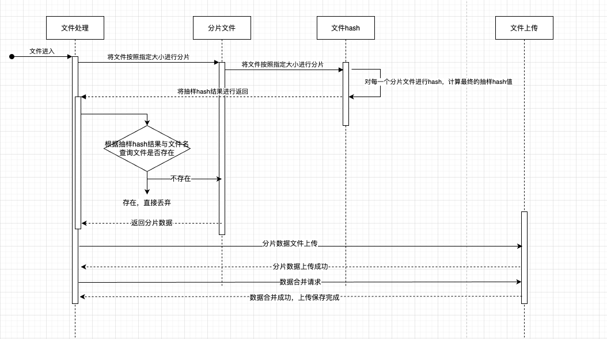
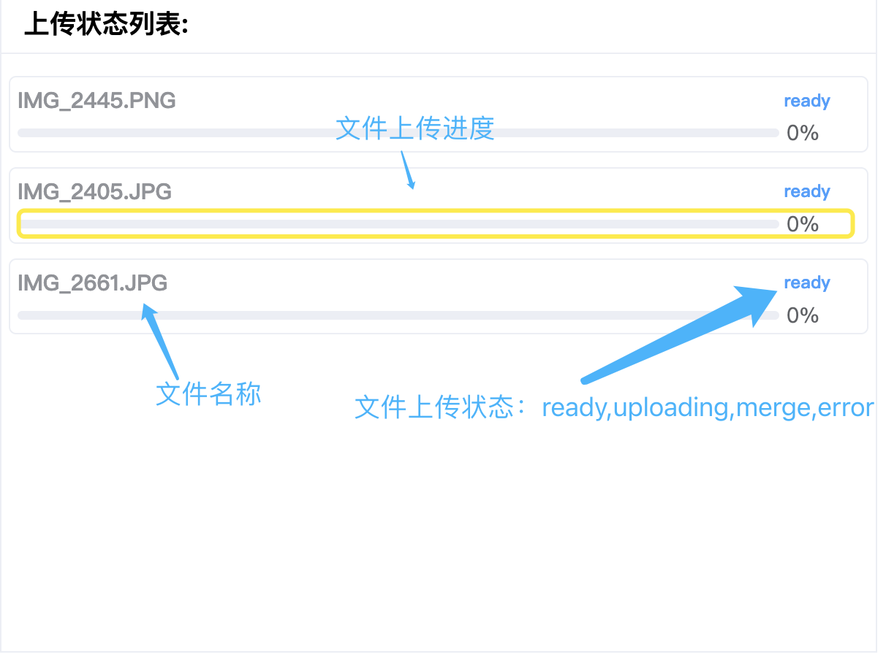
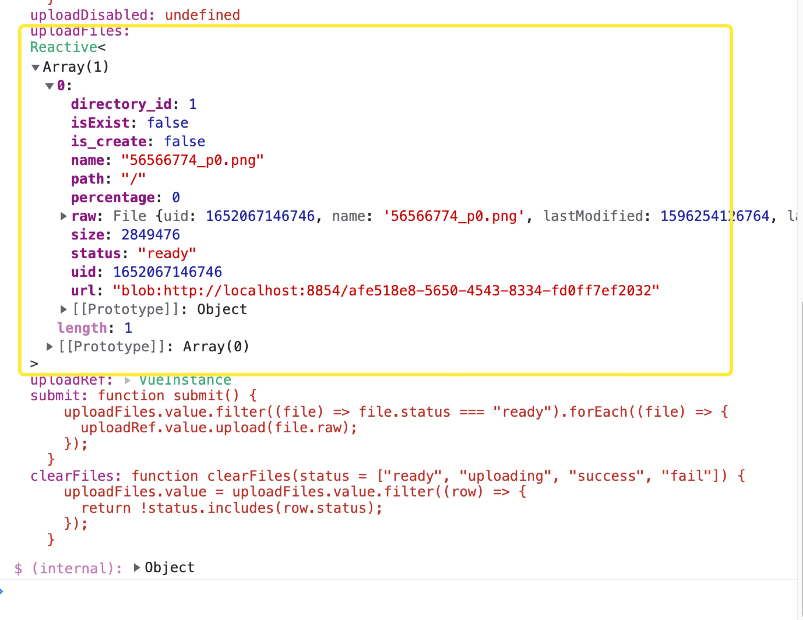
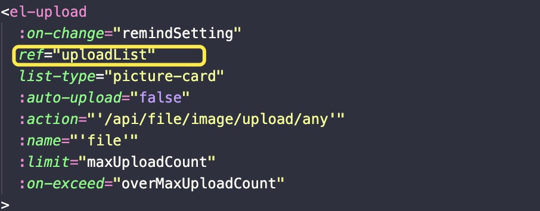
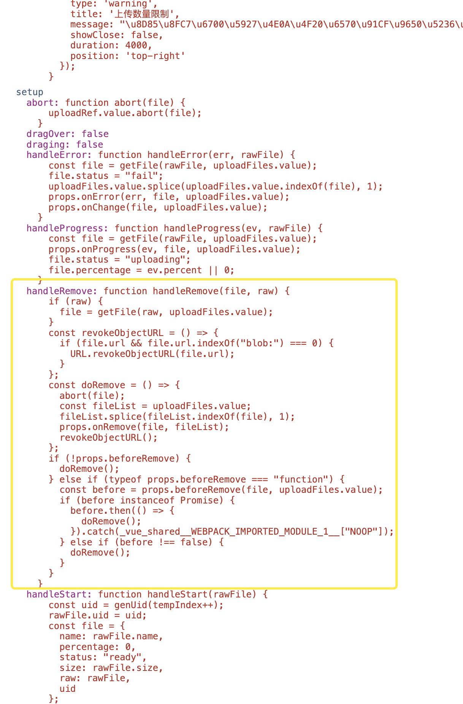
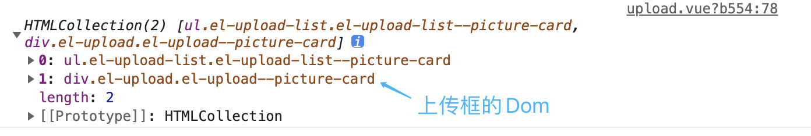
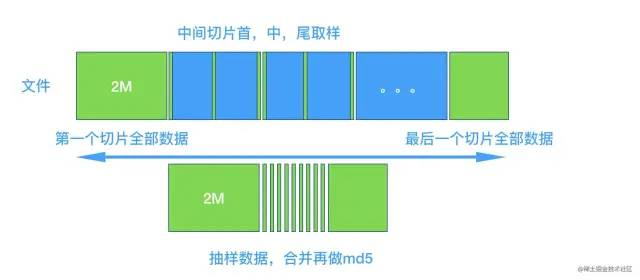

# 文件系统管理与可视化模块开发-Part2

| 文档创建人 | 创建日期   | 文档内容                              | 更新时间   |
| ---------- | ---------- | ------------------------------------- | ---------- |
| adsionli   | 2022-05-09 | 文件系统管理与可视化模块开发-文件上传 | 2022-05-09 |

**文章系列:**

1. [文件系统管理与可视化模块开发-Part1](https://adsionli.xslease.com/page/node/drawingBedPart02)
2. [文件系统管理与可视化模块开发-Part2](https://adsionli.xslease.com/page/node/drawingBedPart02)

这一章的内容主要就是梳理一下关于自己实现文件上传这一前端模块内容的具体流程和一些关键代码的书写。

主要流程如下图



## 文件上传组件

这里我选择直接使用了ElementPlus的上传文件组件，也是偷懒不想重复造轮子了，不过这里我没有使用他的主动上传功能，而是将上传由自己来实现，因为我们需要对文件进行处理，效验以及上传，所以需要重写很多内容。

这一章先对ElementPlus的Upload组件进行一个知识点的汇总。

### 1.1 组件使用与设计

#### 1.1.1 上传列表

选择使用照片墙的形式，对上传文件进行呈现，如下图所示，主要就是设置一下`list-type`为`picture-card`即可


我在实现上传时，没有使用组件提供的主动上传功能，而是选择使用了自己手动上传，这个也是可以通过设置组件的参数来实现即`auto-upload`设置为`false`即可，这样就可以通过我们自定义的按钮来控制文件上传了，同时因为是文件管理，所以我们可以手动设置文件相关内容的设置，如下图中，我们可以设置上传文件名称与上传文件最终的保存路径，保存路径采用了远程搜索的形式，来对用户有一个更好的使用支撑。


除了基础信息设置之外，还提供预览与删除按钮，我们同时需要对预览图片列表的生成和删除按钮的点击后的动态增删，进行相应的响应式操作，来保证数据的一致性。

我还对最大上传数做了设置，如果超过最大上传数时，将会隐藏上传按钮，同时提醒用户无法继续上传。


到这里，上传页面的设计其实已经差不多了，主要设置的内容也就这些，之后就会说说其具体的实现了。

#### 1.1.2 上传进度展示列表设计

这里的上传进度展示列表没有选择使用绑定在上传组件中的回调，因为我们对文件进行了分片，所以上传进度与实际组件中提供的上传进度是不相符的，所以就自己写了一个，实现效果如下：



主要由三个模块组成：

1. 文件名称
2. 文件上传状态，分为四类：ready(等待上传)，uploading(上传中)，merge(合并文件中)，error(上传失败)
3. 文件上传进度列表

这里的关于上传进度的计算以及状态的改变，均有自己来控制，下面将会展开说明。

### 1.2 组件内容的实现

上面说了整体的设计思路后，我想大家已经对这块内容有了一些了解，也对具体将要实现什么东西有了一点想法了，所以现在就来具体说说实现的代码啦。

#### 1.2.1 上传组件的实现

上传组件选择了ElementPlus中的上传组件，这里就不再细说了，大家可以自行前往查看:[upload组件](https://element-plus.org/zh-CN/component/upload.html)

这里就主要说一下其中的一些特别的点的实现

##### 1.2.1.1 文件数据的处理与获取

这里比较重要的就是关于文件数据的获取，我们可以在控制台中进行打印，查看ElementPlus的Upload组件的数据格式，如下图：



从这里我们看见，他是一个数组的形式，里面保存了关于文件的相关数据，`raw`这个属性，存储的是File类型内容，包括了文件数据，也就是最终我需要上传的内容。

**文件移除**

除了这些数据格式之外，我们还需要根据这些个事，自己去实现一下移除图片的操作，同时还需要调用这个实体对象，使用其内部的`handleRemove`方法，去手动移除。

> 关于如何获取这个实体对象，其实很简单，只需要给一个ref，然后在setUp中声明一个同名的ref响应式数据，就可以获取到了
>
> 
>
> ```js
> const uploadList = ref()
> ```

手动移除文件：

```js
/**
 * @method remove 移除文件
 * @param {UploadFile} file 上传的文件
 */
const remove = (file: UploadFile) => {
    previewList.value.splice(previewList.value.indexOf(file.url), 1)
    percentage.value.delete(file.name)
    uploadList.value.handleRemove(file)
    if (uploadList.value.uploadFiles.length < maxUploadCount) {
        uploadList.value.$el.children[1].style.display = 'inline-block'
    }
}
```



**最大文件同时上传数与上传框的隐藏**

对于最大文件上传数的限制，我们可以通过Upload组件中的`limit`进行设置，同时可以设置回调事件`on-exceed`，来对达到最大上传数时进行捕获。

但是对于上传框的隐藏的触发，我们应该在上传数到达最大限制数量时，就进行隐藏，如果是在on-exceed中去设置的话，其实这时候用户已经点击上传了，这样就不对了，所以我们还需要在on-change中进行当前文件列表数据长度进行判断，来主动隐藏最后一个上传框。

```js
/**
 * @method remindSetting 提醒设置图片路径
 */
const remindSetting = (uploadFile: UploadFile, uploadFiles: UploadFiles) => {
    //NOTE: 上面这段内容是让我们来设置文件的保存路径及相关附加内容的
    // if (uploadFile.status === 'ready') {
    //   previewList.value.push(uploadFile.url)
    //   uploadFile.path = '/'
    //   uploadFile.directory_id = 1
    //   uploadFile.is_create = false
    //   uploadFile.isExist = false
    //   percentage.value.set(uploadFile.name, {
    //     percentage: 0,
    //     status: 'ready',
    //   })
    //   ElMessage({
    //     type: 'warning',
    //     message: '请设置图片保存路径',
    //   })
    // }
    //README: 下面的操作是当达到上传限制之后，我们就把最后一个上传框给隐藏了
    if (uploadFiles.length >= maxUploadCount) {
        uploadList.value.$el.children[1].style.display = 'none'
        overMaxUploadCount()
    }
}
```

我们可以通过获取到这个组件的dom对象，来进行隐藏，为什么这里的children是取的1呢？原因很简单，在Upload组件设计中，这里的children设计成了两个元素，一个是之前已经添加过内容的file-list，另外一个就是上传框(当时这个也坑了我1个多小时....)，这样之后，我们就可以手动控制上传框的显隐了，同时在remove的时候，要去恢复上传框的显示，上面的代码中也已经给出了。



到这里，关于上传组件的内容基本已经结束了，之后就是具体上传的实现了，这里先不说，放在下面。

##### 1.2.2 进度监控的实现

虽然Upload组件提供了上传进度的回调函数，但是不太符合我们上传设计，所以就直接舍弃掉，我们自己来设计了，首先就是页面设计了，页面设计很简单，上面已经给出了，其次就是和上传列表中的联动，以及在后续接收上传进度的数据创建了。

很幸运的是，在vue3中，我们已经可以通过响应式数据，传递到上传中去，然后通过修改响应式数据内容，来同步状态，这就大大减低了这一块内容开发的难度。

具体数据设计如下：

```typescript
//这个用来存储不同名称文件的上传进度，使用map，可以区分开，并快速查询
const percentage = ref(new Map())
//上传进度的数据格式，主要就是状态和上传进度
type PercentageList = {
    status: string,
    percentage: number
}
```

很简单，但是很有效，然后我们可以在每一次添加一张图片之后，就去在`percentage`中添加一条数据。

然后当进行文件上传按钮点击之后，我们就可以把这个响应式对象传到`submit`中，因为不是在同一个文件中执行的，所以我们还需要在执行的ts文件中去接收一下这个`percentage`，然后就是简单的赋值了。

当然对于进度监控，比较难的是进度的计算，因为我们对数据进行了分片操作，所以每一块分片数据的上传就是我们需要单独计算上传进度，然后加在一起，才是这个文件的真实上传进度，所以设计了一下计算公式，下块代码所示：

```typescript
const xhr = new XMLHttpRequest();
if (xhr.upload) {
    xhr.upload.onprogress = function progress(e: any) {
        if (e.total > 0) {
            e.percent = e.loaded / e.total;
        }
        let realP = Number(((1 / (options.sliceCount)) * e.percent * 100));
        percentageList.get(file.name).percentage = (Number(percentageList.get(file.name).percentage) + (Number(realP - uploadPrecentage))).toFixed(2);
        uploadPrecentage = realP;
    };
}
```

上面有一些参数说明一下：

1. `e.loaded`与`e.total`：这两个参数是`xmlHttpRequest`的`onprogress`事件提供的event`参数`中携带的内容，其中的`loaded`与`total`代表了上传内容的大小以及总上传的大小，这为我们提供了进度计算的基础依据，所以我们可以通过这两个参数，计算出一个分片的上传进度。
2. `options.sliceCount`: 就是我们对当前文件的分片数量，也是我们用来计算每个分片贡献多少进度的一个依据。
3. `uploadPrecentage`: 记录当前分片数据的上传进度的，不是最新的，是上一次的。

有了上面的4个参数之后，我们就可以计算真实上传进度了。

1. 首先计算出每一个分片的当前上传进度`e.precent`。
2. 计算在当前分片贡献度下的实际进度大小。
3. 将原有的文件上传进度加上当前分片上传进度与上一次上传进度的相减的值，就是我们此刻上传进度的大小。

好了，这样就计算完成啦，然后就可以将这个值传入到进度列表中，呈现出来就可以了。

> 这里涉及到了[XmlHttpRequest](https://developer.mozilla.org/zh-CN/docs/Web/API/XMLHttpRequest)相关的知识，如果不是很熟悉的话，还是建议好好掌握一下，因为真的很重要。同时还要对Vue3响应式数据有一个比较好的认知，因为只有这样，才可以在很多地方使用好它。

到这里比较简单的两个部分，但是也是我们整个上传部分的数据呈现的内容就已经结束了，接着就是说说我们的骚操作，数据分片以及合并与抽样hash的实现啦。

## 文件分片及合并与抽样hash

这个模块，说难，也不是很难，说简单也不简单，因为会需要设计到对Blob、File、XmlHttpRequest的使用以及md5编码的使用，还有一些hash冲突的解决，所以会有点绕，但是理清楚了，还是比较好写的，现在就开始一步一步梳理啦。

### 2.1 文件分片

文件分片是一个很重要的模块，它不仅仅为我们的断点续传提供帮助，也对我们在后面抽样hash时，提供数据分片贡献起了很大的作用。

上面我们已经介绍了Upload组件中的数据格式了，其中`raw`属性，保存的是一个`File`对象，而`File`对象又是`Blob`的子类，所以我们可以对这个`File`对象进行切割，使用`Blob.slice()`方法，所以我们就需要提供每一个分片大小。

> 虽然这里我在查阅相关资料的时候，看到一个慢启动策略，就是根据一个固定大小的分片数据的上传速度，来计算后面究竟应该采取多少的分片大小来上传的动态分片大小调整的方法，但是我想了想，实现方法实在是有点复杂，我就先暂时放弃了。好吧，其实也不是很难，就是自己偷懒了，因为还有node端内容要写，只能先放一放了。

那么接下来就放出我的分片写法，非常的简单...

```typescript
/**
 * @method sliceFile 切割文件
 * @param {File} file 待处理文件
 * @param {number} size 文件切割大小
 */
const sliceFile = (file: File, size: number = minSliceSize): { file: File, idx: number }[] => {
    if (file.size < minSliceSize) {
        return [{
            idx: 0,
            file: file
        }];
    }
    const fileChunkList: { file: File, idx: number }[] = [];
    let cur = 0;
    let count = 0;
    while (cur < file.size) {
        if (cur + size > file.size) {
            fileChunkList.push({
                idx: count,
                file: new File([file.slice(cur, file.size, file.type)], `${file.name}_${count}`, { type: file.type })
            });
            break;
        }
        fileChunkList.push({
            idx: count,
            file: new File([file.slice(cur, cur + size, file.type)], `${file.name}_${count}`, { type: file.type })
        });
        cur += size;
        count++;
    }

    return fileChunkList;
}
```

这里需要注意的是我们需要为每一个分片打上标记，为了之后在组合的时候，不会出现顺序问题，导致组合出现问题。

好了，有了分片数据之后，我们就可以进行抽样hash了。

### 2.2 抽样hash

乍一听这个抽样hash的时候，我是有点懵的，因为没听过啊😂，然后查了一下，看到别人说类似于布隆过滤器，然后就去了解了一下，然后大概也就知道怎么回事了，这里我就不赘述了，大家可以去看看布隆过滤器的原理:[布隆过滤器](https://www.bilibili.com/video/BV1zK4y1h7pA?spm_id_from=333.337.search-card.all.click)

然后呢，就是一张关于抽样hash的示意图，大家可以看一下(从网上找的😂):



来解释一下这张图的含义：

1. 保留文件分片的头和尾，对头和尾进行完整的md5编码
2. 对分片数据中间的部分，只取其头和尾的几个字节的数据进行md5编码
3. 然后得出最终的md5编码数据,就是当前文件的最终编码

这大概就是上面这张图的内容说明。这里有几个注意的点：

1. 头尾切片文件大小的选择比较重要，当头尾文件选择的大小越大时，最后生成的md5编码越难重复，但是相应的代价就是越耗时
2. 中间分片数据的头尾也是同理，越大，越不容易生成重复的md5的值，但是越耗时。

当然，这样子的hash要比原来文件的直接hash快太多了，以前1G的hash，需要处理大概20多秒，但是抽样hash之后，只需要3秒左右的时间。

> 我看到一些公众号上说只要1秒，我是不知道怎么写的，我是真的菜...

当然处理这些分片数据的hash算法还是比较耗时的，如果为了不影响到主页面的流畅性的话，有一个内容被使用了，就是**Time-Slice(时间分片)**。

**Time-Slice(时间分片)**一开始我不太了解这玩意究竟是干什么的，后来看了内容之后，大概了解了一下。

这里就涉及到浏览器的渲染机制还有屏幕刷新率的关系了。

因为不同的屏幕刷新率是不同的，大部分都是60Hz的，但是浏览器页面比较简单的话，在每一秒可以渲染的帧数是很高的，但是屏幕限制了浏览器的渲染率，所以就会让浏览器页面的渲染固定在每秒60帧了，这就让每一帧都会有一些空余渲染时间。而**time-slice**就是抓住了这个渲染的空余时间了，然后去执行相关的内容，这样就不会占用主的**EventLoop**进行执行了，这样就可以不影响到用户的使用，又可以完成相关的内容。

对**time-slice**做得很好的就是React中的Time Slice了，不过具体的还没有去研究过，所以等之后找完工作之后，就开始研究React中的一些模块啦。

那么在我们的这块内容中，也可以使用time-slice来处理文件的抽样hash，这样就不会让用户感觉到浏览器卡顿了，提高用户体验。

具体实现就是调用顶层对象`windows`下的`requestIdleCallback`方法，这个方法就是可以将我们的操作放入到每一帧的空闲时间中去进行处理且不妨碍主线程的处理。

好了，有了上面的知识储备之后，我们就可以来编写这一块代码了(这里代码是自己写的，有不好的地方还望见谅)

```typescript
/**
 * @method hashFile 处理文件hash
 * @param {File} file 待处理文件 
 */
const hashFileList = (file: UploadFile) => {
    return new Promise((resolve, reject) => {
        let taskCount = file.sliceFile?.length || 0;
        let currentTask = 0;
        const spark = new SparkMD5.ArrayBuffer();
        if (taskCount === 0) {
            resolve([]);
        }
        let hashAll = false;
        //NOTE: 这里的Deadline是requestIdleCallback的传入参数，其类型我加在了下面
        const doFileHash = async (deadline: Deadline) => {
            //如果任务还有剩余且还有时间，就来执行抽样hash的任务
            while (taskCount > 0 && deadline.timeRemaining() > 1 && !hashAll) {
                let sparkData = await hash(file?.sliceFile![currentTask], currentTask, file.sliceFile?.length || 0)
                currentTask++;
                if (taskCount == 0) {
                    resolve(sparkData)
                    hashAll = true;
                    break;
                }
            }
            if (taskCount > 0 && !hashAll) {
                window?.requestIdleCallback!(doFileHash);
            }
        }
        const hash = (sliceFile: { file: File, idx: number }, currentIdx: number, fileSize: number) => {
            return new Promise((resolve, reject) => {
                if (fileSize == 0) {
                    return "";
                }
                const fileReader = new FileReader();
                fileReader.readAsArrayBuffer(sliceFile.file);
                fileReader.onload = function (e) {
                    let sliceData = extractDataSlice(e.target?.result, currentIdx, fileSize);
                    if (sliceData.length === 0 && taskCount - 1 != 0) {
                        taskCount--;
                        resolve(null);
                    }
                    sliceData.forEach(v => {
                        spark.append(v);
                    })
                    taskCount--;
                    if (taskCount === 0) {
                        resolve(spark.end())
                    }
                    resolve(null);
                }
            })
        }
        window?.requestIdleCallback!(doFileHash);
    })
}
/**
 * NOTE: 这里主要用来对文件进行分片以及hash的操作
 */
type Deadline = {
    timeRemaining: () => number,
    didTimtout: boolean
}
```

`extractDataSlice`方法的实现如下:

```typescript
/**
 * @method extractDataSlice 提取数据分片
 * @param {*} data 分片数据 
 * @param {number} currentIdx 当前数据分片下标
 * @param {number} fileSize 文件分片数据大小
 */
const extractDataSlice = (data: any, currentIdx: number, fileSize: number) => {
    if (!data || fileSize === 0) {
        return [];
    }
    //第一段数据分片与第二段数据分片
    if (currentIdx === 0 && fileSize !== 0) {
        return [data];
    } else if (currentIdx === fileSize - 1 && fileSize !== 0 && fileSize > 1) {
        return [data];
    }
    let returnData: ArrayBuffer[] = [];
    let iterations = dataSliceNumber;
    let size = data.byteLength;
    if (size === 0) {
        return [];
    }
    if (size < iterations * sliceTagSize) {
        return [data];
    }
    for (let i = 0; i < iterations - 1; i++) {
        let startPosition = i == 0 ? 0 : Math.ceil(size / i);

        returnData.push(data.slice(startPosition, startPosition + sliceTagSize));
    }
    //NOTE: 这里就是放入一段中间分片时的结尾片段
    returnData.push(data.slice(size - sliceTagSize, size));

    return returnData;
}
```

很长的两个处理方法，看起来有点复杂，其实不难理解，在主函数中，我们对整个文件进行处理，在`extractDataSlice`方法中，我们就判断当前分片数据是否是头尾数据，如果是就返回完整的数据，如果不是就提取其部分头尾数据以及中间数据进行返回就可以了。

这里的md5编码选择了使用spark-md5这个库，还有之前没有提到的就是`FileReader`对象，这个对象可以读取`File`对象数据，同时会有相应的事件，我们就可以通过FileReader来读我们提取出来需要作为贡献值的数据，来进行md5编码。

当然我们这里还需要额外记录一下任务完成数量，这是为了能够让我们及时结束requestIdleCallback。

> 很多公众号都是抄来抄去的，而且给出的源码里面也没这些，所以我都是自己写的😂

好了，到这里，我们基本完成了非常大的跨步了，基本算是完成了整个流程的70%了，接下来就拿我们的生成的hash串，去后端效验当前文件是否存在啦。

### 2.3 文件效验

其实这里没啥好说的，但是这里也就是为什么可以读取文件系统，但我还是使用了Mysql去存储文件数据的原因所在了，因为通过在Mysql中的数据查找，可以很快地得知是否存在文件，这样就可以节省文件递归查找的过程，而且可能文件名不同，但是文件是同一个文件的情况，所以用Mysql查要快很多。

> 这里其实有点想到了百度网盘的实现了，所以就试着模仿了一下，当然到底是不是这样做的，我也不太知道哭瞎(ಥ_ಥ) 。

## 文件上传

终于到了最后一块内容了，文件上传了，我们在这里需要将分片数据进行上传，然后在分片数据全部上传完毕之后，告诉后端进行分片数据合并。

在这里我对分片数据的上传做了并行处理，其实是有点问题的，因为Promise.all的处理是将所有文件同时执行，不是一个一个上传，而且当一个出错，全部G，这里其实是自己的设计缺陷，但是现在因为时间不多，暂时不修改了，但是还是做了处理，就是上传失败后不会调用reject，而是还是用resolve返回，但是会添加到失败队列中去。后期的话，应该会根据网速的快慢，动态调整同时上传文件的数量。

当然这里还是要继续写下去的，这里的文件上传我没有选择使用axios，而是直接使用**XMLHttpRequest**来进行创建并上传。

因为我们需要获取到上传进度，以及一些数据的额外处理，所以不如XMLHttpRequest来的灵活。具体实现代码如下：

```typescript
/**
 * @method requestFile 上传文件分片
 * @param {Blob} sliceFile 分片文件数据 
 * @param {number} sliceIdx 分片下标 
 * @param {UploadFile} file 总文件内容 
 * @param {*} errorQueue 等待重传队列
 * @param {number} sliceCount 分片个数
 * @param {number} uploadSuccess 分片上传成功个数
 */
const requestFile = (sliceFile: { file: File, idx: number }, file: UploadFile, errorQueue: any, options: { sliceCount: number, uploadSuccess: number }) => {
    return new Promise((resolve, reject) => {
        const formData = new FormData;
        formData.append('hash_key', file.hash_key);
        formData.append('idx', String(sliceFile.idx));
        formData.append('file', sliceFile.file, sliceFile.file.name);
        let uploadPrecentage = 0;
        const xhr = new XMLHttpRequest();
        if (xhr.upload) {
            xhr.upload.onprogress = function progress(e: any) {
                if (e.total > 0) {
                    e.percent = e.loaded / e.total;
                }
                let realP = Number(((1 / (options.sliceCount)) * e.percent * 100));
                percentageList.get(file.name).percentage = (Number(percentageList.get(file.name).percentage) + (Number(realP - uploadPrecentage))).toFixed(2);
                uploadPrecentage = realP

            };
        }
        xhr.onload = (e) => {
            if (xhr.status < 200 && xhr.status >= 300 && xhr.status != 304) {
                //NOTE: 如果失败了就放入到失败队列并记录失败次数
                errorQueue.set(sliceFile.idx, {
                    errorCount: errorQueue.has(sliceFile.idx) ? 1 : errorQueue.get(options.sliceCount).errorCount++,
                    file: sliceFile
                })
                resolve({
                    status: false,
                    data: xhr.statusText
                });
            }
            options.uploadSuccess++;

            resolve(xhr.response);
        }
        xhr.open("POST", uploadUrl);
        xhr.send(formData);
        xhr.responseType = 'json';
    })
}
```

在这里如果存在失败的内容，我们就会放在一个全局的失败变量下，进行采集，然后当所有分片数据上传完毕后，去查看失败队列下的数量是否为0，如果不为0，就把失败队列的数据继续上传。主函数实现如下:

```typescript
/**
 * @method uploadSliceFile 上传文件(分片形式)
 * @param {UploadFile} file 等待上传文件
 * @param {Map<PercentageList>} percentageList 文件上传进度表
 */
const uploadSliceFile = async (file: UploadFile) => {
    let options = {
        sliceCount: file.sliceFile?.length || 1,
        uploadSuccess: 0
    }
    let sliceFile = file.sliceFile;
    //NOTE: 失败队列，如果分片上传失败，进入此队列，记录失败次数，一旦超过次数，整个文件上传失败，并删除服务器上文件内容
    const errorQueue = new Map();
    //TODO: 创建同步线程，直接发起多重http请求，暂不优化，可以优化
    let requestSlice = sliceFile?.map(v => {
        return requestFile(v, file, errorQueue, options);
    })
    await Promise.all(requestSlice || []);

    //NOTE: 这里依然要判断是否上传失败
    let uploadError = false;
    //NOTE: 失败重传队列的执行
    while (errorQueue.size != 0 || uploadError) {
        for (let [key, value] of errorQueue.entries()) {
            if (value.errorCount >= maxErrorCount) {
                uploadError = true;
                file.precentage = 0;
                break;
            }
            try {
                let status = await requestFile(value.file, file, errorQueue, options);
                status.status && errorQueue.delete(key);
            } catch (e) {
                console.log(e);
            }
        }
    }
    if (uploadError) {
        throw new Error(`文件上传失败，文件名称: ${file.name}!`)
    }
    percentageList.get(file.name).status = 'merge';
    //NOTE: 当分片数据全部上传完毕之后，就可以执行文件合并请求了
    let mergeData = await mergeFile(file);
    return mergeData;
}
```

好吧，又是两大块代码段，虽然我想写的尽可能简单一点，但是还是写了比较多，没办法...

当我们的分片数据全部上传完成之后且没有失败的分片数据了之后，我们就可以告诉后端进行文件合并了，到这里一整个文件上传的流程也就结束了，接下来这段代码就是最终的对外公开的主执行函数了：

```typescript
/**
 * @method handleAndUpload 处理并上传文件
 * @param {File[]} fileList 文件列表
 * @param {Map} percentage 文件上传进度表
 */
const handleAndUpload = async (fileList: UploadFile[], percentage: Map) => {
    percentageList = null;
    try {
        percentageList = percentage;

        const fileListSlice = fileList.map(v => {
            v.sliceFile = sliceFile(v.file);
            return v;
        })
        let verifyData = fileListSlice.map(async v => {
            v.hash_key = await hashFileList(v);
            let verifyData = await verifyUpload(v.name, v.hash_key);
            v.isExist = verifyData.exist;
            if (!v.isExist) {
                v.uploadSuccess = false;
                v.precentage = 0;
            } else {
                v.uploadSuccess = true;
                v.precentage = 100;
            }
            return v;
        });

        let uploadData = (await Promise.all(verifyData)).filter(v => {
            return v.uploadSuccess == false;
        })
        for (let v of uploadData) {
            try {
                percentageList.get(v.name).status = 'uploading'
                await uploadSliceFile(v);
                percentageList.get(v.name).status = 'success';
                percentageList.get(v.name).percentage = 100;
            } catch (e) {
                percentageList.get(v.name).status = 'error';
                console.log(e);
            }
        }

        return true;
    } catch (e) {
        console.log(e);
        throw e;
    }
}
```

主函数就没什么好说的了，就是将上面的步骤全部组合在一起就可以了，然后export给外部进行使用就可以了。

这里需要注意的就是我们还要维护好percentageList中的不同文件的上传状态的修改，这关乎着我们外部的内容的变化。

## 总结

到这里，上传模块就已经差不多完成了，里面还涉及到很多相关的小东西就不在这里一一说明了，大家可以自己去github上查看我写的源码，同时欢迎大家一起讨论，查看哪里还是可以进行优化，或者逻辑还可以继续调整的地方，加油加油ヾ(◍°∇°◍)ﾉﾞ

[github源码地址](https://github.com/FlyBirdHeight/adsionliblog_manager)

> 主要的实现目录：
>
> src/views/image/uploadImage.vue
>
> src/components/image/uploadImage
>
> src/modules/files/slice.ts

