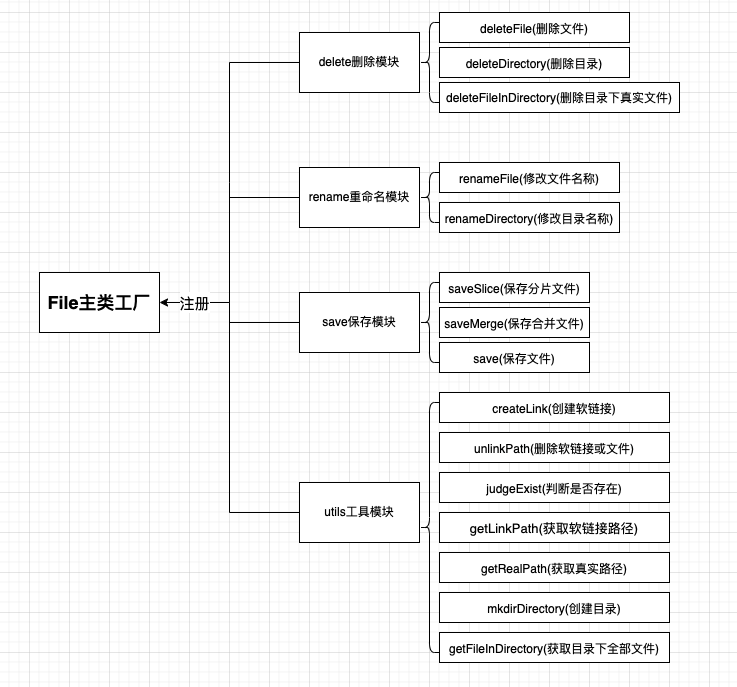

# 文件系统管理与可视化模块开发-Part3

| 文档创建人 | 创建日期   | 文档内容                                      | 更新时间   |
| ---------- | ---------- | --------------------------------------------- | ---------- |
| adsionli   | 2022-05-10 | 文件系统管理与可视化模块开发-后端文件系统管理 | 2022-05-10 |

**文章系列:**

1. [文件系统管理与可视化模块开发-Part1](https://adsionli.xslease.com/page/node/drawingBedPart01)
2. [文件系统管理与可视化模块开发-Part2](https://adsionli.xslease.com/page/node/drawingBedPart02)
3. [文件系统管理与可视化模块开发-Part3](https://adsionli.xslease.com/page/node/drawingBedPart03)

说完了前端文件上传之后，我们就可以来说说后端是如何设计文件系统的创建、删除、添加等相关内容的书写啦。

>本章内容主要涉及到了node的几个模块：fs模块、path模块、stream流

## express接收文件流

再说文件系统设计之前，我想先说一下，express中是如何获取到前端上传过来的文件流的，因为我使用的是express4.x的版本，request中取消了file的获取，所以需要通过第三插件来接收文件流，这里我使用的是`busboy`，当然其他的也都是可以的，然后我们可以来看一下接收的代码该怎么写：

```js
let _this = this;
return new Promise((resolve, reject) => {
    try {
        let busboy = Busboy({
            headers: request.headers
        })
        let additional = {};
        additional['path'] = this.slicePath;
        /**
                 * README: 这里busboy有个奇怪的坑，就是无法对field在后面的时候进行处理，
                 *         只能在传过来的formData中将file放在最后才可以，所以传过来的时候要注意一下
                 */
        busboy.on('file', async function (name, file, info) {
            let returnData = await _this.fileHandle.saveSlice(file, additional);
            resolve({
                status: true
            })
        })
        busboy.on('field', function (name, value, info) {
            additional[name] = value;
        })
        //NOTE: 通过管道，把request中内容写入到busboy中
        request.pipe(busboy);
    } catch (e) {
        console.log(e);
        reject(e);
    }
})
```

代码实现起来很简单，直接跟着busboy的文旦来写就可以了，这里有一个注意的点就是在写获取额外上传内容的时候，我们需要把`field`事件写在`file`读取事件之后，不然的话，就无法获取到`formData`中额外携带的参数了。

同时我们需要把request输入流写入到busboy中去，这样我们就可以开始读取文件了，然后我们就可以在读取到文件数据之后，去进行我们的文件保存工作了，busboy的`file`读取事件中返回的第二个file参数是一个文件流数据，这就为我们之后的写入很方便啦，直接用就完事了。

> busboy的文档地址:https://www.npmjs.com/package/busboy
>
> 文件流相关内容地址: https://www.nodeapp.cn/stream.html#stream_class_stream_readable

## 文件管理系统结构设计

为了更好地增加可拓展性以及代码间的解耦，我选用了工厂模式来设计开发了文件系统管理模块，主要结构如下图所示：



上面就是我们整个文件系统封装的内容。其中比较重要的就是saveSlice、saveMerge、createLink、mkdirDirectory以及deleteFileInDirectory这五个函数，是我们整个的核心内容，其他函数方法都是为这几个方法做支撑的，当然也可以单独被使用。

接下来我们就一个一个展开说说。

### saveSlice函数

`saveSlice`函数的用途就是用来保存前端上传过来的分片数据文件，并且保存在一个默认保存分片数据的地方。

我们跟着代码一点点的开始分析

```js
/**
 * @method saveSlice 保存分片文件
 * @param {ReadableStream} file 文件读取流
 * @param {SliceType: {hash_key: string, idx: number, path:string}} options 配置属性
 */
const saveSlice = function (file, options) {
    return new Promise((resolve, reject) => {
        try {
            let fileWrite = this.fs.openSync(this.path.resolve(options.path, `./${options.hash_key}_${options.idx}`), 'a+');
            file.on('data', (data) => {
                this.fs.appendFileSync(fileWrite, data);
            })
            file.on('close', () => {
                console.log('end');
                this.fs.closeSync(fileWrite)
                resolve({
                    status: true
                })
            })
            file.on('error', () => {
                console.log('error');
                this.fs.closeSync(fileWrite)
                reject({
                    status: false,
                    message: "读取并写入文件时发生错误"
                })
            })
        } catch (e) {
            reject({
                status: false,
                message: "读取并写入文件时发生错误:" + e.message
            })
        }
    })
}
```

在上面一节我们说了传入的file是一个文件流，所以我们可以很简单的完成写入啦。

1. 使用同步函数`openSync`打开指定名称的文件，并且设置打开方式为追加，这里选择使用`a+`，当文件不存在时，会自动创建一个文件并且使用追加的形式打开，关于追加是什么，大家可以自己去了解一下。
2. 我们需要捕获三个事件，分别是数据读取、读取完成、发生错误，我们将在数据读取中调用同步方法`appendFileSync`，将数据追加到文件的末尾中去，这里也可以使用`file.pipe(fileWrite)`来实现，但是我感觉用`appendFileSync`更加符合主观第一印象(个人习惯)。
3. 当我们文件写入完成后，我们就可以关闭文件，将文件的操作权利让出，一定要主动去关闭文件，以达到释放内存空间的目的，节省内存开销。
4. 如果出现错误，我们就直接`reject`掉的同时关闭文件读取。

就这样，很简单的保存文件分片数据就完成了。

关于路径的获取，我们可以提前在File工厂类中写好相关的配置属性，这样我们就可以直接调用了，然后再将formData中额外携带的hash标识与分片下标拼接在一起，就构成了我们分片的数据名称了。

> 注意的一点：我们需要提供完整的文件路径，而不能是相对路径，所以我们这里使用的`path.resolve`方法将路径拼接在一起的，而不是`path.relative`。

### saveMerge函数

`saveMerge`函数方法的作用就是：当分片数据全部上传并保存完毕之后，将文件合并并保存在指定位置，创建软链接地址，对应用户自定义位置。

一样，先看代码实现:

```js
/**
 * @method saveMerge 保存合并文件
 * @param {MergeType:{name: string, hash_key:string, linkPath: string, savePath: string, sliceCount: number, type: string}} options 传入数据
 * @description 这里的操作步骤：1. 找到全部符合条件的分片数据
 * 2. 将分片数据全部写入到同一个文件中去
 * 3. 创建软链接，并触发event，创建到数据库去，然后创建相关的文件夹
 */
const saveMerge = function (options) {
    return new Promise((resolve, reject) => {
        try {
            let nameList = options.name.split('.');
            let deposit = this.path.resolve(options.savePath, `${nameList[0]}_${options.hash_key}.${nameList[1]}`);
            let slicePath = this.path.resolve(global.__dirname, `./${this.config.slice}`, options.hash_key);
            let fd = this.fs.openSync(deposit, 'a+');
            for (let i = 0; i < options.sliceCount; i++) {
                let sliceData = slicePath + '_' + i;
                if (!this.judgeExist(sliceData)) {
                    throw new Error("分片文件不存在！无法完成内容合并！");
                }
                let fileData = this.fs.readFileSync(sliceData);
                this.fs.appendFileSync(fd, fileData);
            }
            this.fs.closeSync(fd);
            this.createLink(deposit, this.path.resolve(options.linkPath, options.name))
            resolve({
                status: true,
                fullPath: deposit,
                name: options.name,
                linkPath: options.linkPath
            })
        } catch (e) {
            reject(new Error("分片合并失败！" + e.message))
        }
    })
}
```

