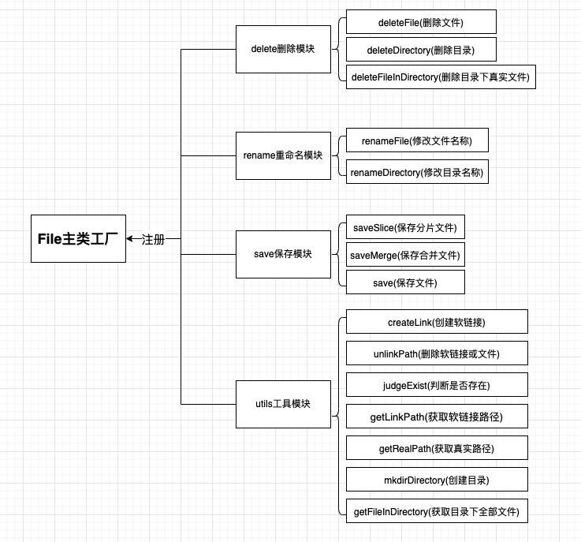

# 文件系统管理与可视化模块开发-Part4

| 文档创建人 | 创建日期   | 文档内容                                      | 更新时间   |
| ---------- | ---------- | --------------------------------------------- | ---------- |
| adsionli   | 2022-05-10 | 文件系统管理与可视化模块开发-后端文件系统管理 | 2022-05-10 |

**文章系列:**

1. [文件系统管理与可视化模块开发-Part1](https://juejin.cn/post/7112050624220364813)
2. [文件系统管理与可视化模块开发-Part2](https://juejin.cn/post/7112052145301487623)
3. [文件系统管理与可视化模块开发-Part3](https://juejin.cn/post/7112284530567823367/)

说完了前端文件上传之后，我们就可以来说说后端是如何设计文件系统的创建、删除、添加等相关内容的书写啦。

>本章内容主要涉及到了node的几个模块：fs模块、path模块、stream流

## express接收文件流

再说文件系统设计之前，我想先说一下，express中是如何获取到前端上传过来的文件流的，因为我使用的是express4.x的版本，request中取消了file的获取，所以需要通过第三插件来接收文件流，这里我使用的是`busboy`，当然其他的也都是可以的，然后我们可以来看一下接收的代码该怎么写：

```js
let _this = this;
return new Promise((resolve, reject) => {
    try {
        let busboy = Busboy({
            headers: request.headers
        })
        let additional = {};
        additional['path'] = this.slicePath;
        /**
                 * README: 这里busboy有个奇怪的坑，就是无法对field在后面的时候进行处理，
                 *         只能在传过来的formData中将file放在最后才可以，所以传过来的时候要注意一下
                 */
        busboy.on('file', async function (name, file, info) {
            let returnData = await _this.fileHandle.saveSlice(file, additional);
            resolve({
                status: true
            })
        })
        busboy.on('field', function (name, value, info) {
            additional[name] = value;
        })
        //NOTE: 通过管道，把request中内容写入到busboy中
        request.pipe(busboy);
    } catch (e) {
        console.log(e);
        reject(e);
    }
})
```

代码实现起来很简单，直接跟着busboy的文旦来写就可以了，这里有一个注意的点就是在写获取额外上传内容的时候，我们需要把`field`事件写在`file`读取事件之后，不然的话，就无法获取到`formData`中额外携带的参数了。

同时我们需要把request输入流写入到busboy中去，这样我们就可以开始读取文件了，然后我们就可以在读取到文件数据之后，去进行我们的文件保存工作了，busboy的`file`读取事件中返回的第二个file参数是一个文件流数据，这就为我们之后的写入很方便啦，直接用就完事了。

> busboy的文档地址:https://www.npmjs.com/package/busboy
>
> 文件流相关内容地址: https://www.nodeapp.cn/stream.html#stream_class_stream_readable

## 文件管理系统结构设计

为了更好地增加可拓展性以及代码间的解耦，我选用了工厂模式来设计开发了文件系统管理模块，主要结构如下图所示：



上面就是我们整个文件系统封装的内容。其中比较重要的就是`saveSlice`、`saveMerge`、`createLink`、`deleteFilesInDirectory`这几个函数，是我们整个的核心内容，其他函数方法都是为这几个方法做支撑的，当然也可以单独被使用。

接下来我们就一个一个展开说说。

### 工厂类的实现

直接上代码

```js
import { createRequire } from 'module';
import fs from "fs";
import path from "path";
import * as Save from "./utils/save.js";
import * as Utils from "./utils/utils.js"
import * as Rename from "./utils/rename.js"
import * as Delete from "./utils/delete.js";
import * as PathModify from "./utils/path_modify.js"
const handleList = [Save, Utils, Rename, Delete, PathModify];
const require = createRequire(import.meta.url);
/**
 * README: 文件管理系统
 */
class FileSetting {
    constructor() {
        this.fs = fs;
        this.path = path;
        this.config = require('./config/save.json');
        this.registerHandle();
    }

    /**
     * @method registerHandle 注册相关方法
     */
    registerHandle() {
        for (let module of handleList) {
            for (let fn of Reflect.ownKeys(module)) {
                if (typeof fn !== 'string' || fn === '__esModule') {
                    continue
                }
                this[fn] = module[fn].bind(this);
            }
        }
    }
}
```

使用JS来实现工厂类还是比较简单的，通过使用EsModule的导入，使其在编译时就被执行，然后再通过register函数，注册入当前这个对象下，这里实际使用到了原型链的知识，所以如果大家想要刨根究底的弄通一个知识话，还需要能够知道其实际为什么这样干，才能有所提升。

> 注：如果是要绑定到当前这对象下的话，函数不能使用箭头函数的形式进行声明，因为这样就会无法使用bind来绑定上下文，因为其上下文对象只会是当前文件下的作用域。(其实好像也不用使用`bind`进行绑定，因为加入到this下的话，等于`FileSetting.prototype.fn = module[fn]`，当时考虑的不好)

### saveSlice函数

`saveSlice`函数的用途就是用来保存前端上传过来的分片数据文件，并且保存在一个默认保存分片数据的地方。

我们跟着代码一点点的开始分析

```js
/**
 * @method saveSlice 保存分片文件
 * @param {ReadableStream} file 文件读取流
 * @param {SliceType: {hash_key: string, idx: number, path:string}} options 配置属性
 */
const saveSlice = function (file, options) {
    return new Promise((resolve, reject) => {
        try {
            let fileWrite = this.fs.openSync(this.path.resolve(options.path, `./${options.hash_key}_${options.idx}`), 'a+');
            file.on('data', (data) => {
                this.fs.appendFileSync(fileWrite, data);
            })
            file.on('close', () => {
                console.log('end');
                this.fs.closeSync(fileWrite)
                resolve({
                    status: true
                })
            })
            file.on('error', () => {
                console.log('error');
                this.fs.closeSync(fileWrite)
                reject({
                    status: false,
                    message: "读取并写入文件时发生错误"
                })
            })
        } catch (e) {
            reject({
                status: false,
                message: "读取并写入文件时发生错误:" + e.message
            })
        }
    })
}
```

在上面一节我们说了传入的file是一个文件流，所以我们可以很简单的完成写入啦。

1. 使用同步函数`openSync`打开指定名称的文件，并且设置打开方式为追加，这里选择使用`a+`，当文件不存在时，会自动创建一个文件并且使用追加的形式打开，关于追加是什么，大家可以自己去了解一下。
2. 我们需要捕获三个事件，分别是数据读取、读取完成、发生错误，我们将在数据读取中调用同步方法`appendFileSync`，将数据追加到文件的末尾中去，这里也可以使用`file.pipe(fileWrite)`来实现，但是我感觉用`appendFileSync`更加符合主观第一印象(个人习惯)。
3. 当我们文件写入完成后，我们就可以关闭文件，将文件的操作权利让出，一定要主动去关闭文件，以达到释放内存空间的目的，节省内存开销。
4. 如果出现错误，我们就直接`reject`掉的同时关闭文件读取。

就这样，很简单的保存文件分片数据就完成了。

关于路径的获取，我们可以提前在File工厂类中写好相关的配置属性，这样我们就可以直接调用了，然后再将formData中额外携带的hash标识与分片下标拼接在一起，就构成了我们分片的数据名称了。

> 注意的一点：我们需要提供完整的文件路径，而不能是相对路径，所以我们这里使用的`path.resolve`方法将路径拼接在一起的，而不是`path.relative`。

### saveMerge函数

`saveMerge`函数方法的作用就是：当分片数据全部上传并保存完毕之后，将文件合并并保存在指定位置，创建软链接地址，对应用户自定义位置。

一样，先看代码实现:

```js
/**
 * @method saveMerge 保存合并文件
 * @param {MergeType:{name: string, hash_key:string, linkPath: string, savePath: string, sliceCount: number, type: string}} options 传入数据
 * @description 这里的操作步骤：1. 找到全部符合条件的分片数据
 * 2. 将分片数据全部写入到同一个文件中去
 * 3. 创建软链接，并触发event，创建到数据库去，然后创建相关的文件夹
 */
const saveMerge = function (options) {
    return new Promise((resolve, reject) => {
        try {
            let nameList = options.name.split('.');
            let deposit = this.path.resolve(options.savePath, `${nameList[0]}_${options.hash_key}.${nameList[1]}`);
            let slicePath = this.path.resolve(global.__dirname, `./${this.config.slice}`, options.hash_key);
            let fd = this.fs.openSync(deposit, 'a+');
            for (let i = 0; i < options.sliceCount; i++) {
                let sliceData = slicePath + '_' + i;
                if (!this.judgeExist(sliceData)) {
                    throw new Error("分片文件不存在！无法完成内容合并！");
                }
                let fileData = this.fs.readFileSync(sliceData);
                this.fs.appendFileSync(fd, fileData);
            }
            this.fs.closeSync(fd);
            this.createLink(deposit, this.path.resolve(options.linkPath, options.name))
            resolve({
                status: true,
                fullPath: deposit,
                name: options.name,
                linkPath: options.linkPath
            })
        } catch (e) {
            reject(new Error("分片合并失败！" + e.message))
        }
    })
}
```

其实`saveMerge`函数的实现和保存分片时的操作一样，我们需要先根据传入的options中的部分属性进行设置。所以先来看一下前端传过来的options中包括什么内容：

1. `options.name`: 文件保存名称

2. `options.linkPath`：软链接地址，这个是在controller中处理好，传到`saveMerge`函数中的。

   ```js
   this.fileLinkPath = path.resolve(global.__dirname, 'public/file/link')
   
   let linkPath = path.resolve(this.fileLinkPath, `./${fileInfo.path}`);
   ```

   通过`path`模块将两个文件路径相对合并。

3. `options.savePath`:默认保存路径，主要使用在自己项目中时，分别会用来保存markdown文件和image文件区分的不同保存路径，因为我是将同类型源文件都保存一个目录下的，然后创建软链接到用户自定义路径下的。

4. `options.sliceCount`:文件分片数量，要用来合并分片用的

5. `options.type`:暂时无用

我们通过传入的`sliceCount`就可以直到所有分片文件的大小，然后再通过传入的文件保存路径以及相对路径，来确保之后源文件的保存地址与软链接地址。然后再通过`split`文件名称，来设置好文件保存名称。

之后就是对分片文件的合并，在分片文件合并时，我们需要去判断分片文件是否存在，来确保合并出来后的文件能够被恢复且不缺少内容，如果分片文件丢失了，那么就抛出错误。

> 其实这里就是文件分片上传的意义所在，我们能够在文件下一次上传时，通过hash值，查找已经存在的分片内容，然后将未上传的分片内容进行接收，已上传的分片文件就不需要重复上传了。

之后就和保存分片文件一样，首先通过`openSync`并指定类型为`a+`（追加，且当原文件不存在时创建文件），然后就将每一个分片文件通过`appendFileSync`追加到文件中。当所有分片文件集合完成后，关闭文件流`closeSync`，并且创建软链接，即调用已经封装好的`createLink`方法。

#### createLink实现

```js
/**
 * @method createLink 创建软链接
 * @param {string} file 源文件路径
 * @param {string} linkPath 软链接路径
 */
const createLink = function (file, linkPath) {
    try {
        let fileExist = this.judgeExist(file);
        if (!fileExist) {
            throw new Error("源文件不存在!")
        }
        let linkPathList = linkPath.substr(0).split('/').filter(v => {
            return v != '';
        });
        linkPathList.pop();
        linkPathList = "/" + linkPathList.join("/")
        let linkExist = this.judgeExist(this.path.normalize(linkPathList));
        // //NOTE: 如果软链接的前置路径不存在的话，就会去创建一个前置路径，当然这里要注意，必须提供完整路径且一级一级创建，不然会报错
        if (!linkExist) {
            linkPathList = linkPathList.substr(0).split('/').filter(v => {
                return v != '';
            }).slice(8);
            let path = this.path.resolve(global.__dirname, './public/file/link');
            for (let i = 0; i < linkPathList.length; i++) {
                path = this.path.resolve(path, `./${linkPathList[i]}`);
                if (!this.judgeExist(path)) {
                    this.fs.mkdirSync(path);
                }
            }
        }
        this.fs.symlinkSync(file, linkPath);
        return this;
    } catch (e) {
        console.log(e)
        throw e;
    }
}
```

创建软链接过程也比较简单，但是这里需要注意的是，**如果软链接文件存放的文件目录没有被创建的话，直接创建软链接的时候会报错**，所以为了解决这个问题，我们需要首先对文件路径进行分析，先将完整的文件目录路径创建出来。

> 创建目录路径的时候，其实在之前我们就已经判断过是否是新创建的文件目录路径了，如果是新的路径，就会触发数据库添加，会往数据库中一级一级添加文件目录数据。

创建文件目录也就是调用同步方法`mkdirSync`方法即可，传入路径。

最后再通过`symlinkSync`完成软链接的创建即可以啦。

当我们创建完软链接并链接到原文件地址后，整个文件合并也就到了尾声，最后再将信息进行返回，因为之后还需要将这些内容存入到对应的数据库中即可完成。

### deleteFilesInDirectory函数

`deleteFilesInDirectory`函数主要是为了删除目录下的文件，因为我们保存在对应目录下的内容都是软链接地址，所以我们需要先获取软链接文件链接的真实文件地址，然后将真实文件也要同步删除掉才可以，所以具体实现如下：

```js
/**
 * @method deleteFilesInDirectory 删除目录下的全部文件
 * @param {*} path 
 */
const deleteFilesInDirectory = async function (path) {
    try {
        let fileList = await this.getFilesInDirectory(path);
        if (fileList.length == 0) {
            return true;
        }
        for (let v of fileList) {
            this.deleteFile(v);
        }
        return true;
    } catch (e) {
        throw new Error(e);
    }
}
```

可以看到，我们会调用`getFilesInDirectory`方法，来获取文件目录下的全部文件数据，`getFilesInDirectory`实现如下:

```js
/**
 * @method getFilesInDirectory 获取目录下的全部文件
 * @param {*} path 目录路径
 */
const getFilesInDirectory = async function (path) {
    try {
        let fileRealPath = [];
        if (!this.judgeExist(path)) {
            throw new Error("当前目录路径不存在:" + path)
        }
        let fileList = glob.sync(`${path}/*`);
        for (let v of fileList) {
            let info = this.fs.statSync(v);
            if (info.isDirectory()) {
                fileRealPath.push(...(await this.getFilesInDirectory(v)));
            } else {
                //获取真实文件路径，并放入返回中
                let realPath = await this.getRealPath(v);
                fileRealPath.push(realPath)
            }
        }
        
        return fileRealPath
    } catch (e) {
        throw new Error(e);
    }
}
```

`getFilesInDirectory`函数的实现不是很困难，只是一个简单的递归调用，然后再将每一次读取到的目录下的文件返回，因为删除一个目录的时候，其下可能存在多级目录，所以需要进行递归来获取，然后再将所有的文件放在一个**一维数组**中统一返回即可。

当我们获取到了所有真实文件路径之后，就可以一个一个把文件进行删除，删除文件的话只需要调用一下`deleteFile`函数即可，这个函数实现比较简单:

```js
/**
 * @method deleteFile 删除文件
 * @param {*} path 文件路径
 */
const deleteFile = function (path) {
    if (!this.judgeExist(path)) {
        throw new Error("当前文件路径不存在:" + path)
    }
    this.fs.unlinkSync(path);
    return this;
}
```

这里可以直接使用`unlinkSync`这个同步方法，他不仅可以删除软链接，也可以删除文件，所以直接调用这个就可以了。

好了，这样我们就可以在同步删除软连接目录时，同时删除对应到真实文件的内容啦。


其它函数的实现就比较简单了，这里就不再一一列举了，可以前往[github的项目库](https://github.com/FlyBirdHeight/adsionli-back/tree/main/modules/file)中进行查看。


## 结束语

这里主要就是说了一下自己如何对文件管理的模块的封装，主要使用到Node下的`fs`与`path`模块的使用。还有就是如何通过`busboy`来接受前端传过来的文件数据，为了防止每一篇字数过多，我将会在下一篇中说一下针对前端操作所开的项目接口以及执行流程，然后在下下篇就要开始具体说一下另外一个很大的模块，文件可视化模块啦。现在除了在自己的博客上发布文章，也开始在掘金上发布文章了，因为想要和跟多的人进行交流学习，还希望大家多多指出文章不足的内容，共同进步。

> 其实这块内容已经做完2个多月了，因为太懒了，一直还没写完总结，嘿嘿


