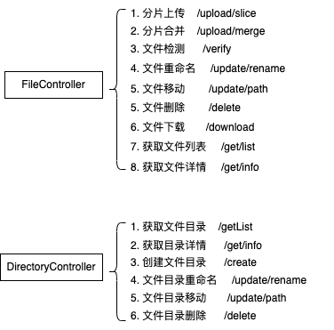

# 文件系统管理与可视化模块开发-Part5

| 文档创建人 | 创建日期   | 文档内容                                          | 更新时间   |
| ---------- | ---------- | ------------------------------------------------- | ---------- |
| adsionli   | 2022-06-24 | 文件系统管理与可视化模块开发-后端接口及数据库设计 | 2022-06-24 |

1. [文件系统管理与可视化模块开发-Part1](https://juejin.cn/post/7112050624220364813)
2. [文件系统管理与可视化模块开发-Part2](https://juejin.cn/post/7112052145301487623)
3. [文件系统管理与可视化模块开发-Part3](https://juejin.cn/post/7112284530567823367/)
4. [文件系统管理与可视化模块开发-Part4](https://juejin.cn/post/7112307948604358692)

之前几章内容已经将文件上传及文件管理说明的差不多了，现在这一章就是说一下后端接口设计及数据库内容设计。因为主要是个人使用，所以设计的不会很复杂，而且一直没有什么工作经历，所以不会有太多的考虑，还望各位多多包涵😂，只是分享一下自己的实现。

## 数据表设计

为了记录文件的外链地址以及提高命中效率，选择使用数据表来存储文件及目录的数据，所以之后的数据表也主要分成两张，一张`Files`表，一张`Directories`表，同时将两张表进行外键关联，方便再删除的时候进行同时删除

> 当然设置外键可能会对性能上有影响，但是这个内容针对的也只是自己个人的，所以偷懒了，直接使用外键关联，然后在删除`directorys`的时候，关联删除`files`表中的数据，以及本表中的子数据。

### Directories表

表结构如下

```sql
create table directories
(
    id              int auto_increment
        primary key,
    name            varchar(255)  default 'file'            not null comment '文件夹名称',
    level           int           default 1                 not null comment '文件夹层级，默认第0级，即最上层',
    parent_id       int           default 0                 not null comment '上一级文件夹id',
    directory_size  bigint        default 0                 not null comment '文件夹大小',
    image_count     int           default 0                 not null comment '图片数量',
    directory_count int           default 0                 not null comment '子文件夹数量',
    file_count      int           default 0                 not null comment '普通文件数量，不包含文件夹，包含图片',
    created_at      timestamp     default CURRENT_TIMESTAMP null,
    updated_at      timestamp                               null on update CURRENT_TIMESTAMP,
    relative_path   varchar(1024) default ''                not null comment '相对地址',
    real_path       varchar(2048) default ''                not null comment '真实地址',
    constraint relative_path
        unique (relative_path),
    constraint directories_fk_parent_id
        foreign key (parent_id) references directories (id)
            on delete cascade
)
    comment '文件夹列表';

create index directories_index_parent_id
    on directories (parent_id);
```

很简单的一张表，不过设置了相对路径的唯一性，避免相同的相对路径导致重复的脏数据的产生。同时对于文件目录来说，其是可以拥有子目录的，所以还需要记录一下`parent_id`，同时为其设置外键关联，并设置`delete cascade`。

### Files表

表结构如下

```sql
create table files
(
    id             int auto_increment comment '文件标记主键'
        primary key,
    path           varchar(300)                            not null comment '文件存放路径',
    type           int           default 0                 not null comment '文件类型，0：图片，1：文章md',
    name           varchar(255)                            not null comment '文件名称',
    description    varchar(300)  default ''                null comment '文件简介',
    url            varchar(300)                            not null comment '外链设置',
    download_count int           default 0                 not null comment '下载数量',
    created_at     timestamp     default CURRENT_TIMESTAMP not null,
    updated_at     timestamp                               null on update CURRENT_TIMESTAMP,
    size           bigint        default 0                 not null comment '文件大小',
    use_count      int           default 0                 null comment '图片使用次数',
    directory_id   int           default 1                 not null comment '文件夹路径id',
    hash_tag       varchar(1024) default ''                not null comment '唯一性标识',
    link_path      varchar(1024) default ''                not null comment '软链接地址',
    constraint files_directory_id
        foreign key (directory_id) references directories (id)
            on delete cascade
)
    comment '文件数据';
```

这里需要存储文件的hash标识，以及相对路径也就是软链接路径，同时还需要保存外链设置，因为当我们需要应用图片文件的时候，就需要使用外链了，所以保存在数据库会比较方便获取，同时我们可以对文件使用的相关内容做一些记录，方便后期的分析。

### 一些Sql记录

再开发的时候，有一些`sql`书写属实有点困难，在这里进行一些记录，也是因为很久不太写了。

1. 文件目录更新后，更新子文件目录路径以及其下所有文件。

   > 这个一开始想着要不要在后端手动控制书写的，后来发现还不如直接丢到数据库里面处理。

   具体`sql`如下:

   ```sql
   update directories set
       relative_path = concat('/resources/link/images', substring(relative_path, char_length('/resources/link/image') + 1)),
       real_path = concat('/Users/adsionli/resources/images',
           substring(real_path, char_length('/Users/adsionli/resources/image') + 1))
   where relative_path like '/resources/link/image%';
   ```

   上面就更新一个文件目录时的`sql`啦，通过使用`sql`中提供的`concat,substring,char_length`函数的使用，配合`like`获取到全部相同的父路径的目录路径，然后进行统一修改，这样就可以完成啦。上面这个就是将`/resources/link/image`修改成`/resources/link/images`的一个修改操作

   > 这种路径修改，一般就是在修改文件目录名称的时候执行，对于文件目录移动后的更新其实和这个也差不多的

   更新完文件目录后，还需要将对应其下的全部的文件的相对路径，外链地址进行更新，还是采用和上面更新文件目录的形式进行更新，其具体`sql`如下：

   ```sql
   update files set url = concat(substring_index(url, '/resources/link/images', 1), '/resources/link/image',
       substring(url, char_length(concat(substring_index(url, '/resources/link/images', 1), '/resources/link/image')) + 1)),
       link_path = concat('/Users/adsionli/resources/link/images',
           substring(link_path, char_length('/Users/adsionli/resources/link/image') + 1))
   where url like '%/resources/link/images%';
   ```

   > 这里为什么可以使用`like`时，前后都可以加`%%`，原因是上面我在设置`directories`表的时候，将`relative_path`设置成了唯一，所以不太用担心匹配出现问题。当然十分特殊的时候，我实在没遇到过......还望大家在使用的时候，遇到的话，可以给我留言......

2. 文艺目录移动或文件移动时的`sql`。

   处理sql与上面一样，嘿嘿。

> 具体在代码中实现呢，我使用了自己开发的一个简单的orm框架来书写，这个之后也会整理出文章，和大家进行分享😂

## 接口设计

完成了上面比较核心的sql书写与以及数据表的创建之后，我们就需要来对我们需要使用到的功能进行接口设计了。主要接口见下图



接口内容不是太多，因为根据我们要做的东西相对来说已经完全够用了，当然比如说修改使用者权限什么的这种，暂时就没有考虑去做，之后等秋招结束后，再去慢慢实现啦。

> 本人要忙着秋招了....所以很多东西相要写但没啥时间，等这段时间过了，再回来继续填坑

其中有几个接口需要详细说一下，分别是**文件目录删除、文件目录获取、文件目录移动**，主要比较困难的实现都是在文件目录这块，至于文件来说，在之前其实都说的差不多了，大概还会和大家说说文件移动，其他都比较简单，没必要都详细说明，大家可以自己去看看代码。

### 文件目录接口

#### 获取文件目录

获取文件目录前端主要需要传递的参数只有一个，就是请求目录的`id`，后端通过取得目录`id`来获取到当前目录下的所有内容，包括其下的`directories`与`files`。

> 这里只支持一级的获取，不支持多层级的获取，当然这个是可以自己设置的。

为了取得其下的`directories`与`files`的话，我们就需要在设置`DirectoryModel`的时候，在其中声明一下关联关系，当然我们需要知道目录对于其子目录与文件来说都是一对多的关系，所以`Model`中可以这样写:

```js
/**
* @method hasManyFiles 一个文件夹拥有很多文件
*/
hasManyFiles() {
    return this.hasMany('files', 'id', 'directory_id');
}

/**
* @method hasManyDirectories 一个文件夹可以拥有多个文件夹
*/
hasManyDirectories() {
    return this.hasMany(this.table, 'id', 'parent_id');
}
```

> 对了，需要声明一下，我这里可以这样写是因为自己做的`orm`中间件下支持了关系关联，所以可以这样写😂。具体`orm`的代码的话，在项目下的`modules`目录下的`orm`文件夹中可以找到。这里没有用第三方的，因为当时自己的时间比较多，就自己写了。这块内容之后也会出文章来分享一下

在声明好关系之后，我们就可以在做查询的时候加上

```js
/**
* @method getInfoWithFileAndDirectory 获取文件夹信息及其子文件与子文件夹
* @param {number} id 文件夹id
* @param {boolean} first 第一次请求根目录
*/
getInfoWithFileAndDirectory(id, first = false) {
    let where;
    where = {
        id: id
    }
    return this.with(['hasManyDirectories', 'hasManyFiles']).find({
        where
    });
}
```

好了，这样就完成啦，然后再在对应的`Service`中，去调用`Model`的方法就可以进行返回咯。

#### 移动文件目录

文件目录移动是一个比较麻烦的事情，因为我们需要把其下所有的子目录以及所有的文件都进行路径更新，这还包括子目录中的子目录和文件，如果用程序中去处理的话，实在是麻烦，所以就按照上面的sql来直接处理了，当然可能会遇到问题，所以加了唯一性标识来确保不会出现问题😂，当然会不会出现问题，暂时还没遇到......

然后直接来看看实现的代码，这里贴出的是Service中的实现代码:

```js
/**
* @method changePath 修改目录路径
* @param {{id: number, directory_id: number, relative_path: string, oldPath: string}} options 修改内容
*/
async changePath(options) {
    let findData = await this.directoryModel.findById(options.directory_id);
    let directoryData = await this.directoryModel.findById(options.id);
    if (findData.length == 0 || directoryData.length == 0) {
        throw new ChangeDirectoryPathError('父级/本目录不存在', {
            id: options.id,
            relative_path: options.relative_path
        })
    }
    let selfInfo = directoryData[0]
    let connection = await this.directoryModel.startAffair(true);
    try {
        let updateNameSql = await this.directoryModel.update({
            set: {
                parent_id: options.directory_id,
                level: findData[0].level + 1
            },
            where: {
                id: options.id
            }
        }, true)
        let updateDirectoryPath = await this.directoryModel.updateDirectoryPath(selfInfo, { name: options.relative_path, oldName: options.oldPath }, true);
        let updateFilePath = await this.fileModel.updateFileUrlAndPath(selfInfo, { name: options.relative_path, oldName: options.oldPath }, true)
        await connection.query(updateNameSql);
        await connection.query(updateDirectoryPath);
        await connection.query(updateFilePath);
        this.fileHandle.changeDirectoryPath(selfInfo.real_path, selfInfo.real_path.replace(options.oldPath, options.relative_path));
        await connection.commit();

        return true;
    } catch (e) {
        await connection.rollback();
        throw new ChangeDirectoryPathError(e.message, {
            id: options.id,
            relative_path: options.relative_path
        })
    }
}
```

这里主要需要说明一下的就是为了确保数据表数据与真实文件地址的修改都需要同时完成，我们需要使用事务来控制数据提交，等待真实文件目录地址修改完成后，在对数据进行提交，这样可以确保不会脏数据。

这里的事务开启使用的依然是自己写的一个`startAffair`方法，不过这里由于自己没有设计好，所以需要通过对应的`Model`来调用事务的开启，确保是在这一次链接中的事务开启，这里是我自己的问题......

然后我们就可以调用在`Model`中写好的方法进行数据的更新，同时我还设置了如果最后一个参数是true的话，会返回处理好的sql而不会直接执行，然后在返回的事物对象中统一提交即可。

`updateDirectoryPath`与`updateFileUrlAndPath`实现如下(其实就是对上面一节中说的`sql`一样，不过是处理成了符合自己编写的`orm`框架的规则)

```js
/**
* @method updateDirectoryPath 更新目录路径,本身与子集
* @param {Directories} directory 源路径
* @param {{name: string, oldName: string}} options 修改信息
* @param {boolean} returnSql 是否返回sql且不执行
*/
updateDirectoryPath(directory, options, returnSql = true) {
    return this.update({
        set: {
            relative_path: {
                noEdit: true,
                data: `concat('${directory.relative_path.replace(options.oldName, options.name)}', substring(relative_path, char_length('${directory.relative_path}') + 1))`
            },
            real_path: {
                noEdit: true,
                data: `concat('${directory.real_path.replace(options.oldName, options.name)}', substring(real_path, char_length('${directory.real_path}') + 1))`
            },
        },
        where: {
            relative_path: {
                type: "like",
                data: `${directory.relative_path}%`
            }
        }
    }, returnSql);
}

/**
* @method updateFileUrlAndPath 更新文件url与path，基于目录路径被修改
* @param {Directories} directory 源路径
* @param {{name: string, oldName: string}} options 修改信息
* @param {boolean} returnSql 是否返回sql且不执行
*/
updateFileUrlAndPath(directory, options, returnSql = true) {
    return this.update({
        set: {
            url: {
                noEdit: true,
                data: `concat(substring_index(url, '${directory.relative_path}', 1), '${directory.relative_path.replace(options.oldName, options.name)}',substring(url, char_length(concat(substring_index(url, '${directory.relative_path}', 1), '${directory.relative_path}')) + 1))
                `
            },
            link_path: {
                noEdit: true,
                data: `concat('${directory.real_path.replace(options.oldName, options.name)}',substring(link_path, char_length('${directory.real_path}') + 1))`
            }
        },
        where: {
            url: {
                type: "like",
                data: `%${directory.relative_path}%`
            }
        }
    }, returnSql);
}
```

好啦，这样就完成了文件目录的移动，以及其子目录和文件的修改，上面的一些语法也是自己写的orm中的规则，大家可以等我以后把这个坑填上😂

#### 删除文件目录

删除文件目录的难点主要就是在还需要删除其下软连接文件对应的真实文件，但是这一块内容的话，在[part4](https://juejin.cn/post/7112307948604358692)中已经解决啦，所以我们在Service中也只是需要去把事务开启，等待文件目录与真实文件删除后，在处理数据表中数据即可，具体实现如下，就不解释啦，大家自己看看

```js
/**
* @method deleteDirectory 删除目录文件
* @param {{id: number}} options 待删除数据
*/
async deleteDirectory(options) {
    //NOTE: 开启事务进行删除，为了保证不会发生错误
    let connection = await this.directoryModel.startAffair(true);
    try {
        let deleteSql = await this.directoryModel.deleteById(options.id, true);
        let findData = await this.directoryModel.findById(options.id);   
        if (findData.length == 0) {
            throw new DeleteDirectoryError("当前文件目录不存在!", options.id)
        }
        let dir = findData[0];
        await connection.query(deleteSql);
        //TODO: 这里是否要放到events中去执行，执行失败放入消息队列，然后继续重新处理？先同步执行好了
        await this.fileHandle.deleteFilesInDirectory(dir.real_path);
        await this.fileHandle.deleteDirectory(dir.real_path);
        await connection.commit()
        return true;
    } catch (e) {
        await connection.rollback();
        console.log(e);
        throw new DeleteDirectoryError(e.message, {
            id: options.id
        })
    }
}
```

### 文件接口

文件接口的话，主要比较多的需要去触发一些`event`，因为需要去统计到一些文件的数据，然后修改某些内容。其他的来说实现难度不是很大。比较麻烦的分片上传的话，也是在[part4](https://juejin.cn/post/7112307948604358692)中的开篇就有提到，这里就不重复了。

主要还是因为对于文件来说，其影响的范围比较小，只会影响其本身，不会影响其他的内容，所以书写起来的内容的话也就比较简单了。


## 结束语

哔哔赖赖了大半天终于把前期工作都完成啦，文件上传，文件保存，文件数据保存三个方面，接下来就是最关键的文件可视化啦，现在就滚去写文件可视化的内容，这块内容也比较多，因为要处理一大堆数据和亿点点的小细节。

> 感觉各位看本系列的大家，写代码也很久了，以前从来不会在任何平台进行分享，因为身边会有很多志同道合的人一起讨论，结果上了研究生之后，发现大家都忙着考公，考编。真正喜欢写代码的人越来越少，所以就想着在平台上与大家一起交流，进步。总比我一个人闭门造车要强很多啦，嘿嘿，感谢。