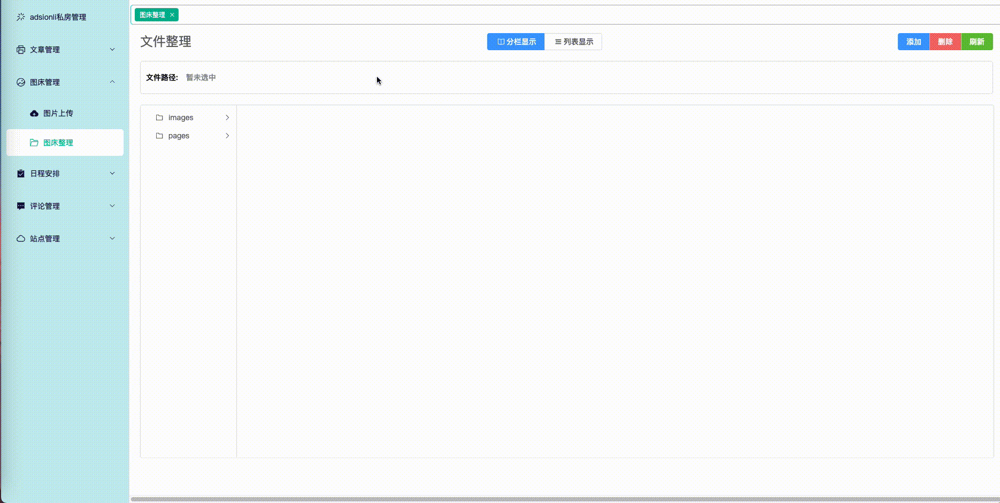

# 文件系统管理与可视化模块开发-Part5

| 文档创建人 | 创建日期   | 文档内容                                            | 更新时间   |
| ---------- | ---------- | --------------------------------------------------- | ---------- |
| adsionli   | 2022-06-24 | 文件系统管理与可视化模块开发-前端可视化实现内容分析 | 2022-06-24 |

终于到了如何实现前端可视化了，前面罗里吧嗦说了一大堆内容，这一篇就是如何实现前端可视化了。

本块内容开发选择使用了element-plus的`cascade-panel`，因为当我第一眼看到这个组件的时候，我就想着要做这个系列内容了，觉得很好用也很好玩，虽然在实际开发中遇到了挺多问题的，但是也都一一解决了。

接下来就可以开始我们前端可视化开发。

## 内容设计

首先先来明确一下我们实现的内容有哪些，这样才能更好的直到自己需要完成哪些。

> 真是又当产品，又当开发，哈哈哈，作为学生只能这样啦

### 页面构建

这里页面主要分成两种，一种是分栏可视化，一种是列表可视化

这一种是分栏可视化，也是其中最难实现的，主要是基于**elementplus**的`cascade-panel`这个组件，在用的时候真的是因为自己的愚蠢，被折磨了两天，属实是个笨蛋了。

还有一种就是列表显示了，是基于**elementplus**的table组件的二次封装的内容。

这个二次封装主要是之前看到了一篇写的特别好的文章，然后就想着自己去实现一下，就是这篇[毛呆老哥写的](https://juejin.cn/post/7043649748749778975)，真的非常的棒，提供了很多之前没有想的思路，果然自己还是个菜鸡。

> 然后在自己实现的时候，就有好好熟练地学习了`drag`事件，这也为之后的分栏显示中的`drag`做了很好地铺垫。

### 细节设计

还有一些细节上的设计

目录右键列表:

文件右键列表:

文件详情:

### 实现效果

首先是分栏显示，也就是我们的最主要实现的内容的一些内容展示

#### 分栏显示效果展示

1. 文件目录创建

   

2. 目录删除与文件删除

   

3. 文件目录与文件移动

   

4. 文件目录切换

   

5. 修改名称

   

列表展示就不放了，没什么特殊的地方。

## 结束语

这篇文章我们就先分析一下我们需要实现的功能，以及最终实现的效果，接下来就要进入真正的开发啦，冲呀

