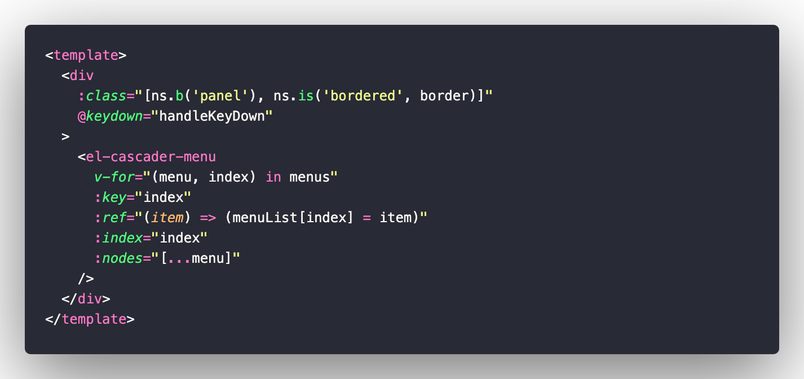
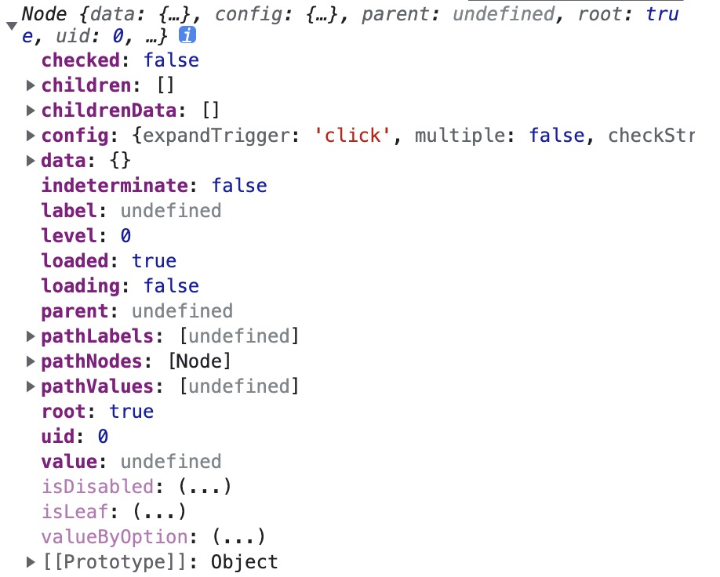
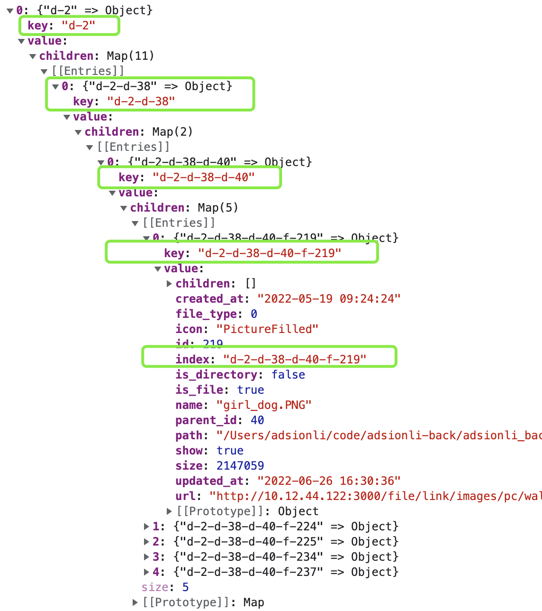

# 文件系统管理与可视化模块开发-Part7

| 文档创建人 | 创建日期   | 文档内容                                                   | 更新时间   |
| ---------- | ---------- | ---------------------------------------------------------- | ---------- |
| adsionli   | 2022-06-25 | 文件系统管理与可视化模块开发-`cascade-panel`讲解及数据处理 | 2022-06-25 |

1. [文件系统管理与可视化模块开发-Part1](https://juejin.cn/post/7112050624220364813)
2. [文件系统管理与可视化模块开发-Part2](https://juejin.cn/post/7112052145301487623)
3. [文件系统管理与可视化模块开发-Part3](https://juejin.cn/post/7112284530567823367/)
4. [文件系统管理与可视化模块开发-Part4](https://juejin.cn/post/7112307948604358692)
5. [文件系统管理与可视化模块开发-Part5](https://juejin.cn/post/7112663237694341156)
6. [文件系统管理与可视化模块开发-Part6](https://juejin.cn/post/7112713036778962975)

通过上一篇文章的分析，我们已经明确了自己需要实现的内容。然后在使用`cascade-panel`进行分栏展示中，我们需要区分出`directory`与`file`，因为`directory`是可以展开的，而`file`是作为叶子节点的，是可以最终被选中的。除了数据构造之外，我们还需要维护需要展示的节点，因为在删除，新建，移动等功能时，展开节点下内容会需要更新。这些都是我们需要在`cascade-panel`中去完成的，所以现在需要好好分析一下该如何利用**element-plus**的`cascade-panel`去完成这些。

> **element-plus**的文档写的太简单了，属实没多大用，被坑惨了，还是自己去翻他们实现的源码后，才完成的......
>
> [cascade-panel的文档](https://element-plus.org/zh-CN/component/cascader.html#cascaderpanel-%E5%B1%9E%E6%80%A7)

## cascade-panel解读

这一章主要来聊聊`cascade-panel`组件作用是什么，究竟是如何实现的，如何更新节点内容等。

### cascade-panel组件片段

`cascade-panel`组件一共由三部分组成，分别是最外层的`cascade-panel`，每一列的`cascade-panel-menu`以及每一列中的内容组件`menu-node`，三部分组成，其中对于我们来说，最重要就是最外层的`cascade-panel`。

首先看看他的`Fragment`片段是怎么写的。



我们可以看到，控制`cascade-panel`的`menu`生成的主要是一个`menus`数据，还有一个就是`menuList`这个数据，我们可以通过`menuList`这个数据拿到对应的列的`panel`。

**这里需要特别注意，`menus`与`menusList`这两个数据非常的重要，是我们之后需要操作的主要数据。**

### cascade-panel组件props使用

因为我们在使用`cascade-panel`这个组件时，和它本身的级联选择框有点不同，主要用于展示而不是最终的选中，而且展示的内容存在强关联的属性，所以我们不能直接在一开始的就加载好全部展示数据，需要一级级的请求获取，所以我们就需要使用其提供的`props`来设置`lazyload`懒加载的属性。

下面是在我使用的时候，设置的`props`的参数

```typescript
const columnSetting = {
  lazy: true,
  //NOTE: 这里的触发条件是当前结构下没有children时触发，一般情况下不触发的
  lazyLoad: lazyLoad,
  value: 'index',
  label: 'name',
  children: 'children',
  multiple: false,
  leaf: 'is_file',
}
```

这里有几个参数是需要注意的，虽然我们是展示性质的，但是还是要指定好叶子结点，因为我们的文件目录是可以展开的，所以不可能是叶子节点，所以只有文件这种不可展开的应该被设置为叶子结点，所以`leaf: 'is_file'`，这里的`is_file`也会在下面的数据处理后的结构中给出。

然后就是需要设置`lazy`为true，这样才会走入我们设置`lazyLoad`懒加载的方法，下面是实现懒加载的代码

```typescript
const lazyLoad = async function (node, resolve) {
  let data = []
  refreshCurrent.value = true
  if (node.level == 0) {
    list.value = await getMenuData({ id: 1 }, true)
    data = returnMenuData(list.value)
    currentData.value = null
  } else if (node.data.is_directory) {
    currentData.value = node.data
    data = await getMenuData(currentData.value, false)
  } else if (node.data.is_file) {
    data = undefined
  }
  resolve(data)
  nextTick(() => {
    scrollToRight()
  })
}
```

在`lazyLoad`函数中，接收的参数有两个，分别是`node`与`resolve`，`resolve`就是请求完成时，返回的回调，**是必须要被调用的，否则没有返回数据的**。`node`就是当前次展开节点的节点数据，其主要包含的内容见下图



上面这个`node`是在第一次加载时，传入的`node`，我们可以看到他的`level`是0，我们可以通过`level`来判断是否是第一次请求，如果是第一次请求，我们就可以在请求时告诉后端是第一次请求，并且设置`parent_id`为1，这样就可以获取根目录下的`level`为1的内容了。

> 这里是我们手动设置了一个根目录数据，id为1，是所有子目录的最外层根目录。

上面这些内容中还有一些比较重要的数据，之后会使用到的是:`parent,pathLabel,pathValues,children,childrenData,data,loaded,loading`

1. `parent`:父节点的`Node`类数据
2. `pathLabel`:路径的`label`数组数据
3. `pathValues`:路径的自定义`value`的数组数据
4. `children`: 子数据的Node数据
5. `childrenData`:子数据的原数据
6. `data`:本身传入的data数据
7. `loaded`:用于判断是否已加载
8. `loading`:用于显示`loading`的等待动画

### cascade-panel组件列表更新

这个应该是最不好弄的东西了，其实也不是这个组件问题，而是我选择使用这个组件时，自己造成的问题，因为本身这个组件不具有这个功能，所以在暴露出来给我使用的方法中是没有直接操作列表更新的，所以就需要我们自己去更新。

> 早知道自己写一个话，说不定会简单一些，既然用了，那我们就好好说说这块。

让我们思考一下，有哪些操作时候需要对`cascade-panel`列表进行更新呢？其实有以下几个场景：

1. **文件目录重命名**

   文件目录重命名时，会导致其下的所有子目录以及文件的相对路径发生改变，还会导致文件的外链地址也发生改变，所以我们需要把它下面的所有的子列表数据进行更新，这就会需要进行列更新。

2. **主动刷新列表**

   这个就是当我们主动刷新列表时，需要去让`cascade-panel`指定列去进行刷新，很好理解。

3. **文件目录移动**

4. **文件目录创建**

5. **文件移动，删除，上传，改名**

> 一开始因为组件本身没有暴露出相关更新的函数时，一直在苦恼究竟如何更新，当时还在网上查找了很长的时间，也没有查到，后来看了源码才想到可以直接操作数据来控制渲染即可，害。

但是，在原本的cascade-panel组件中是没有提供任何可以直接更新列表内容的函数的，所以我们只能利用数据进行更新。

就是我上面提到的`menus`与`menuList`这两个数据，再配合我们从后端获取数据之后，进行处理，再放入，这一流程。

比方说我们为一个文件目录修改了名称的话，想想看，我们应该怎么处理呢？

还记得我们之前说的那几个关键的数据吗，分别是`children`与`childrenData`，我们可以同时去更新这两块内容下的目录与文件中的相关数据，如果是目录的话，就需要去更新其`relative_path`，如果是文件的话，需要更新`url`与`link_path`。

不过这里比较难的还是文件目录移动，因为我们需要更新的内容比较多，所以我们需要将之前的数据先清除掉，再重新获取，再放入到对应的menus下，在构建好node，所以有点麻烦，这个会在下一章具体实现中细细说。

> 为啥不说文件的操作嘞，因为比较简单，涉及到的面比较小，这里不细说了，主要就是说一下目录的操作。

## 数据结构

本章主要来讲讲自己是如何处理数据的，将其分为非叶节点`Directory`与叶节点`File`的做法。

首先是我们从后端请求返回的`directory`和`file`两种数据类型的结构如下

```typescript
interface Directory {
    id: number,
    name: string,
    directory_size: number,
    image_count: number,
    directory_count: number,
    created_at: string,
    updated_at?: string,
    file_count: number,
    parent_id: number,
    level: number,
    relative_path: string,
    size: number,
    directories: Directory[],
    files: FileInfo[]
}
interface FileInfo {
    id: number,
    name: string,
    created_at: string,
    path: string,
    url: string,
    des?: string,
    size: number,
    type: number,
    directory_id: number,
    updated_at?: string
}
```

基于上面这两种数据结构，我们可以设计一下统一的MenuItem的结构，见下段代码

```typescript
/**
 * @interface MenuItem 用于文件列表生成的数据
 * @property {number} id 正常的id，不过这里是文件夹对应的是文件夹的id，文件对应文件的id
 * @property {string} name 名称
 * @property {string} created_at 创建时间
 * @property {boolean} is_directory 是否是文件夹
 * @property {boolean} is_file 是否是文件
 * @property {string} icon 图标
 * @property {number} size 文件大小
 * @property {number} parent_id 父级id
 * @property {string} url 外链地址(用于文件)
 * @property {string} relative_path 相对存放路径
 * @property {string} path 完整路径
 * @property {number} file_type 文件类型(只针对是文件时)
 * @property {MenuDataList[]} children 子文件夹
 * @property {boolean} getChildren 是否已获取子数据
 * @property {number} level 层级
 * @property {boolean} show 是否显示
 */
interface MenuItem {
    id: number,
    index: string,
    name: string,
    created_at: string,
    is_directory: boolean,
    is_file: boolean,
    icon: string,
    size: number,
    parent_id: number,
    updated_at?: string,
    url?: string,
    relative_path?: string,
    path?: string,
    file_type?: number,
    children?: Map<string, MenuDataList>,
    getChildren?: boolean,
    level?: number,
    show?: boolean
}
```

关于`MenuItem`中每一个参数的含义，就不说了，上面代码中的注释已经给出了。我们通过在`menuItem`中设置`is_file`与`is_directory`来让`cascade-panel`来判断一个是叶子节点，哪一个非叶子结点。同时还会给一个唯一性标识`index`，不仅可以方便我们查看其路径组成，也可以让我们在找节点的时候更加方便。

`index`的构造如下图



就如图中框出的部分，我把是`directory`的使用`d-<id>`的形式进行组合，而是`file`的则使用`f-<id>`的形式进行组合，这就可以让我们在对目录进行操作的时候，很容易的通过index的组合形式，来找到对应的数据了。

接着一步步说说数据处理

### 获取数据

```js
/**
 * @method getMenuData 获取Menu列表可视化数据
 * @param {MenuDataList} parent 父类数据 
 * @param {boolean} first 第一次请求
 */
const getMenuData = async (parent: MenuItem, first: boolean = false) => {
    try {
        if (!first && Reflect.has(parent, 'getChildren') && parent.getChildren) {
            return returnMenuData(parent.children || new Map<string, MenuDataList>());
        }

        let fileList: any = await getFileList({
            parent_id: parent.id,
            first
        });
        if (!first) {
            let data = handleFileData(parent, fileList);
            parent.children = data?.get(parent.index)?.children;
            Reflect.set(parent, 'getChildren', true);

            return returnMenuData(parent.children || new Map<string, MenuDataList>());
        } else {
            let children = handleFileData(parent, [...fileList[0].directories, ...fileList[0].files], true);

            return children;
        }
    } catch (e) {
        console.log(e);
    }
}
```

`getMenuData`是我们对外的获取接口数据并返回处理好之后列表数据的总入口，这里需要传入两个参数，分别是`parent`与`first`这两个参数，`parent`就是我们的父类数据，而`first`是为了在第一次请求的时候才会给出，如果是第一次请求，那么请求返回的数据就是我们的第一层数据，所以不需要放入到传入的`parent`数据中，是作为第一层的。

当我们获取到数据之后进入handleFileData函数，来对数据进一步封装，在处理

```typescript
/**
 * @method handleFileData 处理文件数据，放入到相关文件夹内容下
 * @param {MenuDataList} parentList 父文件夹
 * @param {Directory[]} fileList 待处理文件列表
 * @param {boolean} first 是否是第一次
 */
const handleFileData = (parentList: MenuItem, fileList: Directory[] | any, first: boolean = false) => {
    if (fileList.length == 0) {
        return;
    }
    if (first) {
        let value = handleMenuList(fileList);
        return value;
    } else {
        let value = handleMenuList(fileList, { index: parentList.index, id: parentList.id }, false);
        return value;
    }
}
```

### 处理数据

处理获取到的数据，并按照数据形式不同，转换成相同`MenuItem`数据，并最终返回

```typescript
/**
 * @method handleMenuList 将文件夹，文件数据处理成可以可视化的列表数据,这里不是最终的，只是为了之后可以方便读取
 * @param {Directory[]} fileList 待处理数据
 * @param {string} pre_index 前置index
 * @param {boolean} isChild 是否是子节点
 */
const handleMenuList = (fileList: Directory[] | any, preOpt: { index: string, id: number } = { index: '', id: 1 }, isChild: boolean = false): Map<string, MenuItem> => {
    let returnData: Map<string, MenuItem> = new Map<string, MenuItem>();
    let children = new Map<string, MenuItem>();
    for (let value of fileList) {
        //README: 这里的url是否存在只在第一次时会被触发，因为根目录下也会存在文件
        if (Reflect.has(value, 'url')) {
            let menuData = changeFileInfoToMenuData(value, value.id);
            menuData.index = `f-${value.id}`
            returnData.set(menuData.index, menuData);
        } else {
            let index = '';
            if (value.level == 1 || value.parent_id == 1) {
                index = 'd-' + value.id.toString();
            } else if (preOpt.id !== value.id) {
                index = `${preOpt.index}-d-${value.id}`
            } else {
                index = preOpt.index
            }
            if (Reflect.has(value, 'files') && value.files.length != 0) {
                for (let file of Reflect.get(value, 'files')) {
                    let menuData = changeFileInfoToMenuData(file, value.id);
                    menuData.index = `${index}-f-${file.id}`
                    children.set(menuData.index, menuData);
                }
            }
            if (Reflect.has(value, 'directories') && value.directories.length != 0) {
                let data = handleMenuList(value.directories, { index, id: value.id }, true);
                if (data.size != 0) {
                    for (let [k, v] of data.entries()) {
                        Reflect.deleteProperty(v, 'children')
                        children.set(v.index, v);
                    }
                }

            }
            let data = changeDirectoryInfoToMenuData(value, isChild);
            data.index = index;
            data.children = children;

            returnData.set(data.index, data);
        }
    }

    return returnData;
}
```

这里也是使用了简单的递归，因为我们当前的数据下可能存在子级，所以我们需要为子级也附上其`index`值，这里会根据传入的`fileList`中的每一项是否具有`url`来判断是文件还是文件目录，只有文件才具有`url`，所以可以这样进行处理。然后就是按照上面的那种`d-<id>`或是`f-<id>`的形式进行赋值index。

然后再根据是文件还是文件目录进行不同的处理，也就是分别调用了`changeFileInfoToMenuData`与`changeDirectoryInfoToMenuData`

```typescript
/**
 * @method changeFileInfoToMenuData 将文件转成列表数据
 * @param {FileInfo} file 文件数据 
 * @param {number} parent_id 父文件夹id
 */
const changeFileInfoToMenuData = (file: FileInfo, parent_id: number = 0): MenuDataList => {
    let data: MenuDataList = {
        id: file.id,
        name: file.name,
        created_at: file.created_at,
        url: file.url,
        path: file.path,
        icon: getFileIcon(file.type),
        is_directory: false,
        is_file: true,
        size: file.size,
        file_type: file.type,
        parent_id: file.directory_id,
        updated_at!: file?.updated_at,
        index: '',
        show: true
    };

    return data;
}
/**
 * @method changeDirectoryInfoToMenuData 将文件夹数据转换成可视化列表数据
 * @param {Directory} directory 文件
 * @param {boolean} isChild 是否是子文件夹
 */
const changeDirectoryInfoToMenuData = (directory: Directory, isChild: boolean = false) => {
    let data: MenuDataList = {
        id: directory.id,
        name: directory.name,
        created_at: directory.created_at,
        updated_at!: directory?.updated_at,
        relative_path: directory.relative_path,
        icon: 'Folder',
        is_directory: true,
        is_file: false,
        size: directory.directory_size,
        parent_id: directory.parent_id,
        getChildren: false,
        children: new Map<string, MenuDataList>(),
        level: directory.level,
        index: '',
        show: true
    }

    return data;
}
```

这两个函数比较简单，就是将数据，按照`MenuItem`的形式进行赋值返回即可，注意，我们这里的`chilren`都是给的`map`类型，这样方便我们之后对数据进行查询，因为我是把`index`作为`map`的`key`的。

到这里我们就处理好了需要展示的数据，并且把数据使用`Map`的形式进行返回，保存下来。其中`index`标识作为`key`，可以加速查询

### 查询数据

我们在上面处理好了需要返回的数据之后，如果我们需要快速的获得一个index标识的数据的时候，就需要有对应的查询，具体实现如下段代码：

```typescript
/**
 * @method getDirectoryList 获取文件目录列表，根据传入的index
 * @param {string} index
 */
const getDirectoryPathList = (index: string) => {
    let list = [];
    let t = index.split('-');
    for (let i = 1; i < t.length; i += 2) {
        list.push(t.slice(0, i + 1).join('-'))
    }
    return list;
}

let findList = list.value
for (let v of value) {
    findList = getDirectoryList(v, findList, Math.floor((v.split('-').length + 1) / 2))
    emitData.push({
        name: findList.name,
        value: v,
    })
}
```

> 这里的`list`就是我们一直维护的`map`数据，他可以用来控制我们数据重用，比如当一个节点展开之后，但是当我们切换了节点，有切换回来的时候，我们就不需要重复请求，因为我们保存在对应的前置节点下的`children`中了，这样就可以节省重复获取节点的时间消耗，除非我们主动地进行刷新，才会重新获取并重新放入`map`中。
>
> 这就是`MenuItem`数据类型下的`getChildren`的作用，用来协助判断是否已经获取过了`children`节点，如果获取了，就不需要在请求了，而是直接进行返回即可。

很简单的一段代码，我们就可以很快速的从`Map`数据中，即`list`数据中，查找到我们需要的节点的`data`，这比从`menus`(也就是`cascade-panel`中的`Node`树)中查找要快的多。

## 结束语

这一章主要就是和大家介绍了一下`cascade-panel`这个组件中的一些关键数据以及后面需要实现的内容以及相关的数据处理，在写这篇文章的时候，我发现，以前有些地方考虑的太多了，反而造成了代码的冗余，所以就没有很快的写好，这也导致写的内容有点混乱了，因为自己找到了不足，就在进行修改。而且我还发现，自己以前在写这个内容的时候，是怎么想到这么写的已经有点忘了，这处理属实有点复杂了，然后现在回顾整理文章，也正好在帮自己理理。加油加油，这几天在把最后两篇整理出来，这一块内容也就说完了，大家也可以自己试试看自己开发一个，然后来和我分享一下更好的实现思路，ヾ(◍°∇°◍)ﾉﾞ


