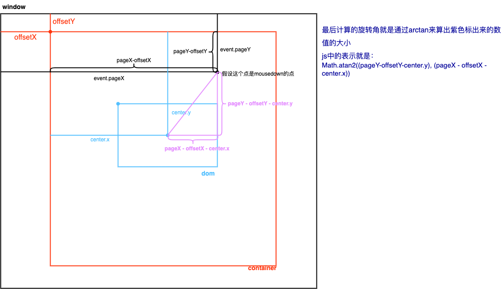
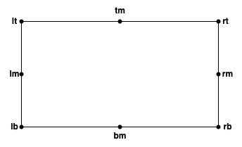
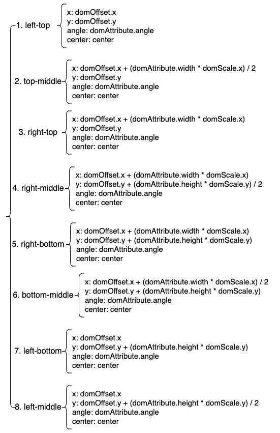
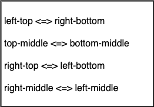
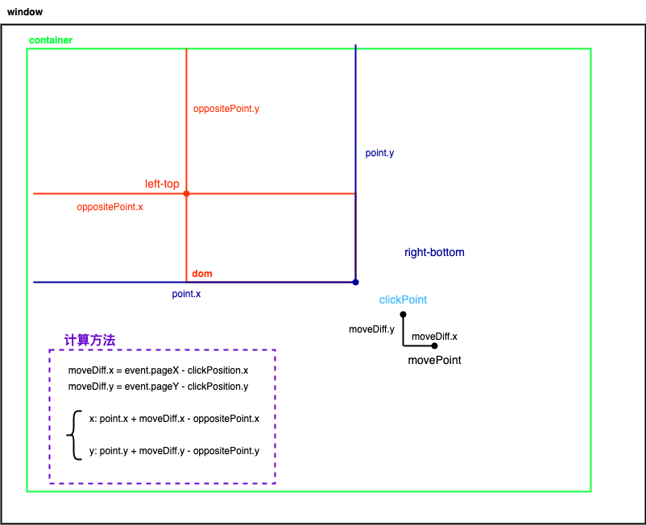
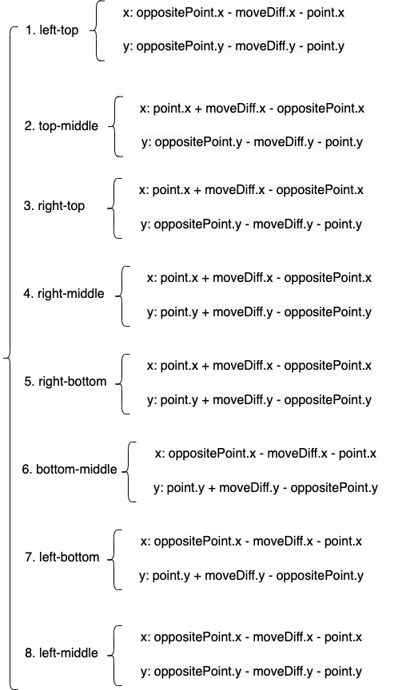

# 通用型Resize,Drag,Rotate组件内容解析

| 文档创建人 | 创建日期   | 文档内容                             | 更新时间   |
| ---------- | ---------- | ------------------------------------ | ---------- |
| adsionli   | 2022-06-19 | 通用型Resize,Drag,Rotate组件内容解析 | 2022-06-19 |

最近在做可视化ppt的制作，然后在开发通用型空间控制resize,drag,rotate时遇到了很大的问题，如果不基于旋转时的放缩不会引起位置的变换，但是如果是旋转之后，就没法固定位置进行放缩操作了，说起来可能有点难懂，但是这个问题怎么都解决不掉了，困扰了2天。终于在网上找到了相关的解决方法，现在对别人的源码进行解读与记录，方便之后自己开发这个通用型控件的时候思路比较清晰。

## 内容梳理

1. 旋转
2. 放缩
3. 拖移
4. 基于中心点的放缩
5. 等比例放缩

>  上面列举的点，就是我们这个空间需要实现的内容，看上去好像没啥，感觉也比较简单，但是实际在做的时候，才会发现会多么的坑爹。特别是在旋转之后的放缩，会造成位置偏移的现象。

## 存在的问题

1. 旋转后的锚点无法固定

​		当一个`dom`进行`transform`的`rotate`之后，它的`absolute`锚点无法改变，依然是这个`dom`的未旋转时的四个顶点，这就很坑了，因为无法改变锚点，就会导致当我们按照某个方向改变`width`与`height`时，造成dom的移动

> 可能会说通过设置`transform-origin`来设置锚点，但是这是不行的，因为这依然会导致`dom`乱跑，特别是在`mousedown`的时候，大家可以自己去试一下，因为它是设置了`transform`内容的锚点设置。

2. 旋转后无法按照某个方向进行放缩

​		这个问题是上面锚点无法固定带来的，它会导致放缩出现问题，会导致往任意方向的放缩都会导致整个内容发生偏移。

造成上面的问题的原因，是因为我们是通过改变`left、top、bottom、right`来控制`dom`往固定方向放缩造成的，这会导致旋转之后的锚点无法去进行更新，导致了上述的问题产生。

为了解决上面的问题，就需要选择使用transform中的matrix来进行作为`dom`变换的操作，不直接去修改`dom`的`width`与`height`，而是通过控制`scale`来控制。

所以我们这里就需要选择两种矩阵，一种是**旋转平移矩阵**，一种是**旋转缩放矩阵**，通过这两种矩阵，来实现`dom`的变化。

> 因为是2D平面上的，所以矩阵是3*3的形式
> $$
> \begin{matrix}
> cos\alpha & sin\alpha & mP.x \\
> -sin\alpha & cos\alpha & mP.y \\
> 0 & 0 & 1 \\
> \end{matrix}
> $$

## 内容实现

接下来讲述一下各个内容的实现。

### 3.1 旋转

旋转的实现先看一下下图：



上面这个图好像有点复杂，其实还是挺简单的。这里分了三块，分别是**window,container,dom**。他们分别是**窗口，放置resize的容器，以及resize的本体**。

首先需要明确一点，我们的`dom`的`absolute`不是相对于`window`的，而是相对于`container`的，这点很重要。但是event中的pageX与pageY是相对于window的，所以一定要能够区分开，不然会对之后的开发造成很大的困扰。

然后解释一下标出的参数

1. `offsetX/offsetY`：这两个位置信息就是`container`相对于整个`window`的`x/y`的偏移信息。
2. `pageX/pageY`: 这两个位置信息是我们在鼠标`mousedown`时候的相对整个`window`的`x/y`的位置信息。
3. `centerX/centerY`:这两个位置信息是我们dom容器的中心点的位置信息，它的求解方式如下：

```js
const center = {x: 0, y: 0};
//这里需要乘上放缩的scale大小，因为他不会直接显示在width与height中，而是在transform中的
center.x = dom.x + (dom.width / 2) * scaleX;
center.y = dom.y + (dom.height / 2) * scaleY;
```

知道了上面这几个参数之后，我们就可以求出鼠标`mousedown`位置以及之后鼠标在`move`过程中的，相对于`center`中心点的偏转角度了。

> 计算不说了，上面图里面我都标出来了，下面给一下实现代码：

```js
export default ({ x, y, scaleX, scaleY, width, height, angle, startX, startY, offsetX, offsetY }, onUpdate) => {
  //获取中心点位置
  const center = getCenter({ x, y, scaleX, scaleY, width, height })
  //记录一下开始旋转时的角度，startX就是pageX,startY就是pageY
  const pressAngle = Math.atan2((startY - offsetY) - center.y, (startX - offsetX) - center.x) * 180 / Math.PI
  //这里要返回一个回调函数，用于在鼠标Move的时候去调用的
  return (event) => {
    //计算当前鼠标位置所在的旋转角度
    const degree = Math.atan2((event.pageY - offsetY) - center.y, (event.pageX - offsetX) - center.x) * 180 / Math.PI;
    //计算旋转后相对于原先已存在的旋转角度
    let ang = angle + degree - pressAngle
    //如果是按下shift的旋转，就旋转固定角度15度就行，取余
    if (event.shiftKey) {
      ang = (ang / 15 >> 0) * 15;
    }
	//返回旋转角，更新dom的rotate
    onUpdate({
      angle: ang
    })
  }
}
```

### 3.2 scale

>  这个是最难的内容，所以内容会有点多。

#### 3.2.1 核心提要

1. `scale`放缩的三种方式：

​	(1) `scaleFormCenter`:中心放缩，和名字一样，这个放缩是会以中心点为`transform-origin`，然后同时向两侧进行放缩，比如说我只放缩x方向的大小的时候，**如果只是单向放缩的话，它只会往x正方向或者是负方向进行放缩**，但是如果是`scaleFormCenter`的话，就**会同时向正负两个方向进行放缩**。这就是一种放缩方式。

​	(2)`aspectRatio`:等比例放缩，很好理解，就是当我们进行放缩的时候，它会按照`dom`原有的`width/height`的宽高比进行放缩。

​	(3)单向放缩：最普通的一种放缩方式，就是往一个方向进行放缩。

2. 目标点



如上图所示，在我们的通用型空间中，用来控制scale改变的共有八个目标点，分别是：

1. `left-top`(lt): 左上目标点，用于拉升后往左上方改变图形大小，此时`rigth-bottom`目标点固定不动。可以同时修改`x/y`的放缩。
2. `top-middle`(tm): 上中目标点，用于拉升后往上方改变图形大小，此时`bottom-middle`目标点固定不动。可以同时修改`y`的放缩。
3. `right-top`(rt): 右上目标点，用于拉升后往右上方改变图形大小，此时`left-bottom`目标点固定不动。可以同时修改`x/y`的放缩。
4. `right-middle`(rm): 右中目标点，用于拉升后往右方改变图形大小，此时`left-middle`目标点固定不动。可以同时修改`x`的放缩。
5. `right-bottom`(rb): 右下目标点，用于拉升后往右下方改变图形大小，此时`left-top`目标点固定不动。可以同时修改`x/y`的放缩。
6. `bottom-middle`(bm): 中下目标点，用于拉升后往下方改变图形大小，此时`top-middle`目标点固定不动。可以同时修改`y`的放缩。
7. `left-bottom`(lb): 左下目标点，用于拉升后往左下方改变图形大小，此时`right-top`目标点固定不动。可以同时修改`x/y`的放缩。
8. `left-middle`(lm): 左中目标点，用于拉升后往左方改变图形大小，此时`right-middle`目标点固定不动。可以同时修改`x`的放缩。

上面这些目标点很重要，同时他们的相反点在之后也要作为定位点进行计算的。

同时针对每一个点的求解和处理也都不一样，后面会一一提到。

#### 3.2.2 参数说明

由于需要根据很多点进行定位，所以传入的参数是比较多的，这里就需要记录一下，按照不同类型进行记录

1. `clickPosition: {x: number, y: number}`

​	鼠标`mousedown`的位置，注意是相对于window的点击位置，我们需要记录一下鼠标点下时的起始位置，用于计算之后鼠标在`move`阶段时的相对位置计算。

2. `domOffset: {x: number, y: number}`

​	dom内容一开始设置的偏移位置，我们需要根据这个偏移位置来计算目标点的坐标以及相反目标点的坐标位置，还有一些相对位置的设置也需要用到

3. `domAttribute: {width: number, height: number, rotate: number}` 

​	dom内容的属性，分别是宽度，高度以及旋转角度，也是用于之后很多计算之中。

4. `domScale: {x: number, y: number}`

​	dom内容的缩放比，也是最重要的内容，因为我们需要根据缩放比来计算变换之后的新的缩放比例。

5. `scaleLimit: number`

​	最大缩放比例设置，用来限制最大的缩放大小，这里一般设置为0.1

6. `eventAttribute: {scaleFormCenter: boolean, enableScaleFormCenter: boolean, aspectRatio: boolean, enableAspectRatio: boolean}`

​	事件属性: 

`scaleFormCenter`与`enableScaleFormCenter`是一组，用于控制是否是按照中心进行放缩，触发条件是同时在拖动时候按下`alt`键，且在设置了`scaleFormCenter`为`true`的情况下。

`aspectRatio`与`enableAspectRatio`是一组，用于控制是否是等比例放缩，触发条件是同时在拖动时候按下`shift`键，且在设置了`aspectRatio`为`true`的情况下。

#### 3.2.3 代码实现及说明

>  代码实现放在最后

接下来，我们一段一段内容来进行分析。

参数输入，没啥好说的，上面**3.2.2**中已经说过了。

1. 计算宽高比，这里没什么太多内容，但是要注意一点就是在计算的时候需要给宽高都乘上`scaleX/scaleY`，这样才准确，因为原本的width与height不会进行修改，而是通过transform进行的放缩变换，实现如下:

   ```js
   let ratio = (domAttribute.width * domScale.x) / (domAttribute.height * domScale.y)
   ```

2. 获取定位点坐标，这个定位点就是我们按下的操作点，就是**3.2.1**中标出来的那8个点中的一个，我们需要求出定位点的相对位置，也很好处理。代码如下：

   ```js
   function getCenter(domOffset, domAttribute, domScale){
       //注意，这里我们需要根据放缩后的大小来求出实际的中心点，因为放缩之后的中心发生了偏移的
       const changeWidth = domAttribute.width * domScale.x;
       const changeHeight = domAttribute.height * domScale.y;
   
       const widthDiff = changeWidth - domAttribute.width;
       const heightDiff = changeHeight - domAttribute.height;
   
       return {
           x: x - (widthDiff + changeWidth / 2),
           y: y - (heightDiff + changeHeight / 2)
       }
   }
   //根据放缩之后的大小，来获取点的位置
   function getOriginalPositionFromScale(position, size, scale) {
       const changed = size * scale;
       const diff = changed - size;
   
       return position - diff
   }
   //ScaleType就是来告诉处理函数点击的是哪一个定位点
   function getPoint(scaleType,domOffset, domAttribute, eventAttribute, domScale) {
       
       let center = getCenter(domOffset, domAttribute, domScale);
       if(eventAttribute.scaleFromCenter) {
   		return center;
       }
       //把需要用到的内容先保存起来，然后需要给到每个顶点的计算中去
       let info = {
           center,
           domOffset,
           domAttribute,
           domScale,
           x: getOriginalPositionFromScale(domOffset.x, domAttribute.width, domScale.x),
           y: getOriginalPositionFromScale(domOffset.y, domAttribute.height, domScale.y)
       }
       //直接根据scaleType选择不同点的处理方法
       switch (scaleType) {
           case 'tl':
               caller = getBR
               break
           case 'ml':
               caller = getMR
               break
           case 'tr' :
               caller = getBL
               break
           case 'tm' :
               caller = getBM
               break
           case 'bl' :
               caller = getTR
               break
           case 'bm' :
               caller = getTM
               break
           case 'br' :
               caller = getTL
               break
           case 'mr' :
               caller = getML
               break
       }
       return caller(props)
   }	
   ```

   一共8个定位点，每一个点的计算位置都会有一些差别，下面这张图会给出：

   

   上面就是在未旋转情况下的各个定位点的坐标获取，但是如果要考虑上旋转的情况的话，就还需要根据旋转角度继续进行一步计算。代码如下：

   ```js
   //rad参数就是将角度转换为弧度
   function findPoint({x, y, angle, center, rad = angle * (Math.PI / 180)}){
     //根据旋转公式，绕着中心点的旋转公式
     x: (x - center.x) * Math.cos(rad) - (y - center.y) * Math.sin(rad) + center.x,
     y: (x - center.x) * Math.sin(rad) + (y - center.y) * Math.cos(rad) + center.y
   }
   ```

   旋转公式如下：
   $$
   x_0 = (x - c_x) * \cos(\theta) - (y - c_y) * \sin(\theta) + c_x \\
   y_0 = (x - c_x) * \sin(\theta) + (y - c_y) * \sin(\theta) + c_y
   $$

3. 获取了控制定位点的位置之后，我们还需要获取相反点的位置，这个就不细说了，和上面的操作是一样的，不过就是根据scaleType取它相反的操作点作为固定点，然后来计算transform的偏移量。对应关系如下图所示:

   

4. 记录一下当前点的位置，用于给返回的回调函数进行使用，这里用了一个闭包的形式。

   > `currentPoint: {x: domOffset, y: domOffset, scaleX: domScale.x, scaleY: domScale.y}`

5. 返回的回调函数(关键内容)

   这里就要分情况了，因为在我们进行放缩的时候，我们可以进行等比例缩放也可以按照中心进行放缩或者是普通缩放三种形式，所以我们需要在回调函数中进行判断。

   1. 判断是否是按照中心放缩的情况

      判断方式：`eventAttribute.enableScaleFromCenter && ((event.altKey && !scaleFromCenter)  || (!event.altKey && scaleFromCenter))`

      解释：在允许中心放缩的情况，如果是按下了`alt`键但`scaleFormCenter`为`false`的时候；未按下`alt`键但是`scaleFormCenter`为`true`时，也认为是中心放缩的情况。

      处理：

      1. 更新`clickPosition`，将当前次的鼠标位置作为开始的位置，重新赋值
      2. 将`eventAttribute.scaleFromCenter`变为`true`，这样就可以让下一次鼠标移动时，以当前次的位置作为`clickPosition`的位置，而不会去更新
      3. 更新一下定位点的位置，因为是从当前次开始按中心放缩了
      4. 更新一下相反点的位置。

   2. 判断是否为等比例缩放

      `!event.shiftKey && eventAttribute.aspectRatio` => `eventAttribute.aspectRatio = false`

      `event.shiftKey && !eventAttribute.aspectRatio` => `eventAttribute.aspectRatio = true`

      最后在还需要判断是否开启了`eventAttribute.enableAspectRatio`，如果未开启`eventAttribute.aspectRatio = false`

      > 等比例缩放是可以和按照中心缩放同时开启的，也可以作为单独的事件和普通放缩同时作用的

   3. 记录一下当前鼠标位置与起始点击位置的差

      ```js
      const moveDiff = {
          x: event.pageX - clickPosition.x,
          y: event.pageY - clickPosition.y
      }
      ```

   4. **又是一步非常重要的内容**，我们需要计算出点的偏移量了，相对于相反定位点，这步很重要！

      首先先通过一张图来看一个点的放缩情况，然后再根据这个类推到其他点，我选择定位点是right-bottom这个点，然后他的相反点是left-top。

      

      上面这张图就很好地解释了相对于相反点的偏移计算了。这里需要额外解释一下的就是这个点击的起始点不一定在`point`定位点，所以我单独画出去了，加以区分，这样就可以很明确的看到`moveDiff`的两个变量的偏移了，也就可以理解相对于原相反点的偏移量是怎么计算出来的了。

      好了，有了一个点之后，我们就可以推出其他点了，如下图所示：

      

      好了，这样就可以获取到不同scaleType时的偏移啦，理清楚了还是蛮简单的。

      5. 获取到偏移量之后，还得考虑一种特殊情况，就是当是中心放缩的时候，我们可以知道它是向两侧进行放缩的，所以我们需要处理一下偏移量

         ```js
         movePoint.x *= 2
         movePoint.y *= 2
         ```

      6. 然后就要考虑到旋转之后的情况，我们需要获取到旋转角的`sin`与`cos`，来计算相对的定位。

         > 这里有一个需要注意的点，我们是以center为原点，且向下为y轴的正方向，向右为x轴正方向的，所以对于角度来说，我们需要对其中四个定位点要取反，这四个定位点就是:`top-middle`,`right-top`,`bottom-middle`,`left-bottom`。因为这四个定位点的位置分别在二、四象限，所以需要取反。

         ```js
         function(scaleType, angle){
             switch (scaleType) {
                 case 'tr':
                 case 'tm':
                 case 'bl':
                 case 'bm':
                     return {
                         cos: Math.cos(-angle * (Math.PI / 180)),
                         sin: Math.sin(-angle * (Math.PI / 180))
                     }
                 default:
                     return {
                         sin: Math.sin(angle * (Math.PI / 180)),
                         cos: Math.cos(angle * (Math.PI / 180))
                     }
             }
         }
         ```

      7. 根据返回的`cos`与`sin`的值，我们就可以计算出旋转之后的点的相对距离啦，这个真的历经千辛万苦才拿到这个重要的内容。但是还没结束，下面就需要继续求出`scaleX`与`scaleY`了。

         ```js
         //根据角度获得相对位置
         const rotationPoint = {
             x: movePoint.x * cos + movePoint.y * sin,
             y: movePoint.y * cos - movePoint.x * sin
         }
         //同时我们需要更新一下当前点的放缩信息
         currentProps.scaleX = (rotationPoint.x / domAttribute.width) > scaleLimit ? rotationPoint.x / domAttribute.width : scaleLimit
         currentProps.scaleY = (rotationPoint.y / domAttribute.height) > scaleLimit ? rotationPoint.y / domAttribute.height : scaleLimit
         ```

      8. 根据scaleType，也就是操作的定位点不同，计算实际缩放的大小，同时这里需要明确定位点的操作是对单方向还是双方向的变化。

         > `top-middle`与`bottom-middle`仅仅变换`height`
         >
         > `left-top/right-top/right-bottom/left-bottom`变换`width`与`height`
         >
         > `left-middle/right-middle`仅变化`width`

         ```js
         switch (scaleType) {
             case 'lm':
             case 'rm':
                 currentProps.scaleY = scaleY
                 //等比变换的话，就需要把X变换的比例赋给Y
                 if (aspectRatio) {
                     currentProps.scaleY = ((width * currentProps.scaleX) * (1 / ratio)) / height;
                 }
                 break;
             case 'tm':
             case 'bm':
                 currentProps.scaleX = scaleX
                 if (aspectRatio) {
                     currentProps.scaleX = ((height * currentProps.scaleY) * ratio) / width;
                 }
                 break;
             default:
                 if (aspectRatio) {
                     currentProps.scaleY = ((width * currentProps.scaleX) * (1 / ratio)) / height;
                 }
         }
         ```

      9. 处理完放缩之后，还需最后处理一下`dom`的偏移设置，放缩后`dom`的`x,y`可能发生变化，特别是旋转的情况下。

         1. 第一种情况是在中心放缩的情况下，我们需要重新获取一下中心点位置，这里传入`domScale`就是上面求出的新的`scaleX/scaleY`

            ```js
            const center = getCenter({
                x,
                y,
                width,
                height,
                scaleX: currentProps.scaleX,
                scaleY: currentProps.scaleY,
            })
            currentProps.x = x + (point.x - center.x)
            currentProps.y = y + (point.y - center.y)
            ```

         2. 第二种情况就是单向放缩的情况，我们需要重新获取一下相反点，因为这时候放缩了，所以位置一定会发生偏移，所以为了让还是固定的效果，就得使用更新后的相反定位点位置

            ```js
            const freshOppositePoint = getOppositePoint(scaleType, {
                width,
                height,
                angle,
                x,
                y,
                scaleX: currentProps.scaleX,
                scaleY: currentProps.scaleY,
            });
            
            currentProps.x = x + (oppositePoint.x - freshOppositePoint.x)
            currentProps.y = y + (oppositePoint.y - freshOppositePoint.y)
            ```

      10. 如果在调用`scale`函数的时候，有作为更新函数传入的话，我们就可以把`currentProps`作为参数传入进去，用于后面的css更新了。


终于结束了，实在是太太太麻烦了，但是效果雀食很好，里面一定要注意的就是更新定位点与鼠标点击之间的位置关系，同时要考虑旋转后的情况。

### 3.3 style
这个函数就是用于处理上面`scale`传入的`currentProps`了，把它变为最终我们需要的`transform`的`matrix`矩阵。

#### 3.3.1 参数说明

1. `domAttribute: {width: number, height: number, angle: number}`

   `dom`元素的宽，高，旋转角

2. `domScale: {x: number, y: number}`

   `dom`元素的`x/y`轴上的缩放

3. `domOffset: {x: number, y: number}`

   `dom`元素在`x/y`轴上的偏移

#### 3.3.2 具体实现

1. 计算变换后新的`width`与`height`的值

   ```js
   const changedWidth = domAttribute.width * (1 - domScale.x);
   const newWidth = domAttribute.width - changedWidth;
   const changedHeight = domAttribute.height * (1 - domScale.y);
   const newHeight = domAttribute.height - changedHeight;
   ```

2. 判断是否允许放缩作用在`width/height`上，如果是不允许的话，就直接作用在`transform`中；如果允许的话，需要更新`dom`的`width`与`height`

   我们还需要根据传入的参数，来获取变换矩阵：

   > 这里矩阵运算用了transformation-matrix这个库

   ```js
   transformMatrix = transform(
       //先位移变换，x与y都是currentProps更新之后传入的
       translate(roundTo(x + changedWidth / 2), roundTo(y + changedHeight / 2)),
       //在旋转变换
       rotate(angle * (Math.PI / 180)),
       //最后进行缩放，scaleX与scaleY都是currentProps更新之后传入的
       scale(scaleX, scaleY)
   );
   ```

3. 最后返回就完事了，把`transformMatrix`转成符合`css`的`matrix`就行了，结束，搞定


## 结束语

谁tm再说前端简单，放心，我绝对会打死那个人，真正的前端人都是一个艺术家，也是一个图形学家，我是前端我骄傲，强交互的真的爱了。

​      

​      

​      

​      

   