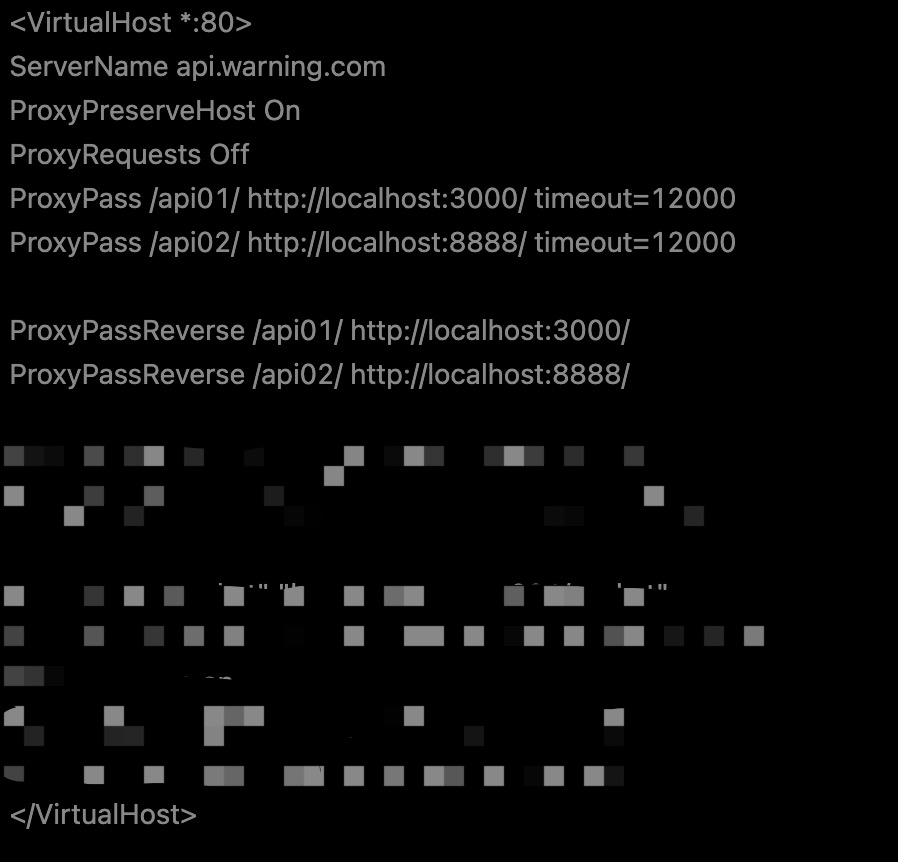
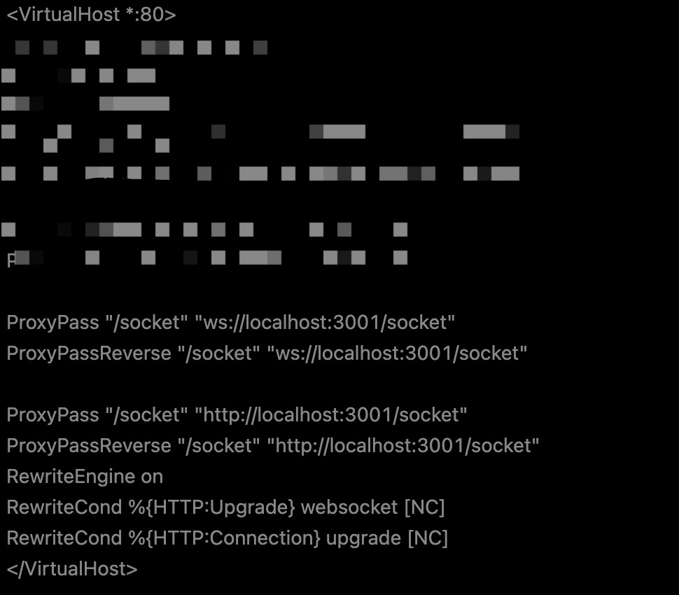
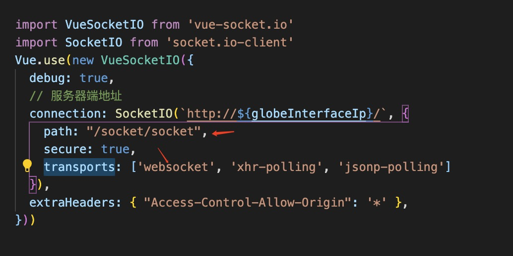
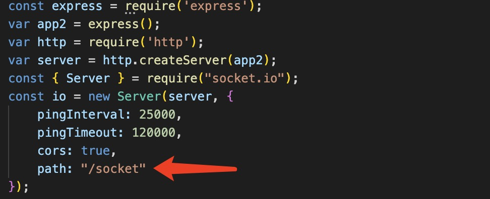

# 危险预警项目部署总结与自我反思

> 记录一下危险预警项目部署过程中遇到的问题

| 文档创建人 | 创建日期   | 文档内容                       | 更新时间   |
| ---------- | ---------- | ------------------------------ | ---------- |
| adsionli   | 2021-12-13 | 危险预警项目部署总结与自我反思 | 2021-12-13 |

## 1. 部署中遇到的问题总结

1. 在军方部署项目时，其服务器上是没有如阿里云、腾讯云等相关的ip解析工具的，只可以使用ipv4规则，所以在启动项目的时候就必须走tcp协议而不能使用tcp6协议，那么在启动apache服务器、node项目已经项目中的jar包项目时，必须要给定具体的ip地址，当然这里可以直接给`0.0.0.0`就可以了，这样子其三者都会走tcp协议了。
2. 虽然上述已经设置了tcp协议，但是依然会发现当我们直接在内网中访问挂起的服务时，还是无法去访问(不过很奇怪的是apache挂起服务的80端口可以访问，当时其他的端口就是无法访问到)。那么这时候该怎么办，这里我选择使用了apache的反向代理服务，通过apache服务器提供的反向代理功能，直接挂一个虚拟地址来代理出去，将端口服务和socket服务全部代理走。虽然这个想法很好，但是在实现的过程中，socket服务代理出现了问题，花了一天时间才解决掉，属实是笨蛋了，下面也会说。
3. 数据库连接上，也出现了一些无法预测的问题，当然这里很多问题是因为军方给的table的sql有问题，给出的字段与实际使用中的字段完全不相同，导致浪费了大量时间来修改字段名，这点属实有点无语了。然后还有一个自己坑了自己的地方，就是在做数据库配置文件的时候，在代码中使用的是**host**，但是配置文件中配置成了**ip**，也浪费了一些时间去查错，真想抽自己一顿，太蠢了......最后一个问题就是有一张数据表是与另外一张数据表强关联的，会先去检索他们的一个配置数据表才会返回搜索结果，但是这在之前给到我的sql中也没有提到，调了1天半，真的被坑的人晕了。
4. 本次部署最大的问题就是我自己并未到现场，因为疫情影响，杭州无法前往军方基地继续操作，只能通过语音通话指挥另外一个人进行远程部署，这里其实暴露了一个很大的问题就是准备不充分，我没有考虑到部署的人的水平不够，对linux操作完全不熟练，很多我指挥的内容，都无法很好地执行，会产生很多单词拼写的错误(真的被折磨爆炸了)。自己应该去准备一个自动化部署脚本的，这样才是最好的一种方式。
5. 还有一个问题就是再部署过程，又产生了新的功能需求，这是措手不及的，实际上再部署过程中，是不应该去增加新的需求和对原有功能的修改的，但是因为这并不是在公司中的项目，而是在学校中任务，是不会走流程的，所以这让我认识到，我在实际与人合作方面还存在严重的不足，也没有好好地让师弟等人对我起很好的支撑，所有的内容都被我一个人扛走了，最后自己很疲惫，很多原定的学习计划都无法展开，这使得自己原有计划被打乱。这点自己做的非常不好，这对以后如果从开发人员成长为一个合格的项目管理者是一个很大惊醒，还是应该做到更好的统筹。

## 2. 关于apache反向道理问题的总结

1. 普通接口的反向代理

   普通接口的反向代理实际上是很好实现的，只需要对原有的httpd.conf文件中，开启反向代理模块，然后再挂起一个虚拟主机来对进入的请求进行反向代理(当然这里还需要关闭正向代理)，具体配置代码如下

   (1) 首先在httpd.conf中开启反向代理模块

   

   (2)创建一个httpd_host.conf文件，专门用来处理反向代理服务,同时配置文件：

   

2. socket的反向代理问题

   socket反向代理问题比起普通接口的代理会来的复杂一点，同时对apache的版本也有一定要求，apache版本需要>=4.xx，因为需要一个叫做`proxy_watunnel`的模块来开启socket反向代理，同时还得开启`rewrite`模块，来对正向代理过来的内容进行重写。

   > 同时这里还存在两个个很坑的地方。
   >
   > 1. 在做socket反向代理的时，我们需要在配置文件中指定连接协议，比如说时websocket，那么我们在前端设置socket.io的时候，也需要设置其transports为`websocket`，只有这样才能走通socket反向代理，不然是无法走通的。
   >
   > 2. 在node处还需要制定一个socket的path，因为再部署的时候，我发现不指定这个path的时候，也是无法完成转发的。

   (1)apache中关于socket.io的配置

   

   

   (2)前端项目初始化socket连接时代码修改

   

   (3)后端项目创建socket服务时的配置

   

这样之后，socket服务就被反向代理成功啦，在配置文件中，我们需要配置好协议提升的内容，如果不设置的话，依然走http1.0协议就没法进行持久化链接，只有http1.1协议中才具有持久化链接的功能。同时，还需要配合代码上的修改，才能够完成这个反向代理，在这里一定要记住了才可以啦。

3. 数据库相关内容记录

   (1)自动站内容

   > 在本次部署中自动站是最难处理的一块内容了，他需要指定好需要查询的站点内容后，才会返回内容，否则是无内容返回的，这个让人感觉十分的意外

   原来的sql代码如下:

   ```sql
   select data_id, data_station, data_time, data_temperature, data_wind_direction,
               data_wind_speed, data_pressure, data_humidity,data_visibility, data_rain_day,
               data_rain_minute, data_dew_temperature, data_vapour_pressure from hx_data
   where data_wind_speed >= 10
     and data_temperature not between -4000 and 4000
     and data_time between str_to_date(concat_ws(' ', '2021-12-01', '00:00:00'), '%Y-%m-%d %H:%i:%s') and str_to_date(concat_ws(' ', '2021-12-01', '23:59:59'), '%Y-%m-%d %H:%i:%s')
   order by data_time desc ;
   ```

   加入站点之后的sql代码：

   ```sql
   select data_id, data_station, data_time, data_temperature, data_wind_direction,
               data_wind_speed, data_pressure, data_humidity,data_visibility, data_rain_day,
               data_rain_minute, data_dew_temperature, data_vapour_pressure from hx_data
   where data_station in (1,2,3,4,5,6,7,8,9,10,11)
     and data_wind_speed >= 10
     and data_temperature not between -4000 and 4000
     and data_time between str_to_date(concat_ws(' ', '2021-12-01', '00:00:00'), '%Y-%m-%d %H:%i:%s') and str_to_date(concat_ws(' ', '2021-12-01', '23:59:59'), '%Y-%m-%d %H:%i:%s')
   order by data_time desc ;
   ```

   只有这样之后才会有返回数据。

   同时这里如果需要加快检索速度，需要把时间范围缩小，同时根据数据表设置的索引字段来进行查找，这样才可以做到加速的效果。


## 总结

那么，在本次项目部署中遇到的问题已经总结好了，还有很多需要改进的地方，还是自己的不成熟，导致了这次部署项目的过程有点磕磕绊绊，还需要继续努力，为之后工作做好准备。这样才能让部署或开发中遇到任何的问题都可以很快的进行排查与解决，加油加油ヾ(◍°∇°◍)ﾉﾞ。