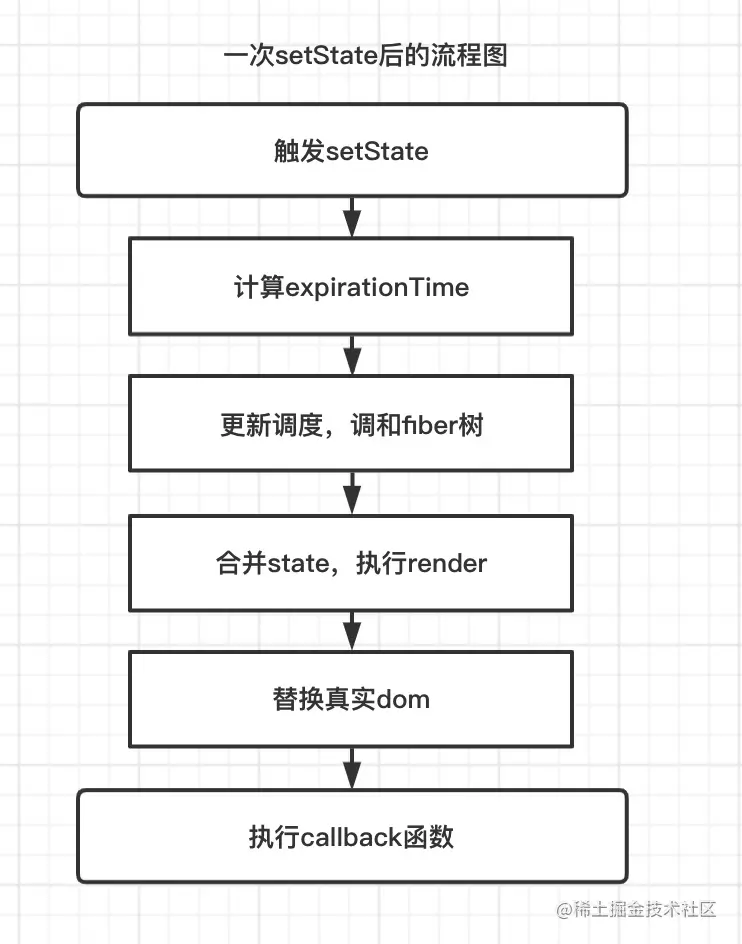
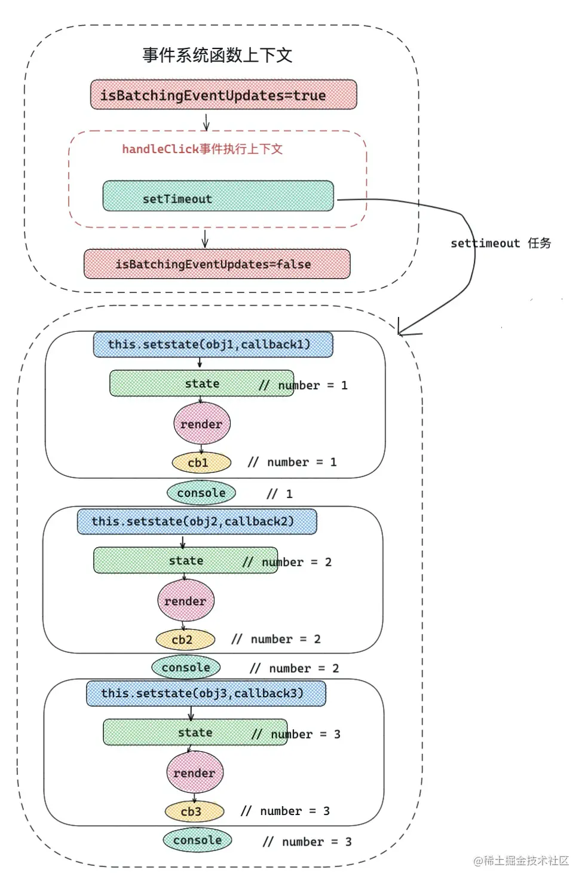
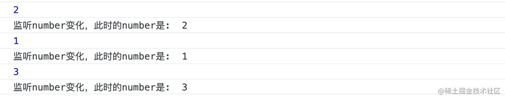

# react学习-01

| 文档创建人 | 创建日期   | 文档内容                      | 更新时间   |
| ---------- | ---------- | ----------------------------- | ---------- |
| adsionli   | 2022-11-24 | react学习-jsx,component,state | 2022-11-24 |

终于开始学习react了，因为秋招的时候发现，大部分公司都要求掌握react才可以，但是平时自己主要使用的都是vue3+ts进行开发的，所以现在就来学习react的相关知识并进行一些小内容的开发。

## 初识jsx

在react中，jsx的转换规则会分为以下几种类型

```tsx
const toLearn = [ 'react' , 'vue' , 'webpack' , 'nodejs'  ]

const TextComponent = ()=> <div> hello , i am function component </div> 

class Index extends React.Component{
    status = false /* 状态 */
    renderFoot=()=> <div> i am foot</div>
    render(){
        /* 以下都是常用的jsx元素节 */
        return <div style={{ marginTop:'100px' }}   >
            { /* element 元素类型 */ }
            <div>hello,world</div>
            { /* fragment 类型 */ }
            <React.Fragment>
                <div> 👽👽 </div>
            </React.Fragment>
            { /* text 文本类型 */ }
            my name is adsionli 
            { /* 数组节点类型 */ }
            { toLearn.map(item=> <div key={item} >let us learn { item } </div> ) }
            { /* 组件类型 */ }
            <TextComponent/>
            { /* 三元运算 */  }
            { this.status ? <TextComponent /> : <div>三元运算</div> }
            { /* 函数执行 */ } 
            { this.renderFoot() }
            <button onClick={ ()=> console.log( this.render() ) } >打印render后的内容</button>
        </div>
    }
}
```

上面这段代码中，一共展示了8种类型：element元素类型、fragment类型（react内置片段）、文本类型、数组类型、组件类型、三元运算类型、函数执行类型。每一种类型都会在编译之后，变为React Element 形式。这里React会调用函数`React.createElement`来进行节点的创建，它主要的两个参数分别是：

1. 第一个参数：如果是组件类型，会传入组件对应的类或函数；如果是 dom 元素类型，传入 div 或者 span 之类的字符串。
2. 第二个参数：一个对象，在 dom 类型中为标签属性，在组件类型中为 props 。

出了上述的两个最重要的参数之外，后面还可以传入children的参数。

可以看一下下段代码:

```html
<div>
   <TextComponent />
   <div>hello,world</div>
   let us learn React!
</div>
```

上段代码就会被编译为:

```js
React.createElement("div", null,
                    React.createElement(TextComponent, null),
                    React.createElement("div", null, "hello,world"),
                    "let us learn React!"
                   )
```

知道了怎么回事，我们就可以记一下jsx的转换规则，这样有助于我们之后更加熟练的使用jsx的语法

| `jsx`元素类型     | `react.createElement` 转换后                      | `type` 属性                   |
| ----------------- | ------------------------------------------------- | ----------------------------- |
| `element`元素类型 | `react element`类型                               | 标签字符串，例如 `div`        |
| `fragment`类型    | `react element`类型                               | `symbol` `react.fragment`类型 |
| 文本类型          | 直接字符串                                        | 无                            |
| 数组类型          | 返回数组结构，里面元素被`react.createElement`转换 | 无                            |
| 组件类型          | `react element`类型                               | 组件类或者组件函数本身        |
| 三元运算 / 表达式 | 先执行三元运算，然后按照上述规则处理              | 看三元运算返回结果            |
| 函数执行          | 先执行函数，然后按照上述规则处理                  | 看函数执行返回结果            |

### react处理

react在通过将jsx语法转换成React Element之后，会进入到调和阶段，所谓的调和阶段就是将React Element转换成对应的fiber对象，然后就像构建原型链一样，通过sibling,return,child将每一个fiber对象联系起来。

#### fiber类型

在react中fiber主要分为以下一些类型:

```typescript
export const FunctionComponent = 0;       // 函数组件
export const ClassComponent = 1;          // 类组件
export const IndeterminateComponent = 2;  // 初始化的时候不知道是函数组件还是类组件 
export const HostRoot = 3;                // Root Fiber 可以理解为根元素 ， 通过reactDom.render()产生的根元素
export const HostPortal = 4;              // 对应  ReactDOM.createPortal 产生的 Portal 
export const HostComponent = 5;           // dom 元素 比如 <div>
export const HostText = 6;                // 文本节点
export const Fragment = 7;                // 对应 <React.Fragment> 
export const Mode = 8;                    // 对应 <React.StrictMode>   
export const ContextConsumer = 9;         // 对应 <Context.Consumer>
export const ContextProvider = 10;        // 对应 <Context.Provider>
export const ForwardRef = 11;             // 对应 React.ForwardRef
export const Profiler = 12;               // 对应 <Profiler/ >
export const SuspenseComponent = 13;      // 对应 <Suspense>
export const MemoComponent = 14;          // 对应 React.memo 返回的组件
```

#### fiber结构

jsx最终会根据调和之后产生fiber对象，产生一个fiber结构图，如下图所示:


fiber 对应关系

- child： 一个由父级 fiber 指向子级 fiber 的指针。
- return：一个子级 fiber 指向父级 fiber 的指针。
- sibling: 一个 fiber 指向下一个兄弟 fiber 的指针。

> 数组结构外层会被加上一层fragment，然后其中的数组内容回作为fragment的子节点

### 可控性render

上面的 demo 暴露出了如下问题：

1. 返回的 `children` 虽然是一个数组，但是数组里面的数据类型却是不确定的，有对象类型( 如`ReactElement` ) ，有数组类型(如 `map` 遍历返回的子节点)，还有字符串类型(如文本)；
2. 无法对 render 后的 React element 元素进行可控性操作。

针对上述问题，我们需要对demo项目进行改造处理，具体过程可以分为4步：

1. 将上述children**扁平化处理**，将数组类型的子节点打开 ；
2. **干掉children中文本类型节点**；
3. 向children最后插入say goodbye元素；
4. 克隆新的元素节点并渲染。

由于，我们想要把 render 过程变成可控的，因此需要把上述代码进行改造。

```jsx
class Index extends React.Component{
    status = false /* 状态 */
    renderFoot=()=> <div> i am foot</div>
    /* 控制渲染 */
    controlRender=()=>{
        const reactElement = (
            <div style={{ marginTop:'100px' }} className="container"  >   
                 { /* element 元素类型 */ }
                <div>hello,world</div>  
                { /* fragment 类型 */ }
                <React.Fragment>      
                    <div> 👽👽 </div>
                </React.Fragment>
                { /* text 文本类型 */ }
                my name is alien       
                { /* 数组节点类型 */ }
                { toLearn.map(item=> <div key={item} >let us learn { item } </div> ) } 
                { /* 组件类型 */ }
                <TextComponent/>  
                { /* 三元运算 */  }
                { this.status ? <TextComponent /> :  <div>三元运算</div> }  
                { /* 函数执行 */ } 
                { this.renderFoot() }  
                <button onClick={ ()=> console.log( this.render() ) } >打印render后的内容</button>
            </div>
        )
        console.log(reactElement)
        const { children } = reactElement.props
        /* 第1步 ： 扁平化 children  */
        const flatChildren = React.Children.toArray(children)
        console.log(flatChildren)
        /* 第2步 ： 除去文本节点 */
        const newChildren :any= []
        React.Children.forEach(flatChildren,(item)=>{
            if(React.isValidElement(item)) newChildren.push(item)
        })
        /* 第3步，插入新的节点 */
        const lastChildren = React.createElement(`div`,{ className :'last' } ,`say goodbye`)
        newChildren.push(lastChildren)
        
        /* 第4步：修改容器节点 */
        const newReactElement =  React.cloneElement(reactElement,{} ,...newChildren )
        return newReactElement
    }
    render(){
        return this.controlRender()
    }
}
```

然后就可以一步一步进行分析

1. 首先我们将`reactElement`中的`props`属性下的`children`进行获取，我们可以拿到这个`React Element`下的全部子节点。

2. 然后使用`React.Children.toArray`进行扁平化处理。

   > React.Children.toArray 可以扁平化、规范化 React.element 的 children 组成的数组，只要 children 中的数组元素被打开，对遍历 children 很有帮助，而且 **React.Children.toArray 还可以深层次 flat** 。

3. 在使用`React.Children.forEach`对获取到的子节点数组进行遍历，并在遍历中使用`React.isValidElement`函数判断当前`Element`是不是一个`React Element`元素。

   > `React.Children.forEach = React.Children.toArray + Array.prototype.forEach`
   >
   > React.Children.forEach 本身就可以把 children 扁平化

4. 使用`React.createElement`创建新的节点，并且插入到过滤之后的新节点的最后

5.  **已经修改了 children，通过 cloneElement 创建新的容器元素**

   > 使用`React.cloneElement`是为了将element元素为样板clone并返回新的react element元素。返回的元素的props是将新的props与原始元素的props进行浅层合并之后的结果
   >
   > `React.createElement`与`React.cloneElement`不同地方在于`createElement` 把上面写的 jsx，变成 element 对象

问: React.createElement 和 React.cloneElement 到底有什么区别呢?

答: 可以完全理解为，一个是用来创建 element 。另一个是用来修改 element，并返回一个新的 React.element 对象。

### Babel解析jsx流程

对于jsx的解析，其主要是在编译的时候通过babel对jsx语法进行解析，解析成可被浏览器认识的js代码，其主要使用的两个babel的plugin是：

- @babel/plugin-syntax-jsx ： 使用这个插件，能够让 Babel 有效的解析 JSX 语法。
- @babel/plugin-transform-react-jsx ：这个插件内部调用了 @babel/plugin-syntax-jsx，可以把 React JSX 转化成 JS 能够识别的 createElement 格式。

新版本 React 已经不需要引入 createElement ，这种模式来源于 `Automatic Runtime`，看一下是如何编译的。

业务代码中写的 JSX 文件：

```js
function Index(){
    return <div>
        <h1>hello,world</h1>
        <span>let us learn React</span>
    </div>
}
```

被编译后的文件：

```js
import { jsx as _jsx } from "react/jsx-runtime";
import { jsxs as _jsxs } from "react/jsx-runtime";
function Index() {
  return  _jsxs("div", {
            children: [
                _jsx("h1", {
                   children: "hello,world"
                }),
                _jsx("span", {
                    children:"let us learn React" ,
                }),
            ],
        });
}
```

plugin-syntax-jsx 已经向文件中提前注入了 _jsxRuntime api。不过这种模式下需要我们在 .babelrc 设置 runtime: automatic 。

```json
"presets": [    
    ["@babel/preset-react",{
    "runtime": "automatic"
    }]     
],
```

#### api层面模拟实现jsx解析流程

第一步：创建 element.js，写下将测试的 JSX 代码。

```js
import React from 'react'

function TestComponent(){
    return <p> hello,React </p>
}
function Index(){
    return <div>
        <span>模拟 babel 处理 jsx 流程。</span>
        <TestComponent />
    </div>
}
export default Index
```

第二步：因为 babel 运行在 node 环境，所以同级目录下创建 jsx.js 文件。来模拟一下编译的效果。

```js
const fs = require('fs')
const babel = require("@babel/core")

/* 第一步：模拟读取文件内容。 */
fs.readFile('./element.js',(e,data)=>{ 
    const code = data.toString('utf-8')
    /* 第二步：转换 jsx 文件 */
    const result = babel.transformSync(code, {
        plugins: ["@babel/plugin-transform-react-jsx"],
    });
    /* 第三步：模拟重新写入内容。 */
    fs.writeFile('./element.js',result.code,function(){})
})
```

如上经过三步处理之后，再来看一下 element.js 变成了什么样子。

```js
import React from 'react';

function TestComponent() {
  return /*#__PURE__*/React.createElement("p", null, " hello,React ");
}

function Index() {
  return /*#__PURE__*/React.createElement("div", null, /*#__PURE__*/React.createElement("span", null, "\u6A21\u62DF babel \u5904\u7406 jsx \u6D41\u7A0B\u3002"), /*#__PURE__*/React.createElement(TestComponent, null));
}
export default Index;
```

如上可以看到已经成功转成 React.createElement 形式，从根本上弄清楚了 Babel 解析 JSX 的大致流程。

## Component

在react中，其整个框架组成就是有各种Component进行组合而成，其主要分为两种组件形式，分别是类组件与函数组件，那么类组件和函数组件之间有什么区别呢？可以看一下下面的代码

```js
/* 类 */
class textClass {
    sayHello=()=>console.log('hello, my name is alien')
}
/* 类组件 */
class Index extends React.Component{
    state={ message:`hello ，world!` }
    sayHello=()=> this.setState({ message : 'hello, my name is alien' })
    render(){
        return <div style={{ marginTop:'50px' }} onClick={ this.sayHello } > { this.state.message }  </div>
    }
}
/* 函数 */
function textFun (){ 
    return 'hello, world'
}
/* 函数组件 */
function FunComponent(){
    const [ message , setMessage ] = useState('hello,world')
    return <div onClick={ ()=> setMessage('hello, my name is alien')  } >{ message }</div>
}
```

组件本质上就是类和函数，但是与常规的类和函数不同的是，**组件承载了渲染视图的 UI 和更新视图的 `setState` 、 `useState` 等方法**。React 在底层逻辑上会像正常实例化类和正常执行函数那样处理的组件。

> 组件就是一个对象，或者是一个立即执行函数

### React组件处理流程

类组件执行方式

> 对于类组件的执行，是在react-reconciler/src/ReactFiberClassComponent.js中

```js
function constructClassInstance(
    workInProgress, // 当前正在工作的 fiber 对象
    ctor,           // 我们的类组件
    props           // props 
){
     /* 实例化组件，得到组件实例 instance */
     const instance = new ctor(props, context)
}
```

函数组件执行方式

> 对于函数组件的执行，是在react-reconciler/src/ReactFiberHooks.js中

```js
function renderWithHooks(
  current,          // 当前函数组件对应的 `fiber`， 初始化
  workInProgress,   // 当前正在工作的 fiber 对象
  Component,        // 我们函数组件
  props,            // 函数组件第一个参数 props
  secondArg,        // 函数组件其他参数
  nextRenderExpirationTime, //下次渲染过期时间
){
     /* 执行我们的函数组件，得到 return 返回的 React.element对象 */
     let children = Component(props, secondArg);
}
```

其实不难看出，对于类组件来说，实际就是进行一个实例化过程；对于函数组件来说，则是一个执行过程。

在 React 调和渲染 fiber 节点的时候，**如果发现 fiber tag 是 ClassComponent = 1，则按照类组件逻辑处理，如果是 FunctionComponent = 0 则按照函数组件逻辑处理**。当然 React 也提供了一些内置的组件，比如说 Suspense 、Profiler 等。

> 通过判断fiber tag的类型，具体的分类可以看上一讲。

### 两种不同的React组件

#### 1. 类组件

在 class 组件中，除了继承 React.Component ，底层还加入了 updater 对象，组件中调用的 `setState` 和 `forceUpdate` 本质上是调用了 `updater` 对象上的 `enqueueSetState` 和 `enqueueForceUpdate` 方法。

React 底层是如何定义类组件的呢？

> 源码位置：react/src/ReactBaseClasses.js

```js
function Component(props, context, updater) {
  this.props = props;      //绑定props
  this.context = context;  //绑定context
  this.refs = emptyObject; //绑定ref
  this.updater = updater || ReactNoopUpdateQueue; //上面所属的updater 对象
}
/* 绑定setState 方法 */
Component.prototype.setState = function(partialState, callback) {
  this.updater.enqueueSetState(this, partialState, callback, 'setState');
}
/* 绑定forceupdate 方法 */
Component.prototype.forceUpdate = function(callback) {
  this.updater.enqueueForceUpdate(this, callback, 'forceUpdate');
}
```

如上可以看出 `Component` 底层 `React` 的处理逻辑是：类组件执行构造函数过程中会在实例上绑定 `props` 和 `context` ，初始化置空 refs 属性，原型链上绑定`setState`、`forceUpdate` 方法。对于 `updater`，React 在实例化类组件之后会单独绑定 `update` 对象。

**｜--------问与答---------｜**

问：如果没有在 constructor 的 super 函数中传递 props，那么接下来 constructor 执行上下文中就获取不到 props ，这是为什么呢？

```js
/* 假设我们在 constructor 中这么写 */
constructor(){
    super()
    console.log(this.props) // 打印 undefined 为什么?
}
```

答案很简单，刚才的 Component 源码已经说得明明白白了，绑定 props 是在父类 Component 构造函数中，执行 super 等于执行 Component 函数，此时 props 没有作为第一个参数传给 super() ，在 Component 中就会找不到 props 参数，从而变成 undefined ，在接下来 constructor 代码中打印 props 为 undefined 。

```js
/* 解决问题 */
constructor(props){ 
    super(props)
}
```

**｜---------end----------｜**

**为了更好地使用 React 类组件，我们首先看一下类组件各个部分的功能：**

```js
class Index extends React.Component{
    constructor(...arg){
       super(...arg)                        /* 执行 react 底层 Component 函数 */
    }
    state = {}                              /* state */
    static number = 1                       /* 内置静态属性 */
    handleClick= () => console.log(111)     /* 方法： 箭头函数方法直接绑定在this实例上 */
    componentDidMount(){                    /* 生命周期 */
        console.log(Index.number,Index.number1) // 打印 1 , 2 
    }
    render(){                               /* 渲染函数 */
        return <div style={{ marginTop:'50px' }} onClick={ this.handerClick }  >hello,React!</div>
    }
}
Index.number1 = 2                           /* 外置静态属性 */
Index.prototype.handleClick = ()=> console.log(222) /* 方法: 绑定在 Index 原型链的 方法*/
```

上面把类组件的主要组成部分都展示给大家了。针对 state ，生命周期等部分，后续会有专门的章节进行讲解。

**｜--------问与答---------｜**

问：上述绑定了两个 handleClick ，那么点击 div 之后会打印什么呢？

答：结果是 111 。因为在 class 类内部，箭头函数是直接绑定在实例对象上的，而第二个 handleClick 是绑定在 prototype 原型链上的，它们的优先级是：实例对象上方法属性 > 原型链对象上方法属性。

**｜---------end----------｜**


> 记录：
>
> 1. 对于类组件来说，其上的props、context、updater都需要在constructor中通过super传给Component对象，只有这样才能通过this来使用props
>
> 2. 对于Component下的`setState`与`forceupdater`来说，其本质是调用React.updater对象下的`enqueueSetState`，`enqueueForceUpdate`

#### 2. 函数组件

**ReactV16.8** hooks 问世以来，对函数组件的功能加以强化，可以在 function 组件中，做类组件一切能做的事情，甚至完全取缔类组件。**函数组件的结构相比类组件就简单多了**，比如说，下面写了一个常规的函数组件：

```js
function Index(){
    console.log(Index.number) // 打印 1 
    const [ message , setMessage  ] = useState('hello,world') /* hooks  */
    return <div onClick={() => setMessage('let us learn React!')  } > { message } </div> /* 返回值 作为渲染ui */
 }
 Index.number = 1 /* 绑定静态属性 */
```

> 注意：不要尝试给函数组件 prototype 绑定属性或方法，即使绑定了也没有任何作用，因为通过上面源码中 React 对函数组件的调用，**是采用直接执行函数的方式，而不是通过new的方式**。

那么，函数组件和类组件本质的区别是什么呢？

**对于类组件来说，底层只需要实例化一次，实例中保存了组件的 state 等状态。对于每一次更新只需要调用 render 方法以及对应的生命周期就可以了。但是在函数组件中，每一次更新都是一次新的函数执行，一次函数组件的更新，里面的变量会重新声明。**

> 对于类组件来说，更新并不会重新new，而是会触发响应的生命周期，但是对于函数组件来说，每一次更新都会重新执行
>
> 也就是说更新的模式不同

为了能让函数组件可以保存一些状态，执行一些副作用钩子，React Hooks 应运而生，它可以帮助记录 React 中组件的状态，处理一些额外的副作用。

### 父子组件通信

React 一共有 5 种主流的通信方式：

1. props 和 callback 方式
2. ref 方式。
3. React-redux 或 React-mobx 状态管理方式。
4. context 上下文方式。
5. event bus 事件总线。

**① props 和 callback 方式**

props 和 callback 可以作为 React 组件最基本的通信方式，父组件可以通过 props 将信息传递给子组件，子组件可以通过执行 props 中的回调函数 callback 来触发父组件的方法，实现父与子的消息通讯。

父组件 -> 通过自身 state 改变，重新渲染，传递 props -> 通知子组件

子组件 -> 通过调用父组件 props 方法 -> 通知父组件。

```js
/* 子组件 */
function Son(props){
    const {  fatherSay , sayFather  } = props
    return <div className='son' >
         我是子组件
        <div> 父组件对我说：{ fatherSay } </div>
        <input placeholder="我对父组件说" onChange={ (e)=>sayFather(e.target.value) }   />
    </div>
}
/* 父组件 */
function Father(){
    const [ childSay , setChildSay ] = useState('')
    const [ fatherSay , setFatherSay ] = useState('')
    return <div className="box father" >
        我是父组件
       <div> 子组件对我说：{ childSay } </div>
       <input placeholder="我对子组件说" onChange={ (e)=>setFatherSay(e.target.value) }   />
       <Son fatherSay={fatherSay}  sayFather={ setChildSay }  />
    </div>
}
```

**效果**


**⑤event bus事件总线**

当然利用 eventBus 也可以实现组件通信，但是在 React 中并不提倡用这种方式，我还是更提倡用 props 方式通信。如果说非要用 eventBus，我觉得它更适合用 React 做基础构建的小程序，比如 Taro。接下来将上述 demo 通过 eventBus 方式进行改造。

```js
import { BusService } from './eventBus'
/* event Bus  */
function Son(){
    const [ fatherSay , setFatherSay ] = useState('')
    React.useEffect(()=>{ 
        BusService.on('fatherSay',(value)=>{  /* 事件绑定 , 给父组件绑定事件 */
            setFatherSay(value)
       })
       return function(){  BusService.off('fatherSay') /* 解绑事件 */ }
    },[])
    return <div className='son' >
         我是子组件
        <div> 父组件对我说：{ fatherSay } </div>
        <input placeholder="我对父组件说" onChange={ (e)=> BusService.emit('childSay',e.target.value)  }   />
    </div>
}
/* 父组件 */
function Father(){
    const [ childSay , setChildSay ] = useState('')
    React.useEffect(()=>{    /* 事件绑定 , 给子组件绑定事件 */
        BusService.on('childSay',(value)=>{
             setChildSay(value)
        })
        return function(){  BusService.off('childSay') /* 解绑事件 */ }
    },[])
    return <div className="box father" >
        我是父组件
       <div> 子组件对我说：{ childSay } </div>
       <input placeholder="我对子组件说" onChange={ (e)=> BusService.emit('fatherSay',e.target.value) }   />
       <Son  />
    </div>
}
```

这样做不仅达到了和使用 props 同样的效果，还能跨层级，不会受到 React 父子组件层级的影响。但是为什么很多人都不推荐这种方式呢？因为它有一些致命缺点。

- 需要手动绑定和解绑。
- 对于小型项目还好，但是对于中大型项目，这种方式的组件通信，会造成牵一发动全身的影响，而且后期难以维护，组件之间的状态也是未知的。
- 一定程度上违背了 React 数据流向原则。

## 组件的强化方式

#### 类组件继承

对于类组件的强化，首先想到的是继承方式，之前开发的开源项目 react-keepalive-router 就是通过继承 React-Router 中的 Switch 和 Router ，来达到缓存页面的功能的。因为 React 中类组件，有良好的继承属性，所以可以针对一些基础组件，首先实现一部分基础功能，再针对项目要求进行有方向的**改造**、**强化**、**添加额外功能**。

基础组件：

```js
/* 人类 */
class Person extends React.Component{
    constructor(props){
        super(props)
        console.log('hello , i am person')
    }
    componentDidMount(){ console.log(1111)  }
    eat(){    /* 吃饭 */ }
    sleep(){  /* 睡觉 */  }
    ddd(){   console.log('打豆豆')  /* 打豆豆 */ }
    render(){
        return <div>
            大家好，我是一个person
        </div>
    }
}
/* 程序员 */
class Programmer extends Person{
    constructor(props){
        super(props)
        console.log('hello , i am Programmer too')
    }
    componentDidMount(){  console.log(this)  }
    code(){ /* 敲代码 */ }
    render(){
        return <div style={ { marginTop:'50px' } } >
            { super.render() } { /* 让 Person 中的 render 执行 */ }
            我还是一个程序员！    { /* 添加自己的内容 */ }
        </div>
    }
}
export default Programmer
```

效果：


我们从上面不难发现这个继承增强效果很优秀。它的优势如下：

1. 可以控制父类 render，还可以添加一些其他的渲染内容；
2. 可以共享父类方法，还可以添加额外的方法和属性。

但是也有值得注意的地方，就是 state 和生命周期会被继承后的组件修改。像上述 demo 中，Person 组件中的 componentDidMount 生命周期将不会被执行。

**②函数组件自定义 Hooks**

在自定义 hooks 章节，会详细介绍自定义 hooks 的原理和编写。

**③HOC高阶组件**

在 HOC 章节，会详细介绍高阶组件 HOC 。

## State

> React 是有多种模式的，基本平时用的都是 legacy 模式下的 React，除了`legacy` 模式，还有 `blocking` 模式和 `concurrent` 模式， blocking 可以视为 concurrent 的优雅降级版本和过渡版本，React 最终目的，不久的未来将以 concurrent 模式作为默认版本，这个模式下会开启一些新功能。
>
> 对于 concurrent 模式下，会采用不同 State 更新逻辑。前不久透露出未来的Reactv18 版本，concurrent 将作为一个稳定的功能出现。

### 类组件中的state

#### setState用法

React 项目中 UI 的改变来源于 state 改变，类组件中 `setState` 是更新组件，渲染视图的主要方式。

其基本用法如下:

```js
setState(obj, callback)
```

- 第一个参数：当 obj 为一个对象，则为即将合并的 state ；如果 obj 是一个函数，那么当前组件的 state 和 props 将作为参数，返回值用于合并新的 state。
- 第二个参数 callback ：callback 为一个函数，函数执行上下文中可以获取当前 setState 更新后的最新 state 的值，可以作为依赖 state 变化的副作用函数，可以用来做一些基于 DOM 的操作。

```js
/* 第一个参数为function类型 */
this.setState((state,props)=>{
    return { number:1 } 
})
/* 第一个参数为object类型 */
this.setState({ number:1 },()=>{
    console.log(this.state.number) //获取最新的number
})
```

假如一次事件中触发一次如上 setState ，在 React 底层主要做了那些事呢？

- 首先，setState 会产生当前更新的优先级（老版本用 expirationTime ，新版本用 lane ）。
- 接下来 React 会从 fiber Root 根部 fiber 向下调和子节点，调和阶段将对比发生更新的地方，更新对比 expirationTime ，找到发生更新的组件，合并 state，然后触发 render 函数，得到新的 UI 视图层，完成 render 阶段。
- 接下来到 commit 阶段，commit 阶段，替换真实 DOM ，完成此次更新流程。
- 此时仍然在 commit 阶段，会执行 setState 中 callback 函数,如上的`()=>{ console.log(this.state.number) }`，到此为止完成了一次 setState 全过程。

**更新的流程图如下：**



请记住一个主要任务的先后顺序，这对于弄清渲染过程可能会有帮助：
render 阶段 render 函数执行 -> commit 阶段真实 DOM 替换 -> setState 回调函数执行 callback 。

**类组件如何限制 state 更新视图**

对于类组件如何限制 state 带来的更新作用的呢？

- ① **pureComponent** 可以对 state 和 props 进行浅比较，如果没有发生变化，那么组件不更新。
- ② **shouldComponentUpdate** 生命周期可以通过判断前后 state 变化来决定组件需不需要更新，需要更新返回true，否则返回false。

#### setState原理

对于类组件，类组件初始化过程中绑定了负责更新的`Updater`对象，对于如果调用 setState 方法，实际上是 React 底层调用 Updater 对象上的 **enqueueSetState** 方法。

因为要弄明白 state 更新机制，所以接下来要从两个方向分析。

- 一是揭秘 enqueueSetState 到底做了些什么？
- 二是 React 底层是如何进行批量更新的？

首先，这里极致精简了一波 enqueueSetState 代码。如下

> react-reconciler/src/ReactFiberClassComponent.js

```js
enqueueSetState(){
     /* 每一次调用`setState`，react 都会创建一个 update 里面保存了 */
     const update = createUpdate(expirationTime, suspenseConfig);
     /* callback 可以理解为 setState 回调函数，第二个参数 */
     callback && (update.callback = callback) 
     /* enqueueUpdate 把当前的update 传入当前fiber，待更新队列中 */
     enqueueUpdate(fiber, update); 
     /* 开始调度更新 */
     scheduleUpdateOnFiber(fiber, expirationTime);
}
```

**enqueueSetState** 作用实际很简单，就是创建一个 update ，然后**放入当前 fiber 对象的待更新队列中，最后开启调度更新**，进入上述讲到的更新流程。

那么问题来了，React 的 batchUpdate 批量更新是什么时候加上去的呢？

这就要提前聊一下事件系统了。正常 **state 更新**、**UI 交互**，都离不开用户的事件，比如点击事件，表单输入等，React 是采用事件合成的形式，每一个事件都是由 React 事件系统统一调度的，那么 **State 批量更新正是和事件系统息息相关的**。

> react-dom/src/events/DOMLegacyEventPluginSystem.js

```js
/* 在`legacy`模式下，所有的事件都将经过此函数同一处理 */
function dispatchEventForLegacyPluginEventSystem(){
    // handleTopLevel 事件处理函数
    batchedEventUpdates(handleTopLevel, bookKeeping);
}
```

重点来了，就是下面这个 batchedEventUpdates 方法。

> react-dom/src/events/ReactDOMUpdateBatching.js

```js
function batchedEventUpdates(fn,a){
    /* 开启批量更新  */
   isBatchingEventUpdates = true;
  try {
    /* 这里执行了的事件处理函数， 比如在一次点击事件中触发setState,那么它将在这个函数内执行 */
    return batchedEventUpdatesImpl(fn, a, b);
  } finally {
    /* try 里面 return 不会影响 finally 执行  */
    /* 完成一次事件，批量更新  */
    isBatchingEventUpdates = false;
  }
}
```

如上可以分析出流程，在 React 事件执行之前通过 `isBatchingEventUpdates=true` 打开开关，开启事件批量更新，当该事件结束，再通过 `isBatchingEventUpdates = false;` 关闭开关，然后在 scheduleUpdateOnFiber 中根据这个开关来确定是否进行批量更新。

> 也就是说批量更新主要取决于`isBatchingEventUpdates`是否开启，如果开启了就可以批量更新，如果没有开启就不进行批量更新

下面是一个实例

```js
export default class index extends React.Component{
    state = { number:0 }
    handleClick= () => {
          this.setState({ number:this.state.number + 1 },()=>{   console.log( 'callback1', this.state.number)  })
          console.log(this.state.number)
          this.setState({ number:this.state.number + 1 },()=>{   console.log( 'callback2', this.state.number)  })
          console.log(this.state.number)
          this.setState({ number:this.state.number + 1 },()=>{   console.log( 'callback3', this.state.number)  })
          console.log(this.state.number)
    }
    render(){
        return <div>
            { this.state.number }
            <button onClick={ this.handleClick }  >number++</button>
        </div>
    }
} 
```

点击打印：**0, 0, 0, callback1 1 ,callback2 1 ,callback3 1**

如上代码，在整个 React 上下文执行栈中会变成这样：


> 从上图我们可以发现setState的过程相当于收集一个副作用的过程，他会在render前才会执行，且是按照收集的顺序进行触发的。
>
> 还要注意，这里是顺序执行，不存在异步执行情况

异步操作里面的批量更新规则会被打破，比如用 promise 或者 setTimeout 在 handleClick 中这么写：

```js
setTimeout(()=>{
    this.setState({ number:this.state.number + 1 },()=>{   console.log( 'callback1', this.state.number)  })
    console.log(this.state.number)
    this.setState({ number:this.state.number + 1 },()=>{    console.log( 'callback2', this.state.number)  })
    console.log(this.state.number)
    this.setState({ number:this.state.number + 1 },()=>{   console.log( 'callback3', this.state.number)  })
    console.log(this.state.number)
})
```

打印 ： **callback1 1 , 1, callback2 2 , 2,callback3 3 , 3**

那么在整个 React 上下文执行栈中就会变成如下图这样:



**所以批量更新规则被打破**。

**那么，如何在如上异步环境下，继续开启批量更新模式呢？**

React-Dom 中提供了批量更新方法 `unstable_batchedUpdates`，可以去**手动批量更新**，可以将上述 setTimeout 里面的内容做如下修改:

```js
import ReactDOM from 'react-dom'
const { unstable_batchedUpdates } = ReactDOM
setTimeout(()=>{
    unstable_batchedUpdates(()=>{
        this.setState({ number:this.state.number + 1 },()=>{   console.log( 'callback1', this.state.number)  })
        console.log(this.state.number)
        this.setState({ number:this.state.number + 1 },()=>{    console.log( 'callback2', this.state.number)  })
        console.log(this.state.number)
        this.setState({ number:this.state.number + 1 },()=>{   console.log( 'callback3', this.state.number)  })
        console.log(this.state.number) 
    })
})
```

> 其实这里主要的就是批量更新的概念，就是获取改变一次的更新，作用在全部的作用函数中，且数据不发生改变，且是按照顺序执行的流程进行执行。

打印： **0 , 0 , 0 , callback1 1 , callback2 1 ,callback3 1**

在实际工作中，unstable_batchedUpdates 可以用于 Ajax 数据交互之后，合并多次 setState，或者是多次 useState 。原因很简单，所有的数据交互都是在异步环境下，如果没有批量更新处理，一次数据交互多次改变 state 会促使视图多次渲染。

**那么如何提升更新优先级呢？**

**React-dom 提供了 flushSync ，flushSync 可以将回调函数中的更新任务，放在一个较高的优先级中**。React 设定了很多不同优先级的更新任务。如果一次更新任务在 flushSync 回调函数内部，那么将获得一个较高优先级的更新。

接下来，将上述 `handleClick` 改版如下样子：

```js
handerClick=()=>{
    setTimeout(()=>{
        this.setState({ number: 1  })
    })
    this.setState({ number: 2  })
    ReactDOM.flushSync(()=>{
        this.setState({ number: 3  })
    })
    this.setState({ number: 4  })
}
render(){
   console.log(this.state.number)
   return ...
}
```

打印 **3 4 1** ，相信不难理解为什么这么打印了。

- 首先 `flushSync` `this.setState({ number: 3 })`设定了一个高优先级的更新，所以 2 和 3 被批量更新到 3 ，所以 3 先被打印。
- 更新为 4。
- 最后更新 setTimeout 中的 number = 1。

**flushSync补充说明**：flushSync 在同步条件下，会合并之前的 setState | useState，可以理解成，如果发现了 flushSync ，就会先执行更新，如果之前有未更新的 setState ｜ useState ，就会一起合并了，所以就解释了如上，2 和 3 被批量更新到 3 ，所以 3 先被打印。

综上所述， React 同一级别**更新优先级**关系是:

flushSync 中的 setState **>** 正常执行上下文中 setState **>** setTimeout ，Promise 中的 setState。

### 函数组件中的state

React-hooks 正式发布以后， useState 可以使函数组件像类组件一样拥有 state，也就说明函数组件可以通过 useState 改变 UI 视图。那么 useState 到底应该如何使用，底层又是怎么运作的呢，首先一起看一下 useState 。

#### useState

**基本用法**

```js
 [ ①state , ②dispatch ] = useState(③initData)
```

- ① state，目的提供给 UI ，作为渲染视图的数据源。
- ② dispatch 改变 state 的函数，可以理解为推动函数组件渲染的渲染函数。
- ③ initData 有两种情况，第一种情况是非函数，将作为 state 初始化的值。 第二种情况是函数，函数的返回值作为 useState 初始化的值。

initData 为非函数的情况:

```js
/* 此时将把 0 作为初使值 */
const [ number , setNumber ] = React.useState(0)
```

initData 为函数的情况:

```js
const [ number , setNumber ] = React.useState(()=>{
    /*  props 中 a = 1 state 为 0-1 随机数 ， a = 2 state 为 1 -10随机数 ， 否则，state 为 1 - 100 随机数   */
    if(props.a === 1) return Math.random() 
    if(props.a === 2) return Math.ceil(Math.random() * 10 )
    return Math.ceil(Math.random() * 100 ) 
})
```

对于 dispatch的参数,也有两种情况：

- 第一种非函数情况，此时将作为新的值，赋予给 state，作为下一次渲染使用;
- 第二种是函数的情况，如果 dispatch 的参数为一个函数，这里可以称它为reducer，reducer 参数，是上一次返回最新的 state，返回值作为新的 state。

**dispatch 参数是一个非函数值**

```js
const [ number , setNumber ] = React.useState(0)
/* 一个点击事件 */
const handleClick=()=>{
   setNumber(1)
   setNumber(2)
   setNumber(3)
}
```

**dispatch 参数是一个函数**

```js
const [ number , setNumber ] = React.useState(0)
const handleClick=()=>{
   setNumber((state)=> state + 1)  // state - > 0 + 1 = 1
   setNumber(8)  // state - > 8
   setNumber((state)=> state + 1)  // state - > 8 + 1 = 9
}
```

> useState的声明后，返回的第二个内容，可以用来修改参数值，里面可以接收函数、非函数内容

#### 监听State变化

类组件 setState 中，**有第二个参数 callback 或者是生命周期componentDidUpdate 可以检测监听到 state 改变或是组件更新**。

那么在函数组件中，如何怎么监听 state 变化呢？这个时候就需要 **useEffect** 出场了，通常可以把 state 作为依赖项传入 useEffect 第二个参数 deps ，但是注意 useEffect 初始化会默认执行一次。

具体可以参考如下 Demo :

```js
export default function Index(props){
    const [ number , setNumber ] = React.useState(0)
    /* 监听 number 变化 */
    React.useEffect(()=>{
        console.log('监听number变化，此时的number是:  ' + number )
    },[ number ])
    const handerClick = ()=>{
        /** 高优先级更新 **/
        ReactDOM.flushSync(()=>{
            setNumber(2) 
        })
        /* 批量更新 */
        setNumber(1) 
        /* 滞后更新 ，批量更新规则被打破 */
        setTimeout(()=>{
            setNumber(3) 
        })
       
    }
    console.log(number)
    return <div>
        <span> { number }</span>
        <button onClick={ handerClick }  >number++</button>
    </div>
}
```

效果:



> 函数组件：useEffect进行监听
>
> 对象组件：第二个参数 callback 或者是生命周期componentDidUpdate

#### dispatch更新特点

上述讲的批量更新和 flushSync ，在函数组件中，dispatch 更新效果和类组件是一样的，但是 useState 有一点值得注意，就是当调用改变 state 的函数dispatch，在本次函数执行上下文中，是获取不到最新的 state 值的，把上述demo 如下这么改：

```js
const [ number , setNumber ] = React.useState(0)
const handleClick = ()=>{
    ReactDOM.flushSync(()=>{
        setNumber(2) 
        console.log(number) 
    })
    setNumber(1) 
    console.log(number)
    setTimeout(()=>{
        setNumber(3) 
        console.log(number)
    })   
}
```

**结果： 0 0 0**

原因很简单，**函数组件更新就是函数的执行，在函数一次执行过程中，函数内部所有变量重新声明，所以改变的 state** ，只有在下一次函数组件执行时才会被更新。所以在如上同一个函数执行上下文中，number 一直为0，无论怎么打印，都拿不到最新的 state 。

**useState注意事项**

在使用 useState 的 dispatchAction 更新 state 的时候，记得不要传入相同的 state，这样会使视图不更新。比如下面这么写：

```js
export default function Index(){
    const [ state  , dispatchState ] = useState({ name:'alien' })
    const  handleClick = ()=>{ // 点击按钮，视图没有更新。
        state.name = 'Alien'
        dispatchState(state) // 直接改变 `state`，在内存中指向的地址相同。
    }
    return <div>
         <span> { state.name }</span>
        <button onClick={ handleClick }  >changeName++</button>
    </div>
}
```

如上例子🌰中，当点击按钮后，发现视图没有改变，为什么会造成这个原因呢？

在 useState 的 dispatchAction 处理逻辑中，会浅比较两次 state ，发现 state 相同，不会开启更新调度任务； demo 中两次 state 指向了相同的内存空间，所以默认为 state 相等，就不会发生视图更新了。

解决问题： **把上述的 dispatchState 改成 dispatchState({...state}) 根本解决了问题，浅拷贝了对象，重新申请了一个内存空间**。

> 对于函数声明的state,调用dispatch时，需要注意不能传入原state对象，这样会认为没有发生修改，需要结构申请新的内存空间才可以。

### useState原理揭秘

对于 useState 原理，后面会有独立的篇章介绍，这里就不多说了。

**｜--------问与答---------｜**

类组件中的 `setState` 和函数组件中的 `useState` 有什么异同？ **相同点：**

- 首先从原理角度出发，setState和 useState 更新视图，底层都调用了 scheduleUpdateOnFiber 方法，而且事件驱动情况下都有批量更新规则。

**不同点**

- 在不是 pureComponent 组件模式下， setState 不会浅比较两次 state 的值，只要调用 setState，在没有其他优化手段的前提下，就会执行更新。但是 useState 中的 dispatchAction 会默认比较两次 state 是否相同，然后决定是否更新组件。
- setState 有专门监听 state 变化的回调函数 callback，可以获取最新state；但是在函数组件中，只能通过 useEffect 来执行 state 变化引起的副作用。
- setState 在底层处理逻辑上主要是和老 state 进行合并处理，而 useState 更倾向于重新赋值。