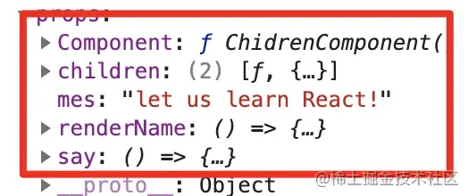
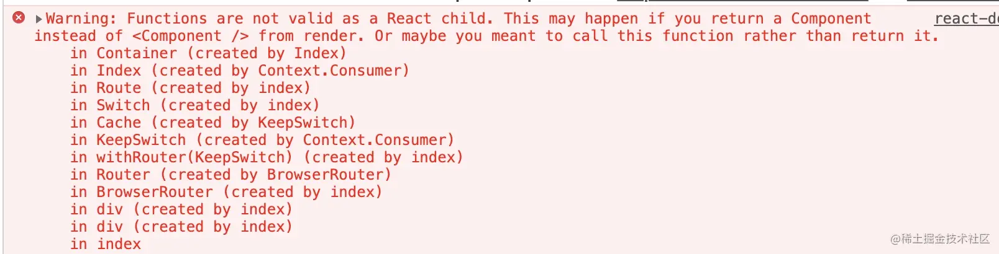
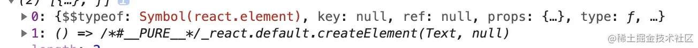
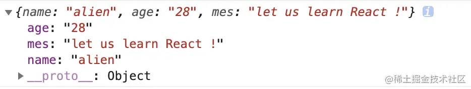
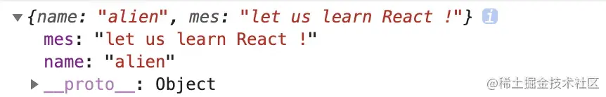
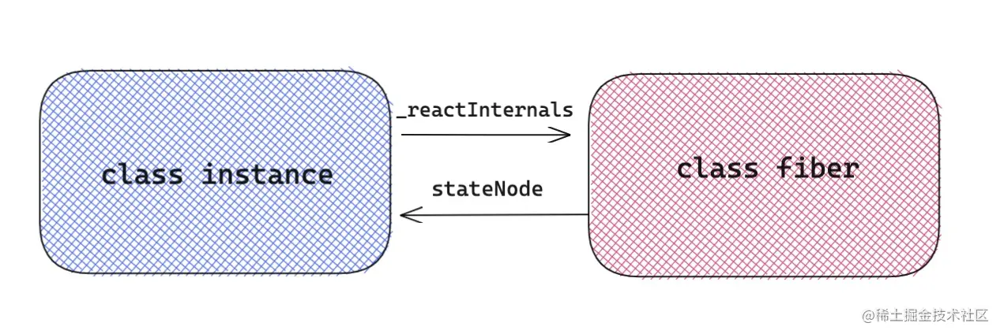
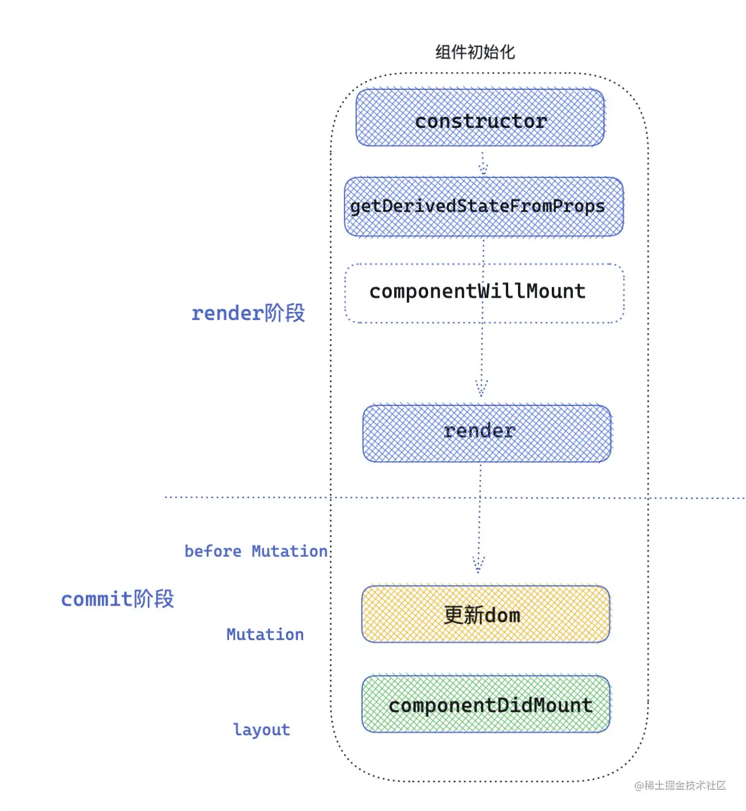
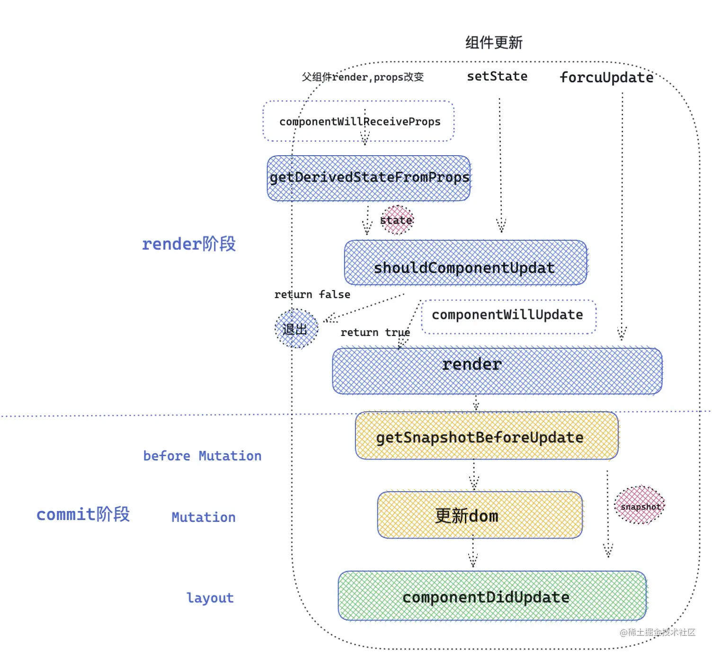

# react学习-02

| 文档创建人 | 创建日期   | 文档内容                  | 更新时间   |
| ---------- | ---------- | ------------------------- | ---------- |
| adsionli   | 2022-11-28 | react学习-props,lifeCycle | 2022-11-28 |

## Props学习

props 是 React 组件通信最重要的手段，它在 React 的世界中充当的角色是十分重要的。有一点必须明确，弄清楚一次 render 的过程，就是调用 React.createElement 形成新的 element 过程，新的 element 上就会有新的 props 属性，这个新 props 就是重新渲染视图的关键所在。所以学好 props，有助于打通 React 组件脉络。

### 什么是props

首先应该明确一下什么是 props ，对于在 React 应用中写的子组件，无论是函数组件 `FunComponent` ，还是类组件 `ClassComponent` ，父组件绑定在它们标签里的属性/方法，最终会变成 props 传递给它们。但是这也不是绝对的，对于一些特殊的属性，比如说 ref 或者 key ，React 会在底层做一些额外的处理。首先来看一下 React 中 props 可以是些什么东西？

> 父组件传递给子组件数据的一个传输工具就是props

React 中的 props ，还是很灵活的，接下来先来看一个 demo ：

```jsx
/* children 组件 */
function ChidrenComponent(){
    return <div> In this chapter, let's learn about react props ! </div>
}
/* props 接受处理 */
class PropsComponent extends React.Component{
    componentDidMount(){
        console.log(this,'_this')
    }
    render(){
        const {  children , mes , renderName , say ,Component } = this.props
        const renderFunction = children[0]
        const renderComponent = children[1]
        /* 对于子组件，不同的props是怎么被处理 */
        return <div>
            { renderFunction() }
            { mes }
            { renderName() }
            { renderComponent }
            <Component />
            <button onClick={ () => say() } > change content </button>
        </div>
    }
}
/* props 定义绑定 */
class Index extends React.Component{
    state={  
        mes: "hello,React"
    }
    node = null
    say= () =>  this.setState({ mes:'let us learn React!' })
    render(){
        return <div>
            <PropsComponent  
               mes={this.state.mes}  // ① props 作为一个渲染数据源
               say={ this.say  }     // ② props 作为一个回调函数 callback
               Component={ ChidrenComponent } // ③ props 作为一个组件
               renderName={ ()=><div> my name is alien </div> } // ④ props 作为渲染函数
            >
                { ()=> <div>hello,world</div>  } { /* ⑤render props */ }
                <ChidrenComponent />             { /* ⑥render component */ }
            </PropsComponent>
        </div>
    }
}
```

如上看一下 props 可以是什么？

- ① props 作为一个子组件渲染数据源。
- ② props 作为一个通知父组件的回调函数。
- ③ props 作为一个单纯的组件传递。
- ④ props 作为渲染函数。
- ⑤ render props ， 和④的区别是放在了 children 属性上。
- ⑥ render component 插槽组件。

> 这里和vue就是不太一样了，在vue中props只能传递数据，对于插在其中的内容，是要作为插槽传递的。其父子组件通信则是通过emit来进行数据传递的。
>
> 在react中，props内容更加全面，可以传递函数、组件、数据、渲染函数、插槽

那么如上 props 在组件实例上是什么样子：

**PropsComponent 如果是一个类组件，那么可以直接通过 this.props 访问到它**：



在标签内部的属性和方法会直接绑定在 props 对象的属性上，对于组件的插槽会被绑定在 props 的 Children 属性中。

### props的定义

接下来一起总结一下 props 究竟能做些什么？

**在 React 组件层级 props 充当的角色**

一方面父组件 props 可以把数据层传递给子组件去渲染消费。另一方面子组件可以通过 props 中的 callback ，来向父组件传递信息。还有一种可以将视图容器作为 props 进行渲染。

**从 React 更新机制中 props 充当的角色**

在 React 中，props 在组件更新中充当了重要的角色，在 fiber 调和阶段中，diff 可以说是 React 更新的驱动器，熟悉 vue 的同学都知道 vue 中基于响应式，数据的变化，就会颗粒化到组件层级，通知其更新，但是在 React 中，无法直接检测出数据更新波及到的范围，props 可以作为组件是否更新的重要准则，变化即更新，于是有了 PureComponent ，memo 等性能优化方案。

**从React插槽层面props充当的角色** React 可以把组件的闭合标签里的插槽，转化成 Children 属性，一会将详细介绍这个模式。

### Props变化监听

**类组件中**

① componentWillReceiveProps 可以作为监听props的生命周期，但是 React 已经不推荐使用 componentWillReceiveProps ，未来版本可能会被废弃，因为这个生命周期超越了 React 的可控制的范围内，可能引起多次执行等情况发生。于是出现了这个生命周期的替代方案 getDerivedStateFromProps ，在下一章节，会详细介绍 React 生命周期。

**函数组件中**

② 函数组件中同理可以用 useEffect 来作为 props 改变后的监听函数。**(不过有一点值得注意, useEffect 初始化会默认执行一次)**

```js
React.useEffect(()=>{
    // props 中number 改变，执行这个副作用。
    console.log('props改变：' ，props.number  )
},[ props.number ])
```

### Props Children模式

props + children 模式 在 React 中非常常用，尤其对一些优秀开源组件库。比如 react-router 中的 Switch 和 Route ， antd 中的 Form 和 FormItem。

首先来看看 prop + children 的几个基本情况。

**① props 插槽组件**

```js
<Container>
    <Children>
</Container>
```

上述可以在 Container 组件中，**通过 props.children 属性访问到 Children 组件**，为 React element 对象。

作用：

- 1 **可以根据需要控制 Children 是否渲染**。
- 2 **像上一节所说的， Container 可以用 React.cloneElement 强化 props (混入新的 props )，或者修改 Children 的子元素。**

**② render props模式**

```jsx
<Container>
   { (ContainerProps)=> <Children {...ContainerProps}  /> }
</Container>
```

这种情况，在 Container 中， props.children 属性访问到是函数，并不是 React element 对象，针对这种情况，像下面这种情况下 children 是不能直接渲染的，直接渲染会报错。

```js
function  Container(props) {
     return  props.children
}
```

如果上述直接这么写，会报如下的错误：



改成如下方式，就可以了。

```js
function  Container(props) {
    const  ContainerProps = {
        name: 'alien',
        mes:'let us learn react'
    }
     return  props.children(ContainerProps)
}
```

这种方式作用是：

- 1 **根据需要控制 Children 渲染与否。**
- 2 **可以将需要传给 Children 的 props 直接通过函数参数的方式传递给执行函数 children** 。

**混合模式**

如果 Container 的 Children 既有函数也有组件，这种情况应该怎么处理呢？

```jsx
<Container>
    <Children />
    { (ContainerProps)=> <Children {...ContainerProps} name={'haha'}  />  }
</Container>
```

首先在 Container 里打印 Children 看看是什么？



```js
const Children = (props)=> (<div>
    <div>hello, my name is {  props.name } </div>
    <div> { props.mes } </div>
</div>)

function  Container(props) {
    const ContainerProps = {
        name: 'alien',
        mes:'let us learn react'
    }
     return props.children.map(item=>{
        if(React.isValidElement(item)){ // 判断是 react elment  混入 props
            return React.cloneElement(item,{ ...ContainerProps },item.props.children)
        }else if(typeof item === 'function'){
            return item(ContainerProps)
        }else return null
     })
}

const Index = ()=>{
    return <Container>
        <Children />
        { (ContainerProps)=> <Children {...ContainerProps} name={'haha'}  />  }
    </Container>
}
```

**效果**


这种情况需要先遍历 children ，判断 children 元素类型：

- 针对 element 节点，通过 cloneElement 混入 props ；
- 针对函数，直接传递参数，执行函数。

### 操作props技巧

#### 抽象props

抽象 props 一般用于**跨层级传递 props** ，一般不需要具体指出 props 中某个属性，而是**将 props 直接传入或者是抽离到子组件中**。

#### 混入props

```jsx
function Son(props){
    console.log(props)
    return <div> hello,world </div>
}
function Father(props){
    const fatherProps={
        mes:'let us learn React !'
    }
    return <Son {...props} { ...fatherProps }  />
}
function Index(){
    const indexProps = {
        name:'alien',
        age:'28',
    }
    return <Father { ...indexProps }  />
}
```

**打印**



Father 组件一方面直接将 Index 组件 indexProps 抽象传递给 Son，一方面混入 fatherProps 。

> 多层级传入，并且可以进行合并

**抽离props**

有的时候想要做的恰恰和上面相反，比如想要从父组件 props 中抽离某个属性，再传递给子组件，那么应该怎么做呢？

```jsx
function Son(props){
    console.log(props)
    return <div> hello,world </div>
}

function Father(props){
    const { age,...fatherProps  } = props
    return <Son  { ...fatherProps }  />
}
function Index(){
    const indexProps = {
        name:'alien',
        age:'28',
        mes:'let us learn React !'
    }
    return <Father { ...indexProps }  />
}
```

**打印**



成功的将 indexProps 中的 age 属性抽离出来。

> 跨层级传递props，可以消费props中内容，且消费后，子级就无法进行消费了

#### 注入props

##### **显式注入props**

显式注入 props ，就是能够直观看见标签中绑定的 props 。

```jsx
function Son(props){
     console.log(props) // {name: "alien", age: "28"}
     return <div> hello,world </div>
}
function Father(prop){
    return prop.children
}
function Index(){
    return <Father>
        <Son  name="alien"  age="28"  />
    </Father>
}
```

如上向 Son 组件绑定的 name 和 age 是能直观被看见的。

##### **隐式注入 props**

这种方式，一般通过 `React.cloneElement` 对 props.chidren 克隆再混入新的 props 。

```jsx
function Son(props){
     console.log(props) // {name: "alien", age: "28", mes: "let us learn React !"}
     return <div> hello,world </div>
}
function Father(prop){
    return React.cloneElement(prop.children,{  mes:'let us learn React !' })
}
function Index(){
    return <Father>
        <Son  name="alien"  age="28"  />
    </Father>
}
```

如上所示，将 mes 属性，隐式混入到了 Son 的 props 中。

### props实践-实现一个Form嵌套组件

接下来到实践环节了。需要编写一个实践 demo ，**用于表单状态管理的`<Form>` 和 `<FormItem>` 组件**

- `<Form>`用于管理表单状态；
- `<FormItem>`用于管理`<Input>`输入框组件。,

编写的组件能够实现的功能是：

- ①`Form` 组件可以被 ref 获取实例。然后可以调用实例方法 `submitForm` 获取表单内容，用于提交表单，`resetForm` 方法用于重置表单。
- ②`Form`组件自动过滤掉除了`FormItem`之外的其他React元素
- ③`FormItem` 中 name 属性作为表单提交时候的 key ，还有展示的 label 。
- ④ `FormItem` 可以自动收集 `<Input/>` 表单的值。

目的：

希望通过这实践 demo 让大家学习到：

- **① props 基本使用**
- **② 学会操作 props.children ，隐式注入 props**
- **③ 掌握表单嵌套原理(现实情况要比这个复杂)**

**组件使用**

```jsx
export default  () => {
    const form =  React.useRef(null)
    const submit =()=>{
        /* 表单提交 */
        form.current.submitForm((formValue)=>{
            console.log(formValue)
        })
    }
    const reset = ()=>{
        /* 表单重置 */
        form.current.resetForm()
    }
    return <div className='box' >
        <Form ref={ form } >
            <FormItem name="name" label="我是"  >
                <Input   />
            </FormItem>
            <FormItem name="mes" label="我想对大家说"  >
                <Input   />
            </FormItem>
            <input  placeholder="不需要的input" />
            <Input/>
        </Form>
        <div className="btns" >
            <button className="searchbtn"  onClick={ submit } >提交</button>
            <button className="concellbtn" onClick={ reset } >重置</button>
        </div>
    </div>
}
```

**效果**


#### 1 编写 `<Form>`

```jsx
class Form extends React.Component{
    state={
        formData:{}
    }
    /* 用于提交表单数据 */
    submitForm=(cb)=>{
        cb({ ...this.state.formData })
    } 
    /* 获取重置表单数据 */
    resetForm=()=>{
       const { formData } = this.state
       Object.keys(formData).forEach(item=>{
           formData[item] = ''
       })
       this.setState({
           formData
       })
    }
    /* 设置表单数据层 */
    setValue=(name,value)=>{
        this.setState({
            formData:{
                ...this.state.formData,
                [name]:value
            }
        })
    }
    render(){
        const { children } = this.props
        const renderChildren = []
        React.Children.forEach(children,(child)=>{
            if(child.type.displayName === 'formItem'){
                const { name } = child.props
                /* 克隆`FormItem`节点，混入改变表单单元项的方法 */
                const Children = React.cloneElement(child,{ 
                    key:name ,                             /* 加入key 提升渲染效果 */
                    handleChange:this.setValue ,           /* 用于改变 value */
                    value:this.state.formData[name] ||  '' /* value 值 */
                },child.props.children)
                renderChildren.push(Children)
            }
        })
        return renderChildren
    }
}
/* 增加组件类型type  */
Form.displayName = 'form'
```

设计思想：

- 首先考虑到 `<Form>` 在不使用 `forwardRef` 前提下，最好是类组件，因为**只有类组件才能获取实例**。
- 创建一个 state 下的 formData属性，用于收集表单状态。
- 要封装 **重置表单**，**提交表单**，**改变表单单元项**的方法。
- 要过滤掉除了 `FormItem` 元素之外的其他元素，那么怎么样知道它是不是`FormItem`，这里教大家一种方法，可以给函数组件或者类组件绑定静态属性来证明它的身份，然后在遍历 props.children 的时候就可以**在 React element 的 type 属性(类或函数组件本身)上，验证这个身份，在这个 demo 项目，给函数绑定的 displayName 属性，证明组件身份。**
- 要克隆 `FormItem` 节点，将改变表单单元项的方法 handleChange 和表单的值 value 混入 props 中。

#### 2 编写 `<FormItem>`

```jsx
function FormItem(props){
    const { children , name  , handleChange , value , label  } = props
    const onChange = (value) => {
        /* 通知上一次value 已经改变 */
        handleChange(name,value)
    }
   return <div className='form' >
       <span className="label" >{ label }:</span>
       {
            React.isValidElement(children) && children.type.displayName === 'input' 
            ? React.cloneElement(children,{ onChange , value })
            : null
       }
   </div>    
}
FormItem.displayName = 'formItem'
```

设计思想：

- `FormItem`一定要绑定 displayName 属性，用于让 `<Form>` 识别`<FormItem />`
- 声明 `onChange` 方法，通过 props 提供给`<Input>`，作为改变 value 的回调函数。
- `FormItem`过滤掉除了 `input` 以外的其他元素。

#### 3 编写 `<Input />`

```jsx
/* Input 组件, 负责回传value值 */
function Input({ onChange , value }){
    return  <input className="input"  onChange={ (e)=>( onChange && onChange(e.target.value) ) } value={value}  />
}
/* 给Component 增加标签 */
Input.displayName = 'input'
```

设计思想：

- 绑定 displayName 标识`input`。
- `input` DOM 元素，绑定 onChange 方法，用于传递 value 。


## LifyCycle生命周期

目标：搞定 React 生命周期的流程和能弄清楚在各个生命周期做些什么，第二点就是加深对 React Hooks 中 `useEffect` 和 `useLayoutEffect`的使用。

### 类组件生命周期

在讲 React 生命周期之前，有必要先来简单聊聊 React 两个重要阶段，render 阶段和 commit 阶段，React 在调和( render )阶段会深度遍历 React fiber 树，目的就是发现不同( diff )，不同的地方就是接下来需要更新的地方，对于变化的组件，就会执行 render 函数。在一次调和过程完毕之后，就到了commit 阶段，commit 阶段会创建修改真实的 DOM 节点。

如果在一次调和的过程中，发现了一个 `fiber tag = 1 `类组件的情况，就会按照类组件的逻辑来处理。对于类组件的处理逻辑，首先判断类组件是否已经被创建过，首先来看看源码里怎么写的。

> react-reconciler/src/ReactFiberBeginWork.js

```js
/* workloop React 处理类组件的主要功能方法 */
function updateClassComponent(){
    let shouldUpdate
    const instance = workInProgress.stateNode // stateNode 是 fiber 指向 类组件实例的指针。
    if (instance === null) { // instance 为组件实例,如果组件实例不存在，证明该类组件没有被挂载过，那么会走初始化流程
        constructClassInstance(workInProgress, Component, nextProps); // 组件实例将在这个方法中被new。
        mountClassInstance(  workInProgress,Component, nextProps,renderExpirationTime ); //初始化挂载组件流程
        shouldUpdate = true; // shouldUpdate 标识用来证明 组件是否需要更新。
    }else{  
        shouldUpdate = updateClassInstance(current, workInProgress, Component, nextProps, renderExpirationTime) // 更新组件流程
    }
    if(shouldUpdate){
        nextChildren = instance.render(); /* 执行render函数 ，得到子节点 */
        reconcileChildren(current,workInProgress,nextChildren,renderExpirationTime) /* 继续调和子节点 */
    }
}
```

几个重要概念：

- ① `instance` 类组件对应实例。
- ② `workInProgress` 树，当前**正在调和的 fiber 树** ，一次更新中，React 会自上而下深度遍历子代 fiber ，如果遍历到一个 fiber ，会把当前 fiber 指向 workInProgress。
- ③ `current` 树，在初始化更新中，current = null ，在第一次 fiber 调和之后，会将 workInProgress 树赋值给 current 树。React 来用workInProgress 和 current 来确保一次更新中，快速构建，并且状态不丢失。
- ④ `Component` 就是项目中的类组件。
- ⑤ `nextProps` 作为组件在一次更新中新的 props 。
- ⑥ `renderExpirationTime` 作为下一次渲染的过期时间。

上面这个函数流程我已经标的很清楚了，同学们在学习React的过程中，重要的属性一定要拿小本本记下来，比如说**类组件完成渲染挂载之后， React 用什么记录组件对应的 fiber 对象和类组件实例之间的关系**。只有搞清楚这些，才能慢慢深入学习 React 。

在组件实例上可以通过 `_reactInternals` 属性来访问组件对应的 fiber 对象。在 fiber 对象上，可以通过 `stateNode` 来访问当前 fiber 对应的组件实例。两者的关系如下图所示。



> stateNode获取fiber对于组件实例，_reactInternals属性访问fiber对象

#### 类组件生命周期执行过程

React 的大部分生命周期的执行，都在 `mountClassInstance` 和`updateClassInstance` 这两个方法中执行，所以为了让大家深入学习 React 生命周期的执行过程，我觉得有必要去揭秘这两个函数充当了什么角色。我把流程简化成 mount (初始化渲染) 和 update (更新)两个方向。

为了让大家更理解生命周期的执行流程，我这里分为**组件初始化**，**组件更新** ， **组件销毁** ，三大阶段分析。

#### 初始化阶段

**① constructor 执行**

在 mount 阶段，首先执行的 constructClassInstance 函数，用来实例化 React 组件，在组件章节已经介绍了这个函数，组件中 constructor 就是在这里执行的。

在实例化组件之后，会调用 mountClassInstance 组件初始化。

接下来看一下 mountClassInstance 做了些什么？ 我只写了和生命周期息息相关的代码。

> react-reconciler/src/ReactFiberClassComponent.js

```js
function mountClassInstance(workInProgress,ctor,newProps,renderExpirationTime){
    //获取fiber实例对象
    const instance = workInProgress.stateNode;
    //获取我们写的类组件上的getDerivedStateFromProps变量，用来判断是否有对应的生命周期捕获
    const getDerivedStateFromProps = ctor.getDerivedStateFromProps;
    //ctor 就是我们写的类组件，获取类组件的静态方法
    if (typeof getDerivedStateFromProps === 'function') { 
        //这个时候执行 getDerivedStateFromProps 生命周期 ，得到将合并的state
        const partialState = getDerivedStateFromProps(nextProps, prevState);
        // 合并state
        const memoizedState = partialState === null || partialState === undefined ? prevState : Object.assign({}, prevState, partialState); 
        workInProgress.memoizedState = memoizedState;
        //将state 赋值给我们实例上，instance.state  就是我们在组件中 this.state获取的state
        instance.state = workInProgress.memoizedState;
    }
    if(typeof ctor.getDerivedStateFromProps !== 'function' &&   typeof instance.getSnapshotBeforeUpdate !== 'function' && typeof instance.componentWillMount === 'function' ){
        //当 getDerivedStateFromProps 和 getSnapshotBeforeUpdate 不存在的时候 ，执行 componentWillMount
        instance.componentWillMount(); 
    }
}
```

**② getDerivedStateFromProps 执行**

在初始化阶段，`getDerivedStateFromProps` 是第二个执行的生命周期，值得注意的是它是从 ctor 类上直接绑定的静态方法，传入 props ，state 。 返回值将和之前的 state 合并，作为新的 state ，传递给组件实例使用。

**③ componentWillMount 执行**

如果存在 `getDerivedStateFromProps` 和 `getSnapshotBeforeUpdate` 就不会执行生命周期`componentWillMount`。

**④ render 函数执行**

到此为止 `mountClassInstance` 函数完成，但是上面 `updateClassComponent` 函数， 在执行完 `mountClassInstance` 后，执行了 render 渲染函数，形成了 children ， 接下来 React 调用 `reconcileChildren` 方法深度调和 children 。

**⑤componentDidMount执行**

细心的同学可能发现，生命周期 `componentDidMount` 还没有出现，那么 `componentDidMount` 是如何执行的呢？上文中简单介绍了 render 和 commit 两个阶段，上述提及的生命周期都是在 render 阶段执行的。一旦 **React 调和完所有的 fiber 节点，就会到 commit 阶段**，在组件初始化 commit 阶段，会调用 `componentDidMount` 生命周期。

> react-reconciler/src/ReactFiberCommitWork.js

```js
function commitLifeCycles(finishedRoot,current,finishedWork){
     switch (finishedWork.tag){                             /* fiber tag 在第一节讲了不同fiber类型 */
        case ClassComponent: {                              /* 如果是 类组件 类型 */
             const instance = finishedWork.stateNode        /* 类实例 */
             if(current === null){                          /* 类组件第一次调和渲染 */
                instance.componentDidMount() 
             }else{                                         /* 类组件更新 */
                instance.componentDidUpdate(prevProps,prevState，instance.__reactInternalSnapshotBeforeUpdate); 
             }
        }
     }
}
```

从上面可以直观看到 `componentDidMount` 执行时机 和 `componentDidUpdate` 执行时机是相同的 ，只不过一个是针对初始化，一个是针对组件再更新。到此初始化阶段，生命周期执行完毕。

执行顺序：constructor -> getDerivedStateFromProps / componentWillMount -> render -> componentDidMount

> render阶段：组件初始化触发或是更新state后触发，这个阶段包括getDerivedStateFromPorps/componentWillMount
>
> commit阶段：render阶段触发完成后，进入到提交阶段也就是commit阶段，这里就包括了componentDidMount或是componentDidUpdate
>
> render阶段和commit阶段会在组件初始化时都被触发



接下来分析一下一次组件更新中，会有哪些生命周期执行呢？

#### 更新阶段

接下来一次类组件的更新阶段，到底会执行那些生命周期函数呢，回到了最开始 `updateClassComponent` 函数了，当**发现 current 不为 null 的情况时，说明该类组件被挂载过，那么直接按照更新逻辑来处理**。

> react-reconciler/src/ReactFiberClassComponent.js

```js
function updateClassInstance(current,workInProgress,ctor,newProps,renderExpirationTime){
    const instance = workInProgress.stateNode; // 类组件实例
    const hasNewLifecycles =  typeof ctor.getDerivedStateFromProps === 'function'  // 判断是否具有 getDerivedStateFromProps 生命周期
    if(!hasNewLifecycles && typeof instance.componentWillReceiveProps === 'function' ){
         if (oldProps !== newProps || oldContext !== nextContext) {     // 浅比较 props 不相等
            instance.componentWillReceiveProps(newProps, nextContext);  // 执行生命周期 componentWillReceiveProps 
         }
    }
    let newState = (instance.state = oldState);
    if (typeof getDerivedStateFromProps === 'function') {
        ctor.getDerivedStateFromProps(nextProps,prevState)  /* 执行生命周期getDerivedStateFromProps  ，逻辑和mounted类似 ，合并state  */
        newState = workInProgress.memoizedState;
    }   
    let shouldUpdate = true
    if(typeof instance.shouldComponentUpdate === 'function' ){ /* 执行生命周期 shouldComponentUpdate 返回值决定是否执行render ，调和子节点 */
        shouldUpdate = instance.shouldComponentUpdate(newProps,newState,nextContext,);
    }
    if(shouldUpdate){
        if (typeof instance.componentWillUpdate === 'function') {
            instance.componentWillUpdate(); /* 执行生命周期 componentWillUpdate  */
        }
    }
    return shouldUpdate
}
```

**①执行生命周期 componentWillReceiveProps**

首先判断 `getDerivedStateFromProps` 生命周期是否存在，如果不存在就执行`componentWillReceiveProps`生命周期。传入该生命周期两个参数，分别是 newProps 和 nextContext 。

**②执行生命周期 getDerivedStateFromProps**

接下来执行生命周期`getDerivedStateFromProps`， 返回的值用于合并state，生成新的state。

**③执行生命周期 shouldComponentUpdate**

接下来执行生命周期`shouldComponentUpdate`，传入新的 props ，新的 state ，和新的 context ，返回值决定是否继续执行 render 函数，调和子节点。这里应该注意一个问题，`getDerivedStateFromProps` 的返回值可以作为新的 state ，传递给 `shouldComponentUpdate` 。

**④执行生命周期 componentWillUpdate**

接下来执行生命周期 `componentWillUpdate`。`updateClassInstance` 方法到此执行完毕了。

**⑤执行 render 函数**

接下来会执行 render 函数，得到最新的 React element 元素。然后继续调和子节点。

**⑥执行 getSnapshotBeforeUpdate**

> react-reconciler/src/ReactFiberCommitWork.js

```js
function commitBeforeMutationLifeCycles(current,finishedWork){
     switch (finishedWork.tag) {
          case ClassComponent:{
               const snapshot = instance.getSnapshotBeforeUpdate(prevProps,prevState) /* 执行生命周期 getSnapshotBeforeUpdate   */
                instance.__reactInternalSnapshotBeforeUpdate = snapshot; /* 返回值将作为 __reactInternalSnapshotBeforeUpdate 传递给 componentDidUpdate 生命周期  */
          }
     }
}
```

`getSnapshotBeforeUpdate` 的执行也是在 commit 阶段，commit 阶段细分为 `before Mutation`( DOM 修改前)，`Mutation` ( DOM 修改)，`Layout`( DOM 修改后) 三个阶段，getSnapshotBeforeUpdate 发生在`before Mutation` 阶段，生命周期的返回值，将作为第三个参数 __reactInternalSnapshotBeforeUpdate 传递给 componentDidUpdate 。

**⑦执行 componentDidUpdate**

接下来执行生命周期 componentDidUpdate ，此时 DOM 已经修改完成。可以操作修改之后的 DOM 。到此为止更新阶段的生命周期执行完毕。



更新阶段对应的生命周期的执行顺序：

componentWillReceiveProps( props 改变) / getDerivedStateFromProp -> shouldComponentUpdate -> componentWillUpdate -> render -> getSnapshotBeforeUpdate -> componentDidUpdate

