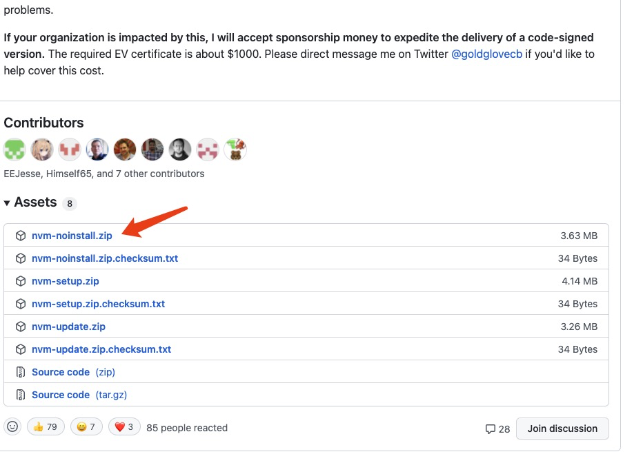
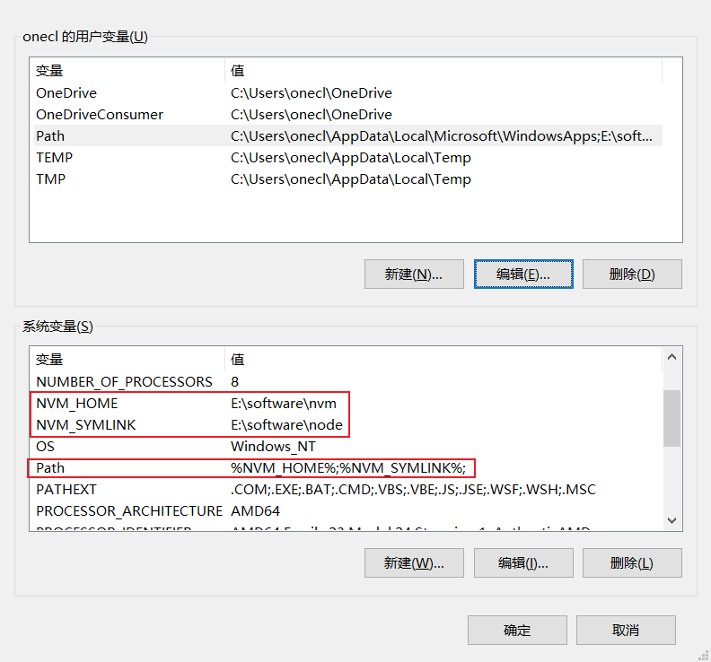
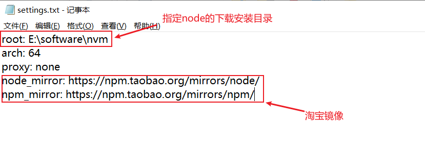

# nvm工具的使用
| 文档创建人 | 创建日期   | 文档内容          | 更新时间 |
| ---------- | ---------- | ----------------- | -------- |
| adsionli   | 2021-10-31 | nvm工具的使用 | 2021-10-31    |

## nvm能干什么

在我们的日常开发中经常会遇到这种情况：手上有好几个项目，每个项目的需求不同，进而不同项目必须依赖不同版的 NodeJS 运行环境。如果没有一个合适的工具，这个问题将非常棘手。

[nvm](https://github.com/creationix/nvm) 应运而生，nvm 是 Mac 下的 node 管理工具，有点类似管理 Ruby 的 rvm，如果需要管理 Windows 下的 node，官方推荐使用 [nvmw](https://github.com/hakobera/nvmw) 或 [nvm-windows](https://github.com/coreybutler/nvm-windows)。

## nvm的安装
### macos系统的安装

1. macos上安装nvm比较简单，可以直接使用brew进行安装，安装指令如下

   > 以上的前提是在电脑上已经安装了homebrew的基础下进行完成的

   ```shell
   brew install nvm
   ```

2. 配置macos上的配置文件`~/.bash_profile`，配置完成后，保存退出，然后打开~/.zsher

   `.bash_profile`的配置属性如下：

   ```shell
   export NVM_DIR="$HOME/.nvm"
   [ -s "/usr/local/opt/nvm/nvm.sh" ] && . "/usr/local/opt/nvm/nvm.sh"  # This loads nvm
   [ -s "/usr/local/opt/nvm/etc/bash_completion.d/nvm" ] && . "/usr/local/opt/nvm/etc/bash_completion.d/nvm"
   ```

   > 以上配置是基于homebrew安装后的默认路径，如果手动通过cmake安装的就需要自己调整一下路径

   配置一下nvm的国内镜像源，不然下载node的时候速度简直让人崩溃

   ```shell
   export NVM_NODEJS_ORG_MIRROR=http://npm.taobao.org/mirrors/node
   export NVM_IOJS_ORG_MIRROR=http://npm.taobao.org/mirrors/iojs
   ```

   上述配置完成之后，如果只是简单的使用`source ~./bash_profile`使其进行生效的时候，你会发现，只有在当前终端页面时生效的，如果你关了中断之后，再次使用nvm的时候就全部没了，所以最后的`source`并不是放在`.bash_profile`中。但是网上就绝对大多数的教程都是基于此来的，就很坑，真正的操作应该是如下所示：

   ```shell
   1. 打开~目录下的.zsher文件
   2. 在.zsher文件的最后一行添加如下代码
   source ~/.bash_profile
   ```

   这样操作之后，在执行一次`source ~/.zsher`就可以完美生效了，且是全局生效，不会因为不同的终端导致无法执行的问题出现了。这和**macos**系统的有关系，`.zsher`文件是作用在主配置文件中的，所以每一次作用时只会走`.zsher`这个文件，所以我们需要把`.bash_profile`文件的source导入到`.zsher`中。

   以上，在macos系统上的安装就完成了。

### windows系统的安装

windows系统上，安装的不是nvm，是nvm-windows，但是所有的nvm指令全是相同的。

首先前往github上的nvm-windows页面上进行下载，这里直接给出下载地址[nvm下载地址](https://github.com/coreybutler/nvm-windows/releases)



> 上图版本是最新的v1.1.8，直接下载第一个免安装版的，是人家直接打包好的，下载下来之后进行稍许配置就可以直接使用的。

下载完成之后，解压缩到指定的位置，然后前往我的电脑的属性中进行环境变量的配置，以便在全局生效



我们需要配置两个参数，分别是`NVM_HOME`以及`NVM_SYMLINK`这两个参数，`NVM_HOME` 指向**nvm**安装的目录，另一个是 `NVM_SYMLINK` 指向一个快捷方式。

配置好环境变量后，到 nvm安装目录下新建一个 setting.txt 文本文件，这个setting.txt的文本文件主要的作用是设置相关配置项，比如node下载之后的存放目录以及node,npm的国内源镜像的相关功能。



到了这里windows系统上的安装实际已经完成了，可以在终端中进行测试，查看`nvm -v`指令是否被正确执行。

### linux系统的安装使用

首先要确保自己的linux系统上有wget或者curl，因为要通过这个下载nvm的安装包

```shell
//然后输入一下指令进行安装,这里安装的是nvm0.39.0（任意位置执行这段指令都可以）
wget -qO- https://raw.githubusercontent.com/creationix/nvm/v0.39.0/install.sh | bash
```

下载完成之后，打开 `~/.bashrc`这个文件，到最底部查看是否存在如下代码：

```shell
export NVM_DIR="$HOME/.nvm"
[ -s "$NVM_DIR/nvm.sh" ] && \. "$NVM_DIR/nvm.sh"  # This loads nvm
[ -s "$NVM_DIR/bash_completion" ] && \. "$NVM_DIR/bash_completion"  # This loads nvm bash_completion
```

如果已经存在了就不需要处理，如果不存在就将上段代码复制过去，并换成国内的源

```shell
export NVM_NODEJS_ORG_MIRROR=http://npm.taobao.org/mirrors/node
export NVM_IOJS_ORG_MIRROR=http://npm.taobao.org/mirrors/iojs
```

自后保存退出后，在执行一下`source ~/.bashrc`，确保配置生效，就安装完成了

## nvm的使用

| 指令名称                      | 指令的作用                                                   | 示例                                                  |
| :---------------------------- | ------------------------------------------------------------ | ----------------------------------------------------- |
| `nvm install (version)`       | 安装指定版本的node                                           | `nvm install v14.15.0`                                |
| `nvm uninstall (version)`     | 卸载已安装的指定版本node                                     | `nvm uninstall v14.15.0`                              |
| `nvm use (version)`           | 使用指定版本的node                                           | `nvm use 14.15.0`                                     |
| `nvm node_mirror [url]`       | 设置node镜像(windows有效)                                    | `nvm npm_mirror https://npm.taobao.org/mirrors/node/` |
| `nvm npm_mirror [url]`        | 设置npm镜像(windows有效)                                     | `nvm npm_mirror https://npm.taobao.org/mirrors/npm/`  |
| `nvm ls`                      | 显示已安装node版本，以及当前会用版本及默认版本，及可安装版本 | `nvm ls`                                              |
| `nvm -v`                      | 显示nvm安装的版本                                            | `nvm -v`                                              |
| `nvm current`                 | nvm当前使用node 版本                                         | `nvm current`                                         |
| `nvm alias default (version)` | nvm设置默认node版本                                          | `nvm alias default 14.15.0`                           |

> 还有一些指令，不是很常用，就不列出来了，可以自己通过终端输入`nvm`查看

关于管理node,npm镜像的话，可以使用nrm管理工具，可以通过npm导入

```shell
npm install -g nrm
```

> nrm是一种管理npm资源的资源管理器，他可以设置和切换不同的npm库的源，具体的操作可以看这篇博文: [关于nrm与nvm结合使用的例子](https://segmentfault.com/a/1190000020028788)

## 总结

nvm真的是一个很好用的版本控制的工具，根据不同项目需要来使用不同的node版本，大大的提高了开发效率。之前在学习webpack的使用，使用postcss来编译css代码的时候，就出现了这种需求，我的nodejs的版本是12.19.0，但是如果想在终端使用postcss编译的话需要node版本为>12，所以需要切换node版本，然后这个时候我就安装了nvm来进行版本控制，到达很好的效果，所以就分享一篇安装和常用指令的集合，来增加记忆。

**工具的使用在代码开发过程也十分重要的，能够大大提高开发效率，减少不必要的时间损耗。**