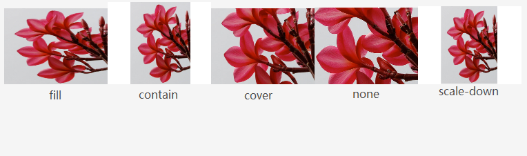
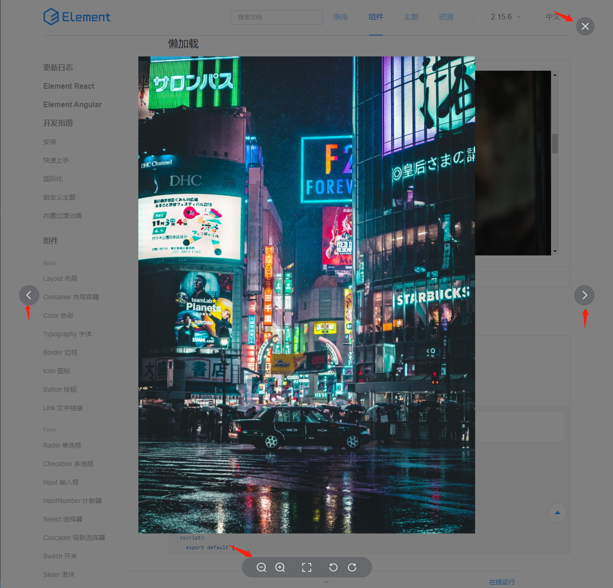

# 源码阅读-elementui下的image组件
| 文档创建人 | 创建日期   | 文档内容          | 更新时间 |
| ---------- | ---------- | ----------------- | -------- |
| adsionli   | 2021-11-02 | elementui下的image组件学习 | 2021-11-02   |

## elementui-image组件的组成
`elementui`的`image`模块主要是有`main.vue`，image-viewer.vue两个文件组成的，其最外层的`main.vue`是image组件的主体文件，`image-viewer.vue`文件主要为点击图片后的大图预览。

## elementui-image组件的功能

1. 首先理清楚`image`组件中完成了什么功能，功能列表如下：

   ​    (1)`image`组件能够设置fit的属性，通过`fit`来设置图片展示形式

   ​	(2)图片懒加载的使用，基于`scroll`滚动条事件来进行

   ​	(3)图片的大图预览，通过设置`preview`来开启，同时需要传入`previewSrcList`参数。

   ​	(4)可配置图片加载失败的显示，通过`slot`来实现

   ​	(5)可配置图片加载过程的显示，通过`slot`来实现

   ​	(6)图片在大图预览下的功能: 缩放，旋转，等比例调整，图片切换，基于鼠标滚轮的缩放，基于键盘输入的缩放，切换，隐藏预览功能，基于鼠标按下事件的拖放功能。

## elementui-image的功能实现

### fit的样式实现

fit样式主要是包含5种形式，分别是：`fill`, `none`, `contain`, `scale-down`,`cover`

> object-fit属性在有些低版本的浏览器上是不被支持的，所以需要自己处理以上的五种显示形式，下面会进行整理书写

`object-fit`属性用于指定应如何调整 `img` 或 `video` 的大小以适合其容器。该属性告诉内容以多种方式填充容器；例如“保持纵横比”或“拉伸并占用尽可能多的空间”。具体的图片展示效果如下图：



> 根据MDN-CSS的解释，以上5种形式的对应解释如下
>
> 1. `contain：`
>
>    被替换的内容将被缩放，以在填充元素的内容框时保持其宽高比。 整个对象在填充盒子的同时保留其长宽比，因此如果宽高比与框的宽高比不匹配，该对象将被添加==**黑边**==。
>
> 2. `cover：`
>
>    被替换的内容在保持其宽高比的同时填充元素的整个内容框。如果对象的宽高比与内容框不相匹配，该对象将被剪裁以适应内容框。
>
> 3. `fill：`
>
>    被替换的内容正好填充元素的内容框。整个对象将完全填充此框。如果对象的宽高比与内容框不相匹配，那么该对象将被拉伸以适应内容框。
>
> 4. `none：`
>
>    被替换的内容将保持其原有的尺寸。
>
> 5. `scale-down：`
>
>    内容的尺寸与 `none` 或 `contain` 中的一个相同，取决于它们两个之间谁得到的对象尺寸会更小一些。

那么在**image**组件中，为了实现`fit`的动态配置，**image**组件中是由父组件传入`fit`的属性值，如果不传入的话，会选择默认的`fill`，来对图片进行处理。

同时由于部分低版本浏览器平台中，是不支持`object-fit`的，所以**image**组件对其进行了处理，通过一个`computed`数据`imageStyle`来控制**image**的样式。同时对于不支持的浏览器平台，也自定义了一份类`object-fit`的样式来进行兼容。

具体兼容代码如下：

```js
//通过这段代码来判断是否支持当前浏览器，如果不支持就返回false,支持返回true
const isSupportObjectFit = () => document.documentElement.style.objectFit !== undefined;
//定义枚举类，用于对应fit的几种形式
const ObjectFit = {
    NONE: 'none',
    CONTAIN: 'contain',
    COVER: 'cover',
    FILL: 'fill',
    SCALE_DOWN: 'scale-down'
};
/**
* 兼容代码,它的实际实现也很简单，实际就是处理图片的长宽比，来控制图片的显示格式
*/
getImageStyle(fit) {
    const { imageWidth, imageHeight } = this;
    const {
        clientWidth: containerWidth,
        clientHeight: containerHeight
    } = this.$el;

    if (!imageWidth || !imageHeight || !containerWidth || !containerHeight) return {};

    const imageAspectRatio = imageWidth / imageHeight;
    const containerAspectRatio = containerWidth / containerHeight;

    if (fit === ObjectFit.SCALE_DOWN) {
        const isSmaller = imageWidth < containerWidth && imageHeight < containerHeight;
        fit = isSmaller ? ObjectFit.NONE : ObjectFit.CONTAIN;
    }

    switch (fit) {
        case ObjectFit.NONE:
            return { width: 'auto', height: 'auto' };
        case ObjectFit.CONTAIN:
            return (imageAspectRatio < containerAspectRatio) ? { width: 'auto' } : { height: 'auto' };
        case ObjectFit.COVER:
            return (imageAspectRatio < containerAspectRatio) ? { height: 'auto' } : { width: 'auto' };
        default:
            return {};
    }
}
/**
* 图片的长宽获取实际是在mounted种获取到的，通过新建一个Image类，然后监控imageLoad是否成功，如果成功了，就可以读取图片的长宽。
*/
loadImage() {
    if (this.$isServer) return;

    // reset status
    this.loading = true;
    this.error = false;

    const img = new Image();
    img.onload = e => this.handleLoad(e, img);
    img.onerror = this.handleError.bind(this);

    // bind html attrs
    // so it can behave consistently
    Object.keys(this.$attrs)
        .forEach((key) => {
        const value = this.$attrs[key];
        img.setAttribute(key, value);
    });
    img.src = this.src;
}
handleLoad(e, img) {
    this.imageWidth = img.width;
    this.imageHeight = img.height;
    this.loading = false;
    this.error = false;
}
//computed属性imageStyle
imageStyle() {
    const { fit } = this;
    if (!this.$isServer && fit) {
        return isSupportObjectFit()
            ? { 'object-fit': fit }
        : this.getImageStyle(fit);
    }
    return {};
}
```

通过上述的代码，就可以设置图片的`fit`属性了，如果说浏览器不支持，也可通过自定义`width`与`height`来实现类fit的样式。虽然说实现起来的步骤比较多，但是这样可以为大部分浏览器平台提供很好的适配和兼容，是一种很好的处理方式。

### 图片懒加载的实现方式

​		图片懒加载的实现实际上用了节流器来完成，通过设置延迟器，避免在第一时间加载图片，等待一个指定的时间后加载图片，达到图片懒加载的实现。具体的防抖和节流的实现，这里就先不赘述了，等到之后出一片博文之后，来在这里添加一条链接。

​		同时这里的图片懒加载也是基于Scroll的事件监听进行实现，然后加入throttle之后，设置等待时间为200ms，来实现show的延迟加载。

​		具体实现代码如下：

```js
addLazyLoadListener() {
    //判断是否是服务端渲染，如果是服务端渲染就无法使用懒加载，因为服务端渲染是把所有标签全部渲染完成后输出的
    if (this.$isServer) return;

    const { scrollContainer } = this;
    let _scrollContainer = null;

    if (isHtmlElement(scrollContainer)) {
        _scrollContainer = scrollContainer;
    } else if (isString(scrollContainer)) {
        _scrollContainer = document.querySelector(scrollContainer);
    } else {
        _scrollContainer = getScrollContainer(this.$el);
    }

    if (_scrollContainer) {
        this._scrollContainer = _scrollContainer;
        //这里来设置节流，等待时间为200ms，这样就不会实时出发scroll滚动事件。
        this._lazyLoadHandler = throttle(200, this.handleLazyLoad);
        on(_scrollContainer, 'scroll', this._lazyLoadHandler);
        this.handleLazyLoad();
    }
}
```

​		实现还是比较简单的，但是这里的很多东西感觉很值得学习，无论是节流还是滚动事件的设置。作为现在的新手的我来说是值得学习的，又可以学习使用节流的场景，也可以学习节流与事件合并使用的技巧。

### 图片加载失败和加载中的可配置的实现

这里的图片加载失败和加载中的可配置实现，其实都是基于slot进行实现的，也就是vue中插槽，并且这里使用了具名插槽的使用。插槽的使用还是比较简单的，这里就放一下vue官网对插槽的介绍：[vue插槽](https://cn.vuejs.org/v2/guide/components-slots.html)

### 图片预览的功能模块实现(image-view.vue文件)

先放一张图，通过这个图里的内容来介绍预览功能



​	图片预览模块的功能实现就比较好玩了，主要分为上面说的几个方面，现在就来说一下这些方面：

1. 布局：

   页面采用的布局实际就是蒙版的实现，但是`image-view`的蒙板实现其实存在一些问题，就是当把组件插在页面中的时候，如果整个页面是很长的页面，那么在对图片使用滚轮缩放放大的时候，主页面也会被影响。整体的页面布局采用的还是`flex`布局的形式，同时将`justify-content`设置问`center`，`align-item`也设置为`center`，这样就可以保证`image`的居中显示了。其他的图标都为`absolute`，图标组依然在`absolute`的基础上，继续设置了`flex`布局，同时为了保证每一个图标在图标组内均为分布，`justify-content`设置为了`space-around`。

   > flex布局牛逼，节省了好多时间，只需要调解基线就完事了。

2. 放缩

   图片放缩的功能是基于css中`transform`属性，`transform`属性提供了`scale`的调整，所以很方便就实现了图片的放缩，同时在图片使用`transform`的时候，会被默认提升到最顶层，这就完美的解决了蒙版遮盖的问题，一举两得。基础的放缩在image组件的控制是基于两个放缩按钮来实现的，所以也是很方便的。

3. 旋转

   图片旋转的功能是基于css中`transform`属性，`transform`属性提供了`rotate`的调整，所以很方便就实现了图片的旋转。

   > 在旋转与放缩的实现中，会设置一个判断是否是通过普通按钮操作的判断，如果是普通的操作就会再加上一个`transition`来设置切换的时间，让交互更加友好。但是在滚轮的缩放中，就需要取消`transition`属性，因为滚轮的滑动十分迅速，交互十分频繁，为了达到节流的要求，就需要设置滚轮每一次滚动的步长比普通按钮的长，且取消`transition`，防止直接卡死。

4. 等比例调整

   等比例调整功能实现也很简单，只需要原本设置的`max-width`与`max-height`直接取消掉就可以实现了。

   ```js
   const Mode = {
       CONTAIN: {
           name: 'contain',
           icon: 'el-icon-full-screen'
       },
       ORIGINAL: {
           name: 'original',
           icon: 'el-icon-c-scale-to-original'
       }
   };
   toggleMode() {
       if (this.loading) return;
   
       const modeNames = Object.keys(Mode);
       const modeValues = Object.values(Mode);
       const index = modeValues.indexOf(this.mode);
       const nextIndex = (index + 1) % modeNames.length;
       this.mode = Mode[modeNames[nextIndex]];
       this.reset();
   }
   ```

   通过按钮事件，来切换class即可

5. 图片切换

   通过键盘输入的左右方向键或者页面中提供的按钮来进行图片切换的操作。这里图片切换也就是来通过修改修改currentImage以及指向srclist的下标的改变来进行切换。同时这里还有在加载时的一步操作就是在一开始的获取点的image的在srclist中的位置来初始化下表。

   ```js
   //currentImage与viewerZIndex是一个computed属性，这样就不需要可以修改这两个属性，一旦发生改变就可以触发
   computed: {
       currentImg() {
           return this.urlList[this.index];
       },
       viewerZIndex() {
           const nextZIndex = PopupManager.nextZIndex();
           return this.zIndex > nextZIndex ? this.zIndex : nextZIndex;
       }
   }
   //具体的实现
   methods: {
       prev() {
           if (this.isFirst && !this.infinite) return;
           const len = this.urlList.length;
           this.index = (this.index - 1 + len) % len;
       },
       next() {
           if (this.isLast && !this.infinite) return;
           const len = this.urlList.length;
           this.index = (this.index + 1) % len;
       }
   }
   ```

6. 基于鼠标滚轮的放缩

   基于鼠标滚轮的放缩就是对当前的页面添加了一个鼠标滚轮滑动的事件，同时通过window.requestAnimationFrame来优化鼠标滚轮滑动的效率，让其事件的触发与浏览器刷新频率相同，优化性能。

   对于鼠标滚轮的事件，在不同的浏览器中拥有不同的事件相应名称，在image组件中的处理就是判断`isFirefox`，具体代码如下

   ```js
   export const isFirefox = function() {
     return !Vue.prototype.$isServer && !!window.navigator.userAgent.match(/firefox/i);
   };
   const mousewheelEventName = isFirefox() ? 'DOMMouseScroll' : 'mousewheel';
   ```

   > 不过这里个人感觉还不是特别严谨，感觉mdn上给出的判断更加合理，这里贴出代码
   >
   > ```js
   > //获取鼠标滚轮事件
   > const mouseWheel = () =>
   >   "onwheel" in document.createElement("div")
   >     ? "wheel" // 各个厂商的高版本浏览器都支持"wheel"
   >     : document.onmousewheel !== undefined
   >     ? "mousewheel" // Webkit 和 IE一定支持"mousewheel"
   >     : "DOMMouseScroll"; // 低版本firefox
   > ```
   >
   > 在自己基于自己的blog开发的image组件中，我才用了上述的写法， 并做了测试，效果还不错啦

   这里让我主要学习到的是鼠标滚轮事件的优化，就是上面说的结合window.requestAnimationFrame来使用的方法，真的感觉很棒，这样每一次滚轮事件的触发，都结合了当前屏幕的实时刷新率，让其效果达到最好。

   具体的代码实现贴出：

   ```js
   this.mouseWheelHandler = rafThrottle((e) => {
       /**
       * NOTE: wheelDelta和detail都是用来判断滚轮是上滑还是下滑，但是在不同浏览器的平台中的判断条件不同，所以需要两个都叫判断
       * NOTE: 当使用window.requestAnimationFrame的时候，是可以不使用transition的
       */
       const delta = e.wheelDelta ? e.wheelDelta : -e.detail;
       if (delta > 0) {
           this.transform.enableTransition = false;
           this.zoomIn(false);
       } else {
           this.transform.enableTransition = false;
           this.zoomOut(false);
       }
   });
   //on方法是elementui封装的一个柯里化的addEventListener方法
   on(this.$isServer)(document, mouseWheel(), this.mouseWheelHandler);
   export function rafThrottle(fn) {
       //这里的locked是限制了当前页面的requestAnimationFrame事件只能存在一个的锁。
       let locked = false;
       return function(...args) {
           if (locked) return;
           locked = true;
           window.requestAnimationFrame(_ => {
               fn.apply(this, args);
               locked = false;
           });
       };
   }
   ```

7. 基于键盘输入的缩放

   基于键盘的缩放就是对键盘输入做了监听，并且对上下左右四个方向键以及esc键、空格做了处理。直接贴代码好了，很简单

   ```js
   this._keyDownHandler = e => {
       //防止事件向上传播，只在当前标签中使用
       e.stopPropagation();
       const keyCode = e.keyCode;
       switch (keyCode) {
               // ESC
           case 27:
               this.hide();
               break;
               // SPACE
           case 32:
               this.toggleMode();
               break;
               // LEFT_ARROW
           case 37:
               this.prev();
               break;
               // UP_ARROW
           case 38:
               this.handleActions('zoomIn');
               break;
               // RIGHT_ARROW
           case 39:
               this.next();
               break;
               // DOWN_ARROW
           case 40:
               this.handleActions('zoomOut');
               break;
       }
   };
   ```

8. 隐藏预览功能

   隐藏预览主要有三种形式，一种是按下esc键，一种是点击蒙版而不是图片的位置，最后一种就是点击按钮，其实现都是完全相同，这里我有点不明白为什么要把方法作为prop传过来，然后再执行，为什么不可以做为`emit`来处理。实现还是很简单，就不贴了。

9. 基于鼠标按下事件的拖放功能

   鼠标按下事件的拖放功能主要依赖于vue中支持的mousedown事件来实现，同时在mousedown的同时，绑定上mousemove事件，来获取移动的x,y轴的位置，给到transform上的offsetX与offsetY属性，用来设置imageStyle的margin-left,margin-top属性。其实还是比较简单的。

   具体代码实现如下:

   ```js
   handleMouseDown(e) {
       if (this.loading || e.button !== 0) return;
   
       const { offsetX, offsetY } = this.transform;
       const startX = e.pageX;
       const startY = e.pageY;
       this._dragHandler = rafThrottle(ev => {
           this.transform.offsetX = offsetX + ev.pageX - startX;
           this.transform.offsetY = offsetY + ev.pageY - startY;
       });
       on(document, 'mousemove', this._dragHandler);
       on(document, 'mouseup', ev => {
           off(document, 'mousemove', this._dragHandler);
       });
   	//当事件处理结束后，就会将本事件取消，不会进一步发生
       e.preventDefault();
   }
   ```

   

## 关于elementui管理事件的一些解读

elementui的事件管理都是通过一个柯里化的方法来进行的，就是src/utils/dom.js下的on和off方法，这两个方法写的十分巧妙，可以通过判断是不是服务端渲染的代码，返回不同的事件绑定的代码，具体实现如下:

```js
export const on = function (isServer) {
    if (!isServer && document.addEventListener) {
        return function (element, event, handle) {
            if (element && event) {
                element.addEventListener(event, handle, false)
            }
        }
    } else {
        return function (element, event, handle) {
            if (element && event) {
                element.attachEvent(`on${event}`, handle)
            }
        }
    }
}

export const off = function (isServer) {
    if (!isServer && document.addEventListener) {
        return function (element, event, handle) {
            if (element && event) {
                element.removeEventListener(event, handle, false)
            }
        }
    } else {
        return function (element, event, handle) {
            if (element && event) {
                element.detachEvent(`on${event}`, handle)
            }
        }
    }
}
```

虽然这对绑定事件来说会变得十分简单，但是还是有一个关键的问题就是我无法知道我当前事件是否被消除，所以很想知道有没有很好的事件管理机制来负责处理这些被创建的事件，然后再不需要在使用这些的事件时候，去处理掉这些事件，这也是之后需要我去探索的内容。

# 总结

element-ui的image组件的源码阅读是我第一个仔细分析的它运行的每一步的一个组件，之前虽然也看过了两个比较复杂模块的源码 `table`以及 `tree`的实现，但是却没有这次这么仔细地去分析他的每一个步骤以及页面的布局设计。在本次阅读的过程中，学到了怎么去优化频繁交互的处理方法，以及防抖和节流的使用，收获颇丰，继续努力呀！
