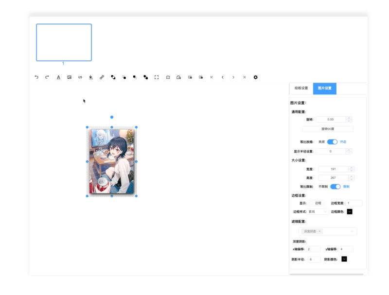

# 基于WEB的可视化PPT制作Part4-实现撤销与恢复

| 文档创建人 | 创建日期   | 文档内容                              | 更新时间   |
| ---------- | ---------- | ------------------------------------- | ---------- |
| adsionli   | 2022-07-11 | 基于WEB的可视化PPT制作-实现撤销与恢复 | 2022-07-11 |

相关文章：

1. [基于WEB的可视化PPT制作Part1-项目描述及实现内容](https://juejin.cn/post/7117982197939699726)
2. [基于 WEB 的可视化 PPT 制作 Part2-控件添加及修改，埋点](https://juejin.cn/post/7118264381229498404)
3. [基于WEB的可视化PPT制作扩展篇-学习并实现FullScreen](https://juejin.cn/post/7117534409405759519)
4. [通用型Resize,Drag,Rotate组件内容解析](https://juejin.cn/post/7111225695262474277)
5. [基于WEB的可视化PPT制作Part3-拖拽、旋转、放缩通用组件实现](https://juejin.cn/post/7118619234669690888)

撤销和恢复操作在日常生活中是我们经常会使用到的功能，那么在我们的简易可视化PPT中，我也想加入这个功能，于是乎就开始分析了在PPT操作中各种情况下的撤销与恢复的逻辑，然后琢磨了一整天，大概理好了PPT中撤销恢复操作的具体实现逻辑。然后突然发现，这个完全可以用优先队列来做，根据每一次动作执行的`timeStamp`来进行构建，时间越新的，越可以放在首部。

> 这个会想到用优先队列，还是多亏了leetcode中的一道题目，叫做[任务调度器](https://leetcode.cn/problems/task-scheduler/)，当时做这道题目的时候，我就是用的优先队列，所以想到依然可以用有限队列来实现。

当然除了使用合理的数据结构之外，我们还需要创建合理的容器内容。这里我就根据对PPT实现的分析，创建了3个优先队列，分别是`actionQueue`动作队列，`undoQueue`撤销队列以及`recoveryQueue`恢复队列，通过这三个队列的操作，来进行合理的撤销恢复。

接下来就让我们详细来说说这些是怎么聚合在一起实现的吧。

## 需求分析

老样子，我们还是要先对PPT进行调研，来分析出在PPT中是如何实现撤销恢复的。

> 这里不确定完全正确，因为只是我一个人琢磨的......网上不太能找到，没办法┓( ´∀` )┏

首先我们会有三个容器，分别是`actionQueue`动作容器，`undoQueue`撤销容器，`recoveryQueue`恢复容器。

1. 当我们有新的动作进入时，我们会将动作内容记录并放入`actionQueue`。

   > 这里的动作主要是指：新建、删除、更新控件，设置背景

2. 撤销操作进入，这里要分3种情况

   1. `actionQueue.size !=0 && recoveryQueue.size == 0`

      动作容器不为空，恢复容器为空

      那我们就要从动作容器`actionQueue`中取出堆顶的动作，放入到撤销容器`undoQueue`中，并且执行相关的撤销操作。

   2. `actionQueue.size == 0 && recoveryQueue.size == 0`

      动作容器为空，恢复容器不为空

      从恢复容器`recoveryQueue`中取出堆顶的动作，放入到撤销容器`undoQueue`中，并且执行相关的撤销操作。

   3. `actionQueue.size != 0 && recoveryQueue.size != 0`

      动作容器不为空，恢复容器不为空

      这里还需要再多一步判断:`actionQueue.top.timeStamp > recoveryQueue.top.timeStamp`，我们需要判断两个容器的堆顶元素，哪一个比较大，较大的那个堆顶元素需要被弹出，放入到撤销容器`undoQueue`中。

   4. `actionQueue.size == 0 && recoveryQueue.size == 0`

      都为空时，不执行撤销

3. 恢复操作进入

   > 恢复操作只和撤销容器有关，与动作容器无关

   1. `undoQueue.size == 0`

      撤销容器为空，不执行恢复

   2. `undoQueue.size != 0`

      撤销容器不为空时，取出`undoQueue`堆顶的动作，**注意：这里我们需要更新动作的执行事件，需要重新赋时**，然后放入恢复容器`recoveryQueue`

上面这种情况是比较正常的情况下的内容，也就是一直添加，然后一直撤销，在一直恢复。

但是在实际场景中，肯定不是这么理想的，会存在添加，改变，然后撤销，恢复，在有新的动作进入。这种时候我们就需要对这种情况进行处理，经过大量的实验，我发现它的处理逻辑是这样子的：

1. 多个新的动作进入。
2. 执行撤销操作，此时动作由动作容器进入到了撤销容器中。
3. 这里有两种情况：
   1. 此时如果有新的动作进入的且撤销之后并没有执行恢复操作，我们**需要清空撤销容器中的动作**。
   2. 如果在新的动作进入之前，执行了恢复操作，那么在新动作进入但未添加入动作容器之前，我们需要干两件事：**清空撤销容器`undoQueue`中的动作；将恢复容器`recoveryQueue`中的动作全部弹出，放入到动作容器`actionQueue`中，且必须是比当前动作容器`actionQueue`的堆顶动作时间新的动作。**

到这里就差不多了，这样基本就兼容了所有情况啦。然后就开始具体实现吧。

## 具体实现

实现主要分为三块内容，第一步就是队列的创建，第二步就是撤销`ubdo`的动作执行和恢复`recovery`的动作执行，最后一步就是接入键盘事件。

### 队列创建

队列的创建就是使用优先队列的通用型模板进行创建即可，还是很简单的，实现代码如下：

```typescript
class PriorityQueue {
    data: any[];
    size: number;
    compare: Function;
    constructor(
        compare = function <T>(a: T, b: T) { return a > b }
    ) {
        this.data = [];
        this.size = 0;
        this.compare = compare;
    }

    /**
    * @method top 返回堆顶最大元素
    */
    top() {
        return this.size === 0 ? null : this.data[0]
    }

    /**
    * @method set 添加入优先队列中，同时对齐进行提升操作
    * @param {number} val
    */
    set<T>(val: T) {
        this.data.push(val)
        this._shifUp(this.size++)
    }

    /**
    * @method pop 弹出堆顶元素，并且进行层级变换，维护优先队列堆顶
    */
    pop() {
        if (this.size === 0) { return null }
        this._swap(0, --this.size)
        this._shifDown(0)
        return this.data.pop()
    }
    
    clear() {
        this.data = [];
        this.size = 0;
    }

    /**
    * @method _parent 返回根节点
    * @param {*} index
    */
    _parent(index: number) {
        return index - 1 >> 1
    }

    /**
    * @method _child 返回子节点
    * @param {*} index
    */
    _child(index: number) {
        return (index << 1) + 1
    }

    /**
    * @method _shifDown 层级下调
    * @param {*} index
    */
    _shifDown(index: number) {
        while (this._child(index) < this.size) {
            let child = this._child(index)
            if (child + 1 < this.size
                && this.compare(this.data[child + 1], this.data[child])) {
                child = child + 1
            }
            if (this.compare(this.data[index], this.data[child])) {
                break
            }
            this._swap(index, child)
            index = child
        }
    }

    /**
    * @method _shifUp 层级上调
    * @param {*} index
    */
    _shifUp(index: number) {
        while (this._parent(index) >= 0
            && this.compare(this.data[index], this.data[this._parent(index)])) {
            this._swap(index, this._parent(index))
            index = this._parent(index)
        }
    }

    _swap(a: number, b: number) {
        [this.data[a], this.data[b]] = [this.data[b], this.data[a]]
    }
}

export default PriorityQueue;
```

然后就是去实例化一下三个队列

```typescript
const compare = (a: Action, b: Action) => {
    return a.timeStamp > b.timeStamp
} 
let actionQueue = new PriorityQueue(compare);
let undoQueue = new PriorityQueue(compare);
let recoveryQueue = new PriorityQueue(compare);
```

好了，这样就完成了我们的三个优先队列的创建啦，接着就是我们动作执行了。

### 动作执行

动作执行主要就是执行撤销操作与恢复操作，其包括了控件的创建与删除，控件的更新以及背景参数的设置。当然这也包括三个队列之间的数据传递的过程。

#### 数据传递

就和我们上面分析的一样，我们根据分析出来的结果进行代码的编写

首先就是撤销操作时的数据传递

```typescript
/**
* @method revokeAction 撤销动作
*/
revokeAction() {
    if (this.actionQueue.size == 0 && this.recoveryQueue.size == 0) {
        return;
    }
    let actionSize = this.actionQueue.size;
    let recoverySize = this.recoveryQueue.size;
    let action: Type.Action | undefined;
    if (actionSize != 0 && recoverySize == 0) {
        action = this.actionQueue.pop();
    } else if (actionSize == 0 && recoverySize != 0) {
        action = this.recoveryQueue.pop();
    } else {
        action = this.actionQueue.top.timeStamp > this.recoveryQueue.top.timeStamp ?
            this.actionQueue.pop() : this.recoveryQueue.pop();
    }
    if (!action) {
        return;
    }
    this.undoQueue.set(action);
    //NOTE: 这里是进行执行动作
    handleUndo.call(this, action);
}
```

然后是恢复操作时的数据传递

```typescript
/**
* @method recoveryAction 恢复动作
*/
recoveryAction() {
    if (this.undoStack.size == 0) {
        return;
    }

    let action: Type.Action | undefined = this.undoStack.size ? this.undoStack.pop() : undefined;
    if (!action) {
        return;
    }
    action.timeStamp = +new Date();

    this.recoveryStack.set(action);

    handleRecovery.call(this, action);
}
```

然后就是在特殊情况时的放入新的动作时的执行。

```typescript
/**
 * @method recordAction 收集动作信息
 * @param {string} type 动作类型 
 * @param {any} index 动作执行的item标识
 * @param oldV 
 */
const recordAction = function (this: any, type: string, index: any, actionType: string, oldV: any, newV: any, itemEditType: string = '') {
    if (this.undoQueue.size != 0) {
        this.undoQueue.clear();
    }
    //README: 在新动作进入之前，先判断之前的undoQueue与recoveryQueue的大小
    if (this.recoveryQueue.size != 0 && this.undoQueue.size == 0) {
        recoveryToAction.call(this);
    }
    let pushData: Action = {
        type,
        page: this.currentPage,
        item_index: index,
        action: actionType,
        data: {
            pre: oldV,
            next: newV
        },
        timeStamp: +new Date(),
    };
    if (actionType === 'item-edit') {
        pushData.itemEditType = itemEditType;
    }
    this.actionQueue.set(pushData)
}

const recoveryToAction = function (this: any) {
    let insertData = [];
    //NOTE: 这里就是去遍历恢复容器，然后将执行事件大于动作容器堆顶元素timeStamp的内容放入，如果比动作容器堆顶元素的timeStamp下的话，直接结束。
    while(this.recoveryQueue.size > 0) {
        let action = this.recoveryQueue.pop();
        if(action.timeStamp > this.actionQueue.top.timeStamp) {
            insertData.push(action);
        }else {
            break;
        }
    }
    for(let action of insertData) {
        this.actionQueue.set(action)
    }
}
```

好啦，到这里我们的数据操作就完成啦，接着就是对撤销执行和恢复执行的封装啦

#### 撤销执行

这里我们主要分成了几种类型，进行撤销操作，分别是:

1. 控件创建
2. 控件删除
3. 控件更新
4. 背景页设置

基于这四种分类，我们就可以来封装撤销执行了。实现如下：

```typescript
import { Action, PageItem } from "../type"
import { findTypeIdx, setItemData, setLayerToList } from './utils';

/**
 * @author adsionli
 * @file undo.ts
 * @description 专门用于处理撤销操作的执行
 */

/**
 * @method undoAdd 撤销添加操作
 * @param {Action} action
 */
const undoAdd = function (this: any, action: Action) {
    let { item_index: index, type } = action;
    let { pageData, typeList } = this.getTypeList(type);
    let idx = findTypeIdx(index, typeList);
    pageData.item.count -= 1;
    typeList.splice(idx, 1);

    let itemTypeIdx = this.itemTypeIndexList.findIndex((v: any) => {
        return v.index === index
    })
    if (itemTypeIdx != -1) {
        this.itemTypeIndexList.splice(itemTypeIdx, 1)
    }
    if (['text', 'image'].includes(action.type)) {
        let style = <PageItem>action.data?.next;
        setLayerToList.call(
            this,
            { index: String(action!.item_index), type: action.type },
            style.style.layer,
            'delete'
        )
    }
}

/**
 * @method undoDelete 撤销删除操作
 */
const undoDelete = function (this: any, action: Action) {
    let { type } = action;
    let { pageData, typeList } = this.getTypeList(type);
    pageData.item.count += 1;
    typeList.push(action.data!.pre);
    this.itemTypeIndexList.push({
        index: action.item_index,
        type
    });
    if (['text', 'image'].includes(action.type)) {
        let style = <PageItem>action.data?.next;
        setLayerToList.call(
            this,
            { index: String(action!.item_index), type: action.type },
            style.style.layer,
            'add'
        )
    }
}

/**
 * @method undoBodyEdit 撤销背景更新操作操作
 */
const undoBodyEdit = function (this: any, action: Action) {
    let pageData = this.pageList.get(this.currentPage);
    pageData.setting.background = action!.data!.pre;
}

/**
 * @method undoItemEdit 撤销item更新操作操作
 */
const undoItemEdit = function (this: any, action: Action) {
    let { typeList } = this.getTypeList(action.type);
    let idx = findTypeIdx(action.item_index, typeList);
    let style = typeList[idx].style;
    let nextData: any = action.data?.next;
    let preData: any = action.data?.pre;
    if (Reflect.ownKeys(nextData).includes('layer')) {
        this.layerSetting.removeItem(nextData.layer, action.item_index);
        this.layerSetting.setItemLayer(preData.layer, { index: action.item_index, type: action.type })
    }

    setItemData(style, preData);
}

const handleUndo = function (this: any, action: Action) {
    switch (action.action) {
        case 'add':
            undoAdd.call(this, action)
            break;
        case 'delete':
            undoDelete.call(this, action)
            break;
        case 'item-edit':
            undoItemEdit.call(this, action)
            break;
        case 'body-edit':
            undoBodyEdit.call(this, action)
            break;
        default:
            break;
    }
}

export default handleUndo
```

这里有一些需要注意的地方：

1. 控件添加的撤销操作对应的就是控件删除

2. 控件删除的撤销操作对应的就是控件添加

3. 控件更新的操作，可以按照传入的指定参数进行更新，无需全部更新，节约更新消耗。撤销操作读取的是`data`中的`pre`数据进行撤销

   > 这里的实现在上一章中已经提到过了，这里也还是放一下
   >
   > ```typescript
   > /**
   >  * @method setItemData 根据更新数据结构，设置对应的item内容
   >  * @param style 
   >  * @param updateData 
   >  */
   > const setItemData = (style: any, updateData: any) => {
   >     let oldData: any = {}
   >     for (let key of Reflect.ownKeys(updateData)) {
   >         oldData[key] = {}
   >         if (Array.isArray(updateData[key])) {
   >             oldData[key] = []
   >         }
   >         if (typeof (updateData[key]) === 'object' && Reflect.ownKeys(updateData[key]).length != 0 && !Array.isArray(updateData[key])) {
   >             oldData[key] = setItemData(style[key], updateData[key]);
   >         } else {
   >             oldData[key] = style[key];
   >             style[key] = updateData[key]
   >         }
   >     }
   > 
   >     return oldData;
   > }
   > ```

4. 背景作为独立的一块，所以需要提出来进行更新

5. 直接返回`handleUndo`即可，其他方法就不对外暴露了。

其他就没什么太难的地方，大家可以看着代码进行理解。

#### 恢复执行

恢复执行的话和撤销是对应的，且恢复执行只会被撤销之后的数据影响，所以实现也不难，具体实现如下：

```typescript
import { Action, PageItem } from "../type"
import { findTypeIdx, setItemData, setLayerToList } from './utils';

/**
 * @author adsionli
 * @file recovery.ts
 * @description 专门用于处理恢复操作的执行
 */

/**
 * @method recoveryAdd 恢复添加操作
 * @param {Action} action
 */
const recoveryAdd = function (this: any, action: Action) {
    let { type } = action;
    let { pageData, typeList } = this.getTypeList(type);
    pageData.item.count += 1;
    typeList.push(action.data!.next);
    this.itemTypeIndexList.push({
        index: action.item_index,
        type
    });
    if (['text', 'image'].includes(action.type)) {
        let style = <PageItem>action.data?.next;
        setLayerToList.call(
            this,
            { index: String(action!.item_index), type: action.type },
            style.style.layer,
            'add'
        )
    }
}

/**
 * @method recoveryDelete 恢复删除操作
 * @param {Action} action 
 */
const recoveryDelete = function (this: any, action: Action) {
    let { item_index: index, type } = action;
    let { pageData, typeList } = this.getTypeList(type);
    let idx = typeList.findIndex((v: any) => {
        return v.index == index
    })
    pageData.item.count -= 1;
    typeList.splice(idx, 1);

    let itemTypeIdx = this.itemTypeIndexList.findIndex((v: any) => {
        return v.index === index
    })
    if (itemTypeIdx != -1) {
        this.itemTypeIndexList.splice(itemTypeIdx, 1)
    }
    if (['text', 'image'].includes(action.type)) {
        let style = <PageItem>action.data?.next;
        setLayerToList.call(
            this,
            { index: String(action!.item_index), type: action.type },
            style.style.layer,
            'delete'
        )
    }
}

/**
 * @method recoveryBodyEdit 恢复背景更新操作操作
 */
const recoveryBodyEdit = function (this: any, action: Action) {
    let pageData = this.pageList.get(this.currentPage);
    pageData.setting.background = action!.data!.next;
}

/**
 * @method recoveryItemEdit 恢复item更新操作操作
 */
const recoveryItemEdit = function (this: any, action: Action) {
    let { typeList } = this.getTypeList(action.type);
    let idx = findTypeIdx(action.item_index, typeList);
    let style = typeList[idx].style;

    let nextData: any = action.data?.next;
    let preData: any = action.data?.pre;
    if (Reflect.ownKeys(nextData).includes('layer')) {
        this.layerSetting.removeItem(preData.layer, action.item_index);
        this.layerSetting.setItemLayer(nextData.layer, { index: action.item_index, type: action.type })
    }

    setItemData(style, nextData);
}

const handleRecovery = function (this: any, action: Action) {
    switch (action.action) {
        case 'add':
            recoveryAdd.call(this, action)
            break;
        case 'delete':
            recoveryDelete.call(this, action)
            break;
        case 'item-edit':
            recoveryItemEdit.call(this, action)
            break;
        case 'body-edit':
            recoveryBodyEdit.call(this, action)
            break;
        default:
            break;
    }
}

export default handleRecovery;
```

需要注意的点如下：

1. 因为恢复容器中的数据只会从撤销容器中拿到，所以我们在处理添加和删除的时候就是和撤销的时候是反过来的。
2. 更新控件样式的内容的时候，我们取得是next中的数据进行恢复
3. 更新背景样式内容也是同2一样的。
4. 直接返回`handleRecovery`即可，其他方法就不对外暴露了。

### 键盘事件

那么为了更加符合用户的习惯，我们添加了对应的键盘输入事件支持撤销与恢复，也就是`ctrl+z`执行撤销，`ctrl+y`执行恢复，代码很简单，如下所示：

```typescript
const revoke = function (this: any) {
    this.revokeAction();
}

const recovery = function (this: any) {
    this.recoveryAction();
}

const getHandleKeyDownData = (event: any) => {
    let keyDownData = event.key

    if (event.key === 'z' && event.ctrlKey) {
        keyDownData = 'revoke'
    } else if (event.key === 'y' && event.ctrlKey) {
        keyDownData = 'recovery'
    }

    return keyDownData
}

/**
 * @method keyInput 键盘输入的处理
 * @param {string} key 键盘输入内容 
 * @param {*} options 额外携带参数
 */
const keyInput = function (this: any, key: string, options: any) {
    switch (key) {
        case 'revoke':
            revoke.call(this);
            break;
        case 'recovery':
            recovery.call(this)
            break;
        default:
            break;
    }
}
```

### 效果展示

好了，通过那么长的步骤之后，我们就来看看最终实现的效果吧。



### 缺陷

这个内容块的开发还不是完全的尽善尽美的，有着如下的一些缺陷：

1. 我们没有保存activeItem的标识，所以在撤销恢复操作的时候，无法在撤销恢复的时候正确的恢复active对象。
2. 跨页面撤销，这个暂时也进行处理，现在在切换页面之后，会把所有的容器数据全部清空。


