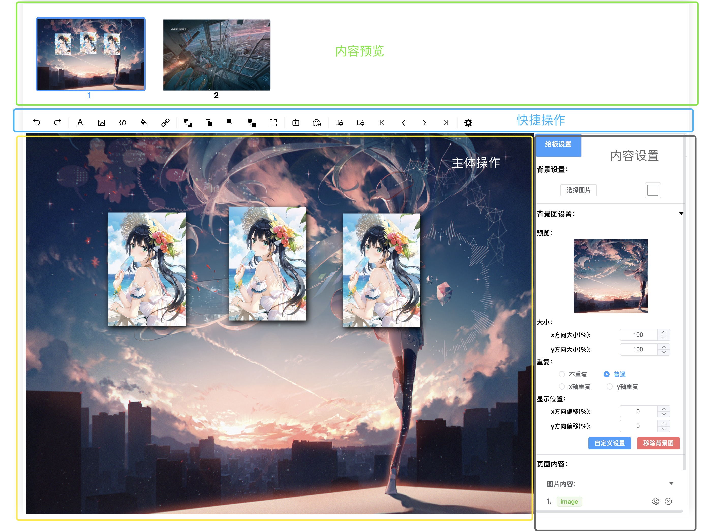
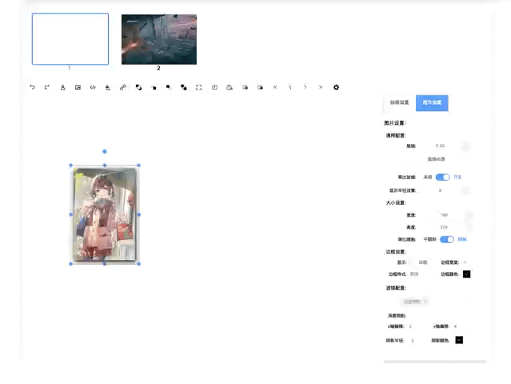

# 基于 WEB 的可视化 PPT 制作 Part1-项目描述及实现内容

| 文档创建人 | 创建日期   | 文档内容                                      | 更新时间   |
| ---------- | ---------- | --------------------------------------------- | ---------- |
| adsionli   | 2022-07-07 | 基于 WEB 的可视化 PPT 制作-项目描述及实现内容 | 2022-07-07 |

突然发现之前的坑还没填完，现在这又是一个新坑，因为之前那个功能还需要修改，所以暂时还有一部分的文章没写好，这部分内容也已经断断续续写了差不多一个月了，大概的样子也已经有了，所以也就开坑，嘿嘿。

本次开发的内容主要是一个基于 Web 的可视化**简易**PPT 制作的一个项目，因为之前看到过[Anthony Fu](https://github.com/antfu)大佬他们写的[slidev.js](https://github.com/slidevjs/slidev)，不过还是要用自己写代码的形式去写，感觉有点麻烦，就想着要不做一个可视化的制作的，然后说干就干。

> 说干就干的后果就是，在开发的过程中遇到了好多好多之前没想到的问题，属实是一路坎坷，不过很多坑踩过了，现在用文章的形式记录下来，避免别人在踩坑啦。

## 内容说明

本次可视化简易 PPT 制作的文章记录主要分为下面几块：

1. 项目描述及实现内容
2. 控件添加及修改，埋点
3. 拖拽、旋转、缩放通用组件实现
4. 实现撤销与恢复
5. 层级设计
6. 动画及触发设置
7. 内容呈现与解析
8. 放映模式

这八块内容，就是本次项目的全部内容及文章啦，不过由于事件的问题，当前只做完了第 5 块内容，后面的 6、7、8 三块内容暂时还没做，因为这个月开始提前批的招聘开了，所以就稍微往后拖拖再继续做完，不过保证是一定要完成的，因为这块内容做完的话，可以学习到好多东西。

> 比如动画那块，我们可以学习到如何封装 vue 的 transition 模块，同时动态加载指定的动画。在放映模式那块，我想好了要使用`LocalStorage`配合`Service Worker`来实现，不过`Service Worker`我暂时还没仔细研究过，所以又可以学一波啦。再比如内容呈现和解析那块，我们又可以学习 AST 的构建以及 JSX 的使用，真的好好玩，不过暂时没有那么多时间了，之前有点拖了....

## 页面设计

页面设计如下图：

主要为四块内容

1. 内容预览：为每一张页面设置一张预览图，同时可以允许点击预览图进行页面切换
2. 快捷操作栏：支持快捷操作，比如撤销恢复，添加文字，添加图片，层级设置，页面设置，页面切换等功能
3. 主体操作页：显示当前页设置内容，同时可以对已添加内容进行操作，设置旋转、缩放、移动等功能，同时支持相关的键盘输入操作
4. 内容设置：可以根据选中的内容不同进行相关内容的设置，也可以设置页面背景内容

这四块内容就是我们设置 PPT 的关键内容了，未来还会继续增加相关操作，但是现在就是这样啦。

## 已完成内容展示

1. 控件添加及设置
   

2. 旋转、缩放、移动
   

3. 撤销、恢复

   

4. 层级设置

   

5. 页面切换、添加、预览生成

    

## 未完成内容

1. 动画库搭建

   让控件与页面切换时，可以设置预定义好的动画效果，不过这个只能作用在放映模式下。同时可以设置不同控件的展示顺序以及展示时间。

2. 放映模式

   将制作完成的内容进行 PPT 式的放映，同时最好可以支持在线演讲者模式，使用`localStorage`与`service worker`来实现(基于同源下)

3. 内容加载与解析

   将制作好的数据，渲染成可渲染的节点数据，利用 AST 渲染树与 JSX 技术

4. 更多的控件内容

   支持更多内容的添加，比如图形，Uml 或者其他相关的内容，支持任何人自定义内容添加，加上对外的接口，让其他人也可以进行开发

## 未来计划

#### 内容完成时间计划表

| 完成内容       | 预计完成时间     | 当前状态 |
| -------------- | ---------------- | -------- |
| 动画及触发设置 | 2022.07.12-07.20 | 待完成   |
| 内容呈现与解析 | 2022.07.23-08.05 | 待完成   |
| 放映模式       | 2022.08.08-08.15 | 待完成   |

#### 相关文章发布时间表

| 文章内容                             | 预计完成时间 | 当前状态 |
| ------------------------------------ | ------------ | -------- |
| 控件添加及修改，埋点文章编写         | 2022.07.09   | 待完成   |
| 拖拽、旋转、缩放通用组件实现文章编写 | 2022.07.10   | 待完成   |
| 实现撤销与恢复文章编写               | 2022.07.11   | 待完成   |
| 层级设计文章编写                     | 2022.07.12   | 待完成   |
| 动画及触发设置文章编写               | 2022.07.21   | 待完成   |
| 内容呈现与解析文章编写               | 2022.08.06   | 待完成   |
| 放映模式文章编写                     | 2022.08.16   | 待完成   |

## 总结

这次这个自己写着玩的项目真的是边学边写，同时结合了大量自己学过的内容才制作了一部分，我发现很多东西只有在实际开发中才会发现所能实际使用的场景，比如在撤销恢复中，我们可以选择使用优先队列来保存操作；在层级系统中，可以使用有序数组+map 的形式来保存层级信息；在旋转、缩放、移动通用组件开发时，计算屏幕坐标与节流的使用。这些如果不实际去开发的话，根本不知道其实际用途在哪里，只有真正使用了，才能更好的把自己学到的知识融会贯通。所以希望大家不要只停留在书面的知识上，还是要用起来，当然这也只是我一个还没工作的菜鸡的一面之词，😂，加油加油！！
