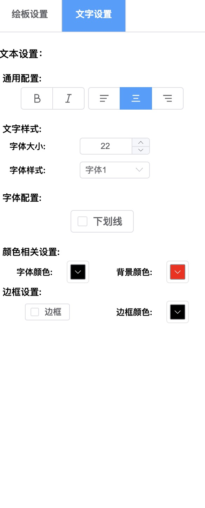
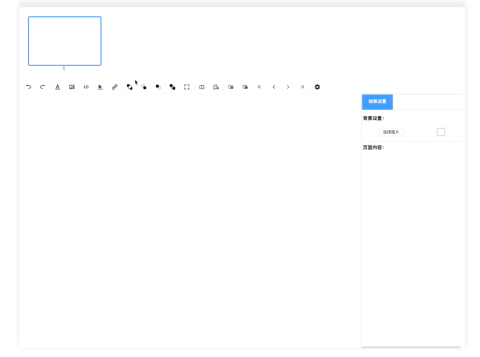
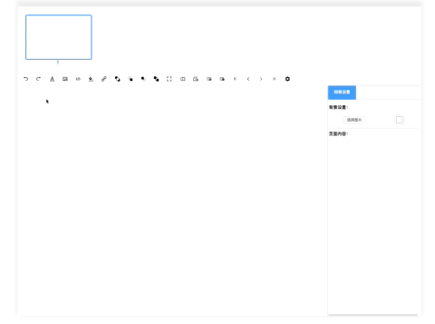

# 基于 WEB 的可视化 PPT 制作 Part2-控件添加及修改，埋点

| 文档创建人 | 创建日期   | 文档内容                                        | 更新时间   |
| ---------- | ---------- | ----------------------------------------------- | ---------- |
| adsionli   | 2022-07-09 | 基于 WEB 的可视化 PPT 制作-控件添加及修改，埋点 | 2022-07-09 |

相关文章：
1. [基于WEB的可视化PPT制作Part1-项目描述及实现内容](https://juejin.cn/post/7117982197939699726)
2. [基于WEB的可视化PPT制作扩展篇-学习并实现FullScreen](https://juejin.cn/post/7117534409405759519)

当前已有的控件只有两种，一种是文字控件，还有一种是图片控件，其中比较难实现的是文字控件，因为想要实现和 PPT 或者 draw.io 那样子的样子话，就需要好好分析该如何实现。同时，除了控件创建之外，我们还要给控件添加相关的键盘输入事件，让其可以被复制。还需要对控件进行埋点操作，为了能够支持撤销恢复操作，所以其实最难的不是控件的实现，而是其与其他内容的联动。

> 之后还会新增更多的可添加控件，比如 Uml 图，几何图形，等等，现在没什么时间......只能先实现比较常用的两种......

## 文字控件

文字控件就是和 PPT 与 Draw.io 中的文字控件相同，能够支持多行输入，字体的基本变换等功能的文字输入框的添加。这个看着好像挺简单的，但是实际分析了 PPT 的实现的之后，才会发现还是比较麻烦的，下面就慢慢分析一下，我们需要完成的内容有哪一些。

### 内容分析

1. 文字输入不能是一个简单的单行的`input`，得是一个`textarea`输入。

2. 选中时不可输入，双击后才可以输入。

   > 这就造成，选中的时候不能显示`textarea`，只有在双击空间后，将元素替换为`textarea`元素

3. 文字需要支持自动换行操作。

   > 因为需要自动换行且一开始只能显示一行的`textarea`，所以我们就需要自己控制`textarea`显示的行数，而且之后还会改变 textarea 的长宽，所以就需要重新计算`textarea`的行数，这就是其中的一个难点。

4. 文字内容可以修改样式。

上面这四点就是我们在实现文字控件时，需要完成的内容。

其中比较麻烦的就是我们需要自己控制`textarea`的行数，而不能够去使用`textarea`自己的`row`和`col`了，所以我们需要自己来控制`textarea`的尺寸。

### 实现

这里实现的主要内容就是关于`textarea`的内容，大家可以先去 MDN 上，看一下关于[`textarea`](https://developer.mozilla.org/zh-CN/docs/Web/API/HTMLTextAreaElement)的介绍，这样可以有一个初步的认识。

**实现一：选中时不可输入，双击后才可以输入**

这里直接看一下我的实现代码

```html
<div class="presentation-text_textarea" @mousedown="mouseDownEvent" @dblclick.stop="setTextarea">
  <div
    class="show-presentation-text"
    ref="presentationShowText"
    v-show="!showArea"
    :style="textAreaCss"
    v-html="showText"
  ></div>
  <textarea
    ref="presentationTextarea"
    rows="1"
    @keydown="stopPropagation"
    v-show="showArea"
    :style="textAreaCss"
    v-model="props.info.data"
  ></textarea>
</div>
```

可以看到，这里我设置了一个同级的`div`与`textarea`对应，同时使用`showArea`来控制显示的是`div`还是`textArea`，然后再为其`parentNode`设置一个`dblclick`双击事件，通过调用`setTextarea`回调函数，修改`showArea`的值，来控制显示。

```typescript
const setTextarea = () => {
  showArea.value = true
  presentationTextarea.value.style.height = presentationShowText.value.clientHeight + 'px'
}
```

> 我们在进行切换时，还需要去更新一下`textarea`的高度，因为我们舍弃了通过`rows`和`cols`来设置`textarea`，所以需要自己来控制

同时为同级`div`设置`v-html`来显示`textarea`中的值，而且它们都会调用同一个动态`style`，也就是`textAreaCss`来保证它们的样式相同。这样就可以解决当我们使用`resize`组件，来拖拽、缩放、旋转时，不会触发`textarea`的获取焦点事件啦。

**实现二：文字需要支持自动换行操作。**

其实本身`textarea`是可以自动换行的，但是这里有一个比较坑的地方，就是我们是无法获取到`textarea`的行数的，这样就会导致我们无法修改`textarea`的高度（这里可能大家会奇怪，为什么我们需要修改`textarea`的高度，这是因为在上一个内容中，我们在文本框失去焦点时，会用一个`div`替换掉`textarea`，用于显示，同时我们设置了`textarea`的初始显示为`rows=1`）。然后我尝试了很多方法来算出 textarea 的高度，发现都不行，而且也无法监听其自动换行的时机，所以非常的无奈。

但是好在最后在网上找到了一个方法，就是设置一个与`parentNode`同级的`dom`，同时设置完全相同的`style`，然后再通过监听数据的变化，来实时计算出当前的行数。虽然有了思路，但是木有现成的实现好的代码，所以我们需要自己去实现一下，具体实现如下，首先是`html`的代码变化

```html
<template>
  <div class="presentation-text_textarea" @mousedown="mouseDownEvent" @dblclick.stop="setTextarea">
    <div
      class="show-presentation-text"
      ref="presentationShowText"
      v-show="!showArea"
      :style="textAreaCss"
      v-html="showText"
    ></div>
    <textarea
      ref="presentationTextarea"
      rows="1"
      @keydown="stopPropagation"
      v-show="showArea"
      :style="textAreaCss"
      v-model="props.info.data"
    ></textarea>
  </div>
  <div ref="calculateHeight" class="calculate-text-height" :style="textAreaCss" v-html="showText"></div>
</template>
```

可以看到增加了一个`calculateHeight`的`dom`，就是通过这个 dom，我们就可以计算啦，然后就是监听`props.info.data`值的变化。

```typescript
/**
 * @property {Element} presentationTextarea textarea节点
 * @property {Element} presentationShowText 显示文本框内容的div节点
 * @property {Element} calculateHeight 用于计算显示高度的div节点
 * @property {Boolean} firstLineHeight 首次计算行高的判断
 * @property {Number} lineCount 行数
 * @property {Number} lineHeight 行高
 */
const presentationTextarea = ref()
const presentationShowText = ref()
const calculateHeight = ref()
const firstLineHeight = ref<boolean>(true)
const lineCount = ref<number>(1)
const lineHeight = ref<number>(0)
watch(
  () => props.info.data,
  (newV, oldV) => {
    nextTick(() => {
      //判断是否是第一次计算高度，如果是第一次的话，我们需要把单行高度计算出来
      if (firstLineHeight.value && presentationTextarea.value.getBoundingClientRect().height != 0) {
        lineHeight.value = presentationTextarea.value.getBoundingClientRect().height
        firstLineHeight.value = false
      }
      showText.value = newV.split('\n').join('<br />')
      //这里需要调用nextTick，因为这里设置了showText.value之后，用于显示和计算的div节点会重绘，所以要用nextTick放在渲染之后
      nextTick(() => {
        //这里就是简单的计算高度，然后进行赋值了
        if (presentationTextarea.value.scrollHeight > presentationTextarea.value.offsetHeight) {
          presentationTextarea.value.style.height = presentationTextarea.value.scrollHeight + 'px'
        } else {
          if (presentationTextarea.value.scrollHeight > calculateHeight.value.offsetHeight) {
            presentationTextarea.value.style.height = calculateHeight.value.offsetHeight + 'px'
          }
        }
        lineCount.value = Math.floor(presentationTextarea.value.scrollHeight / lineHeight.value)
      })
    })
  },
  {
    immediate: true,
  }
)
```

首先我们在`watch`时，需要添加一个`immediate`，在首次时，强制执行，进行初始化。

然后就是对`props.info.data`进行监听了，因为`props.info`是一个`reactive`对象，所以不是`readonly`状态，我们可以直接进行操作，并监听。

然后就是进行计算，关于计算就很简单了，就是把`calculateHeight`的值，赋给`presentationTextarea`，当然这里需要在之前第一次进入时，计算出对应的行高(其实可以删除掉了，因为后面就没用到了)。

**实现三：文字内容可以修改样式。**

文字内容的样式修改很简单，当我们第一次创建的时候，给一个公共的文本属性对象

```typescript
const defaultStyle = (): TextStyle => {
  return {
    attribute: {
      width: 200,
      height: 100,
      angle: 0,
    },
    layer: 1000,
    scale: {
      x: 1,
      y: 1,
    },
    backgroundColor: 'transparent',
    border: {
      set: 'none',
      color: 'rgba(0,0,0,1)',
    },
    position: {
      x: 200,
      y: 100,
    },
    color: 'rgba(0,0,0,1)',
    font: {
      style: 'normal',
      size: 22,
      weight: '400',
      align: 'center',
      family: 'monospace',
    },
    text: {
      decoration: {
        line: 'unset',
        style: 'solid',
        color: 'rgba(0,0,0,1)',
      },
    },
    animate: {
      join: {
        type: 'none',
        time: 0,
      },
      left: {
        type: 'none',
        time: 0,
      },
    },
  }
}
```

通过这个属性对象，来计算出文本的`css`，这样就可以返回对应的样式

```typescript
const analysisCss = function (textInfo: TextStyle) {
  let returnCss: any = {}
  returnCss.backgroundColor = textInfo.backgroundColor
  returnCss.border =
    textInfo.border.set == 'none' ? textInfo.border.set : `${textInfo.border.set} ${textInfo.border.color}`
  returnCss.color = textInfo.color
  returnCss.zIndex = textInfo.layer
  let { style: fontStyle, size: fontSize, weight: fontWeight, align: textAlign, family: fontFamily } = textInfo.font
  returnCss = Object.assign({ fontStyle, fontSize: fontSize + 'px', fontWeight, textAlign, fontFamily }, returnCss)
  let { line: textDecorationLine, style: textDecorationStyle, color: textDecorationColor } = textInfo.text.decoration
  returnCss = Object.assign({ textDecorationLine, textDecorationStyle, textDecorationColor }, returnCss)

  return returnCss
}
```

这样就可以控制文本对象的样式解析，然后再配合我们自己创建的`editToolbar`来控制样式的改变。



这里控制改变还是比较简单的，因为现在通过`props`传递的对象不是只读的了，而是一个响应式对象，所以我们只要一修改，其他地方依然可以监听到对应的属性变化，就可以直接作用到文本上，这样就非常的方便，关于控制栏的实现，可以看这边的[代码](https://github.com/FlyBirdHeight/adsionliblog_manager/tree/main/src/components/site/person/presentation/edit/text)

### 效果展示



## 图片控件

图片控件比较简单，我们只需要将图片上传完成之后，将返回的图片路径添加进入即可，然后就是可以支持图片的一些基本操作，比如滤镜、`border-radius`、边框、旋转角度、宽高等内容的设置。

### 内容分析

1. 支持图片文件上传，上传后回传图片地址，并添加到`container`中
2. 支持图片的等比例缩放，旋转
3. 支持图片相关的样式操作，滤镜等功能

图片功能相对于文本来说好实现很多，主要就是再上传后，添加到`container`中，然后可以对图片样式进行修改即可。

### 实现

具体实现好像没太多可说的，这里就把一些图片的 html 结构以及数据结构给大家看一下

```typescript
<template>
  
</template>
<script lang="ts">
import { ref, defineProps, defineEmits, computed, watch, reactive, watchEffect } from 'vue'
import { analysisCss } from './image'
export default {
  name: 'PresentationImage',
}
</script>
<script lang="ts" setup>
const props = defineProps<{
  info: any
}>()

const emit = defineEmits([])
const imageCss = computed(() => {
  if (props.info.style) {
    let css = analysisCss(props.info.style, props.info.url)

    return css
  } else {
    return null
  }
})
</script>
```

上面实际就是图片的展示，很简单，这里也是通过一个`computed`属性的值，来获取当前图片的样式改变。

图片的数据结构如下:

```typescript
const imageInfo = (): ImageStyle => {
  return {
    attribute: {
      width: 200,
      height: 200,
      angle: 0,
    },
    layer: 1000,
    position: {
      x: 200,
      y: 100,
    },
    scale: {
      x: 1,
      y: 1,
    },
    border: {
      line: 0,
      width: 1,
      style: 'solid',
      radius: 0,
      color: 'rgba(0,0,0,1)',
    },
    style: {
      opacity: 1,
      contrast: 1,
      brightness: 1,
      blur: 0,
      drop_shadow: {
        x: 2,
        y: 4,
        radius: 6,
        color: 'rgba(0, 0, 0, 1)',
      },
      invert: 0,
      setStyle: ['drop-shadow'],
    },
    event: {
      scaleFromCenter: false,
      enableScaleFromCenter: false,
      aspectRatio: true,
      enableAspectRatio: true,
    },
    objectFit: 'fill',
    objectPosition: {
      x: 0,
      y: 0,
    },
    ratio: 1,
    natural: {
      height: 0,
      width: 0,
    },
  }
}
```

这里有一点需要注意，有些图片在添加进来的时候，他的分辨率过大，从而超过了当前`container`的大小的时候，就非常不好处理，所以我们在加入的时候需要提前一步处理好，并且在这一步的时候，我们可以把图片数据转成`blob`并且创建一个浏览器本地缓存的`url`，这一步对于之后的基于`html2canvas`生成预览图的时候非常的重要，可以缩短预览图生成时间，实现代码如下:

```typescript
const addImage = function (this: any, url: string): Promise<ImageItem> {
  const setSize = (width: number, height: number) => {
    while (width > 700 || height > 700) {
      width = width * 0.3
      height = height * 0.3
    }
    return {
      width,
      height,
    }
  }
  const index = this.guid()
  return new Promise((resolve) => {
    let xhr = new XMLHttpRequest()
    xhr.open('get', url, true)
    xhr.responseType = 'blob'
    xhr.onload = function () {
      if (this.status === 200) {
        let blob = this.response
        let localUrl = URL.createObjectURL(blob)
        let image = new Image()
        image.src = localUrl
        let imgHeight = 0,
          imgWidth = 0
        let ratio = 1
        image.onload = function (e: any) {
          imgHeight = e.path[0].naturalHeight
          imgWidth = e.path[0].naturalWidth
          ratio = Number((imgWidth / imgHeight).toFixed(3))
          let style = imageInfo()
          style.natural.width = imgWidth
          style.natural.height = imgHeight
          if (imgWidth > 700 || imgHeight > 700) {
            ;({ width: style.attribute.width, height: style.attribute.height } = setSize(imgWidth, imgHeight))
          }

          style.ratio = ratio
          console.log({
            style,
            url,
            localUrl,
            index: index,
            ratio: true,
            type: 'image',
          })

          resolve({
            style,
            url,
            localUrl,
            index: index,
            ratio: true,
            type: 'image',
          })
        }
      }
    }
    xhr.send()
  })
}
```

这里我们获取图片通过自己创建的`XhrHttpRequest`来获取，然后制定返回的数据格式为`blob`，然后在请求成功后，创建一个本地`URL`，然后在处理一下图片的相关数据，实现起来不难，但也是加快速度一种方式，诶嘿。

其他的代码，大家可以在这里进行查看，比如说[图片内容修改](https://github.com/FlyBirdHeight/adsionliblog_manager/tree/main/src/components/site/person/presentation/edit/image),以及上面的代码的[源代码](https://github.com/FlyBirdHeight/adsionliblog_manager/tree/main/src/modules/person/presentation/image)

### 效果展示



## 内容添加与埋点

除了上面最基本的控件添加，设置，以及其中的一些难点之外，我们还需要将其添加到容器中，并且要出发相关的记录操作，并且要设置其层级，动作记录等内容，这样才能衔接上我们之后还需要进行的操作，所以我们这里就简单的来说说容器的添加以及相关埋点工作。

### 容器添加

容器添加可以直接采用`v-for`的形式添加，因为现在`vue3`的响应式数据会根据数据的变化而动态渲染，这一点要比`vue2`还需要调用`$set`来的要方便的多，所以我们实现起来就不会那么麻烦。

```html
<div class="presentation_body" tabindex="-1" ref="presentationBody" id="presentation_body" @click.stop="handleClick">
  <template v-if="pageMap.item.text.length != 0">
    <resize-element
      @changeStatus="changeStatus"
      @emitActive="emitActive"
      :parent="'presentation_body'"
      v-for="(text, index) of pageMap.item.text"
      :key="text.index"
    >
      <presentation-text :info="text"></presentation-text>
    </resize-element>
  </template>
  <template v-if="pageMap.item.image.length != 0">
    <resize-element
      @changeStatus="changeStatus"
      @emitActive="emitActive"
      :parent="'presentation_body'"
      v-for="(image, index) of pageMap.item.image"
      :key="image.index"
    >
      <presentation-image :info="image"></presentation-image>
    </resize-element>
  </template>
</div>
```

在外层再加一层template占位符，来判断当前控件在当前页面中的个数是否为空，不为空的话，就可以进入`v-for`循环进行渲染了。

### 埋点

为了能够让我们更好的控制控件的添加，删除与更新操作，我们需要让控件走入到一个固定的处理中，这要可以集中处理，更加方便我们为其添加额外的操作，而不至于让代码耦合过高，导致后期再添加新的内容时，不好修改，具体处理如下:

```typescript
/**
 * @method addItem 添加item到页面中
 * @param index 标识
 * @param type 类型
 * @param data 待添加数据
 */
const addItem = function (this: any, index: number, type: string, data: any) {
    let pageData = this.pageList.get(this.currentPage);
    let typeList = pageData.item[type];
    let layer = this.layerSetting.setTopLayer({
        index: index,
        type: type
    }, 0);
    data.style.layer = layer;
    typeList.push(data);
    pageData.item.count += 1;
    recordAction.call(this, type, index, 'add', null, JSON.parse(JSON.stringify(data)))
}
/**
 * @method deleteItem 从页面中删除item
 * @param {number} index item标识
 * @param {string} type 类型
 */
const deleteItem = function (this: any, index: any, type: string, record: boolean = true) {
    let pageData = this.pageList.get(this.currentPage);
    let typeList = pageData.item[type];
    let idx = typeList.findIndex((v: any) => {
        return v.index == index
    })
    if (idx == -1) {
        return false
    }
    pageData.item.count -= 1;
    let preV = typeList.splice(idx, 1)
    this.layerSetting.removeItem(preV[0].style.layer, preV[0].index)
    if (record) {
        recordAction.call(this, type, index, 'delete', JSON.parse(JSON.stringify(preV[0])), null)
    }

    return true;
}
/**
 * @method updateItem 更新页面中的item
 * @param index item标识
 * @param type item类型
 * @param updateData 更新内容
 */
const updateItem = function (this: any, index: any, type: string, updateData: any, itemEditType: string = '') {
    let { pageData, typeList } = this.getTypeList(type);
    let idx = typeList.findIndex((v: PageItem) => {
        return v.index === index;
    })
    let item = typeList[idx];
    if (Reflect.has(updateData, 'data')) {
        return;
    }
    let style = item.style;
    let oldData: any = setItemData(style, updateData);
    if (JSON.stringify(oldData) == JSON.stringify(updateData)) {
        return;
    }

    recordAction.call(this, type, index, 'item-edit', oldData, updateData, itemEditType)
}
```

我们将数据进行统一的添加、删除、更新，并且在其中添加我们需要在不同操作中需要记录的内容，比如说`recordAction`，就是将其添加到动作栈中，允许之后的撤销恢复操作，再比如在添加与删除时，层级的设置与记录等额外内容的添加。

后期还会添加入动画什么的额外操作，都可以因为拆分出来而更加好处理。

具体实现可以看这里的[代码](https://github.com/FlyBirdHeight/adsionliblog_manager/tree/main/src/modules/person/presentation/utils)，在`event.ts`中。

## 结束语

对于整个简易可视化 PPT 来说，控件是十分重要的组成部分，但是现在时间不太多，只能先把最重要的两项文本和图片添加上去，其实对于几何图形和其他的控件内容来说，也都是基于图片和文本的，所以我就先把基础给搭建好，后期再扩展就会非常的快。

控件关联着整个系统的方方面面，撤销恢复，层级，页面渲染，每一处都需要使用它，所以如何协调好它在项目中的内容是非常重要的，所以后期还需要在这里细细打磨一下，设计好对应的模式，让它与其他方面串联完成，更好的结构响应。

加油加油加油！
