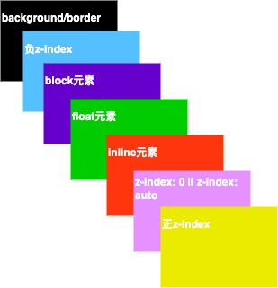
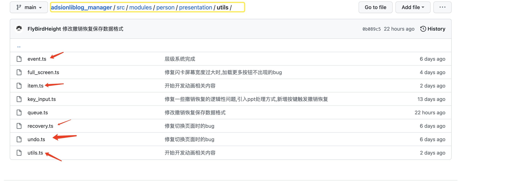

# 基于WEB的可视化PPT制作Part5-层级设计

| 文档创建人 | 创建日期   | 文档内容                        | 更新时间   |
| ---------- | ---------- | ------------------------------- | ---------- |
| adsionli   | 2022-07-12 | 基于WEB的可视化PPT制作-层级设计 | 2022-07-12 |

相关文章：

1. [基于WEB的可视化PPT制作Part1-项目描述及实现内容](https://juejin.cn/post/7117982197939699726)
2. [基于 WEB 的可视化 PPT 制作 Part2-控件添加及修改，埋点](https://juejin.cn/post/7118264381229498404)
3. [基于WEB的可视化PPT制作扩展篇-学习并实现FullScreen](https://juejin.cn/post/7117534409405759519)
4. [通用型Resize,Drag,Rotate组件内容解析](https://juejin.cn/post/7111225695262474277)
5. [基于WEB的可视化PPT制作Part3-拖拽、旋转、放缩通用组件实现](https://juejin.cn/post/7118619234669690888)

在PPT中，层级也是一个比较重要的功能，我们可以通过层级来设置不同叠加关系，那么层级在前端中可以通过`z-index`来进行设置。`z-index`这个css说白了就是深度的表示，说明了元素在z轴上的位置。这里就需要掏出一张非常经典的图，就是下图:



没错了，就是这张七层层叠图，但是，我们这里对于前5层都不会使用到，因为我们的控件全部都是`absolute`的，我们仅仅只需要管理好控件的`z-index`正值的管理。让控件可以自由的进行**上移，下移，置于顶层，置于底层**的操作。

好像看起来没什么难的，但是如果想要实现一个比较好的效果的话，其实还是有一点点需要多考虑一下。

> 我承认一开始想的太简单，导致最后的效果很烂，还好后面重写了😂

## 需求分析

依然先是需求分析，需求就是设计图，需求分析好了，下手写代码才能比较流畅。

需要实现的内容：

1. 置于底层
2. 置于顶层
3. 下移一层
4. 上移一层

很容易理解的四个功能，就是可以让控件自由的移动层级。

这四个功能的范围会有点过于宽泛了，现在我就来在明确一下需要实现的内容

1. 动态卸载无控件内容的层级
2. 置于顶层时，判断当前控件是否是在顶层，如果不在创建一个比当前顶层层级更高的层级，并存放置于顶层操作的控件
3. 置于底层时，判断当前控件是否是在底层，如果不在创建一个比当前底层层级更低的层级，并存放置于底层操作的控件
4. 上移一层触发时，如果当前层级已经是顶层就执行置于顶层操作；如果不是顶层，就查找上一层层级并将当前操作控件放入，并删除当前层级中的控件内容，同时需要判断当前层级内容是否为空，为空就要进行卸载。
5. 上移一层触发时，如果当前层级已经是底层就执行置于底层操作；如果不是底层，就查找下一层层级并将当前操作控件放入，并删除当前层级中的控件内容，同时需要判断当前层级内容是否为空，为空就要进行卸载。
6. 当页面发生切换时，自动构建出层级列表。
7. 可以返回当前页中的最高层级

😱，看起来简简单单的四个功能，居然扩展出这么多内容，实在是.......问题不大，有了需要解决问题的规划，在实现起来就不会特别难啦。

那么为了解决上面的这些问题，就需要选用一个好的结构与对应算法，去保存和操作数据。

在一开始的时候，我又想着用最大，最小堆去保存数据，但是在我设计的操作中，会频繁的进行节点卸载，如果用堆的话，每一次查找都会很麻烦，不方便维护。

所以选用了有序数组+Map的形式，去处理。有序数组负责存放`layer`层级，而`Map`则用来保存每一个层级下控件信息，`Map`的`key`就是layer。

不过在Js中，并没有现成的有序数组供我们使用，所以只能自己来实现一个有序数组来存放层级了。

**而且**(认真脸)有没有发现，这里如果用了有序数组，那么我们的查找，嗯哼，还要我提示吗，大家肯定都想到了，要用二分了啊，二分最好的场景就是在有序数组中进行查询了，时间复杂度非常的稳定O($log_2(n)$)。

okk，好了，下面就可以开始实现咯。

> 这里有个问题，需要多提一下，因为可能在后面会疑惑，为什么明明是相同z-index还是会产生覆盖呢？
>
> 那是因为在`z-index`相同时，还是会有覆盖的问题，这个覆盖是因为`dom`节点优先级问题产生的，可以不用去处理，但是要知道为什么会被覆盖

## 具体实现

上面分析了辣么多，现在就来一步步实现

### 结构实现

首先就是进行我们说的*有序数组*与`Map`的结构设计，这个是我们整个功能模块的底子，非常的重要。

#### 参数设置

```typescript
type ItemInfo = {
    index: string,
    type: string
}
type Layer = {
    layer: number,
    item: ItemInfo[]
};

let layerList: Map<number, Layer> = new Map();
let layerSave: number[] = [];
let startLayer = Math.pow(2,14);
let endLayer = Math.pow(2, 20);
let resizeLayer = currentMinLayer = Math.pow(2, 20) + 1;
let currentMaxLayer = 0;
```

这里我们会初始化多个参数，其中`layerList`与`layerSave`就是我们用于保存数据的内容。

这里还有五个参数`startLayer`、`endLayer`、`resizeLayer`、`currentMinLayer`、`currentMaxLayer`，这四个参数分别：起始层级，结束层级，`resize`选中后赋予的最大层级，当前最小层级、当前最大层级。

`z-index`的最大值是$2^{52} - 1$，当然我们不会选择这么大，因为应该用不到，所以这里选择了$2^{20}$，应该是已经够了。

然后设置了一个起始层级，这是为了让我们的最小层级数不至于到负数。

#### 有序数组

有序数组在很多语言中都会有提供，可以直接使用，但是Js中没有实现这个数组，所以需要自己来实现一下，实现一个简单的话难度不大，其实就是普通二分查找+二分左边界查找来实现。

> 防止被喷，特意声明，这里就是简单实现一下，并不是很完善的实现，只是为了当前功能块😂，大家有更好的实现可以一起交流。

```typescript
/**
* @method setOrderData 添加layer层级
* @param {number} layer 层级
*/
const setOrderData = function (this: any, layer: number) {
    let startIdx = findBoundary.call(this, layer);
    if (this.layerSave[startIdx] < layer) {
        this.layerSave.splice(startIdx + 1, 0, layer);
    } else {
        this.layerSave.splice(startIdx, 0, layer);
    }
}
/**
* @method findBoundary 寻找左边界位置并返回
* @param {number} layer 层级
*/
const findBoundary = function (this: any, layer: number) {
    let len = this.layerSave.length;
    if (len == 0) {
        return 0;
    }
    let left = 0, right = len - 1;
    if (this.layerSave[left] > layer) {
        return 0;
    }
    if (layer > this.layerSave[len - 1]) {
        return len;
    }
    let mid;
    while (left < right && left != right) {
        mid = left - (left + right) >> 1;
        if (this.layerSave[mid] >= layer) {
            right = mid - 1;
        } else {
            left = mid;
        }
    }

    return left;

}
```

上面就是实现有序数组存放与左边界查询的代码啦。这样我们就可以将我们的层级进行保存，并且可以直接从头尾直接获取到当前页面的最小与最大层级啦。

然后就是寻找层级在有序数组中位置的代码，直接基本二分就可以啦，**因为在层级保存中，绝对不会存在相同层级的**。

```typescript
const findIdx = function (this: any, layer: number) {
    let len = layerSave.length;
    let left = 0, right = len - 1;
    //这里是>=的原因是因为我们选取的right是len-1,也就是需要包括了数组的全部元素=>[left, right]
    while(right >= left){
        let mid = left + (right - left) >> 1;
        if(layerSave[mid] == layer){
            return mid;
        }else if (layerSave[mid] < layer){
            left = mid + 1;          
        }else if (layerSave[mid] > layer){
            right = mid - 1;         
        }
    }
    if(data[left] != layer){
        return -1;
    }
    return left;
}
```

### 功能实现

结构设置完成之后，我们就可以来实现我们具体需要的四个功能了，在这四个功能中，我们还需要结合我们自己分析出来的内容进行代码的编写。

#### 置于顶层

```typescript
/**
* @method setTopLayer 置于顶层
* @param {itemInfo: { index: string, type: string }} itemInfo 控件详情
* @param {number} layer 当前层级 
*/
function setTopLayer(itemInfo: { index: string, type: string }, layer: number = 0) {
    if (this.layerList.size === 0) {
        this.initLayer();
        let layer = this.layerList.get(this.currentMaxLayer);
        layer!.item.push(itemInfo);

        return this.currentMaxLayer;
    } else if (layer != 0 && this.layerList.has(layer)) {
        this.removeItem(layer, itemInfo.index)
    }
    this.currentMaxLayer = this.currentMaxLayer + this.layerLimit;
    let newLayer = this.setLayer(this.currentMaxLayer);
    newLayer!.item.push(itemInfo);

    return this.currentMaxLayer;
}
```

置于顶层除了可以通过自己手动设置控件进行触发之外，也可以是在控件创建时进行触发，所以会存在`layerList`为空的情况，这个时候我们就需要去初始化层级。

```typescript
function initLayer() {
    this.currentMinLayer = this.startLayer;
    this.currentMaxLayer = this.startLayer;
    this.layerList.set(this.startLayer, {
        layer: this.startLayer,
        item: []
    });
    this.layerSave.push(this.startLayer);
}
```

初始化的时候，我们需要更新一下`currentMinLayer`与`currentMaxLayer`将其指向我们设置`startLayer`。然后就是向我们的保存数据中添加内容。

如果`layerList`不为空的情况下，我们要去判断当前控件层级是否在`layerList`中存在，如果存在，就需要去卸载原有保存层级的数据，通过调用`removeItem`方法。

```typescript
/**
* @method removeItem 移除对应层级下的item
* @param {number} layer
* @param {string} index
*/
function removeItem(layer: number, index: string) {
    let layerData = this.layerList.get(layer);
    let idx = layerData!.item.findIndex((v: ItemInfo) => {
        return v.index === index
    })
    layerData!.item.splice(idx, 1);
    if (layerData!.item.length === 0) {
        this.deleteLayer(layer);
    }
    let len = this.layerSave.length;
    this.currentMaxLayer = this.layerSave[len - 1];
    this.currentMinLayer = this.layerSave[0];
}
```

因为我们不知道`removeItem`会不会导致当前的最高最低层级的内容变为空，所以我们依旧需要去维护一下`currentMaxLayer`与`currentMinLayer`的值。

完成了这些之后，就需要将当前最大层级进行改变，让其加上我们设置的`layerLimit`，并且将其加入`layerList`和`layerSave`中进行保存。

最后返回调整后的层级，用于控件的`layer`更新。

```typescript
/**
* @method setLayerSave 往有序列表中添加数据
* @param layer 
*/
function setLayerSave(layer: number) {
    setOrderData.call(this, layer);
}
/**
* @method setLayer 设置层级数据
* @param layer 
*/
function setLayer(layer: number) {
    this.layerList.set(layer, {
        layer,
        item: []
    })
    this.setLayerSave(layer)
    return this.layerList.get(layer);
}
```

>  上面就是设置层级，及调用有序数组进行保存的代码，这里还是提一下，避免缺少代码造成大家的阅读不便

#### 上移一层

```typescript
/**
* @method moveUpLayer 上移一层
* @param {itemInfo: { index: string, type: string }} itemInfo 控件详情
* @param {number} layer 当前层级 
*/
function moveUpLayer(itemInfo: { index: string, type: string }, layer: number) {
    if (layer === this.currentMaxLayer) {
        return this.setTopLayer(itemInfo, layer);
    } else {
        let idx = findIdx.call(this, layer);
        if (idx == -1) {
            return;
        }
        if (this.layerSave.length > 1 && idx + 1 < this.layerSave.length) {
            idx += 1;
        }
        let newLayer = this.layerSave[idx];
        this.removeItem(layer, itemInfo.index);

        let layerData = this.layerList.get(newLayer);
        layerData?.item.push(itemInfo);

        return newLayer;
    }
}
```

首先需要判断当前控件的层级是否是顶层层级，如果是的话，直接进入到置于顶层操作，并且返回最终的层级数。

如果不是的话，就去查找当前层级在`layerSave`所处的下标，然后通过`idx + 1`，找到上一层级，然后在执行卸载操作，卸载操作完成后，在执行装载操作即可完成。最后返回新的层级就好啦。

#### 置于底层

```typescript
/**
* @method setTopLayer 置于底层
* @param {itemInfo: { index: string, type: string }} itemInfo 控件详情
* @param {number} layer 当前层级 
*/
function setBottomLayer(itemInfo: { index: string, type: string }, layer: number) {
    if (this.layerList.size === 0) {
        this.initLayer();
        let layer = this.layerList.get(this.currentMinLayer);
        layer!.item.push(itemInfo);

        return this.currentMinLayer;
    } else if (layer != 0 && this.layerList.has(layer)) {
        this.removeItem(layer, itemInfo.index)
    }

    this.currentMinLayer = this.currentMinLayer - this.layerLimit;
    let newLayer = this.setLayer(this.currentMinLayer);
    newLayer!.item.push(itemInfo);

    return this.currentMinLayer;
}
```

和置于顶层一样，还是需要判断一下，当前层级列表`layerList`是否为空，为空就进行初始化，这里不过多介绍了。

如果不为空，就先执行卸载操作，将item从原有层级中进行卸载。

然后就是更新`currentMinLayer`，并且将其添加入`layerList`中，最后返回`currentMinLayer`即可。

#### 下移一层

```typescript
/**
* @method moveDownLayer 下移一层
* @param {itemInfo: { index: string, type: string }} itemInfo 控件详情
* @param {number} layer 当前层级 
*/
function moveDownLayer(itemInfo: { index: string, type: string }, layer: number) {
    if (layer === this.currentMinLayer) {
        return this.setBottomLayer(itemInfo, layer);
    } else {
        let idx = findIdx.call(this, layer);
        idx -= 1;
        let newLayer = this.layerSave[idx];

        this.removeItem(layer, itemInfo.index);
        let layerData = this.layerList.get(newLayer);
        layerData?.item.push(itemInfo);
        return newLayer;
    }
}
```

下移一层的处理逻辑和上移一层的逻辑是一模一样的，这里不写了，大家自己看一下代码即可。

### 接入

在完成了上面的全部功能之后，我们就需要把层级系统接入到我们的简易可视化PPT的`handle`主函数中去了。那么主要使用到的地方就是用户在操作操作栏的响应、还有控件添加与删除、撤销操作、恢复操作、页面切换这些地方。

为了接入的过程更加流畅，这里也会提前在封装几个函数

```typescript
/**
* @method resetData 重置数据，当页面发生改变时，重置
*/
function resetData() {
    this.layerList.clear();
    this.currentMinLayer = this.currentMaxLayer = 0;
    this.layerSave = [];
}
/**
* @method setLayerList 设置层级列表数据
* @param itemData
*/
function setLayerList(itemData: { layer: number, itemInfo: { index: string, type: string } }[]) {
    for (let item of itemData) {
        if (this.layerList.has(item.layer)) {
            let data = this.layerList.get(item.layer);
            data!.item.push(item.itemInfo);
        } else {
            let data = this.setLayer(item.layer);
            data!.item.push(item.itemInfo)
        }
        if (item.layer > this.currentMaxLayer) {
            this.currentMaxLayer = item.layer
        }
        if (item.layer < this.currentMinLayer) {
            this.currentMinLayer = item.layer
        }
    }
}
/**
* @method setItemLayer 设置item控件指定层级(用于撤销与恢复)
* @param {number} layer 层级
* @param {itemInfo: {index: string, type: string}} itemInfo 控件详情 
*/
function setItemLayer(layer: number, itemInfo: { index: string, type: string }) {
    if (this.layerList.has(layer)) {
        let layerData = this.layerList.get(layer);
        layerData?.item.push(itemInfo);
        return;
    }
    let layerItem = this.setLayer(layer);
    layerItem?.item.push(itemInfo);
    return;
}
/**
 * @method setLayerToList 设置item的layer到layerSetting中，指定层级
 * @param {itemInfo: {index: string, type: string}} itemInfo 控件信息
 * @param {number} layer 层级
 */
const setLayerToList = function (this: any, itemInfo: { index: string, type: string }, layer: number, action: string = 'add') {
    if (action == 'add') {
        this.layerSetting.setItemLayer(layer, itemInfo);
    } else {
        this.layerSetting.removeItem(layer, itemInfo.index);
    }

    return true;
}
/**
 * @method setItemDataToLayer 设置当前页面的层级结构
 * @param currentPage 
 */
const setItemDataToLayer = (currentPage: Page | null) => {
    if (!currentPage) {
        return [];
    }
    let item = currentPage.item;
    let returnData: { layer: number, itemInfo: { index: string, type: string } }[] = [];
    if (item.count === 0) {
        return returnData;
    }
    for (let text of item.text) {
        returnData.push({
            layer: text!.style!.layer,
            itemInfo: {
                index: text.index,
                type: 'text'
            }
        })
    }
    for (let image of item.image) {
        returnData.push({
            layer: image!.style!.layer,
            itemInfo: {
                index: image.index,
                type: "image"
            }
        })
    }
    return returnData;
}
```

具体使用的地方就不写了，有点多，会比较啰嗦，大家可以自己前往源码进行查看：[源码查看](https://github.com/FlyBirdHeight/adsionliblog_manager/tree/main/src/modules/person/presentation)

> 主要作用文件
>
> 

## 效果展示

好了，最后就是展示一下效果


**注意：本篇内容完成后，将会有一段时间不再更新，因为后面的内容还没有完全做好，而且提前批开始了，还得背八股和算法题，非常难受，等博主找完工作，就立马去完成，然后回来更新，55555**

