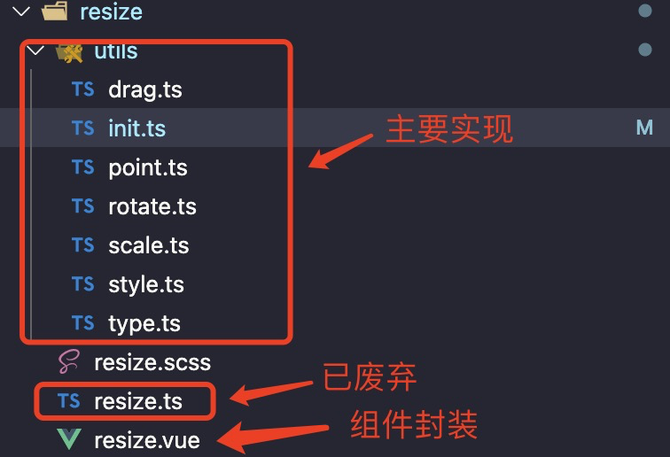
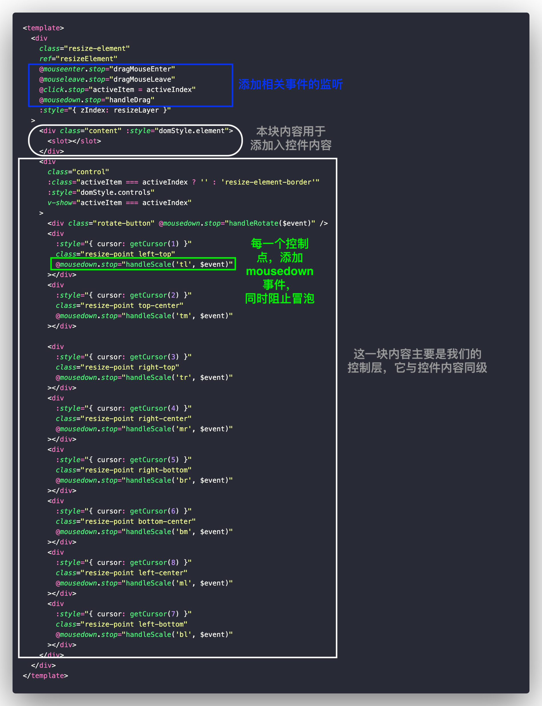
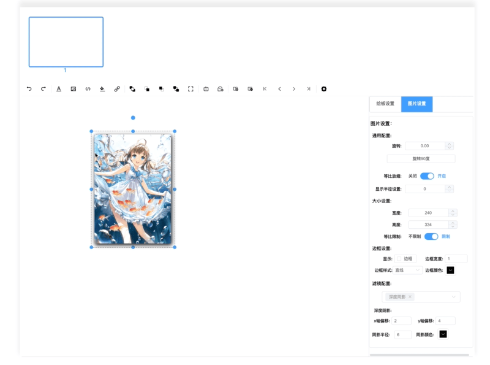

# 基于WEB的可视化PPT制作Part3-拖拽、旋转、放缩通用组件实现

| 文档创建人 | 创建日期   | 文档内容                                            | 更新时间   |
| ---------- | ---------- | --------------------------------------------------- | ---------- |
| adsionli   | 2022-07-10 | 基于WEB的可视化PPT制作-拖拽、旋转、缩放通用组件实现 | 2022-07-10 |

相关文章：

1. [基于WEB的可视化PPT制作Part1-项目描述及实现内容](https://juejin.cn/post/7117982197939699726)
2. [基于 WEB 的可视化 PPT 制作 Part2-控件添加及修改，埋点](https://juejin.cn/post/7118264381229498404)
3. [基于WEB的可视化PPT制作扩展篇-学习并实现FullScreen](https://juejin.cn/post/7117534409405759519)
4. [通用型Resize,Drag,Rotate组件内容解析](https://juejin.cn/post/7111225695262474277)

当我们实现了控件的添加与删除之后，根据原有PPT的内容，我们发现每一个控件被添加选中之后，我们都可以对其进行旋转，放缩、拖拽这三个基本功能，那么我们也就需要来实现一下这个功能，让我们的简易可视化PPT也比较贴近原有PPT的实现习惯。

这里就需要大家去阅读一篇前置文章，也就是我第一次在掘金上发的，一篇关于[通用型Resize,Drag,Rotate组件内容解析](https://juejin.cn/post/7111225695262474277)，通过阅读这篇文章，大家就可以了解其背后的实现原理

> 小小吐槽一下，这篇为啥没有首页推荐嘞，我感觉写的还阔以...果然是我太菜了，5555。

既然之前的原理性的东西已经实现好啦，那么我们就来把它封装成我们项目中需要使用到的组件的形式。

## 组件封装

因为很多内容已经创建完成了，所以我们只需要对其进行使用，并且在接入到我们的内容中，再添加上相关的埋点(也是为了撤销恢复操作)，然后在对外进行开放即可。

> 如果大家需要查看源码的话，可以到[这里](https://github.com/FlyBirdHeight/adsionliblog_manager/tree/main/src/modules/person/presentation/resize)
>
> 
>
> 上面就是目录结构，`resize.ts`这个文件已经被废弃了，它是最早的时候没有基于旋转的实现，会出现定位问题，后期修改后的实现都在`utils`目录下了，保留下来是因为自己有的时候也会回去反思一下，当时出现的问题。

### 主体搭建

因为resize组件需要作用在我们之后添加的全部的控件上，所以我们需要设置一个默认插槽，来让控件进入，所以我们的页面结构设置成下面这种形式



主要就分成两个模块，一个是用于放置控件内容的`content`模块，使用默认插槽；还有一块就是我们的控制层，里面主要有我们的8个控制点以及我们旋转点。

然后我们需要对每一块内容添加上相关的事件：

1. 主体内容事件：

   主体内容需要添加的是`drag`事件，也就是拖拽，不过我并没有使用原本的`drag`而是使用`mousedown`事件，配合`mousemove,mouseup,mouseleave`三个事件来完成。

   > 这是为了和之后的旋转、放缩操作统一起来，走同一个`onDrag`函数即可，避免重复封装

2. 控制点事件：

   这里控制点主要分为两类：旋转控制点、放缩控制点

   其中旋转控制点只有1个，放缩控制点为8个，所以我们需要为其添加不同的`mousedown`事件。

### 内容实现

有了主体内容之后，我们就可以来实现我们需要实现的内容啦。

#### 变量

首先是我们使用到的变量说明。

```typescript
/**
* @property {*} slots 通过useSlots可以拿到插槽内容
* @property {*} child 保存一下插槽内容的item控件内容
* @property {*} childType item控件类型
* @property {string} activeIndex item控件index标识
* @property {string} activeItem 当前选中控件的index标识,在父组件中provide下来的
* @property {*} parentDom resize组件的父级
* @property {*} resizeElement resize组件的ref对象
* @property {*} resizeData resize组件的ref对象
* @property {*} childPropsData item控件传入的props参数
* @property {*} handleObj 总处理对象的单例对象
* @property {number} resizeLayer resize组件的层级
* @property {*} domStyle 两块内容的css样式
*/
const slots = useSlots()
const child = ref(null)
const childType = ref<string>('text')
const activeIndex = ref<number>(0)
const activeItem = inject('activeItem')
const parentDom = ref<any>(null)
const resizeElement = ref<any>()
const resizeData = reactive(generateData())
const childPropsData = ref()
const handleObj = inject('handleObj')
const resizeLayer = ref<number>(0)
const domStyle = reactive({
  element: {},
  controls: {},
})
```

这里要提一下`resizeData`，因为我们在旋转或者放缩的时候，改变的频率比较高，所以我们需要使用`getter`的形式结构出`props`中传递的`style`内容

> 这里是因为`props`传递的内容是一个`reactive`响应式对象，所以需要通过`getter`的形式转为基本类型在赋值，这样就不会造成浅拷贝现象了。

`resizeData`主要包括的内容就是item控件的`attribute:{width, height, angle},offset:{x, y},scale: {x, y}, layer`，这些是属于item控件本身的属性，我们还需要额外保存最外层容器的`top/left`这两个位置信息，用于之后的计算。

#### 实现函数

因为在之前我们已经将基本实现函数写好了，所以我们只需要在封装一层，然后传入相应参数在调用一下就可以了。

由于旋转、拖拽、放缩操作实际都是对鼠标事件的监听，所以我们可以设置一个统一的函数，让其直接调用这个函数即可，所以这里就新建了一个`onDrag`函数，其实现如下：

```typescript
const onDrag = (document: Document, drag: any, updateFunc: Function) => {
    const up = (e: Event) => {
        e.stopPropagation()
        document.removeEventListener('mousemove', drag)
        document.removeEventListener('mouseup', up)
        document.removeEventListener('mouseleave', leave)
        updateFunc(e.timeStamp)
    }
    const leave = (e: Event) => {
        e.stopPropagation()
        document.removeEventListener('mousemove', drag)
        document.removeEventListener('mouseup', up)
        document.removeEventListener('mouseleave', leave)
        updateFunc(e.timeStamp)
    }

    document.addEventListener('mousemove', drag)
    document.addEventListener('mouseup', up)
    document.addEventListener('mouseleave', leave);
}
```

你会发现实际就是`mousemove`这里会有一些不同，所以我们只需要自己传入`drag`函数，然后监听`mouseup`事件与`mouseleave`事件，并将updateFunc放入其中进行执行就可以啦。这里的第一个`document`对象实际就是每一个不同`resize`组件的节点，根据不同的节点创建不同的监听事件，而且要及时进行卸载。

> 这里我们会看到在`mouseup`与`mouseleave`事件中，我们会往`updateFunc`回调函数中传入`e.timeStamp`，这个是有很大用处的，因为我们有一个`click`事件来操作`activeItem`这个选中激活的，如果这里不会传的话，会导致外部还会执行一次且无法取消，如果我们传了上一次鼠标事件发生时间给外部的话，就可以进行比较，如果是在同一时间激发的话，就不需要在执行未选中事件啦。

然后就是`drag`,`rotate`,`resize`三个方法的封装

```typescript
/**
* @method handleDrag 处理拖拽事件
*/
const handleDrag = (event) => {
  if (activeItem.value !== activeIndex.value) {
    activeItem.value = activeIndex.value
  }
  const drag = dragDom(resizeData.offset, { x: event.pageX, y: event.pageY })
  resizeLayer.value = handleObj.layerSetting.resizeLayer

  onDrag(resizeElement.value, drag, (timestamp) => {
    emit('changeStatus', timestamp)
    const position = { x: resizeData.offset.x, y: resizeData.offset.y }
    handleObj.updateItem(activeItem.value, childPropsData.value.type, { position })
    resizeLayer.value = resizeData.layer
  })
}
/**
* @method handleDrag 处理放缩事件
* @param {string} activeType 放缩选中的目标点
*/
const handleScale = (activeType: string, event: Event) => {
  event.stopPropagation()
  let scaleData = Object.assign({}, resizeData.attribute)
  scaleData = Object.assign(scaleData, resizeData.offset)
  scaleData = Object.assign(scaleData, { scaleX: resizeData.scale.x, scaleY: resizeData.scale.y })
  scaleData = Object.assign(scaleData, { startX: event.pageX, startY: event.pageY })
  scaleData = Object.assign(scaleData, resizeData.event)

  const scaleDom = scale(scaleData, activeType, 0.1, (currentData) => {
    resizeData.offset = { x: currentData.x, y: currentData.y }
    resizeData.scale.x = currentData.scaleX
    resizeData.scale.y = currentData.scaleY
  })
  resizeLayer.value = handleObj.layerSetting.resizeLayer
  onDrag(resizeElement.value.parentElement, scaleDom, (timestamp) => {
    emit('changeStatus', timestamp)
    const position = { x: resizeData.offset.x, y: resizeData.offset.y }
    const scale = { x: resizeData.scale.x, y: resizeData.scale.y }
    handleObj.updateItem(activeItem.value, childPropsData.value.type, { position, scale }, 'scale')
    resizeLayer.value = resizeData.layer
  })
}
/**
* @method handleDrag 处理旋转事件
*/
const handleRotate = (event) => {
  const rotateDom = rotate(
    resizeData.offset,
    resizeData.scale,
    resizeData.attribute,
    { x: event.pageX, y: event.pageY },
    resizeData.containerOffset,
    (data) => {
      resizeData.attribute.angle = data.angle
    }
  )
  resizeLayer.value = handleObj.layerSetting.resizeLayer
  onDrag(resizeElement.value.parentElement, rotateDom, (timestamp) => {
    emit('changeStatus', timestamp)
    handleObj.updateItem(
      activeItem.value,
      childPropsData.value.type,
      {
        attribute: { angle: resizeData.attribute.angle },
      },
      'rotate'
    )
    resizeLayer.value = resizeData.layer
  })
}
```

因为我们的`drag/rotate/scale`其中返回的都是一个回调函数，所以我们只需要把它作为参数出入`onDrag`即可，然后我们再在最后取消操作之后，来更新控件的相关参数，这样就可以避免控件属性变化过快，导致其他需要监听控件属性的地方过多次触发，导致性能问题的出现。

完成了上面的内容之后，其实这个组件的开发就已经结束了，但是在本项目中，我们还可以通过设置栏目进行角度，宽高的设置，所以我们还需要设置一个watch来监听控件接收到的props数据的变化。

```typescript
const updateResizeData = (style: any) => {
  if (resizeData.offset.x !== style.position.x || resizeData.offset.y !== style.position.y) {
    resizeData.offset.x = style.position.x
    resizeData.offset.y = style.position.y
  }

  resizeData.attribute = {
    width: style.attribute.width,
    height: style.attribute.height,
    angle: style.attribute.angle,
  }
  resizeData.scale = { x: style.scale.x, y: style.scale.y }
  resizeData.layer = style.layer
  resizeLayer.value = style.layer
}

watch(
  childPropsData,
  (newV, oldV) => {
    updateResizeData(newV.style)
  },
  {
    deep: true,
  }
)
```

我们这里依然只需要本组件需要使用到的内容即可，然后通过`updateResizeData`函数对`resizeData`进行更新。

#### 埋点操作

在上面实现的内容中，大家有没有注意到我并没有直接通过修改`item`控件的`props`对象的数据完成修改，而是使用了`handleObj.updateItem`完成对数据对象的修改。

> 其实这里直接作用于handleObj上的数据的时候，因为全是浅拷贝，所以reactive对象中的数据也会修改掉。

通过这种形式，我们可以采集到`resize/drag/rotate`的前后数据，这样就可以添加入`actionStact(动作栈)`，为之后的撤销恢复提供可执行数据。

这里调用的还是`updateItem`这个函数，它会根据我们传入的结构数据，去进行解析，并赋值。

```typescript
/**
 * @method updateItem 更新页面中的item
 * @param index item标识
 * @param type item类型
 * @param updateData 更新内容
 */
const updateItem = function (this: any, index: any, type: string, updateData: any, itemEditType: string = '') {
    let { pageData, typeList } = this.getTypeList(type);
    let idx = typeList.findIndex((v: PageItem) => {
        return v.index === index;
    })
    let item = typeList[idx];
    if (Reflect.has(updateData, 'data')) {
        return;
    }
    let style = item.style;
    let oldData: any = setItemData(style, updateData);
    if (JSON.stringify(oldData) == JSON.stringify(updateData)) {
        return;
    }

    recordAction.call(this, type, index, 'item-edit', oldData, updateData, itemEditType)
}
```

当然我们在更新的同时，还得把老的数据进行保留，这样就有了`setItemData`这个函数了，它既能执行更新，也可以返回老的数据，放入到动作栈中。

```typescript
/**
 * @method setItemData 根据更新数据结构，设置对应的item内容
 * @param style 
 * @param updateData 
 */
const setItemData = (style: any, updateData: any) => {
    let oldData: any = {}
    for (let key of Reflect.ownKeys(updateData)) {
        oldData[key] = {}
        if (Array.isArray(updateData[key])) {
            oldData[key] = []
        }
        if (typeof (updateData[key]) === 'object' && Reflect.ownKeys(updateData[key]).length != 0 && !Array.isArray(updateData[key])) {
            oldData[key] = setItemData(style[key], updateData[key]);
        } else {
            oldData[key] = style[key];
            style[key] = updateData[key]
        }
    }

    return oldData;
}
```

### 效果展示



效果还是挺好的，同时加入了`ctrl+z`的撤销操作(忘机演示恢复了....)。

## 结束语

这个组件的开发还是挺好玩的，让我知道了就算是在二维平面上开发内容的时候也需要计算很多位置坐标。这也算是边学习边制作了，当然这个后期还有很多可以优化的空间，比如加进节流，来让其变化不要过于快速，降低性能消耗。

有一说一，这一块内容开发折磨了我5天，虽然有现成的，但是如果让它符合我所需要的效果实在是太麻烦了，还得hacker进去，这不太好，还不如自己从头开发一个来的好，而且这样也可以更好地适配自己的功能。

加油加油，继续完善，冲！！！
