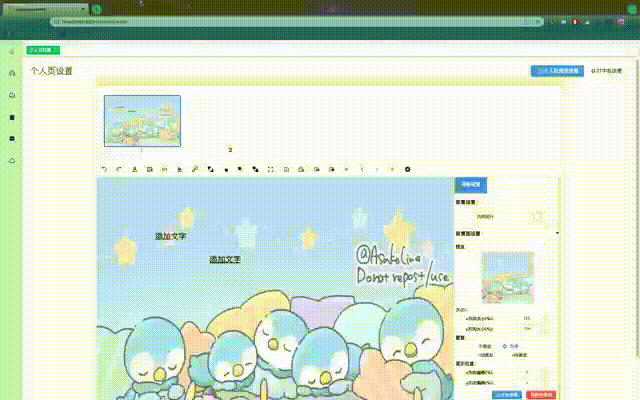

# 基于WEB的可视化PPT制作扩展篇-学习并实现FullScreen

| 文档创建人 | 创建日期   | 文档内容             | 更新时间   |
| ---------- | ---------- | -------------------- | ---------- |
| adsionli   | 2022-07-06 | 学习并实现FullScreen | 2022-07-06 |

在开发可视化PPT时，想做一个`FullScreen`的全屏操作的功能，这样就可以屏蔽掉其他内容，可以更好的进行内容的设置，但是之前并没有学习与使用过相关的API，所以借着这次的机会，来学习并自己实现一个`FullScreen`的操作。

## 关键API

首先先来学习一下相关的关键API的内容，这样有利于梳理一下我们之后需要实现内容的思路。

### 全屏模式的切换

全屏模式的切换主要用到的是这两个`document.exitFullscreen()`与`element.requestFullscreen()`。

从这两个函数的起始对象我们可以发现，一个是在`document`对象下的，还有一个是在我们节点对象`element`下的，这就让我们可以将任意的指定的节点全屏化，当然这里的`element`包括了其下的全部子节点全屏化。

**element.requestFullscreen()**

MDN的解释：请求浏览器（user agent）将特定元素（甚至延伸到它的后代元素）置为全屏模式，隐去屏幕上的浏览器所有 UI 元素，以及其它应用返回一个 `Promise`，并会在全屏模式被激活的时候变成 `resolved` 状态。

可以很清楚的直到，如果我们需要将某一个指定的节点对象及其子元素全屏化的时候，就可以执行`element.requestFullscreen()`，但是这里有一个前提，就是判断当前浏览器是否提供了全屏模式，这还需要调用`Document`下`fullscreenEnabled`来进行判断，如果是`false`的话，则说明不支持全屏模式，这样就无法使用全屏模式了。

如果可以使用，那么我们在调用`element.requestFullscreen()`函数的时候就会返回一个`Promise`对象，这个`Promise`对象是完成切换全屏模式后，返回的一个`resolved`之后的`Promise`对象，他没有携带回传的值。

**document.exitFullscreen()**

MDN的解释：法用于让当前文档退出全屏模式。调用这个方法会让文档回退到上一个调用`Element.requestFullscreen()`方法进入全屏模式之前的状态。

> **备注：** 如果一个元素 A 在请求进去全屏模式之前，已经存在其他元素处于全屏状态，当这个元素 A 退出全屏模式之后，之前的元素仍然处于全屏状态。浏览器内部维护了一个全屏元素栈用于实现这个目的。

这个备注很有意思，我们可以发现，全屏元素可以同时存在很多个，但是是按照栈的形式存储的，当其中一个元素弹出之后，我们并不会直接退出全屏模式，因为如果还有其他元素存在全屏模式下，就会从栈顶取出这个元素，并设置为当前全屏模式的内容。

### 事件

除了上面两个关键的开启与关闭全屏模式的API执行函数之外，还会有相关的事件，配合全屏模式开启与关闭时进行触发，具体分为两种，一种是Document全局对象上的，还有一种是节点对象Element对象上的，这两种是有一点不同的，但是其作用是相同的，只是作用的对象存在区别，原因就在上面一节也有提到，就是因为全屏模式元素不唯一。

Document下的事件

| 事件               | 解释                                                         |
| ------------------ | ------------------------------------------------------------ |
| `fullscreenchange` | 当进入全屏或退出全屏时，事件将被发送到`Document`上。**此处理程序仅在整个文档全屏模式更改时有效**。 |
| `fullscreenerror`  | 当进入全屏或退出全屏出错时，事件将被发送到 `Document` 上，**仅对整个文档的全屏模式更改出错时候有效**。 |

节点对象`Element`的事件

| 事件                         | 解释                                                         |
| ---------------------------- | ------------------------------------------------------------ |
| `Element.onfullscreenchange` | 当全屏事件发生时，**该事件会被发送到该元素**，表明**该元素进入或退出全屏模式** |
| `fullscreenerror`            | 当指定的 `Element` 改变全屏模式时候出现错误，该事件将被发送到指定的 `Element` 上。 |

这里`Element`对象的`change`事件，稍微有点不同，他不能直接通过`addEventListener`进行创建，而是需要通过直接调用函数来设置。


## 实现

其实需要实现的内容不多，因为全屏模式下的内容也不太多，这里的实现直接解读[screenfull](https://github.com/sindresorhus/screenfull)这个组件库。其实实现很简单，但是需要考虑到不同设备下的`api`的不同，这样才具有通用性。

那么第一步，我们就来将大部分设备不同的`api`记录一下

```typescript
const methodMap = [
    [
        'requestFullscreen',
        'exitFullscreen',
        'fullscreenElement',
        'fullscreenEnabled',
        'fullscreenchange',
        'fullscreenerror',
    ],
    // New WebKit
    [
        'webkitRequestFullscreen',
        'webkitExitFullscreen',
        'webkitFullscreenElement',
        'webkitFullscreenEnabled',
        'webkitfullscreenchange',
        'webkitfullscreenerror',

    ],
    // Old WebKit
    [
        'webkitRequestFullScreen',
        'webkitCancelFullScreen',
        'webkitCurrentFullScreenElement',
        'webkitCancelFullScreen',
        'webkitfullscreenchange',
        'webkitfullscreenerror',

    ],
    [
        'mozRequestFullScreen',
        'mozCancelFullScreen',
        'mozFullScreenElement',
        'mozFullScreenEnabled',
        'mozfullscreenchange',
        'mozfullscreenerror',
    ],
    [
        'msRequestFullscreen',
        'msExitFullscreen',
        'msFullscreenElement',
        'msFullscreenEnabled',
        'MSFullscreenChange',
        'MSFullscreenError',
    ],
];
```

上面这个`methodMap`就是为我们提供了在不同浏览器下的`fullscreen`全屏模式的不同`api`，我们可以通过来判断`document`这个全局对象下存在的方法，来自己调整好`fullscreen`的`api`

下面就是来获取到当前`document`对象下的`fullscreen`的`api`的`IIFE`函数：

```typescript
/**
 * NOTE: 首先根据Document对象的区别，区分应该调用哪一个全屏模式的API
 */
const nativeAPI = (() => {
    if (typeof document === 'undefined') {
        return false;
    }
	
    const unprefixedMethods = methodMap[0];
    const returnValue: any = {};

    for (const methodList of methodMap) {
        /**
        *README: 通过判断是否存在开启全屏模式的方法，来对returnValue进行赋值,
        *        最终返回一个可执行列表，且这个可执行列表依然按照最普通的web的全屏方式进行赋值
        */
        const exitFullscreenMethod = methodList?.[1];
        if (exitFullscreenMethod in document) {
            for (const [index, method] of methodList.entries()) {
                returnValue[unprefixedMethods[index]] = method;
            }

            return returnValue;
        }
    }

    return false;
})();
```

获取到可执行列表`nativeAPI`之后，我们就可以来封装`screenfull`这个对象了。

让我们梳理一下，我们需要实现的内容有哪一些：

1. 开启全屏模式

2. 关闭全屏模式

3. 注册开启关闭时的触发事件

4. 关闭开启关闭时的触发事件

5. 相关参数：

   1. 当前操作的`element`对象

   2. 当前`element`对象是否开启全屏模式

   3. 当前浏览器是否支持开启全屏模式

好了，大概也就是这些内容了。然后我们根据分析出的内容来看其实现

1. 开启全屏`startUp`

```typescript
/**
 * @method startup 开启全屏模式
 * @param dom 
 * @param options 
*/
startup(dom: any, options: any = { navigationUI: 'auto' }) {
    return new Promise((resolve, reject) => {
        if (!document.fullscreenEnabled) {
            return false;
        }
        const enterFullScreen = () => {
            fullscreen.off('change', enterFullScreen);
            resolve();
        }
        //NOTE: 添加在开启fullscreen模式时的事件监听
        fullscreen.on('change', enterFullScreen);
        //NOTE: 调用对应平台的fullscreen的api，获取返回的promise对象
        const createPromise: any = dom[nativeAPI.requestFullscreen](options);

        if (createPromise instanceof Promise) {
            createPromise.then(enterFullScreen).catch(reject);
        }
    })
}
```

开启全屏模式的话，我们需要传入一个需要全屏的`dom`元素，同时选择是否传入`options`，这个`options`主要用来控制是否显示导航条的UI的,默认为`'auto'`，也可以自己设置`'hide'/'show'`。

我们需要去调用我们之前设置好的可执行API列表中的`requestFullscreen`来开启全屏模式，因为其返回的是一个Promise对象，所以我们就可以自己先将其进行处理，如果成功或失败了了，调用我们自己设置的回调函数。

2. 关闭全屏`exit`

   ```typescript
   /**
   * @method exit 退出全屏模式时调用
   */
   exit() {
       return new Promise((resolve, reject) => {
           if (!fullscreen.isFullscreen) {
               resolve();
               return;
           }
           const exitFullScreen = () => {
               fullscreen.off('change', exitFullScreen);
               resolve();
           }
   
           fullscreen.on('change', exitFullScreen);
           const exitPromise: any = Reflect.get(document, nativeAPI.exitFullscreen)();
   
           if (exitPromise instanceof Promise) {
               exitPromise.then(exitFullScreen).catch(reject);
           }
       })
   },
   ```

   首先我们需要判断是否处于全屏状态，如果已经未开启全屏，直接返回，如果已经开启了，我们继续执行。

   然后我们自己手动埋入`change`的`event`事件。来根据其关闭状态进行触发。

   之后就还是通过之前设置好的可执行API中的`exitFullscreen()`进行全屏模式的关闭。

3. 事件绑定

   ```typescript
   /**
    * @method onchange 自定义在开启与关闭时触发的change事件
    * @param callback 
   */
   onchange(callback: any) {
       fullscreen.on('change', callback);
   }
   /**
    * @method onerror 自定义在开启与关闭时触发的error事件
    * @param callback 
   */
   onerror(callback: any) {
       fullscreen.on('error', callback);
   }
   on(event: string, callback: any) {
       const eventName = eventNameMap[event];
       if (eventName) {
           document.addEventListener(eventName, callback, false);
       }
   }
   off(event: string, callback: any) {
       const eventName = eventNameMap[event];
       if (eventName) {
           document.removeEventListener(eventName, callback, false);
       }
   }
   ```

   对外直接开放`change`和`error`事件的注册，内部则通过`on`与`off`来绑定事件，这样可以通过可执行API列表中选择合适的绑定事件名称进行事件绑定。

4. 参数设置

   ```typescript
   /**
   * @property {boolean} isFullscreen 是否是全屏状态
   * @property {Element} element 获取当前全屏状态的element对象
   * @property {boolean} isEnabled 是否允许全屏模式
   */
   isFullscreen: {
       get: () => Boolean(Reflect.get(document, nativeAPI.fullscreenElement)),
   }
   element: {
       enumerable: true,
       get: () => Reflect.get(document, nativeAPI.fullscreenElement) ?? undefined,
   }
   isEnabled: {
       enumerable: true,
       get: () => Reflect.get(document, nativeAPI.fullscreenEnabled),
   }
   ```

   这里通过设置其`get`方法，来自定义返回内容，就可以减少代码量。

通过以上的内容，我们就可以创建出一个任意节点全屏化的封装`FullScreen`组件啦，然后来看看使用效果。



效果还是可以的，这里由于我使用的是element-plus中相关的内容组件，所以我们需要将其全部设置成不绑定在body下，这样才可以解决它不在全屏模式下显示的问题。

> 这里其实存在一个问题，就是当我们使用Upload的时候，它会自动触发exitFullscreen，从而导致全屏被关闭，这个暂时还没找到解决方法。

如果还需要结合键盘输入来开启与关闭，也可以自己获取到`keydown`来触发。

但是这里有一点需要注意，我们无法捕获在全屏模式下的按下`esc`取消全屏的事件，所以我们需要创建一个`change`的响应事件，在里面判断当前状态是否是关闭状态且当前的`dom`是否为`null`，如果不为`null`的话，我们就可以在其中设置相关内容，并卸载，具体实现如下:

```typescript
fullscreen.startup(dom)
let fullScreenChange = () => {
    if (!fullscreen.isFullscreen && fullscreen.dom) {
        //因为在FullScreen下的有些布局会乱，所以我们需要手动调整
        fullscreen.dom.style.flexDirection = 'column';
        fullscreen.dom.style.justifyContent = '';
        fullscreen.off('change', fullScreenChange)
    }
}
fullscreen.on('change', fullScreenChange)
```


## 总结

`FullScreen`是一个非常实用的功能，而且其使用也非常简单与友好，封装起来的难度不大，所以大家都可以自己试试来对其进行单独封装，来根据自身的需求来进行编写，冲冲冲！


## 参考内容

1. [全屏API](https://developer.mozilla.org/zh-CN/docs/Web/API/Fullscreen_API#specification_3)
2. [screenfull.js](https://github.com/sindresorhus/screenfull)