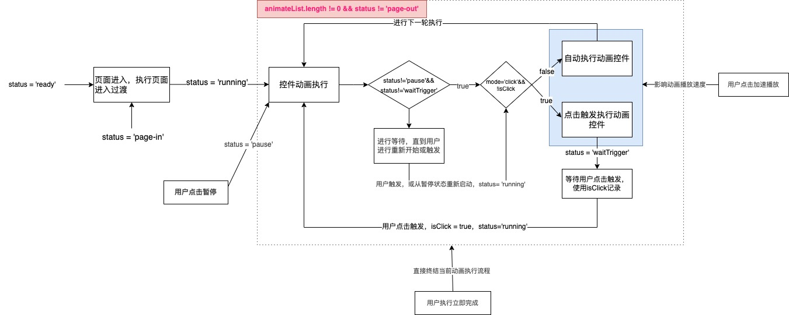
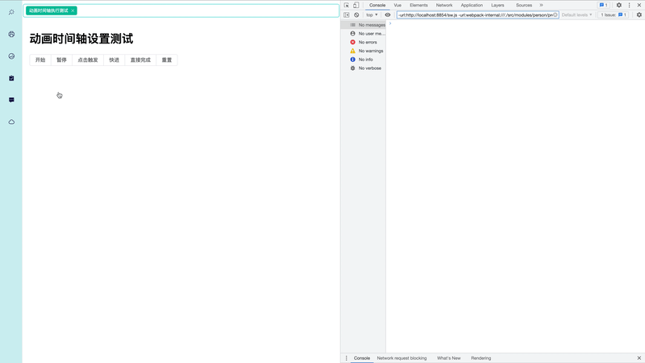

# 基于WEB的可视化PPT制作扩展篇-动画时间轴实现

| 文档创建人 | 创建日期   | 文档内容       | 更新时间   |
| ---------- | ---------- | -------------- | ---------- |
| adsionli   | 2022-09-07 | 动画时间轴实现 | 2022-09-07 |

躺平之后整个人思路都打开了，花了一晚上就写完了一直拖着的动画时间轴的执行实现，可以支持开始、暂停、点击触发、快进、直接完成、重置这几个功能的动画时间轴控制器，接下来就说是如何设计这块内容的啦。

## 内容分析

通过对PPT的动画播放分析，我们可以发现以下几个点：

1. 控件过渡动画出现前，会执行PPT页面进入的过渡效果，当PPT页面进入完成之后，才会执行拥有动画的控件的动画效果。
2. 有的控件是通过点击出来后进行显示的，也就是通过主动触发的方式进入、离开；而有的控件则是通过自动进入、离开来显示过渡效果的。
3. 有的控件还可以新增强调效果(这里不完成该内容)。
4. 自动展示的控件如果是跟在点击触发的控件之后的话，也会因为未点击而不可呈现。
5. 可以支持一下全部显示，跳过控件动画过渡。
6. 支持鼠标滚轮调整控件显示(暂时也不支持)。
7. 可以返回上一次的动画过渡效果执行之前的状态。

上面就是对PPT控件动画过渡的内容分析，除了上述分析之外，我还增加了一些小功能

1. 可以在自动控件过渡效果连续执行的时候，暂停执行，然后再开始执行的功能。
2. 快进功能，可以按照倍速播放的效果，加快控件展示进度。
3. 在任意阶段都可以重置，然后从头开始执行。

## 具体实现

内容分析完成后，我们就可以来进行具体实现了，这里先只是一个测试的类的实现，还未接入具体的数据，我们可以先用模拟数据进行测试。

然后开始来实现这个功能。

### 类设置

我们需要用一个`class`来控制，我们把这个class叫做`ImplementAnimate`

#### 参数及类型定义

然后就来定义一些参数和参数类型来供我们使用。

```typescript
type Animate = {
    time: number,
    action: string,
    options?: any
}
/**
 * @type AnimateType 控件动画内容
 * @property {Animate} enter 控件标识
 * @property {Animate} leave 执行类型
 */
type AnimateType = {
    enter?: Animate,
    leave?: Animate
}
/**
 * @type AnimateList 动画可视化列表显示
 * @property {string} itemIndex 控件标识
 * @property {string} type 执行类型
 * @property {string} icon 执行内容图标
 * @property {string} mode 触发方式
 */
type AnimateList = {
    itemIndex: string,
    type: string,
    icon: string,
    mode: 'in' | 'out',
    trigger: 'click' | 'auto'
}
/**
 * @type AnimateOrder 动画执行属性
 * @property {AnimateList}
 * @property {Animate} action 动画属性
 */
type AnimateOrder = AnimateList & { action: Animate }
type PageAnimateAction = {
    type: string,
    time: number,
    status: any,
}
type AnimatePage = {
    in: PageAnimateAction,
    out: PageAnimateAction
}

class ImplementAnimate {
    /**
     * @property {Map<string, AnimateOrder>} autoImplementStack 自动播放任务栈
     * @property {Map<string, AnimateOrder>} activeTrigger 主动触发任务栈
     * @property {Map<number, AnimateOrder>} execuationOrder 顺序执行等待栈
     * @property {Map<string, AnimateOrder>} execuatedStack 已执行任务栈
     * @property {AnimateList[]} showList 动画展示列表数据
     * @property {string} status 当前动画进行状态
     * @property {number} actionSpeed 播放速度
     */
    autoImplementStack: Map<string, AnimateOrder>
    activeTrigger: Map<string, AnimateOrder>
    execuationOrder: Map<number, AnimateOrder>
    showList: AnimateList[]
    execuatedStack: Map<number, AnimateOrder>
    pageAnimate: AnimatePage
    status: string
    actionSpeed: number
}
```

在这里我定义了两个栈，专门用来分别存储自动执行的动画效果与点击触发的动画执行效果，分别是`autoImplementStack`与`activeTrigger`。

> 不过后来发现确实没啥必要分出两个，因为我们最后可以通过mode来区分触发方式。

一个等待执行的顺序栈`execuationOrder`与一个记录已经执行的任务栈`execuatedStack`。

还定义了一个`pageAnimate`用来记录页面过渡效果，而且这个页面过渡效果的执行是独立于控件动画执行的。

最后就是两个比较重要的参数，一个是记录状态的`status`，以及一个用来记录播放速度的`actionSpeed`了。

#### 函数定义

有了参数和类型后，我们需要定义一些函数，来完成我们的需求。

```typescript
class ImplementAnimate {
    setPageAnimate!: (pageAnimate: PageAnimate) => void
    setItemAnimate!: (itemAnimate: any) => void
    playAnimate!: (animateList: { order: number[], animate: AnimateOrder[] }, isClick?: boolean) => void
    playPage!: () => Promise<boolean>
    setTask: () => void
    runTask: async () => void
    parseTask: () => void
    quickRunning: () => void
    triggerClick: () => void
    executeNow: () => void
    restartStack: () => void
    getAnimateList: () => { order: number[], animate: AnimateOrder[] }
    clearStack: () => void
}
```

1. `setPageAnimate`:  设置页面动画(这里大家用不到的这块内容，可以改成设置自己需要的内容)

2. `setItemAnimate`: 设置控件动画效果(这里大家用不到的这块内容，可以改成设置自己需要的内容)

3. `playAnimate`: 运行动画(也就是一个启动时间控制器任务的函数，需要配合下面的`runTask`,`parseTask`,`triggerClick`这三个函数使用)

4. `playPage`: 运行页面动画(这里是因为页面动画的执行是独立于控件动画执行的，会位于开始和结束的位置执行，这里大家可以设置成自己需要特殊执行的任务)

5. `setTask`:设置任务数据，主要是对外暴露的接口函数，用于设置需要执行内容的数据

6. `runTask`: 启动动画展示任务(**重要**)

7. `parseTask`: 暂停动画任务执行(**重要**)

   > 这里有一点要说明一下，在按下暂停动画执行的时候，如果有正在执行的动画的话，是会先执行完之后在停止执行的。

8. `quickRunning`: 加快执行速度

9. `triggerClick`: 触发点击执行任务(**重要**)

10. `executeNow`: 立即完成全部剩余任务

11. `restartStack`: 重置动画执行任务，进入初始状态

12. `getAnimateList`: 获取等待执行动画内容列表

13. `clearStack`: 清空任务栈

上面这些大概就是我们需要实现的函数啦，下面是一张动画执行流程图，借助着流程图，我们就可以去实现我们函数的代码。



画的也不是特别好，大家凑合看着😂。但是也基本知道了整个流程啦，通过控制status的改变，来推进整个任务进程的进行。

接下来就是来实现几个比较关键的函数。

##### playPage

`playPage`函数主要是用来进行页面切换时的等待进程，我们需要等待页面过渡效果完成之后，再让控件进入，所以我们需要等待其完成后在进行流程执行，所以这里的`playPage`函数我们可以让它返回一个`Promise`对象，这样就可以让外部调用函数使用`await`进行等待了。

```typescript
const playPage = function (this: any): Promise<boolean> {
    let animate: PageAnimateAction;
    if (this.status === AnimateStatus.PageIn) {
        animate = this.pageAnimate.in;
    } else {
        animate = this.pageAnimate.out;
    }
    //NOTE: 具体实现后再打开，用来控制显隐的
    // animate.status.value = !animate.status.value;
    return new Promise(resolve => {
        setTimeout(() => {
            resolve(true);
        }, animate.time)
    })
}
```

##### playAnimate

`playAnimate`函数就是uml图中框起来的部分的执行函数啦，也是整个动画运转中最关键的地方，虽然看起来好像很复杂，实际实现起来却非常非常的简单😂，这可能也是我这里的需求比较简单，而且有很多情况没有考虑到的原因，我们其实只需要设置一个setTimeout函数中，进行一个回溯的写法即可完成每一次任务的执行，然后在每一次进入`playAnimate`函数时，取出当前第一个待执行动画任务，并进行判断即可，然后在进入到setTimeout执行函数中后，对状态进行判断，如果不符合就直接跳出即可。接下来就是代码实现啦：

```typescript
/**
 * @description 本文件主要处理动画的定时播放的进行
 * @param {{ order: number[], animate: AnimateOrder[] }} info 等待执行任务栈内容
 * @param {boolean} isClick 是否已经由用户主动触发判断, true即为用户主动触发
 */
const playAnimate = function (this: any, info: { order: number[], animate: AnimateOrder[] }, isClick: boolean = false) {
    let that = this;
    let animateList = info.animate;
    let orderList = info.order;
    //NOTE: 判断当前执行动画任务栈是否已经执行完成，如果完成了就直接取消执行即可
    if (animateList.length === 0) {
        this.status = AnimateStatus.PageOut;
        return;
    }
    let animateTask: any = animateList.shift();
    let order: any = orderList.shift();
    //NOTE: 如果当前动画任务为自动触发的或者是点击触发且已经由用户主动点击的话，那么就改变控件显示状态，触发过渡效果，并且维护可执行动画栈
    if (animateTask.trigger === 'auto' || (animateTask.trigger === 'click' && isClick)) {
        animateTask.action.options.show = true;
        this.execuationOrder.delete(order);
        this.execuatedStack.set(order, animateTask);
    } else if (animateTask.trigger === 'click' && !isClick) {
        //NOTE: 如果是一个点击触发的动画，且用户未进行点击触发时，终止动画执行，修改动画执行状态
        this.status = AnimateStatus.WaitTrigger;
        return;
    }
    //README: 这里就需要进行下次任务的等待了，同时这里的时间回去进行计算，因为用户可能会进行加速播放，所以实际持续时间为time / actionSpeed
    setTimeout(() => {
        //NOTE: 对状态进行判断，如果状态不可执行，直接返回，如果可以继续执行，就直接进行执行。
        if (this.status === AnimateStatus.PageOut) {
            return;
        }
        if (that.status == AnimateStatus.Pause) {
            return;
        }
        if (that.status == AnimateStatus.Running) {
            if (animateList.length === 0) {
                that.status = AnimateStatus.PageOut;
                console.log('end', that.status)
                return;
            }

            return playAnimate.call(that, { order: orderList, animate: animateList });
        }
    }, animateTask.action.time / this.actionSpeed);
}
```

这样，我们最关键的`playAnimate`函数就设计好了，接着就是用`playAnimate`时的几个场景了。

##### runTask

`runTask`函数即执行动画运行函数，它是在两个场景进行使用：1. 起始阶段进行触发 2. 暂停后进行触发。

那么针对这两个阶段，我们就可以来设计`runTask`函数了。

```typescript
/**
* @method runTask 运行动画执行任务
*/
async runTask() {
    //NOTE: 首先需要获取动画执行任务栈内容
    let playAnimate = this.getAnimateList();
    //README: 根据当前进行状态判断，如果是ready状态，就还需要去执行pageIn，如果是pause状态，只需要从中断位置继续执行即可
    if (this.status === AnimateStatus.Pause) {
        this.status = AnimateStatus.Running;
        this.playAnimate(playAnimate);
    } else {
        this.status = AnimateStatus.PageIn;
        if (this.pageAnimate.in.type != '') {
            await this.playPage();
        }
        this.status = AnimateStatus.Running;
        this.playAnimate(playAnimate);
    }
}

/**
* @method getAnimateList 获取播放动画列表
* @return {{ order: number[], animate: AnimateOrder[] }}
*/
getAnimateList(): { order: number[], animate: AnimateOrder[] } {
    let res: { order: number[], animate: AnimateOrder[] } = { order: [], animate: [] };
    for (let [key, value] of this.execuationOrder) {
        res.order.push(key);
    }
    res.order.sort((a, b) => a - b);
    res.order.length != 0 && res.order.forEach((v: any) => {
        let itemInfo: any = this.execuationOrder.get(v);
        let key: string = itemInfo.itemIndex + '-' + itemInfo.mode;
        let task: any = this.activeTrigger.has(key) ? this.activeTrigger.get(key) : this.autoImplementStack.get(key);
        res.animate.push(task)
    })
    return res;
}
```

##### pauseTask

`pauseTask`暂停动画任务执行函数，这里其实就很简单了，我们只需要将状态进行改变就可以了，但是有一个前提，只有当当前执行状态为`running`时才可以暂停。

```typescript
/**
* @method parseTask 暂停动画执行
*/
pauseTask() {
    if (this.status != AnimateStatus.Running) {
        return;
    }
    this.status = AnimateStatus.Pause;
}
```

##### triggerClick

`triggerClick`函数是用来让用户在主动触发时执行的函数，我们需要在这里告诉`playAnimate`函数，现在是用户主动触发之后的状态，可以继续执行`mode = click`的动画任务了。

```typescript
/**
* @method triggerClick 触发点击执行
*/
triggerClick() {
    if (this.status !== AnimateStatus.WaitTrigger) {
        return;
    }
    this.status = AnimateStatus.Running;
    //NOTE: 继续执行动画任务栈，同时告诉其是由用户主动触发的
    this.playAnimate(this.getAnimateList(), true);
}
```

##### 其余函数书写

```typescript
/**
* @method setTask 设置动画执行任务
* @param {Page | null} pageInfo 页面信息
*/
setTask(pageInfo: Page | null) {
    if (!pageInfo) return;
    this.setPageAnimate(pageInfo!.animate);
    this.setItemAnimate(pageInfo.item);
}

/**
* @method quickRunning 加速动画执行
*/
quickRunning() {
    this.actionSpeed += 0.5;
}

/**
* @method executeNow 立即执行完成
*/
executeNow() {
    //NOTE: 这里代码写的很冗余，后期会修改掉
    for (let [key, value] of this.execuationOrder) {
        let index: string = value.itemIndex + '-' + value.mode;
        let task: any = this.activeTrigger.has(index) ? this.activeTrigger.get(index) : this.autoImplementStack.get(index);
        task.action.options.show = true;
        this.execuatedStack.set(key, value)
    }
    this.execuationOrder.clear();
    this.status = AnimateStatus.PageOut;
    console.log(this.status, this.execuatedStack);
}
/**
* @method restartTask 重置动画执行
*/
restartTask() {
    for (let [key, value] of this.execuatedStack) {
        //NOTE: 这里代码写的很冗余，后期会修改掉
        let index: string = value.itemIndex + '-' + value.mode;
        let task: any = this.activeTrigger.has(index) ? this.activeTrigger.get(index) : this.autoImplementStack.get(index);
        task.action.options.show = false;
        this.execuationOrder.set(key, value)
    }
    this.execuatedStack.clear();
    this.status = AnimateStatus.Ready;
    this.pageAnimate.in.status = false;
    this.pageAnimate.out.status = true;
    console.log(this.status, this.execuationOrder)
}

/**
* @method getAnimateList 获取播放动画列表
* @return {AnimateList[]}
*/
getAnimateList(): { order: number[], animate: AnimateOrder[] } {
    let res: { order: number[], animate: AnimateOrder[] } = { order: [], animate: [] };
    //NOTE: 这里是我自己的问题，书写错误了，导致这里要多处理一些，大家可以根据自己的需要进行修改
    for (let [key, value] of this.execuationOrder) {
        res.order.push(key);
    }
    res.order.sort((a, b) => a - b);
    res.order.length != 0 && res.order.forEach((v: any) => {
        let itemInfo: any = this.execuationOrder.get(v);
        let key: string = itemInfo.itemIndex + '-' + itemInfo.mode;
        let task: any = this.activeTrigger.has(key) ? this.activeTrigger.get(key) : this.autoImplementStack.get(key);
        res.animate.push(task)
    })
    return res;
}
/**
* @method cleatStack 清空动画栈全部内容
*/
clearStack() {
    this.autoImplementStack.clear();
    this.activeTrigger.clear();
    this.execuationOrder.clear();
    this.showList = [];
    this.execuatedStack.clear();
    this.status = AnimateStatus.Ready;
}
```

好啦，到这里我们其实就已经把所有内容处理完了，具体代码整体的实现，可以看以下几个地址，然后大家可以复制到自己的项目里面进行实验。

1. [implement.ts](https://github.com/FlyBirdHeight/adsionliblog_manager/blob/main/src/modules/person/presentation/animation/implement.ts)
2. [timeline.ts](https://github.com/FlyBirdHeight/adsionliblog_manager/blob/main/src/modules/person/presentation/animation/utils/timeline.ts)
3. [animate.vue](https://github.com/FlyBirdHeight/adsionliblog_manager/blob/main/src/views/site/test/animate.vue)
4. [animate_test.ts 这个是测试数据](https://github.com/FlyBirdHeight/adsionliblog_manager/blob/main/src/views/site/test/data/animate_test.ts)
5. [animate_enum.ts](https://github.com/FlyBirdHeight/adsionliblog_manager/blob/main/src/modules/person/presentation/animation/enum/animate_enum.ts)

> 里面有些数据类型大家可以自己进行修改，不需要使用我这边的数据类型

## 效果展示

这里由于还没有一个具体的实现，所以我们可以通过控制台的输出来看一下整个工作流程



> 这里是因为我再转成gif时加了3倍速，所以会导致快进之后会有点鬼畜


## 总结

这是躺平之后的第一个完成的内容了，虽然之前也有些了不少东西，但是也还没梳理过，比如说在改用tsx之后遇到的很多问题及踩的坑，下一篇也会整理出来给大家，避免重复踩坑😂。

果然还是学习和写代码是真的快乐，当然啦，如果工作了，肯定干不了这么多自己想干的事情了（虽然真的想去大厂学习更多的知识，但是没有机会嘞），所以还是润回家了，然后继续写好玩的代码分享给大家，冲呀。