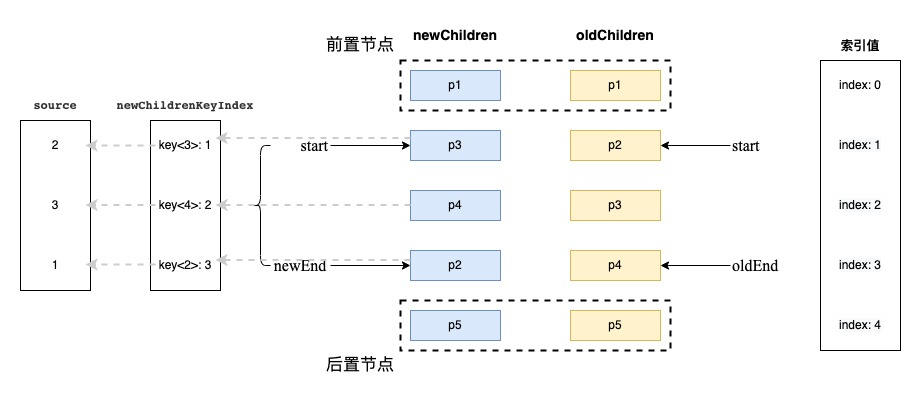
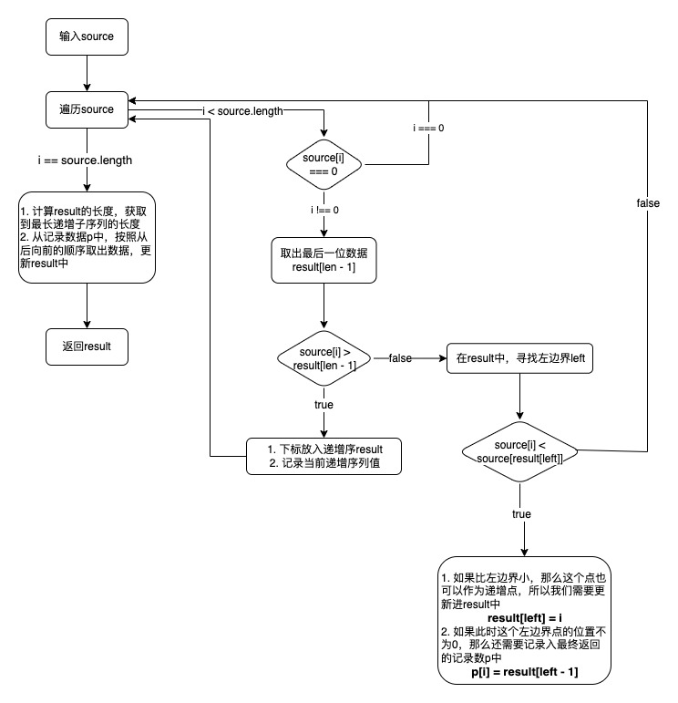
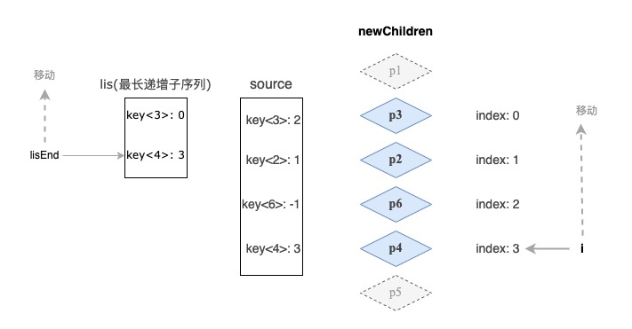

# Vue3之Diff算法学习

| 文档创建人 | 创建日期   | 文档内容          | 更新时间   |
| ---------- | ---------- | ----------------- | ---------- |
| adsionli   | 2022-07-15 | Vue3 Diff算法学习 | 2022-07-17 |

在上一篇中，整理一下关于简单`Diff`和双端`Diff`的实现思路，在这一章中，就整理一下关于快速`Diff`的设计思路。

快速`Diff`是在`vue3`中被用于替代双端`Diff`的一种新的`Diff`算法，也是参考了其他两个虚拟节点库的快速Diff的实现(`ivi`与`inferno `)。

快速`Diff`相比于双端`Diff`来说，实现起来会更加复杂一些，所以会比双端稍微难理解一些，因为步骤有一点多，而且实现的算法也要比双端来的复杂，所以下面我们就来一步一步学习快速Diff的实现，我尽量把每一个步骤都整理与描述清晰，方便自己理解也方便大家理解。

## 1. 步骤总览

为了之后好理解，先把快速Diff的实现步骤先整理一下

1. 预处理新节点组与旧节点组相同的前置节点与后置节点，加速节点处理。

2. 将预处理后的新节点组和旧节点组不相同的数据提取出来，并继续判断是否需要移动节点位置。

3. 构建新节点组剩余待处理数据的`key`与`index`映射，并构建新节点组相对于旧节点组位置记录的映射关系数组

   > 就是将新节点组属于待处理数据在旧节点组中的`index`映射入一个`sourceMap`中进行记录。
   >
   > 这里的映射关系是`newChildren.get(key).index` <=> `oldChildren.get(newChildren[i].key).index`
   >
   > 就是上面的这种关系映射。

4. 如果节点需要移动，在获取`sourceMap`的最长递增子序列，以备之后的比较使用

5. 为最长递增子序列与`sourceMap`建立类似双端`Diff`时的指针对比，不过只需要两者的尾指针即可，然后逐一比较，获取新的锚点，进行位置移动。

上面就是我们需要完成的内容，现在来看还是比较抽象，接下来我们再配合着各自流程的示意图

## 2. 具体实现

接下来我将对上面整理的步骤进行一步一步的实现，配合代码与示意图，梳理相关内容。

### 2.1 预处理

快速Diff一个加速的点就在于预处理了相同的前置节点与后置节点，因为对于相同的前置与后置节点来说，他们的相对位置实际是没有进行移动的，如果在理想情况下，节点均未进行移动，那么前置与后置节点全部相同，我们就不需要去一一对比节点移动问题，直接进行`patch`更新。甚至在更理想的情况下，新增或卸载的节点都在之前已存在相同的后置与前置节点之前，那么直接进行装载或卸载就完事了。这几种特殊的理想情况的示意图如下：


那么针对图中的三种情况，我们就可以来实现一下我们的代码。

```typescript
const quickDiff = function(newChildren: VNode[], oldChildren: VNode[], container: Node) {
    let start = 0;
    let newEnd = newChildren.length - 1;
    let oldEnd = oldChildren.length - 1;
    //README: 相同的前置节点进行更新即可，因为它们的真实Dom位置未发生改变，不需要移动
    while(newChildren[start].key === oldChildren[start].key) {
        patch(oldChildren[start], newChildren[start], container);
        //NOTE: 更新头指针的位置，进行下一位的比较
        start++;
    }
    //README: 相同的后置节点进行更新即可，因为它们的真实Dom的相对位置其实未发生改变，之后只要在它们之前进行插入即可，无需移动
    while(newChildren[newEnd].key === oldChildren[oldEnd].key) {
        patch(oldChildren[oldEnd], newChildren[newEnd], container);
        //NOTE: 更新尾部指针位置
        newEnd--;
        oldEnd--;
    }
    
    //README: 在上述前置与后置节点处理好之后，进行两种理想情况的判断
    if(newEnd > start && oldEnd >= start) {
        //README: 第一种情况，新节点组全部处理完了，但是旧节点组还存在未预计算数据，那么说明这些数据需要全部卸载
        for(let i = start; i <= oldEnd; i++) {
            unmount(oldChildren[i]);
        }
    }else if(oldEnd > start && newEnd >= start) {
        //README: 第二种情况，旧节点组内数据全部被预计算处理掉了，但是新节点组内还存在未处理数据，说明全部都是新增节点
        //NOTE: 选取合适的锚点，锚点选择的就是尾指针指向的前一个节点位置，因为用的插入为insertBefore
        let anchorIndex = newEnd + 1;
        let anchor = anchorIndex > newChildren.length ? newChildren[anchorIndex].el : null;
        for(let i = start; i <= newEnd; i++) {
            patch(null, newChildren[i], container, anchor)
        }
    }
}
```

在上段代码中，我们通过申明`start`头指针与`oldEnd`,`newEnd`两个尾指针，来控制`newChildren`与`oldChildren`的头尾比较。

> 不同尾指针是因为`newChildren`与`oldChildren`长度会存在不同，但是相同的`start`是因为都从头开始的。

然后我们再通过两次判断，处理两种理想情况，就是要么`newChildren`的原有复用节点都未删除，且新增节点位置都在固定范围内，让其旧有节点均保持了相对位置；要么`newChildren`无节点移动且无新增节点，仅仅`oldChildren`存在某个固定范围内的节点卸载，其他节点位置保持相对不变。

### 2.2 节点移动判断

当然，上面的情况实在是太特殊了，我们还需要考虑非理想情况下的处理，比如头尾节点都不相同，或者只有部分相同时的情况。那么我们就需要去判断节点是否发生移动(当然这其中还包括了新增子节点或是卸载旧节点)。

那么该如何判断节点是否移动呢？这里可以采取简单`Diff`的方法进行判断，也就是如果没有节点移动的话，它的节点排序(`key`)应该是严格递增的，但是如果存在节点移动，那么`key`一定就不再是严格递增了，所以在快速`Diff`中还是用这个特点来判断`newChildren`中是否发生了节点移动。

那么接下来就可以通过这个点，来进行判断。

```typescript
const quickDiff = function(newChildren: VNode[], oldChildren: VNode[], container: Node) {
    let start = 0;
    let newEnd = newChildren.length - 1;
    let oldEnd = oldChildren.length - 1;
    while(newChildren[start].key === oldChildren[start].key) {
       ......
    }
    while(newChildren[newEnd].key === oldChildren[oldEnd].key) {
        ......
    }
    if(newEnd > start && oldEnd >= start) {
        ......
    }else if(oldEnd > start && newEnd >= start) {
        ......
    }else {
        //NOTE: 因为只会存在两种理想情况，所以我们只需要新增一个else进入非理想即可
        /**
         * @property {boolean} move 是否需要移动
         * @property {number} newStart newChildren待处理节点开始位置
         * @property {number} oldStart oldChildren待处理节点开始位置
         * @property {number} patched 更新过的节点数量
         * @property {number} lastIndex 相当于简单Diff的lastIndex，用来记录最大的节点的位置下标，协助判断是否移动了节点
         * @property {*} newChildrenKeyIndex 用来映射key对应在newChildren中的位置下标
         * @property {number} handleCount 剩余需要处理的newChildren的节点数
         * @property {number[]} source 映射表，新节点位置映射到oldChildren上的位置记录
         */
        let move = false;
        let newStart = start;
        let oldStart = start;
        let patched = 0;
        let lastIndex = 0;
        let newChildrenKeyIndex = {};
        let handleCount = newEnd - newStart + 1;
        const source = new Array(handleCount).fill(-1);
        //README: 通过创建newChildren的key<=>index的关系，方便接下来在oldChildren中判断是否移动提供快速查找
        for(let i = 0; i < newChildren.length; i++) {
        	newChildrenKeyIndex[newChildren[i].key] = i;
        }
        for(let i = 0; i < oldChildren.length; i++){
            if(patched < handleCount) {
            	//NOTE: 通过节点的key，来获取在newChildren中的位置下标
                let k = newChildrenKeyIndex(oldChildren[i].key);
                if(typeof k !== 'undefined') {
                    //README: 如果还可以在新节点组集合中找到对应下标，说明节点还是被复用了，就得去更新一下
                    patch(oldChildren[i], newChildren[k], container);
                    //NOTE: 然后需要维护一下更新数，每更新一个，递增一个
                    patched++;
                    //NOTE: 这个source主要是为了之后节点移动的一个关键，它会记录下原可复用节点在oldChildren下的位置下标
                    source[k - newStart] = i;
                    //NOTE: 然后就是赋值一个记录位置，用于判断是否是递增序列
                    if(k < lastIndex) {
                        move = true;
                    }else {
                        lastIndex = k;
                    }
                }else {
                    //README: 如果在newChildrenKeyIndex中未找到对应的值，说明oldChildren[i]节点在新节点组中被卸载了
                    unmount(oldChildren[i]);
                }
            }else {
                //README: 如果已更新的节点数已经超过了超过了newChildren剩余待处理节点数，那么肯定就是卸载的了
                unmount(oldChildren[i]);
            }
        }
        
    }
}
```

在上面的代码中，我们通过使用了`newChildrenKeyIndex`这个映射参数，先记录下了`newChildren`下节点`key`对应的位置下标`index`信息，协助判断节点是否移动。

同时在`oldChildren`遍历中获取到可复用`node`在`newChildren`的位置下标时，进一步判断`oldChildren`中的节点是否被卸载，因为如果`oldChildren`中的节点在`newChildrenKeyIndex`不存在映射值的时候，会返回`undefined`，这样就很容易直到这个节点是否被卸载了。

在代码还设置了一个`patched`参数，这个参数的作用也很有用，如果新节点组中的待处理节点(可复用的)都被处理完了，但是`oldChildren`中仍然存在未处理完成的节点时，那么说明**`oldChildren`中剩下的节点都是需要被卸载的，因为`newChildren`中需要处理的节点都处理完了。**通过这个特性，我们又可以进行节点的卸载判断了。

最后还有一个重要的`source`参数，这个参数主要需要记录`newChildren`待处理数据在`oldChildren`中的对应位置，这是为了后面节点移动做准备的，我们这里就先不具体展开说明这个参数的作用了，只要知道它记录了可复用节点在`oldChildren`中的位置。

到了这里，我们**已经可以判断出是否存在需要移动的节点了，并且我们彻底将需要卸载的节点全部卸载完成**了，之后**只需要处理需要移动以及新增的节点**就完事了。

> 最终构建出来的结构如下图所示:
>
> 

### 2.3 节点移动

在判断节点是否进行移动之后,我们就需要处理需要移动的节点了,这个时候就需要用到我们之前准备好的`source`这个数组啦。

`source`数组主要有以下两个作用：

1. 通过`source`数组构建出最长递增子序列，来作为锚点选定点，方便`newChildren`中需要移动的节点选中锚点。
2. 在`source`数组中填充了-1的节点，说明是新增节点，那么就需要进行挂载操作。

在**1**中有提到需要构建一个最长递增子序列，那么为啥要构造最长递增子序列呢？

1. 最长递增子序列中的子节点，是按照递增顺序进行排列的，说明他们还是按照`oldChildren`节点顺序来的，所以他们的位置相对固定，依然是前后关系不便，所以不进行位置更新。

   > 就和之前lastIndex判断是否移动的原理是一样的

2. 最长递增子序列的构建完成之后，可以减少节点移动次数，加快节点移动速度。

上面就是完成最长递增子序列构建的2点好处。

> 注：这里构建的最长递增子序列可以是不连续的。

#### 2.3.1 最长递增子序列

既然知道了最长递增子序列可以带来的好处，那么就可以代码，先来实现一下最长递增子序列构建。具体代码如下：

```typescript
const generateLongestSubsequence = function (source: number[]) {
    let len = source.length;
    //NOTE: p元素的作用就是用来记录最长递增子序列的数据的
    const p = new Array(len).fill(-1);
    /**
     * @property {number[]} result 最终返回的最长递增子序列下标位置集合
     */
    const result = [0];
    let left, right, mid;
    let j;
    for (let i = 0; i < len; i++) {
        const targetIndex = source[i];
        if (targetIndex !== 0) {
            j = result[result.length - 1];
            //NOTE: 判断对比点的大小是否比原位置点的大，如果大的话，说明是递增点，直接放入result，注意，这里放的是下标
            if (source[j] > targetIndex) {
                //NOTE: 这里需要记录一下当前目标点的后一位递增子节点的下标，赋值到复制的那个数组上
                p[j] = i;
                result.push(i);
                continue;
            }
            //NOTE: 如果不是递增的，那么就需要去寻找前置的，小于当前位置的值，也就是使用寻找左边界的二分查找
            left = 0;
            right = result.length - 1;
            //NOTE: 因为result中存的是递增序列且是source的下标值，所以我们通过source[result[mid]]取到对应位置
            //README: 通过二分查找，找我们当前位置j在result中的对应位置，是否可以形成递增序列
            while (left < right) {
                let mid = (left + right) / 2 || 0;
                if (source[result[mid]] < targetIndex) {
                    left = mid + 1;
                } else {
                    right = mid;
                }
            }
            //NOTE: 根据左边界进行判断，下标是否大于目标节点位置的值，如果大于，说明可以形成递增序列
            if (targetIndex < source[result[left]]) {
                //NOTE: 判断left是否是>0的节点，如果是的话，我们需要更新一下p中对应i下的值，以便保存递增子序列的下标记录
                if (left > 0) {
                    p[i] = result[left - 1];
                }
                //README: 同时我们还需去更新一下result对应left下标的值的索引为当前i
                //NOTE: 因为只需要返回一组递增子序列的情况，所以可以直接更新
                result[left] = i;
            }
        }
    }
    //最后我们需要把记录在p数组中的对应result长度的递增子序列的下标取出来，放入result中进行返回
    let pointer = result.length;
    let recordIndex = result[pointer - 1];
    while (pointer-- > 0) {
        result[pointer] = recordIndex;
        recordIndex = p[pointer];
    }
    //NOTE: 本方法，实际用的就是贪心+二分的形式，获取最长递增子序列
    return result;
}
```

上面的这段代码就是`vue3`中用来实现最长递增子序列获取的代码，当然我这里为了方便理解，把相关的变量名进行了修改，这样更加方便理解，现在就来稍微解释一下，配合着代码中已经写好的注释。

**步骤说明**



1. 遍历source数组，然后判断当前下标是否为0，如果是0的话，不执行，进入下一步

2. 获取当前`result`最后一位的下标值，这个值是**当前递增序列的最大值**，然后进行大小的判断

   > 此时的result存放的数据只是暂时的，真正的返回数据都存放在`p`中

   1. 如果大于最大值，就很好处理，直接放入到`result`数组中，并且将其记录在对应`p`数组的对应位置下。

   2. 如果不大于最大值的话，就在`result`中进行查找，因为`result`是一个递增序列，所以很自然的就是使用二分查找，且需要查找的是左边界

      > 这里二分用左边界查找也很好理解，因为我们需要查找最长递增子序列，那么我们需要找到最靠近的比当前节点位置小的那个节点位置，所以要找的是就是左边界

   3. 当我们寻找到对应的左边界`left`后，需要与当前的`targetIndex`进行比较，如果大于，说明可以形成递增序列，那么就可以将当前值进行替换。

      > 这里需要处理`p`的数据，但是需要判断`left`是否`>0`，因为如果`left == 0`，就会推翻之前的全部，所以是不可行的。但是如果是更新在result这个临时的数据中时，是可以的，因为不会影响到最终返回的结果。

3. 当循环处理完之后，我们就需要得出最终需要返回的递增序列的长度，也就是通过这个`result`的数组长度进行得出。然后再通过保存真实返回节点数据下标值的`p`数组进行获取。

实际上就是一种贪心+二分的处理方式，也可以用dp来进行书写。不过贪心+二分会更快点

> 因为这个，我去刷了5道关于最长子序列的各种问题的dp题目😂

#### 2.3.2 节点移动

当我们构建完了最长递增子序列后，我们就可以来进行最终的节点移动了，为了方便理解，先将其原理图放出来，大家可以先有个初步的认识。



> 这里多设置了一个p6节点，展示新增情况

通过图我们可以看到，我们通过之前构建的最长递增子序列和映射表设置尾指针，一步一步处理，且其中主要分成3种情况

1. `lis[lisEnd] == source[i]`

   如果当前最长递增子序列数组的下标值等于在`oldChildren`中映射的节点位置时，说明当前位置相对于原先的位置来说并没有进行移动，所以我们只需要移动最长递增子序列数组的尾指针即可，无需进行位置更新。

2. `source[i] === -1`

   如果当前下标在`oldChildren`中的映射为-1，那么说明当前节点为新增，所以我们需要进行`patch`操作而不是`insert`

3. `source[i] !== lis[lisEnd]`

   如果当前最长递增子序列数组的下标值不等于在`oldChildren`中映射的节点位置时，说明当前节点相对于原来的位置发生了移动，那么我们就需要进行`inseet`操作来将其挂载到对应的节点上。

根据上面的三种状态就可以来编写我们的实现代码啦

```typescript
if (move) {
    //NOTE: 获取到最长递增子序列之后，按照双指针进行循环
    let lis = generateLongestSubsequence(source);
    //README: lisEnd作为lis最长递增子序列的尾部指针，用来处理需要处理的位置
    let lisEnd = lis.length - 1;
    //README: 这里要处理的数据的长度，就是之前获取到的handleCount的长度
    for (let i = handleCount - 1; i >= 0; i--) {
        //NOTE: 等于-1说明是新增的节点
        if (source[i] == -1) {
            //NOTE:这里Pos要加上newStart是因为这里的开始位置是从newStart位置开始的，实际位置在newChildren中是i+newStart
            const pos = i + newStart;
            const newVNode = newChildren[pos];
            //NOTE: 这里获取nextPos，是因为Insert中用的Node.prototype.insertBefore这个方法
            const nextPos = pos + 1;
            const anchor = nextPos < newChildren.length ? newChildren[nextPos] : null;
            //NOTE: 因为是新增的节点，所以只需要挂载即可
            this.patch(null, newVNode, container, anchor)
        } else if (i !== lis[lisEnd]) {
            const pos = i + newStart;
            const newVNode = newChildren[pos];
            const nextPos = pos + 1;
            const anchor = nextPos < newChildren.length ? newChildren[nextPos] : null;
            //NOTE: 只需要更新位置即可，之前已经patch更新过了
            this.insert(newVNode, container, anchor)
        } else {
            //NOTE: 位置没有改变的话，尾指针位置更新
            lisEnd--;
        }
    }
}
```

这样，我们就完成了快速Diff的全部代码编写啦，最后再把完整的代码放在一起，方便大家进行查看

```typescript
const generateLongestSubsequence = function (source: number[]) {
    let len = source.length;
    const p = source.slice();
    const result = [0];
    let left, right, mid;
    let j;
    for (let i = 0; i < len; i++) {
        const targetIndex = source[i];
        if (targetIndex !== 0) {
            j = result[result.length - 1];
            if (source[j] > targetIndex) {
                p[j] = i;
                result.push(i);
                continue;
            }
            left = 0;
            right = result.length - 1;
            while (left < right) {
                let mid = (left + right) / 2 || 0;
                if (source[result[mid]] < targetIndex) {
                    left = mid + 1;
                } else {
                    right = mid;
                }
            }
            if (targetIndex < source[result[left]]) {
                if (left > 0) {
                    p[i] = result[left - 1];
                }
                result[left] = i;
            }
        }
    }
    let pointer = result.length;
    let recordIndex = result[pointer - 1];
    while (pointer-- > 0) {
        result[pointer] = recordIndex;
        recordIndex = p[pointer];
    }
    return result;
}

const quickDiff = function (newChildren: VNode[], oldChildren: VNode[], container: Node) {
    let j = 0;
    let newEnd = newChildren.length - 1;
    let oldEnd = oldChildren.length - 1;
    while (newChildren[j].key === oldChildren[j].key) {
        this.patch(oldChildren[j], newChildren[j], container);

        j++;
    }
    while (newChildren[newEnd].key === oldChildren[oldEnd].key) {
        this.patch(oldChildren[j], newChildren[j], container);

        newEnd--;
        oldEnd--;
    }
    if (newEnd < j && oldEnd >= j) {
        for (let i = j; i <= oldEnd; i++) {
            this.unmount(oldChildren[i]);
        }
    } else if (newEnd >= j && oldEnd < j) {
        let anchorIndex = newEnd + 1;
        let anchor = anchorIndex < newChildren.length ? newChildren[anchorIndex].el : null;
        for (let i = j; i <= newEnd; i++) {
            this.patch(null, newChildren[i], container, anchor);
        }
    } else {
        let move = false;
        const handleCount = newEnd - j + 1;
        const source = new Array(handleCount).fill(-1);
        const oldStart = j;
        const newStart = j;

        let patched = 0;
        let pos = 0
        let newChildrenKeyIndex = {}
        for (let i = 0; i < newChildren.length; i++) {
            newChildrenKeyIndex[newChildren[i].key] = i;
        }
        for (let i = 0; i < oldChildren.length; i++) {
            let oldNode = oldChildren[i];
            if (patched < handleCount) {
                let k = newChildrenKeyIndex[oldNode.key];
                if (typeof k !== 'undefined') {
                    let newNode = newChildren[k];
                    this.patch(oldNode, newNode, container);
                    patched++;
                    source[k - newStart] = i;
                    if (k < pos) {
                        move = true;
                    } else {
                        pos = k;
                    }
                } else {
                    this.unmount(oldNode);
                }
            } else {
                this.unmount(oldNode);
            }
        }

        if (move) {
            let lis = generateLongestSubsequence(source);
            let lisEnd = lis.length - 1;
            for (let i = handleCount - 1; i >= 0; i--) {
                if (source[i] == -1) {
                    const pos = i + newStart;
                    const newVNode = newChildren[pos];
                    const nextPos = pos + 1;
                    const anchor = nextPos < newChildren.length ? newChildren[nextPos] : null;
                    this.patch(null, newVNode, container, anchor)
                } else if (i !== lis[lisEnd]) {
                    const pos = i + newStart;
                    const newVNode = newChildren[pos];
                    const nextPos = pos + 1;
                    const anchor = nextPos < newChildren.length ? newChildren[nextPos] : null;
                    this.insert(newVNode, container, anchor)
                } else {
                    lisEnd--;
                }
            }
        }
    }
}
```

## 结束语

快速Diff的设计十分的巧妙，使用相关的预处理技术，来减少节点的移动次数，无论是一开始的前置节点与后置节点的比较还是之后的最长递增子序列的使用，其实都可以看做是预计算，不过在这些预结算处理中，穿插解决了节点卸载与添加。这比起之前的双端`Diff`进行每一个节点比较移动来说确实优化了不少。这里属实看出了算法的重要性，所以刷题还是有必要的😂。

如果想要很好地掌握好快速Diff，一定要其中几个点：**前置与后置预处理，最长递增子序列，节点移动**。这三个点掌握后，基本就可以自己从头到尾撸出来了，而且在自己开发的时候，也可以在很多地方使用类似的思想去解决。加油加油加油ヾ(◍°∇°◍)ﾉﾞ。