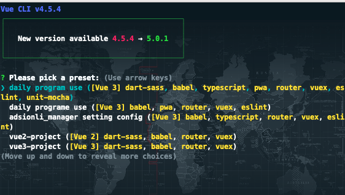
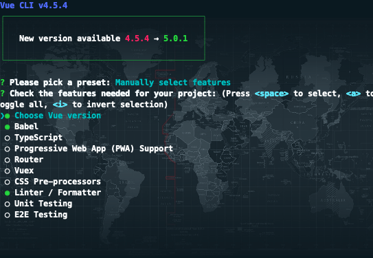
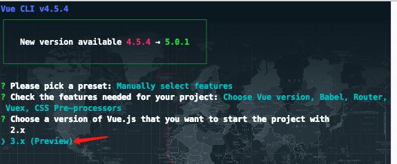
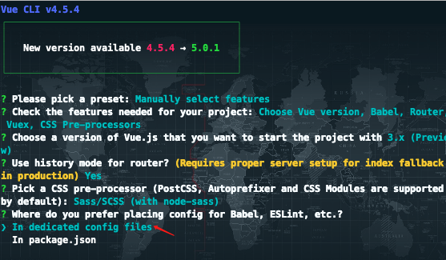
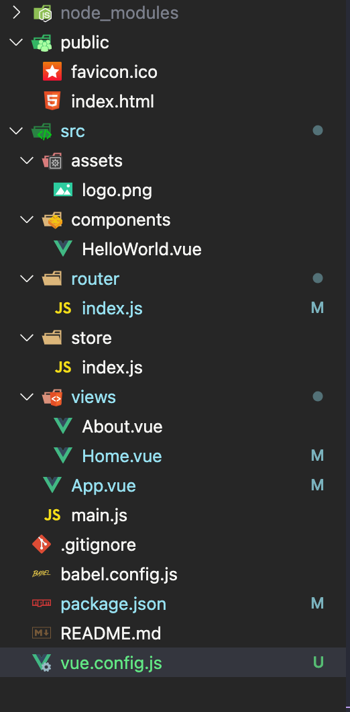
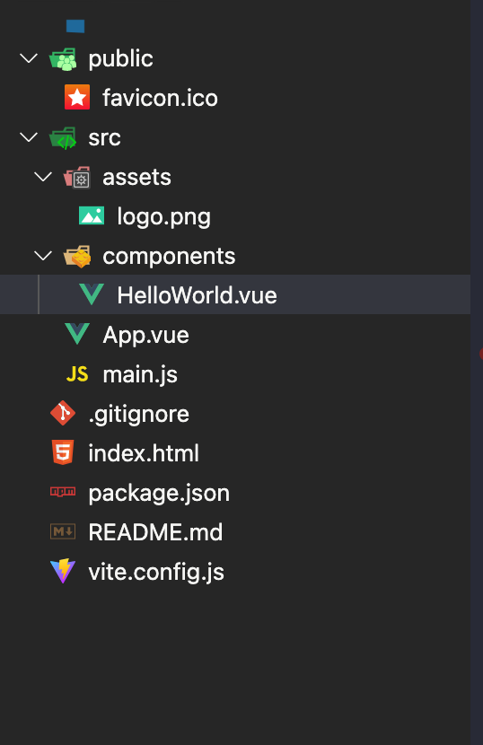

# vue3的学习-01

| 文档创建人 | 创建日期   | 文档内容          | 更新时间   |
| ---------- | ---------- | ----------------- | ---------- |
| adsionli   | 2022-02-23 | vue3的学习使用-01 | 2022-02-23 |

大概使用vue2开发了有3-4年了，从本科到了研究生，最近看到尤大说将要把vue3作为默认版本了，就想着需要开始正式学习一下vue3，来体会一下vue3与vue2之间不同之处。

## 1. 创建vue3项目

vue3项目现在可以通过两种方式来创建，一种就是通过vue-cli(使用webpack)创建，还有一种就是使用vue3中新增的vite来进行创建。vite用于创建项目的速度是非常快的，它的构建速度大概是vue-cli的10倍以上，因为其原生 ES 模块导入方式，可以实现闪电般的冷服务器启动。接下来就稍微说一下该如何使用这两种不同方式进行部署。

### 1.1 使用vue-cli来构建

vue-cli来创建可以说是很熟悉了，首先我们需要在自己的电脑上安装相对应的环境才可以，可以直接参考官网给出的例子：[vue-cli环境的安装](https://cli.vuejs.org/zh/guide/installation.html)，安装好环境之后，就可以正式的开始

1. 首先在终端中输入指令`vue create you-project-name`，完成之后就可以开始选择需要的配置。

   

2. 我们可以选择之前创建过的项目配置，也可以重新进行配置，我们这里就重新就行配置，然后来到以下界面:

   

3. 这里我们就可以选择自己需要配置的内容，这里需要选择`choose Vue version`，这样才可以在后面选择vue3版本进行创建，当然这里的选择可以根据个人喜好进行配置，一般我会把`Vuex，Router，Css Pre-processors，Babel`选上，后面就不需要自己手动配置了。

   

4. 如果选择了`Router`的话，这时会询问你是否开启`History`模式，可以根据自己需要进行选择。

5. 如果选择了`Css Pre-processors`，这里就会询问你导入哪一个Css库，一般我选择的是`Sass/SCSS (with node-sass)`。

6. 这一步会让你选择将配置文件是单独写成文件，还是全部配置在package.json，为了能够单独配置的话，一般我推荐选择第一个。

   

7. 最后就是问你是否需要保存当前的配置，如果想要之后继续使用的话，这里可以输入y，然后在输入配置名称，然后下次就可以直接使用，无需重复配置啦。

8. 到这里就已经结束啦，可以开始使用vue-cli进行vue3的开发啦！

### 1.2 使用vite来创建

vite创建项目十分的简单，具体步骤如下:

1. 打开终端，在终端输入`npm init vite@latest my-vue-app --template vue`

   > 这里需要注意一下，不同的npm版本输入的内容不同，如果使用不同的工具的话，也略有不同:
   >
   > ```shell
   > # npm 6.x
   > npm init vite@latest my-vue-app --template vue
   > 
   > # npm 7+, 需要额外的双横线：
   > npm init vite@latest my-vue-app -- --template vue
   > 
   > # yarn
   > yarn create vite my-vue-app --template vue
   > 
   > # pnpm
   > pnpm create vite my-vue-app -- --template vue
   > ```

2. 完事了，确实一步就完事了，后面就是自己引入自己需要的模块啦。


对比一下vue-cli和vite两种安装方式，可以选择自己喜欢的方式，不过vite的话现在对于旧版本的浏览器的支持不是特别好，必须使用浏览器版本比较高的才可以，所以为了兼容性的话，最好还是先选用vue-cli，等到之后支持好了之后在选择。

同时如果选择了vite作为项目构建的话，且使用的是vsCode作为开发工具的话，可以选择使用volar这个插件，他对vite的支持非常的好。不过在使用volar的时候，如果之前有装过vetur的话，需要先将其禁用掉，否则会造成冲突。

### 1.3 目录结构

1. 首先是vue-cli下的目录结构：

   

   其实和之前也没有太多的变化，还是和之前是差不多的

2. 接着是vite下的目录结构：

   

   vite的目录结构和vue-cli结构是类似的，不过这里就会多出来一个vite.config.js而不再是vue.config.js了，这里就稍微有一些不同。

## 总结

这一章只是一个入门，首先我们要有一个简单的开始，如果入门太难了的话，就会放弃学习下去了.......所以我们就先从项目创建开始，加油ヾ(◍°∇°◍)ﾉﾞ！
