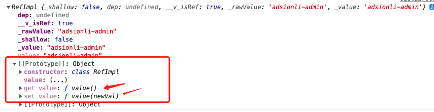

# vue3的学习-02

| 文档创建人 | 创建日期   | 文档内容          | 更新时间   |
| ---------- | ---------- | ----------------- | ---------- |
| adsionli   | 2022-02-25 | vue3的学习使用-02 | 2022-02-25 |

这一章主要学习的是vue3中新增的`setup`组合式API，以及reactive及ref使用及细节问题的学习。

## 1. setup

为了开始使用组合式 API，首先需要一个可以实际使用它的地方。在 Vue 组件中，我们将此位置称为 `setup`。`setup` 是一个组件选项，所以像别的组件选项一样，写在组件导出的对象里。

那么通过vue官方给出的这句解释，我们就可以知道setup就是我们用来实现组合式api的地方。

接下来整理一下setup在官网中给出的内容，这样提炼一下更加方便理解。

### 1.1 setup的执行

1. `setup`是在`beforeCreate`生命周期回调之前进行调用的。
2. `setup`中的`this`指针是`undefined`的，这是因为`setup`在`beforeCreate`之前调用的话，组件还没有进行实例化，这样的话就没有上下文对象了。所以这就造成`setup`不能通过`this`去调用data/computed/methods/props中的相关内容了

### 1.2 setup的返回值

1. `setup`的返回值是一个对象，内部的属性和方法都可以提供给`html`模板使用。
2. `setup`中的对象内部的属性和data函数中的return对象的属性都可以在`html`模板使用。
3. `setup`中的对象中的属性和data函数中的对象中的属性会合并成为组件对象中的属性。
4. `setup`中的对象中的方法和methods对象中的函数方法会合并成为组件对象的方法
5. 在Vue3中尽量不要混合的使用`data`和`setup`及`methods`和`setup`。(就是实现一个就可以了)
6. `setup`不能是一个`async`函数：因为返回值不再是`return`的对象，而是变成了一个`Promise`了，模板就无法使用到`return`对象中的属性数据了

### 1.3 setup的参数

1. `setup(props, context)/ setup(props, {attrs, slots, emit, expose})`。(支持解构)
2. props: 父级组件传递给子级组件的参数。
3. attrs: 父级组件直接在标签中传给子级组件的内容，可以通过attrs来获取，等于this.$attrs。
4. slots: 父级组件中使用插槽的内容。
5. emit: 父级组件传递给子级组件的分发自定义事件函数，等于this.$emit。
6. expose: 可以获取到父组件的prototype，也就是父级组件的原型


## 2. reactive和ref

reactive和ref均是在组合式API中被用于声明响应性的API，但是reactive和ref的适用是不一样的，一个作用于对象，一个使作用于基本类型的数据。

### 2.1 reactive和ref之间的联系

1. ref也可以接收对象作为参数，但是在接收了对象参数之后，vue会自动将其转换成使用reactive来处理对象参数。

   ```js
   import { defineComponent } from 'vue'
   import { Options, Vue, setup } from 'vue-class-component'
   @Options({
       components: {
           toolbar,
           left,
           bottom,
       },
   })
   export default class App extends Vue {
       setup() {
           const data:object = {
               name: "adsionli",
               age: 26,
               wife: {
                   name: "shirley"
               }
           }
           const msg:string = ref("adsionli-admin");
           const msg02:any = ref(data);
           const msg03:any = reactive(data);  
           console.log(msg02)
           console.log(msg03)
           return {
               msg,
               msg02,
               msg03
           }
       }
   }
   ```

   我们可以看一下输出：

   

   可以看到，ref中参数为对象时，会将value处理成为Proxy对象，也就是还是使用了reactive去实现了

2. ref内部的实现是通过给value属性添加getter和setter来实现对数据的劫持。

   

3. reactive内部通过Proxy来实现对对象内部所有数据的劫持，并通过Reflect操作对象内部的数据

4. ref在js中需要通过value来获取到，但是在模板中则不需要，因为解析时会自动添加上.value。


## 总结

这一讲内容不是很多，主要就是来了解一下vue3中的组合式api的使用，以及相关的内容的细节上的理解，setup、ref、reactive真的是很重要的，还是希望大家可以熟练的使用和掌握，加油ヾ(◍°∇°◍)ﾉﾞ！