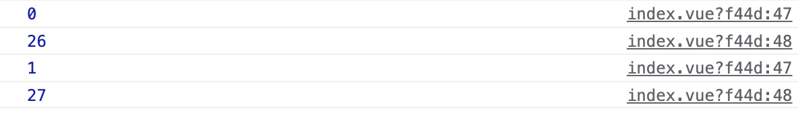

# vue3的学习-03

| 文档创建人 | 创建日期   | 文档内容          | 更新时间   |
| ---------- | ---------- | ----------------- | ---------- |
| adsionli   | 2022-02-26 | vue3的学习使用-03 | 2022-02-26 |

通过一步一步的学习，现在就开始学习一下在vue3中的`watch`与`computed`，相信大家在vue2已经使用的非常熟练了，监听和计算属性可以说是用的非常多的两个了，但是在vue3中与`setup`结合使用时，就会发生一些变化，让我们一起学习一下。

## 1. watch

`watch` API 完全等同于组件侦听器property。`watch` 需要侦听特定的数据源，并在回调函数中执行副作用。默认情况下，它也是惰性的，即只有当被侦听的源发生变化时才执行回调。

### 1.1 单个数据源监听

我们可以像vue2中在vue3中声明watch的方式进行书写，也可以使用新的响应式的代码进行书写，比如下段代码:

```js
setup() {
    const msg01 = ref('adsionli')
    watch(msg01, (oldV: string, newV: string) => {
        console.log('name is change watch:', oldV, newV)
    })
    const changeName = function () {
        console.log('changeName')
        msg01.value += 'shirley'
    }
    return {
        msg01,
        changeName,
    }
}
```

这里让我们执行一下changeName函数，然后来看一下watch的工作。


我们会发现监听器已经开始工作，上面这个监听器就是一个最简单的单个数据源的监听。是不是发现这里的watch和我们以前的写法稍稍有点不同，但是这个实现的效果还是一样的。

假如我们现在要监听一个对象该怎么写这个监听器呢，具体代码如下：

```js
setup() {
    const msg01 = reactive({
        name: 'adsionli',
    })

    watch(() => msg01.name, (oldV: string, newV: string) => {
        console.log('name is change watch:', oldV, newV)
    })
    const changeName = function () {
        console.log('changeName')
        msg01.name += 'shirley'
    }
    return {
        msg01,
        changeName,
    }
}
```

上面这个也还是一个单个数据源的监听，因为我们依然只是监听了对象中的一个属性。我们还会发现这个监听的写法与ref声明的响应式数据有所不同了，这里使用了箭头函数的返回了msg01的name属性，如果直接传入的是msg01.name的话，会提示报错。

### 1.2 多数据源监听

既然有单数据源的监听，那么就一定会有多数据源的监听，多数据源监听，顾名思义就是一次性监听多个数据，那么该怎么写呢，可以看一下下面这段代码:

```js
setup() {
    const msg = reactive({
        name: 'adsionli',
        age: 26,
        wife: {
            name: 'shirley',
            age: 26,
        },
    })
    watch(
        [() => msg.name, () => msg.age, () => msg.wife],
        (oldV, newV) => {
            info.value = newV[0] + '  ' + newV[1]
        },
        { deep: true }
    )
    const info = ref('')
    const changeInfo = () => {
        msg.name += ' love shirley'
        msg.age += 1
        
    }
    const changeWifeInfo = () => {
        msg.wife.name += ' love adsionli'
        msg.wife.age += 1
    }
    return {
        changeWifeInfo,
        changeInfo,
        info,
        msg,
    }
}
```

我们这里同时监听msg对象的`name,age,wife`这个属性，我们可以看到，如果是多个数据源监听的话，我们的第一个参数就可以传一个数组，同时将需要监听的数据写进去，我这里设置了两个方法，分别是设置外层信息，以及修改内层`wife`的信息，可以看看触发之后控制台输出:


上面两幅图分别是控制台的输出，还有就是页面的变化。我们可以看到我们的监听生效了，但是这里还有一个值得注意的地方，就是你会发现我在watch方法中传入了第三个参数，是一个对象，里面有一个`deep:true`，这个意思是什么呢？**设置`deep：true`是为了能够监听到对象的深层次的变化，比如说我们只是监听了wife，但是没有去监听里面的`wife.name`以及`wife.age`，那么当这两个属性发生改变，且没有设置deep时，就无法获取到监听了**。

> 尝试检查深度嵌套对象或数组中的 property 变化时，仍然需要 `deep` 选项设置为 true。
>
> 上面是vue官网给出的deep解释

其实在watch中还有一个参数就是`immediate`，这个参数是用来控制这个`watch`是否会自动触发，比如在上一段代码中，我们有一个`info`属性的获取，它是由`msg`中的`name`和`age`改变时来组成的，如果我们设置`immediate`的话，那么在首次加载的时候，就会触发一次`watch`，来给这个`info`就可以赋值。

通过上面的两种监听方式，我们可以发现这个watch还是和以前的差不多，但是新增了一些内容而且写法略有不同了。

同时`watch`在没有配置`immediate`的时候，它是懒执行的。

## 2. watchEffect

> 为了根据响应式状态*自动应用*和*重新应用*副作用，我们可以使用 `watchEffect` 函数。它立即执行传入的一个函数，同时响应式追踪其依赖，并在其依赖变更时重新运行该函数。
>
> vue官网的解释。

> 对于官网的解释中的副作用属实理解不了，去查了一下，看到这个还是挺好的，记录一下:
>
> 一个函数运行后产生了可以影响其外部或可以看到的效果，就叫副作用，比如console.log，document. Body. Append，alert再或者是showModel（在页面中展示一个弹层），或者window.open打开一个新窗口。
>
> 哪些函数没有副作用呢，只用来计算结果的函数，比如Math.max，JSON.parse，它们的运行除了返回结果外不会有其它效果，这就叫不产生副作用。
>
> 基本上可以简化的理解为副作用就是执行某种操作，无副作用就是执行某种计算。
>
> 这里watchEffect的意思就是在观察（watch）到变化后执行一些操作（effect）。

watchEffect是vue3中才新增的内容，在vue2时候是没有的。看一下下段代码:

```js
const count = ref(0)
const msg = reactive({
    name: 'adsionli',
    age: 26,
    wife: {
        name: 'shirley',
        age: 26,
    },
})
watchEffect(() => {
    console.log(count.value);
    console.log(msg.age)
})
// -> logs 0

setTimeout(() => {
    count.value++;
    msg.age++;
    // -> logs 1
}, 100)
```



可以看到，它会将**应式状态**自动应用**和**重新应用**副作用**进行捕获，并且监听。


## 3. computed