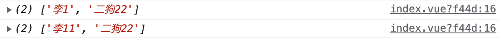

# vue3的学习-03

| 文档创建人 | 创建日期   | 文档内容          | 更新时间   |
| ---------- | ---------- | ----------------- | ---------- |
| adsionli   | 2022-02-26 | vue3的学习使用-03 | 2022-02-26 |

通过一步一步的学习，现在就开始学习一下在vue3中的`watch`与`computed`，相信大家在vue2已经使用的非常熟练了，监听和计算属性可以说是用的非常多的两个了，但是在vue3中与`setup`结合使用时，就会发生一些变化，让我们一起学习一下。

## 1. watch

`watch` API 完全等同于组件侦听器property。`watch` 需要侦听特定的数据源，并在回调函数中执行副作用。默认情况下，它也是惰性的，即只有当被侦听的源发生变化时才执行回调。

### 1.1 单个数据源监听

我们可以像vue2中在vue3中声明watch的方式进行书写，也可以使用新的响应式的代码进行书写，比如下段代码:

```js
setup() {
    const msg01 = ref('adsionli')
    watch(msg01, (oldV: string, newV: string) => {
        console.log('name is change watch:', oldV, newV)
    })
    const changeName = function () {
        console.log('changeName')
        msg01.value += 'shirley'
    }
    return {
        msg01,
        changeName,
    }
}
```

这里让我们执行一下changeName函数，然后来看一下watch的工作。


我们会发现监听器已经开始工作，上面这个监听器就是一个最简单的单个数据源的监听。是不是发现这里的watch和我们以前的写法稍稍有点不同，但是这个实现的效果还是一样的。

假如我们现在要监听一个对象该怎么写这个监听器呢，具体代码如下：

```js
setup() {
    const msg01 = reactive({
        name: 'adsionli',
    })

    watch(() => msg01.name, (oldV: string, newV: string) => {
        console.log('name is change watch:', oldV, newV)
    })
    const changeName = function () {
        console.log('changeName')
        msg01.name += 'shirley'
    }
    return {
        msg01,
        changeName,
    }
}
```

上面这个也还是一个单个数据源的监听，因为我们依然只是监听了对象中的一个属性。我们还会发现这个监听的写法与ref声明的响应式数据有所不同了，这里使用了箭头函数的返回了msg01的name属性，如果直接传入的是msg01.name的话，会提示报错。

### 1.2 多数据源监听

既然有单数据源的监听，那么就一定会有多数据源的监听，多数据源监听，顾名思义就是一次性监听多个数据，那么该怎么写呢，可以看一下下面这段代码:

```js
setup() {
    const msg = reactive({
        name: 'adsionli',
        age: 26,
        wife: {
            name: 'shirley',
            age: 26,
        },
    })
    watch(
        [() => msg.name, () => msg.age, () => msg.wife],
        (oldV, newV) => {
            info.value = newV[0] + '  ' + newV[1]
        },
        { deep: true }
    )
    const info = ref('')
    const changeInfo = () => {
        msg.name += ' love shirley'
        msg.age += 1
        
    }
    const changeWifeInfo = () => {
        msg.wife.name += ' love adsionli'
        msg.wife.age += 1
    }
    return {
        changeWifeInfo,
        changeInfo,
        info,
        msg,
    }
}
```

我们这里同时监听msg对象的`name,age,wife`这个属性，我们可以看到，如果是多个数据源监听的话，我们的第一个参数就可以传一个数组，同时将需要监听的数据写进去，我这里设置了两个方法，分别是设置外层信息，以及修改内层`wife`的信息，可以看看触发之后控制台输出:


上面两幅图分别是控制台的输出，还有就是页面的变化。我们可以看到我们的监听生效了，但是这里还有一个值得注意的地方，就是你会发现我在watch方法中传入了第三个参数，是一个对象，里面有一个`deep:true`，这个意思是什么呢？**设置`deep：true`是为了能够监听到对象的深层次的变化，比如说我们只是监听了wife，但是没有去监听里面的`wife.name`以及`wife.age`，那么当这两个属性发生改变，且没有设置deep时，就无法获取到监听了**。

> 尝试检查深度嵌套对象或数组中的 property 变化时，仍然需要 `deep` 选项设置为 true。
>
> 上面是vue官网给出的deep解释

其实在watch中还有一个参数就是`immediate`，这个参数是用来控制这个`watch`是否会自动触发，比如在上一段代码中，我们有一个`info`属性的获取，它是由`msg`中的`name`和`age`改变时来组成的，如果我们设置`immediate`的话，那么在首次加载的时候，就会触发一次`watch`，来给这个`info`就可以赋值。

通过上面的两种监听方式，我们可以发现这个watch还是和以前的差不多，但是新增了一些内容而且写法略有不同了。

同时`watch`在没有配置`immediate`的时候，它是懒执行的。

## 2. watchEffect

> 为了根据响应式状态*自动应用*和*重新应用*副作用，我们可以使用 `watchEffect` 函数。它立即执行传入的一个函数，同时响应式追踪其依赖，并在其依赖变更时重新运行该函数。
>
> vue官网的解释。

`watchEffect`是vue3中才新增的内容，在vue2时候是没有的。因为vue2到vue3的代码编程风格发生了改变，在vue2中使用的oop思想，而在vue3中则使用了FP思想，而`watchEffect`就是Vue3 就提供了一个通用的副作用钩子（hook）。正是因为编程思想的改变，是的vue3中很多操作都是写在`setup`中而不是在和vue2中那样写在一个对象中了。对于FP思想在vue3中的体现就是`setup` 里，你几乎不会用到 `this` 了；变成了让函数来调用对象或是另一个函数——就是 FP 的特点了。就像下面这段代码。

```js
import { ref, watchEffect } from "vue";

export default {
    setup() {
        const count = ref(1);
        const message = (prefix) => `${prefix} ${count.value}`;

        watchEffect(() => {
            console.log(message("Count is"));
        });
        return { count, message };
    },
};
```

上面这段代码就是一个比较典型的FP变成，函数来调用对象或是另一个函数。

> 这里不展开说纯函数与副作用相关的了，可以看一下这篇：[watchEffect](https://www.jianshu.com/p/a8fdf52d0bcf)
>
> 这里放一张纯函数与副作用的图，以供大家参考：
>
> 

接下来，我们通过`watchEffect`的ts代码来分析`watchEffect`究竟是怎么工作的。

```typescript
function watchEffect(
  effect: (onInvalidate: InvalidateCbRegistrator) => void,
  options?: WatchEffectOptions
): StopHandle;
//属性接口
interface WatchEffectOptions {
  flush?: "pre" | "post" | "sync";
  onTrack?: (event: DebuggerEvent) => void;
  onTrigger?: (event: DebuggerEvent) => void;
}
//属性接口
interface DebuggerEvent {
  effect: ReactiveEffect;
  target: any;
  type: OperationTypes;
  key: string | symbol | undefined;
}
//定义清除副作用的类型
type InvalidateCbRegistrator = (invalidate: () => void) => void;
//定义暂停监听的类型
type StopHandle = () => void;
```

接下来我们通过一个一个参数逐一分析来解读`watchEffect`:

### 2.1 effect参数

`effect`参数也是一个函数，其主要就是用来包含副作用的函数，比如官方给出的这个例子

```js
import { ref, watchEffect } from "vue";
export default {
    setup(){
        const count = ref(0);
        const effect = () => console.log(count.value);
        watchEffect(effect);
        setTimeout(() => count.value++, 1000);
        
        return { count };
    }
}
```

在这段代码里面，`effect`这个函数就是在`count`发生改变时的副作用，它会把`count`打印在控制台中输出，所以当我们把`effect`函数传入`watchEffect`的时候，他就会开启副作用的监听，在响应式元素（`count`）依赖收集阶段会运行一次 `effect` 函数；在`setTimeout`执行完成后，也会运行一次`effect`函数。

#### 2.1.1 清除副作用(OnInvalidate)

`effect`参数是一个函数而且它还有一个自己的参数就是`onInvalidate`，`OnInvalidate`也是一个函数，它的作用就是清除effect产生的副作用。

对于`OnInvalidate`的调用在官网明确指出了，它作用于异步函数，并且只有在如下两种情况下才会被调用：

1. 副作用即将重新执行时
2. 侦听器被停止 (如果在 `setup()` 或生命周期钩子函数中使用了 `watchEffect`，则在组件卸载时)

这里可以模拟一个场景，就是当我们通过一定的检索条件，向后端发起请求的时候，如果这个时候后端数据还没回传完成，我们又修改了检索条件，并且重新发起了请求，那么就可以使用`OnInvalidate`来清除上一次的异步操作，这样就不会让上一次进行下去，强制中断掉，节省无效的开支。比如下面这段代码：

```js
import { getUserInfoByName } from "./userInfo";

const name = ref("adsionli");

watchEffect((onInvalidate) => {
    const info = getUserInfoByName(name.value);
	//如果这个时候响应式数据name发生了改变，且重新发起请求，并且上一次请求未完成，我们就可以关闭上一次，清除副作用
    onInvalidate(() => {
        //执行时机：name发生改变或者监听器停止了(组件被卸载)
        info.cancel();
    });
});
```

> 这功能真好用，还可以用来实现代码的防抖，因为添加防抖功能肯定也是副作用，所以可以用`watchEffect`来实现。

#### 2.1.2  停止侦听

`watchEffect`除了可以在组件被卸载时，执行隐式卸载，也可以进行手动的主动卸载。我们可以看到在`watchEffect`的ts中，会有一个返回值`StopHandle`，这个返回值就是可以让我们去主动卸载掉watchEffect的副作用监听了。

```js
//这里直接给官网的例子，比较简洁，好理解
const stop = watchEffect(() => {
    /* 
     * ... 
     */
})

//主动释放，可以写在另外的函数中进行执行
stop();
```

### 2.2 options参数

首先我们来看一下那个定义的属性接口，我们可以看到里面有三个属性，都是非必须的，所以我们可以任意进行组合。

#### 2.2.1 flush

第一个属性flush，它的主要功能就是可以控制watchEffect在什么时候会被触发，默认是`pre`，也就是在组件更新前发生；如果要改为在组件更新后触发的话，就设置为`post`；还可以设置为`sync`，强制效果始终同步触发，不过官方不建议这样做，因为这样的实时同步触发，会造成低效，所以要避免使用。

> 从 Vue 3.2.0 开始，`watchPostEffect` 和 `watchSyncEffect` 别名也可以用来让代码意图更加明显。
>
> 也就是说在3.2开始会更加的清晰，而不需要在options中声明，会让人不好理解

#### 2.2.2 onTrack和onTrigger

`onTrack` 和 `onTrigger` 选项可用于调试侦听器的行为。

1. `onTrack` 将在响应式 property 或 ref 作为依赖项被追踪时被调用。

2. `onTrigger` 将在依赖项变更导致副作用被触发时被调用。

这两个回调函数都会接收一个包含有关所依赖项信息的调试器事件。可以看一下下面这段代码和它的执行结果：

```js
import { ref, watchEffect, reactive } from "vue";
export default {
    setup(){
        const count = ref(0)
        const msg = reactive({
            name: 'adsionli',
            age: 26,
            wife: {
                name: 'shirley',
                age: 26,
            },
        })
        watchEffect((onInvalidate) => {
            console.log(count.value);
            console.log(msg.age);
        }, {
            flush: 'post',
            onTrack(e){
                console.log(e);
                debugger;
            }
        })
        setTimeout(() => {
            count.value++;
            msg.age++;
        }, 100)
    }
}
```


> `onTrack` 和 `onTrigger` 只能在开发模式下工作。

### 2.3 watchEffect注意点

因为`watchEffect`在Vue3中使用比较频繁，所以有些需要注意的地方。

#### 2.3.1 分开使用

如果同时存在多个副作用的监听的时候，尽量分开使用，不要全部写在一个`watchEffect`中。

```js
watchEffect(() => {
    setTimeout(() => console.log(a.val + 1), 1000);
    setTimeout(() => console.log(b.val + 1), 1000);
});
```

这两个setTimeout完全无关联，可以分开进行监听。

```js
watchEffect(() => {
    setTimeout(() => console.log(a.val + 1), 1000);
});
watchEffect(() => {
    setTimeout(() => console.log(b.val + 1), 1000);
});
```

#### 2.3.2 在生命周期中进行使用 

比如你的副作用函数在首次执行时就要调用 DOM，你可以把他放在 `onMounted` 钩子里：

```javascript
onMounted(() => {
    watchEffect(() => {
        // access the DOM or template refs
    });
}
```

## 3. computed

计算属性，也是大家的老朋友了，在vue2中大量使用的一个东西，在vue3中也是做了修改和补充，不仅可以只传入get方法，也可以同时传入set方法一起进行使用了，同时还可以在开发时进行调试，传入额外的options。

### 3.1 getter

当我们只传入一个getter方法的时候，我们可以看一下最终的输出是什么样子的。

```js
import { defineComponent, computed, reactive} from "vue";
export default defineComponent({
	setup(){
        const name = reactive({
            first: "李",
            second: "二狗"
        })
        const fullName = computed(() => {
            return name.first + name.second
        })
        
        return {
            name,
            fullName
        }
    } 
});
```

我们看一下页面构造以及`computed`的输出:


我们可以看到`computed`的生效是主动的，会在一开始的时候就会触发，所以`fullName`直接赋予了李二狗。如果我们这时候修改这个fullName，还想要作用会原数据怎么办呢，这里就可以使用`computed`的`setter`了。

### 3.2 getter+setter

根据上面那段代码，我们在加上setter，来试着作用回原数据

```js
import { defineComponent, computed, reactive} from "vue";
export default defineComponent({
	setup(){
        const name = reactive({
            first: "李",
            second: "二狗"
        })
        const fullName = computed({
            get: () => name.first + "_" + name.second,
            set: (val) => {
                let data  = val.split("_");
                console.log(data);
                name.first = data[0];
                name.second = data[1];
            }
        })
        
        return {
            name,
            fullName
        }
    } 
});
```

让我们看一下控制台的输出：



再来看一下动态的操作:


### 3.3 调试

> computed的调试是在vue3.2中才推出的，所以在之前的版本里面是没有调试的

`computed` 可接受一个带有 `onTrack` 和 `onTrigger` 选项的对象作为第二个参数：

1. `onTrack` 会在某个响应式 property 或 ref 作为依赖被追踪时调用。

2. `onTrigger` 会在侦听回调被某个依赖的修改触发时调用。

所有回调都会收到一个 debugger 事件，其中包含了一些依赖相关的信息。推荐在这些回调内放置一个 `debugger` 语句以调试依赖。

> `onTrack` 和 `onTrigger` 仅在开发模式下生效。


## 小结

vue3里面的监听器和计算属性的改变真的是比较多的，如果只是通过视频进行学习的话，你根本没法理解watchEffect的真正功能是什么，只有自己去查阅资料才能理解这个是真的很好用，设计的非常得好，所以学习的时候还是要深入进行学习，不能只停留在表面，所以还望大家一起加油，共勉ヾ(◍°∇°◍)ﾉﾞ！

