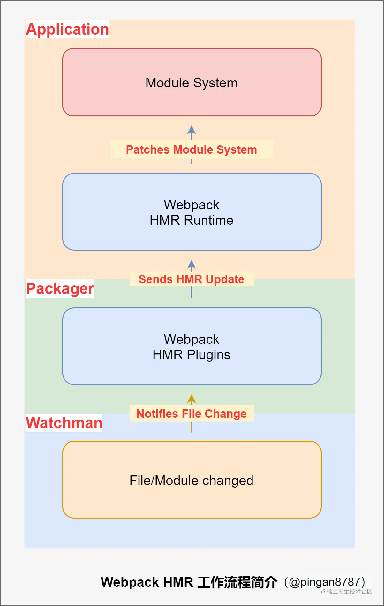
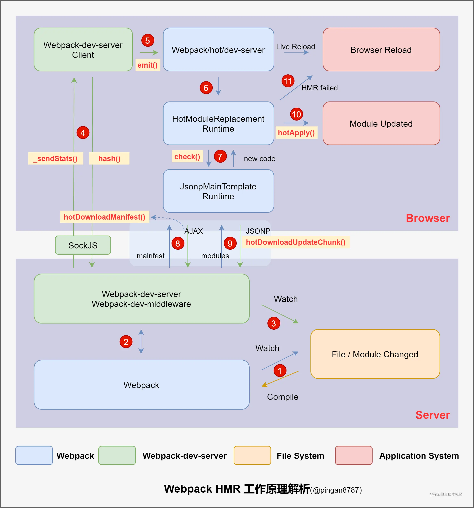

# Webpack之HMR模块学习

| 文档创建人 | 创建日期   | 文档内容    | 更新时间   |
| ---------- | ---------- | ----------- | ---------- |
| adsionli   | 2022-07-30 | HMR模块学习 | 2022-07-30 |

`webpack`中的HMR热更新模块可以说是提升开发体验必备的东西，但是之前都没怎么去理解过它的工作流程和实现，只是认为它是作为一个配置项默认配置进来的，但是我发现面经，现在已经开始问其中的原理了，正好趁着这个机会，来对其原理进行一下学习。

## HMR

HMR 全称 Hot Module Replacement，中文语境通常翻译为模块热更新，它能够在保持页面状态的情况下动态替换资源模块，提供丝滑顺畅的 Web 页面开发体验。

### HMR的使用

HMR的使用在webpack中是十分简单的，只需要通过配置相关参数，或者引入相关的loader就可以让其自己实现HMR啦

```js
module.exports = {
    // ...
    devServer: {
        // 必须设置 devServer.hot = true，启动 HMR 功能
        hot: true
    }
};
```

上面这段代码就是在webpack.config.js中进行配置，打开devServer对象下的hot属性即可启动HMR啦，但是对于js文件来说这是不够的，webpack默认是无法对js文件代码进行HMR的，需要我们自己前往js文件中进行配置，配置如下

```js
if (module.hot) {
    // Capture hot update
    module.hot.accept(path[, func])
}
```

我们可以使用`webpack`对象下的`hot`对象，使用其中的`accept`方法来告诉`webpack`我们导入的路径就是需要进行HMR的内容，同时我们还可以设置相关的`hooks`回调方法，来在HMR的时候进行执行。

对于css文件来说，在配置`style-loader`的时候，其中已经自带了HMR热更新配置了，我们就可以不用自己进行配置。对于vue或者是react项目来说，都有对应的loader(`vue-loader, react-hot-loader`)会对HMR进行配置，所以我们就可以不用太过关心啦

### HMR实现

上面的配置看起来还挺简单的呢，接下来就是原理分析咯

#### 工作流程



1. 当 Webpack（Watchman） 监听到项目中的文件/模块代码发生变化后，将变化通知 Webpack 中的构建工具（Packager）即 HMR Plugin；

   > 这里使用了webpack的监听模式，来监听静态资源的改变

2. 然后经过 HMR Plugin 处理后，将结果发送到应用程序（Application）的运行时框架（HMR Runtime）；

   > 发现内容发生了改变之后，交给`HMR Runtime`来生成增量文件，方便之后交给浏览器端进行操作。

3. 最后由 HMR Runtime 将这些发生变化的文件/模块更新（新增/删除或替换）到模块系统中。

其中，**HMR Runtime 是构建工具在编译时注入的**，通过统一的 Module ID 将编译时的文件与运行时的模块对应起来，并且对外提供一系列 API 供应用层框架（如 React）调用。

#### 完整实现

在上面我们已经知道了HMR是如何工作的，接下来就是对HMR完整实现的复现，我们就可以知道HMR究竟是怎么工作的了。



上图展示了从我们修改代码，到模块热更新完成的一个 HMR 完整工作流程，图中已用红色阿拉伯数字符号将流程标识出来。

其中有几个内容比较关键：

1. [**Webpack-dev-server**](https://link.juejin.cn?target=https%3A%2F%2Fgithub.com%2Fwebpack%2Fwebpack-dev-server) ：一个服务器插件，相当于 express 服务器，启动一个 Web 服务，只适用于开发环境；

2. [**Webpack-dev-middleware**](https://link.juejin.cn?target=https%3A%2F%2Fgithub.com%2Fwebpack%2Fwebpack-dev-middleware) ：一个 **Webpack-dev-server** 的中间件，作用简单总结为：通过`watch mode`，监听资源的变更，然后自动打包。

3. [**Webpack-hot-middleware**](https://link.juejin.cn?target=https%3A%2F%2Fgithub.com%2Fwebpack-contrib%2Fwebpack-hot-middleware) ：结合 `Webpack-dev-middleware` 使用的中间件，它可以实现浏览器的无刷新更新，也就是 HMR；

##### 监听变化，重新编译打包

首先根据 devServer 配置，使用 `npm start` 将启动 Webpack-dev-server **启动本地服务器并进入 Webpack 的 watch 模式**，然后初始化 Webpack-dev-middleware ，在 Webpack-dev-middleware 中通过调用 `startWatch()` 方法对文件系统进行 watch：

> 注意，我们是通过在`middleware`中开启监听，监听文件系统的，而不是在启动的时候就监听了，启动的时候仅仅是加载如watch模式

```js
// webpack-dev-server\bin\webpack-dev-server.js
// 1.启动本地服务器 Line 386
server = new Server(compiler, options);

// webpack-dev-server\lib\Server.js
// 2.初始化 Webpack-dev-middleware Line 109
this.middleware = webpackDevMiddleware(compiler, Object.assign({}, options, wdmOptions));

// webpack-dev-middleware\lib\Shared.js
// 3.开始 watch 文件系统 Line 171
startWatch: function() {
 //...
 // start watching
 if(!options.lazy) {
  var watching = compiler.watch(options.watchOptions, share.handleCompilerCallback);
  context.watching = watching;
 }
 //...
}
share.startWatch();
// ...
```


