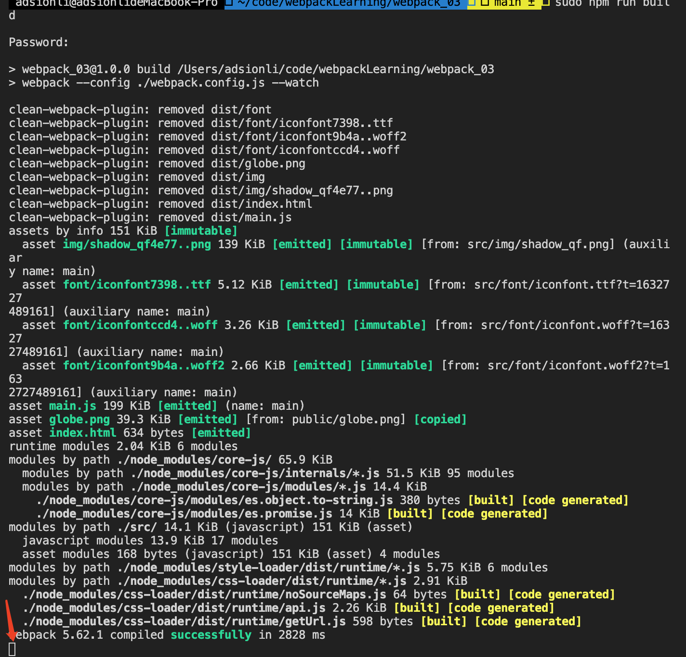

# webpack学习第三阶段

| 文档创建人 | 创建日期   | 文档内容                                       | 更新时间   |
| ---------- | ---------- | ---------------------------------------------- | ---------- |
| adsionli   | 2021-11-09 | webpack学习第三阶段-babel与webpack配置内容学习 | 2021-11-09 |

## babel的使用与babel-loader在webpack中的使用

### babel的简单介绍

babel是一个转译器，感觉相对于编译器compiler，叫转译器transpiler更准确，因为它只是把同种语言的高版本规则翻译成低版本规则，而不像编译器那样，输出的是另一种更低级的语言代码。
但是和编译器类似，babel的转译过程也分为三个阶段：**parsing、transforming、generating**，以ES6代码转译为ES5代码为例，babel转译的具体过程如下：

> ES6代码输入 -> babylon进行解析 -> 得到AST-> plugin用babel-traverse对AST树进行遍历转译 -> 得到新的AST树
>  ->用babel-generator通过AST树生成ES5代码

此外，还要注意很重要的一点就是，babel只是转译新标准引入的语法，比如ES6的箭头函数转译成ES5的函数；而**新标准引入的新的原生对象，部分原生对象新增的原型方法，新增的API等（如Proxy、Set等），这些babel是不会转译的。需要用户自行引入polyfill来解决**。

> 更多关于babel的介绍和梳理，可以看这篇文章：[深入理解Babel原理及使用](https://www.jianshu.com/p/e9b94b2d52e2)

### babel在终端中的使用

1. 首先需要安装`babel`的内核`core`，以及支持终端使用的`cli`

   ```shell
   npm install @babel/core @babel/cli -D
   ```

   这个时候已经可以使用`babel`去转换内容了，可以执行以下命令进行测试

   ```shell
   npx babel -f ./src/main.js --out-dir build
   ```

   转换执行完成后，可以在**build**目录下查看转换的文件，你会发现这个时候，`babel`是无法处理**es6+**相关的语法的，因为`babel`的使用就和`webpack`一样需要扩展插件的支持已经相关`polyfill`的配置，来读取**es5**之后出的对象信息。

2. **安装babel的插件plugin**，这里作为示例安装`@babel/plugin-transform-arrow-functions`与`@babel/plugin-transform-block-scoping`这两个插件，这两个插件的作用分别是解析箭头函数(es6的语法)，以及变量作用域的处理(es6语法, let和const的变量声明)。

   ```shell
   npm install -D @babel/plugin-transform-arrow-functions @babel/plugin-transform-block-scoping
   ```

   这个时候再来执行终端指令，让babel处理指定文件：

   ```shell
   npx babel -f ./src/main.js --out-dir build --plugins=@babel/plugin-transform-arrow-functions,@babel/plugin-transform-block-scoping
   ```

   这样处理之后，在去查看一下build目录下的内容，会发现，这个时候以及转换成功了。

   ```js
   //未处理时代码
   const title = "adsionli"
   const foo = () => {
       console.log(title)
   }
   foo()
   //处理后的代码
   var title = "adsionli";
   var foo = function foo() {
       console.log(title);
   };
   foo();
   ```

3. babel中也会提供如postcss中一样的preset-env，这样就会预装一些常用的插件，不需要自己一个一个去进行配置了

   ```shell
   npm install -D @babel/preset-env
   ```

   安装完成之后，使用preset-env的过程与使用plugin的过程有点类似，但是不太一样

   ```shell
   npx babel -f ./src/main.js --out-dir build --presets=@babel/preset-env
   ```

   执行完后查看一下build目录下的内容

   ```js
   //未处理时代码
   const title = "adsionli"
   const foo = () => {
       console.log(title)
   }
   foo()
   //处理后的代码
   'use strict'
   var title = "adsionli";
   var foo = function foo() {
       console.log(title);
   };
   foo();
   ```

4. 常用babel指令截图:

   

> 这里也只是简单说了一下babel的使用，具体详细的babel使用教程会在之后出一篇专门的博文

### babel在webpack中使用指南

1. 在项目中安装babel-loader

   ```shell
   npm install babel-loader -D
   ```

2. babel-loader就是在webpack主要被使用的内容，它就相当于babel的babel-core，不过这里是配合webpack进行使用的，它的配置就和其他的loader配置是完全相同的，只需要进行如下的配置就可以

   ```js
   {
       test: /\.js$/,
       use: [
           {
               loader: 'babel-loader'
           }
       ]
   }
   ```

   当然按照上面配置的确可以在build时候导入babel了，但是，也还是没法生效的，这里就需要导入相对应的预设或者是插件，其配置也是和之前是差不多的。

   ```js
   {
   	test: /\.js$/,
       use: [
           {
               loader: 'babel-loader',
               options: {
                   presets: [
                       'preset-env'
                   ],
                   plugins: [
                       '@babel/plugin-transform-arrow-functions',
                       '@babel/plugin-transform-block-scoping'
                   ]
               }
           }
       ]
   }
   ```

   这里就配置完成了预设和插件，当然这个preset-env的预设已经包含了现在plugins里面的两个插件了，这里为了做演示，还是放出来了。

   当然除了上述的添加babel-loader的配置方式，还可以通过在根目录创建babel.config.js(cjs, mjs, json)的形式，来进行配置。

   ```js
   module.exports = {
       presets: [
           '@babel/preset-env'
       ]
   }
   ```

   配置和在webpack.config.js文件中的配置是一样的。

3. babel-loader的转换js的适配实际上也是基于browserlistrc这个配置文件中配置的信息来的，会根据browserlist中设置的版本进行适配。同时babel-loader本身也可以配置。

   ```js
   {
       test: /\.js$/,
       use: [
           {
               loader: 'babel-loader',
               options: {
                   presets: [
                       [
                           'preset-env',
                           {
                               target: 'chrome 91'
                           }
                       ]
                   ]
               }
           }
       ]
   }
   ```

## Babel-polyfill配置

###  Babel-polyfill的作用

`polyfill`和它的名字一样，它就是对babel的一个拓展，它能够对`babel`不支持的最新的语法作出支持，比如`Promise, Symbol, Reflect`等对象，如果是用Babel的话是不被支持转译的，这个时候就可以使用`polyfill`进行支持转译，使其在各个浏览器平台中可以运行。

在`polyfill7.x`的版本中，官方推荐使用`core-js`与`regenerator-runtime`，而不再是直接导入`polyfill`了，因为直接导入`polyfill`的话，可能会造成不需要使用到的内容被打包进来，造成打包内容过多。

> 单单一个`Promise`的实现就大概需要500k的大小。

> 对core-js的一点补充
>
> `core-js`是`polyfill`、`runtime`的核心，因为`polyfill`和`runtime`其实都只是对`core-js`和`regenerator`的再封装，方便使用而已。
>  但是`polyfill`和`runtime`都是整体引入的，不能做细粒度的调整，如果我们的代码只是用到了小部分ES6而导致需要使用`polyfill`和`runtime`的话，会造成代码体积不必要的增大（`runtime`的影响较小）。所以，按需引入的需求就自然而然产生了，这个时候就得依靠`core-js`来实现了。
>
> core-js有三种使用方式：
>
> 1. 默认方式：`require('core-js')`
>     这种方式包括全部特性，标准的和非标准的
>
> 2. 库的形式： `var core = require('core-js/library')`
>     这种方式也包括全部特性，只是它不会污染全局名字空间
>
> 3. 只是`shim： require('core-js/shim')`或`var shim = require('core-js/library/shim')`
>     这种方式只包括标准特性（就是只有polyfill功能，没有扩展的特性）
>
> core-js的结构是高度模块化的，它把每个特性都组织到一个小模块里，然后再把这些小模块组合成一个大特性，层层组织。比如：
>  `core-js/es6（core-js/library/es6）`就包含了全部的ES6特性，而`core-js/es6/array（core-js/library/es6/array）`则只包含ES6的`Array`特性，而`core-js/fn/array/from（core-js/library/fn/array/from）`则只有`Array.from`这个实现。

### 项目中使用

1. 先通过`npm`导入一下`core-js`与`regenerate-runtime`的包，作为开发环境的依赖。

   ```shell
   npm install core-js regenerator-runtime -D
   ```

2. 配合`babel/preset-env`来使用我们导入的`polyfill`的包

   ```js
   module.exports = {
       presets: [
           [
               '@babel/preset-env',
               {
                   useBuiltIns: 'usage',
                   coreJs: 3
               }
           ]
       ]
   }
   ```

   > useBuiltIns参数配置，总共有三种形式:
   >
   > 1. false
   >
   >    不会使用polyfill对新对象内容进行填充，在webpack打包的时候。
   >
   > 2. entry
   >
   >    会依据配置的browserlist中的配置进行语法内容的填充，也可以通过自己的target配置项进行配置。同时需要在使用到新语法的地方导入一下代码。
   >
   >    ```js
   >    import "core-js/stable";
   >    import "regenerator-runtime/runtime";
   >    ```
   >
   > 3. usage
   >
   >    按需在打包后代码中填充我们使用到的新的语法对象内容(不回去查看browserlist中的设置或是本身配置target设置的)。

3. 如果想要屏蔽掉不需要使用polyfill的文件的时候，就需要在webpack.config.js中进行一下配置

   ```js
   {
       test: /\.js$/,
       excludes: /node_modules/,
       use: [
           'babel-loader'
       ]
   }
   ```

   这样子就可以不让第三方的包来污染babel在打包时候的填充和转译了

## copy-webpack-plugin插件的使用

1. `copy-webpack-plugin`的介绍

   `copy-webpack-plugin`是webpack中一个插件，主要的作用就是可以配置哪一些资源是不需要通过webpack打包处理，直接复制到打包后的项目目录下面的。其实这个在vue-cli框架使用webpack打包的时候就有使用到，他可以直接将public目录下的内容直接复制到打包后的目录下面，不需要经过webpack处理了。

2. 导入`copy-webpack-plugin`插件

   ```shell
   npm install -D copy-webpack-plugin
   ```

3. 在`webpack.config.js`中配置`copy-webpack-plugin`插件

   ```js
   const CopyPlugin = require('copy-webpack-plugin');
   moudle.export = {
       plugins: [
           new CopyPlugin({
               patterns: [
                   {
                       from: 'public',
                       globeOptions: {
                           ignore: [
                               '**/index.html'
                           ]
                       }
                   }
               ]
           })
       ]
   }
   ```

> 这里导入`copy`插件的时候，和其他的有一些不同，只有`CopyPlugin`就可以了
>
> 参数说明(官网给出)
>
> |                             Name                             | Type                | Default                                       | Description                                                  |
> | :----------------------------------------------------------: | :------------------ | --------------------------------------------- | ------------------------------------------------------------ |
> | [from](https://www.npmjs.com/package/copy-webpack-plugin#from) | `{String}`          | `undefined`                                   | Glob or path from where we copy files.(需要拷贝文件的来源)   |
> |  [to](https://www.npmjs.com/package/copy-webpack-plugin#to)  | `{String-Function}` | `compiler.options.output`                     | Output path.(拷贝文件的输出位置)                             |
> | [context](https://www.npmjs.com/package/copy-webpack-plugin#context) | `{String}`          | `options.context -- compiler.options.context` | A path that determines how to interpret the `from` path.(context上下文主要使用在需要copy的是一个文件而不是一个目录的时候，如果是一个文件就需要指明这个文件所在的绝对路径，在context中声明。如果是一个文件夹目录，context==from) |
> | [globOptions](https://www.npmjs.com/package/copy-webpack-plugin#globoptions) | `{Object}`          | `undefined`                                   | [Options](https://github.com/sindresorhus/globby#options) passed to the glob pattern matching library including `ignore` option.(这是一个全局匹配的参数，可以在里面设置我们需要忽略的copy文件ignore参数) |
> | [filter](https://www.npmjs.com/package/copy-webpack-plugin#filter) | `{Function}`        | `undefined`                                   | Allows to filter copied assets.(对copy的文件源进行筛选，去除掉我们不需要copy的文件，筛选条件问文件源名称) |
> | [toType](https://www.npmjs.com/package/copy-webpack-plugin#totype) | `{String}`          | `undefined`                                   | Determinate what is `to` option - directory, file or template.(声明我们需要copy的文件源的类型，是目录还是文件或者是一个模板，参数可选==dir, file, template==) |
> | [force](https://www.npmjs.com/package/copy-webpack-plugin#force) | `{Boolean}`         | `false`                                       | Overwrites files already in `compilation.assets` (usually added by other plugins/loaders).(重名文件进行覆盖) |
> | [priority](https://www.npmjs.com/package/copy-webpack-plugin#priority) | `{Number}`          | `0`                                           | Allows you to specify the copy priority.(如果有重名的文件，那么优先级越高的文件会覆盖优先级低的文件，这个就是用来设置优先级的) |
> | [transform](https://www.npmjs.com/package/copy-webpack-plugin#transform) | `{Object}`          | `undefined`                                   | Allows to modify the file contents. Enable `transform`  caching. You can use ` { transform: {cache: { key: "my-cache-key" }} }`  to invalidate the cache. |
> | [transformAll](https://www.npmjs.com/package/copy-webpack-plugin#transformAll) | `{Function}`        | `undefined`                                   | Allows you to modify the contents of multiple files and save the result to one file. |
> | [noErrorOnMissing](https://www.npmjs.com/package/copy-webpack-plugin#noerroronmissing) | `{Boolean}`         | `false`                                       | Does not generate an error on missing file(s).(如果文件发生丢失，设置为true就不会生成错误) |
> | [info](https://www.npmjs.com/package/copy-webpack-plugin#info) | `{Object-Function}` | `undefined`                                   | Allows to add assets info.                                   |
>
> 具体说明以及使用方法可以查看npm给出的Readme: [具体说明](https://www.npmjs.com/package/copy-webpack-plugin)

## webpack-dev-server初始

### 通过配置webpack的command来实现动态打包。

```js
"scripts": {
    "test": "echo \"Error: no test specified\" && exit 1",
    "build": "webpack --config ./webpack.config.js --watch"
  },
```



在红色箭头位置，我们会发现在打包结束之后，进程并没有退出，而是在继续监听，当我们修改文件后，我们会发现，它会重新打包，这样就可以是动态编译了。

> 不过使用watch来实现动态编译存在一些缺点:
>
> 1. 每一次保存都会将所有文件进行重新打包编译而不是只是修改局部的内容。
> 2. 因为拥有clean-webpack-plugin插件的原因，每一次重新打包都会进行频繁的文件读写。
>
> 如果使用的是vscode编译器的扩展live-server来作为服务器的话，再结合webpack-watch的使用也会存在一些问题:
>
> 1. 每一次重新编译后，都会刷新整个页面而不是局部的内容。
> 2. 过于耗时

那么为了解决上述的问题，webpack推出了属于自己的webpack-dev-server来解决，同时解决了watch所带来的缺点

### webpack-dev-server的使用

1. 首先肯定还是将**webpack-dev-server**引入到项目中来

   ```shell
   npm install -D webpack-dev-server
   ```

2. 我们需要在**package.json**中来新增一条命令，用来专门使用**webpack-dev-server**的使用。

   ```json
   "scripts": {
       "test": "echo \"Error: no test specified\" && exit 1",
       "build": "webpack --config ./webpack.config.js",
       "serve": "webpack serve --config ./webpack.config.js"
   }
   ```

   > 这里我们新增了一条`serve`的指令，同时使这个指令走的是`webpack serve`，使用我们自己导入的*webpack-dev-server*作为一个临时服务器，同时将打包之后的文件放入内存中，这样就可以进行快速的读写操作，加快打包速度。

   

   > 这里关于更多的webpack-dev-server的配置，就不在这里展开了，之后会专门出一篇文章来聊一下这个webpack-dev-server的详细使用及参数配置。

## webpack-dev-middleware的使用

1. webpack-dev-middleware是什么

   > 官方文档: [webpack-dev-middleware](https://www.webpackjs.com/guides/development/#%E4%BD%BF%E7%94%A8-webpack-dev-middleware)

   `webpack-dev-middleware` 是一个容器(wrapper)，它可以把 webpack 处理后的文件传递给一个服务器(server)。 `webpack-dev-server` 在内部使用了它，同时，它也可以作为一个单独的包来使用，以便进行更多自定义设置来实现更多的需求。接下来是一个 webpack-dev-middleware 配合 express server 的示例。

2. 导入webpack-dev-middleware

   ```js
   npm install --save-dev webpack-dev-middleware
   ```

3. webpack-dev-middleware工作流程(配合express这个Node框架)

   

4. webpack-dev-middleware和express service结合使用的代码

   ```js
   const express = require('express');
   const webpack = require('webpack');
   const webpackDevMiddleware = require('webpack-dev-middleware');
   
   const config = require('./webpack.config.js');
   const compiler = webpack(config);
   const app = express();
   app.use(webpackDevMiddleware(compiler));
   
   app.listen(3000, 'localhost', function(){
       console.log('listen on localhost:3000')
   })
   ```

   在去配置一下package.json中的启动指令

   ```json
   "scripts": {
       "test": "echo \"Error: no test specified\" && exit 1",
       "build": "webpack --config ./webpack.config.js",
       "serve": "webpack serve --config ./webpack.config.js",
       "start": "node serve.js"
   }
   ```

   启动node server

   ```shell
   npm run start
   ```

   

### HMR功能的使用

> HMR又叫模块热替换(Hot Module Replacement 或 HMR)是 webpack 提供的最有用的功能之一。它允许在运行时更新各种模块，而无需进行完全刷新。
>
> ***==HMR不适用于生产环境，这意味着它应当只在开发环境使用。==***


1. 配置HMR

   ```js
   module.exports = {
       mode: "development",
       //开启热更新，与dev-server有关的，都在devServer下配置options
       devServer: {
           hot: true
       }
   }
   ```

   > 这时候还不会生效webpack的HMR，因为我们的mode设置的是development(生产模式)，所以这个时候是和我们的HMR会产生冲突，这个时候就还需要一个参数的设置才可以。

   ```js
   //修改后的代码
   module.exports = {
       mode: "development",
       target: "web",
       //开启热更新，与dev-server有关的，都在devServer下配置options
       devServer: {
           hot: true
       }
   }
   ```

   > 这里仍然没有热更新，我们还需要对文件进行设置，开启热更新才可以。

2. 设置热更新配置

   ```js
   if(module.hot){
   	module.hot.accept(['./js/title.js'], function(){
           console.log('HMR执行完成')
       })   
   }
   ```

   > 这个时候热更新就可以有效的启动了，如下图所示，当我们修改了title.js的时候，页面不再会完全刷新，而是只是热更新title模块。
   >
   > 

3. 支持通过webpack-dev-middleware与express-server来完成热更新（这里还需要导入webpack-hot-middleware才可以）

   ```js
   //在webpack.config.js中导入插件,这里有一个坑，NamedModulesPlugin已经被废弃了，但是官网文档没有更新，这里需要配置新的参数
   const path = require('path')
   const { CleanWebpackPlugin } = require('clean-webpack-plugin');
   const HtmlWebpackPlugin = require('html-webpack-plugin')
   const { DefinePlugin } = require('webpack')
   const CopyPlugin = require('copy-webpack-plugin')
   const webpack = require('webpack')
   const HotMiddleWareConfig = 'webpack-hot-middleware/client?path=/__webpack_hmr&timeout=20000'
   
   module.exports = {
       context: __dirname,
       entry: [
           // 添加一个和HotMiddleWare通信的客户端
           HotMiddleWareConfig,
           // 添加web应用入口文件
           './src/index.js'
       ],
       output: {
           path: path.resolve(__dirname, 'dist'),
           publicPath: '/',
           filename: 'index.js',
       },
       devtool: '#source-map',
       optimization: {
           moduleIds: 'named'
       },
       module: {
           rules: [
               {
                   test: /\.css$/,
                   use: [
                       'style-loader',
                       {
                           loader: 'css-loader',
                           options: {
                               importLoaders: 1,
                               esModule: false
                           }
                       },
                       'postcss-loader'
                   ]
               },
               {
                   test: /\.scss$/,
                   use: [
                       'style-loader',
                       {
                           loader: 'css-loader',
                           options: {
                               importLoaders: 1,
                               esModule: false
                           }
                       },
                       'postcss-loader',
                       'sass-loader'
                   ]
               },
               {
                   test: /\.(jpe?g|git|png|svg)$/,
                   type: 'asset',
                   generator: {
                       filename: 'img/[name][hash:4].[ext]'
                   },
                   parser: {
                       dataUrlCondition: {
                           maxSize: 30 * 1024
                       }
                   }
               },
               {
                   test: /\.(ttf|woff2?)$/,
                   type: 'asset/resource',
                   generator: {
                       filename: 'font/[name][hash:4].[ext]'
                   }
               },
               {
                   test: /\.js$/,
                   exclude: /node_modules/,
                   use: [
                       {
                           loader: 'babel-loader',
                       }
                   ]
               },
           ]
       },
       plugins: [
           new webpack.optimize.OccurenceOrderPlugin(),
           // 在 webpack 插件中引入 webpack.HotModuleReplacementPlugin
           new webpack.HotModuleReplacementPlugin(),
           new webpack.NoErrorsPlugin()
       ],
   };
   ```

   上面是webpack.config.js中的配置，下面是serve.js中的配置

   ```js
   const express = require('express');
   const webpack = require('webpack');
   const webpackDevMiddleware = require('webpack-dev-middleware');
   
   const app = express();
   
   const webpackConfig = require('./webpack.config.js');
   
   const compiler = webpack(webpackConfig);
   
   app.use(webpackDevMiddleware(compiler, {
       noInfo: true, publicPath: webpackConfig.output.publicPath
   }));
   //将编译器挂载给 webpack hot middleware
   app.use(require("webpack-hot-middleware")(compiler, {
       log: console.log, path: '/__webpack_hmr', heartbeat: 10 * 1000
   }));
   app.listen(3000, '127.0.0.1', function(){
       console.log('listen http://127.0.0.1:3000!')
   })
   
   ```

   

